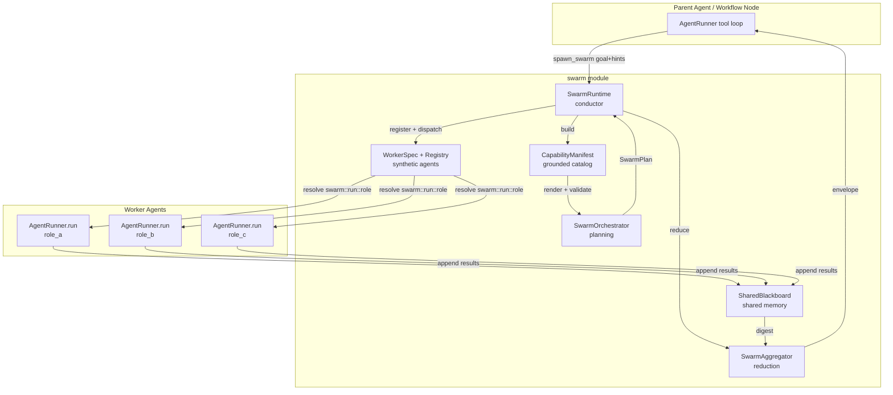
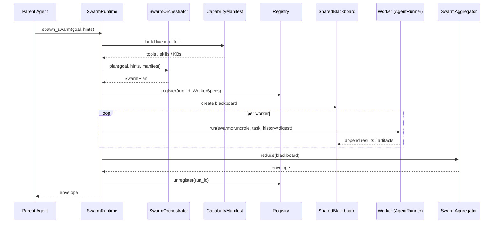

# Swarm Module

The `swarm` module implements **adaptive multi-agent delegation** for the ABStudio backend. It lets a single parent agent dynamically spawn a coordinated team of short-lived worker agents (a "swarm") to handle complex goals that require parallel work, multi-step reasoning, or a combination of tools that no single agent configuration covers.

## Purpose

When a parent agent receives a request that is too broad, multi-part, or requires capabilities outside its own attached toolset, it can call `spawn_swarm`. The swarm module then:

1. **Plans** a team of workers and assigns each a role, task, tools, skills, and knowledge base.
2. **Executes** those workers in parallel or sequentially with a shared memory blackboard.
3. **Aggregates** the workers' outputs into a single parent-facing envelope.

The module is designed to be **grounded**, **bounded**, and **observable**:

- **Grounded**: the orchestrator can only reference tools, skills, and KBs that exist in the live capability manifest.
- **Bounded**: worker counts, token budgets, blackboard sizes, and parallelism are all capped.
- **Observable**: every run emits SSE events and writes a structured JSON dump so operators can trace planning, execution, and aggregation.

## Where It Fits in the System

The swarm module sits between the agent execution layer and the LLM gateway:

- **Upstream**: `AgentRunner` (in `agent_factory/pipeline.py`) injects `spawn_swarm` as a synthetic tool when an agent opts into subagents. The workflow engine (`engine_native_engine`) also uses it for workflow agent nodes.
- **Downstream**: each worker is executed by `AgentRunner.run`, which resolves synthetic `swarm::<run_id>::<role_id>` agent ids through the swarm registry and hydrates tools from `workflow_repo`.
- **Sibling modules**: it reads the live tool/skill/KB catalog from `core_workflow_repo` and `kb_retriever`, and uses the shared LLM helpers in `core_factory_utils`.

## Architecture Overview

### Execution Flow

## Sub-modules

| Sub-module | Responsibility | Key Files |
|------------|----------------|-----------|
| [swarm_planning](swarm_planning.md) | Builds a grounded capability manifest and turns a goal into a validated `SwarmPlan`. | `orchestrator.py`, `capability_manifest.py` |
| [swarm_execution](swarm_execution.md) | Conducts the swarm: registers workers, dispatches them, manages shared memory, and surfaces SSE events. | `runtime.py`, `worker_spec.py`, `registry.py` |
| [swarm_aggregation](swarm_aggregation.md) | Collects worker outputs from the blackboard and reduces them into a single parent-facing envelope. | `aggregator.py`, `blackboard.py` |

## Key Design Decisions

### Synthetic Agent IDs and the Registry

Each worker is registered under a synthetic id of the form `swarm::<run_id>::<role_id>`. `AgentRunner._load_agent` checks this prefix first and resolves the spec through `app.swarm.registry.resolve`. This lets the existing runner execute swarm workers without any change to its core contract.

### Shared Memory via the Blackboard

Workers do not share chat history. Instead, they read a **blackboard digest** that is injected as a single assistant message into the next worker's history. The blackboard supports typed channels (e.g. `results`, `findings`, `errors`) and per-channel locking so concurrent writes to different channels do not block each other.

### Capability Manifest Grounding

The orchestrator only sees tools, skills, and KBs that exist in the deployment. The manifest is cached per process with a short TTL, scoped to the goal via a tool ranker, and rendered with parent-attached tools surfaced first. Plan validation rejects any reference to a name that is not in the manifest.

### Failure Isolation

A worker that raises or times out writes a structured error entry to the blackboard; the swarm continues. The aggregator decides whether the remaining results are sufficient. This mirrors the per-branch isolation already present in the workflow engine.

### Model Inheritance

When a swarm is spawned from a parent agent that has a configured model, that model is forwarded to the orchestrator, aggregator, and workers. This prevents the common "parent runs on Sonnet, nested swarm falls back to factory default" mismatch.

## Configuration

| Environment Variable | Default | Description |
|----------------------|---------|-------------|
| `SWARM_MAX_WORKERS` | 16 | Maximum workers per plan. |
| `SWARM_MAX_PARALLEL` | 8 | Maximum workers running concurrently. |
| `SWARM_WORKER_TIMEOUT_S` | 90 | Default worker timeout in seconds. |
| `SWARM_ORCHESTRATOR_MAX_TOKENS` | 8192 | Output token cap for the planner LLM. |
| `SWARM_ORCHESTRATOR_TEMPERATURE` | 0.2 | Planner temperature. |
| `SWARM_AGGREGATOR_MAX_TOKENS` | 2048 | Output token cap for the aggregator LLM. |
| `SWARM_AGGREGATOR_TEMPERATURE` | 0.1 | Aggregator temperature. |
| `SWARM_BLACKBOARD_PER_CHANNEL_MAX` | 200 | Max entries per blackboard channel. |
| `SWARM_MANIFEST_TTL_S` | 60 | Capability manifest cache TTL. |
| `SWARM_MANIFEST_MAX_CHARS` | 16000 | Char budget for the rendered manifest. |
| `SWARM_ENABLE_SCOPED_MANIFEST` | true | Use a goal-scoped manifest on the first planning attempt. |
| `SWARM_USE_JSON_SCHEMA` | true | Use `response_format=json_schema` when the gateway supports it. |
| `SWARM_ORCHESTRATOR_PREFILL` | true | Prefill the planner assistant turn with `{` to force JSON output. |
| `SWARM_DUMP` | 1 | Enable per-run JSON dumps to `logs/swarm/`. |

## Integration Points

- **`agent_factory/pipeline.py`**: `AgentRunner` injects `spawn_swarm`, forwards the parent model, and resolves synthetic ids.
- **`app/tools/spawn_swarm_tool.py`**: thin adapters that expose `spawn_swarm` to the chat and workflow tool loops.
- **`app/engine/native_engine.py`**: workflow agent nodes construct a `SwarmRuntime` and `SwarmContext` when subagents are enabled.
- **`app/core/workflow_repo.py`**: source of truth for tools, skills, and agents.
- **`app/core/kb_retriever.py`**: enumerates available knowledge bases.
- **`app/core/factory_utils.py`**: shared LLM call helpers used by orchestrator and aggregator.

## Observability

Every swarm run emits SSE events and writes a JSON dump. The dump schema includes setup (models, routing), the plan, per-worker outcomes, aggregation results, and nested-run links. Operators can grep the `[SWARM]` log prefix or inspect `logs/swarm/run_<run_id>.json`.
