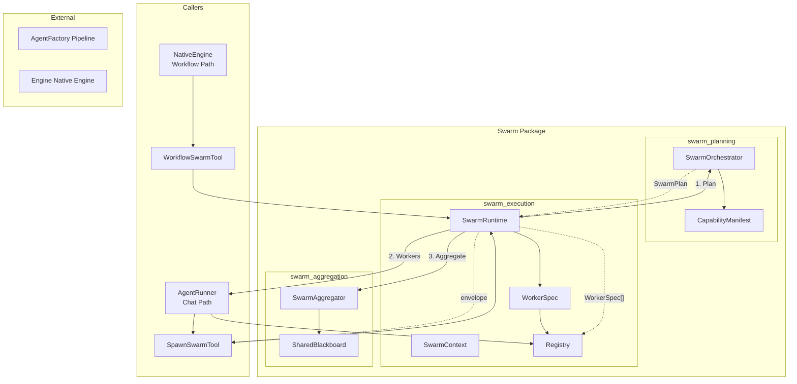
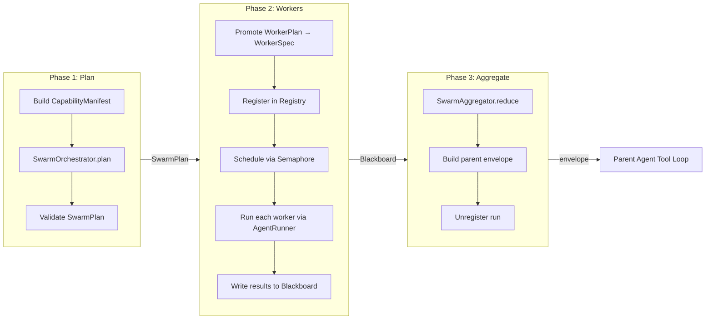
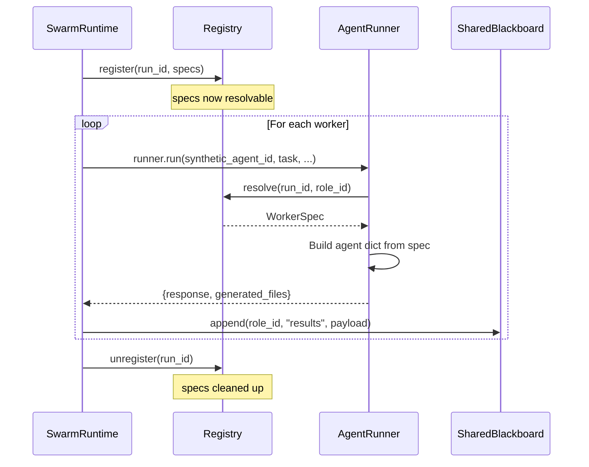
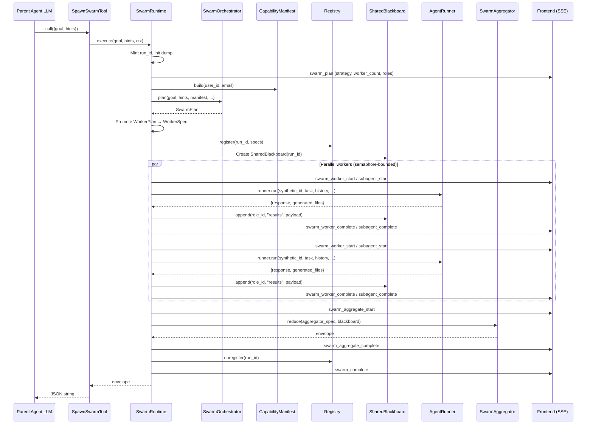
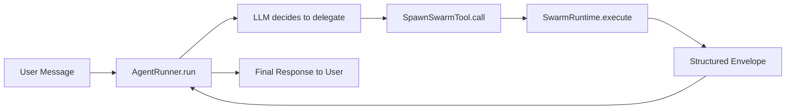
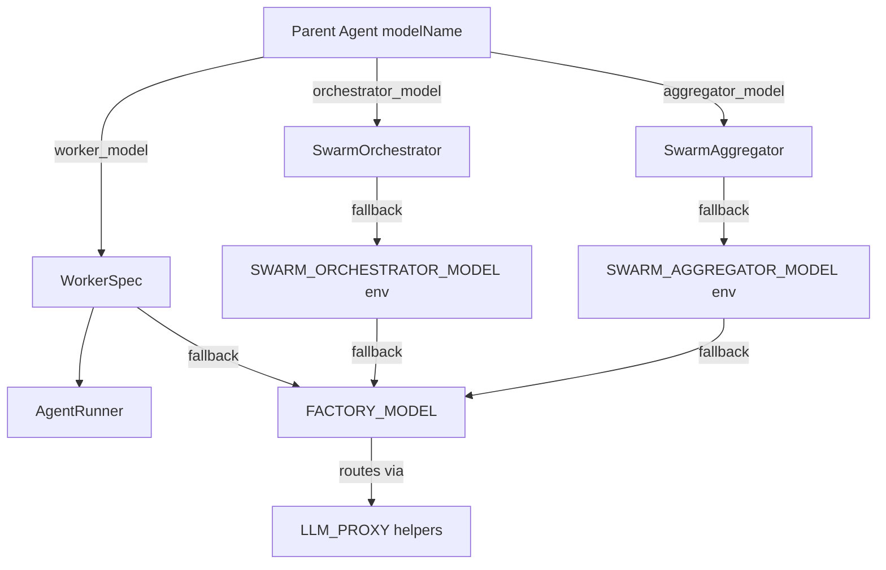
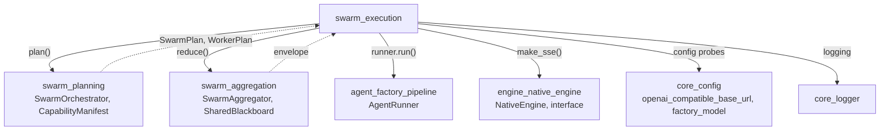

# Swarm Execution Module

## Introduction

The **Swarm Execution** module is the runtime conductor for ABStudio's adaptive multi-agent swarm system. It wraps the three-phase swarm lifecycle — **Plan → Workers → Aggregate** — into a single async `execute()` call that never raises, returning a structured envelope for the parent agent's tool loop to consume. The module lives within the broader `swarm` package and is responsible for scheduling workers with bounded parallelism, managing per-run isolation, emitting live SSE events to the frontend, and persisting structured JSON dumps for operational diagnostics.

The module comprises three core files:

| File | Core Components | Role |
|------|-----------------|------|
| `app/swarm/runtime.py` | `SwarmRuntime`, `SwarmContext` | Conductor + per-run execution context |
| `app/swarm/worker_spec.py` | `WorkerSpec` | Runtime worker specification (as-executed sibling of `WorkerPlan`) |
| `app/swarm/registry.py` | `register`, `resolve`, `unregister` | Process-local registry for synthetic agent ID resolution |

---

## Architecture Overview



### Three-Phase Execution Model

The `SwarmRuntime.execute()` method drives the swarm through three distinct phases, each with its own failure isolation and SSE event surface:



---

## Core Components

### SwarmRuntime

The central conductor class. One instance can serve many concurrent `execute()` calls — each call mints a fresh `run_id` and its own `SharedBlackboard`, making cross-run state leakage impossible.

**Key responsibilities:**

1. **Model resolution** — Inherits the parent agent's configured model (`orchestrator_model` / `aggregator_model`) so the planner, reducer, and workers all run on the user-selected model. Falls through to `FACTORY_MODEL` / env overrides when no parent model is supplied.

2. **Bounded parallelism** — Uses `asyncio.Semaphore(SWARM_MAX_PARALLEL)` (default 8) around each worker's `runner.run` call. The semaphore operates at the worker level, not the LLM HTTP layer — `httpx` already caps TCP concurrency.

3. **Isolated continuation** — A worker that raises or times out writes a structured `{"error": "worker_failure", ...}` entry to the blackboard and the swarm continues. The aggregator decides whether the salvageable subset is sufficient.

4. **Structured JSON dumps** — Every run produces a per-run JSON file at `logs/swarm/run_<run_id>.json` (configurable via `SWARM_DUMP_DIR` / `SWARM_DUMP`). The dump is re-flushed at every milestone (setup → plan → workers → aggregate → complete), making it safe to tail mid-run.

5. **Nested swarm support** — When a worker itself spawns a swarm, the child run's dump is linked back to the parent via the `nested_runs` array, enabling operators to trace the full delegation tree.

**Constructor parameters:**

| Parameter | Type | Description |
|-----------|------|-------------|
| `runner_factory` | `RunnerFactory` | Zero-arg callable returning an `AgentRunner` instance |
| `orchestrator` | `SwarmOrchestrator?` | Optional pre-built orchestrator (else constructed from kwargs) |
| `aggregator` | `SwarmAggregator?` | Optional pre-built aggregator (else constructed from kwargs) |
| `max_parallel` | `int` | Worker concurrency cap (default: `SWARM_MAX_PARALLEL` env, 8) |
| `max_workers` | `int?` | Per-plan worker ceiling (delegated to orchestrator) |
| `orchestrator_model` | `str?` | Parent agent's model for the planner |
| `aggregator_model` | `str?` | Parent agent's model for the reducer |

**`execute()` method signature:**

```python
async def execute(
    self,
    *,
    goal: str,
    hints: Optional[Dict[str, Any]] = None,
    ctx: SwarmContext,
) -> Dict[str, Any]:
```

Returns a structured envelope. **Never raises** — every failure mode (plan validation, manifest load, all workers timing out, aggregator crash) lands as a structured `{"error", "detail"}` envelope.

### SwarmContext

A lightweight, per-run identity and SSE sink bundle. Recreated on every `execute()` call — anything shared across runs lives at the `SwarmRuntime` level.

**Fields:**

| Field | Type | Description |
|-------|------|-------------|
| `user_id` | `str` | Invoker's user ID for credential resolution |
| `email` | `str` | Invoker's email |
| `department` | `str` | Invoker's department for KB ACLs |
| `is_admin` | `bool` | Admin bypass flag |
| `parent_agent_id` | `str` | Parent agent's ID (or `swarm::<run>::<role>` for nested swarms) |
| `thread_id` | `str` | Chat/workflow thread ID |
| `sse_sink` | `SseSink` | Callable that receives SSE frame strings |
| `parent_attached_tools` | `tuple` | Parent agent's purpose-built tool names (excludes platform utilities) |
| `node_id` | `str` | Workflow-graph node ID owning this swarm run (empty in chat path) |
| `strict_scope` | `bool` | When True, manifest contains ONLY parent-attached tools |
| `allowed_extra_domains` | `tuple` | Additional domain prefixes allowed in the scoped manifest |

**`parent_attached_tools`** serves two purposes in the orchestrator:
- **Ranker family expansion** — parent tool prefixes tell the ranker which service families to include in the scoped manifest.
- **Plan-time skip rule** — the orchestrator avoids spawning a redundant worker for a sub-task the parent can handle directly.

**`strict_scope`** is set by the workflow engine when the operator has attached ≥1 tool to a node, creating an explicit "delegate ACROSS THESE tools" contract. Empty `parent_attached_tools` collapses back to unscoped behavior even when this flag is True.

### WorkerSpec

The runtime, as-executed sibling of `WorkerPlan` (defined in `swarm_planning`'s `types.py`). While `WorkerPlan` is the verbatim shape returned by the orchestrator LLM, `WorkerSpec` is what the runtime actually executes.

**Key additions over `WorkerPlan`:**

1. **`run_id`** — The per-swarm UUID, used to build the synthetic `swarm::<run_id>::<role_id>` agent ID that `AgentRunner._load_agent` resolves via the in-memory registry.

2. **`worker_model`** — Inherited from the parent agent node's `modelName`. Empty string falls through to `FACTORY_MODEL` in the `AgentRunner`.

3. **`synthetic_agent_id` property** — Returns `swarm::{run_id}::{role_id}`, the format `AgentRunner._load_agent` resolves. Mirrors the `subagent::<alias>` convention used elsewhere.

**Construction:** `WorkerSpec.from_plan_entry(run_id, entry, worker_model=...)` is the only sanctioned constructor. It re-validates `role_id` against the alias regex (defence in depth) and rejects `run_id` values containing `::`.

**`with_overrides()`** — Returns a copy with selected fields replaced, used at scheduling time to clamp values (e.g., force `max_tool_rounds` below a deployment-wide ceiling).

### Registry (`register`, `resolve`, `unregister`)

A process-local, module-level dict that lets `AgentRunner._load_agent` resolve `swarm::<run_id>::<role_id>` synthetic IDs back to a `WorkerSpec`.

**Why a module-level dict?** The runner's `_load_agent(agent_id)` interface is the established contract for "give me the agent dict for this ID" and is called from multiple sites. The swarm only needs to interpose one branch in that lookup — registering the spec under a synthetic ID mirrors exactly how `app.subagents` handles its static specs.

**Concurrency model:**
- `register` / `unregister` are called once per swarm run from a single coroutine. No external locking required.
- `resolve` is read-only and may fire from many concurrent workers on the same event loop. Plain dict reads under the GIL are safe.

**Persistence:** NONE. A swarm run that crosses a process restart is not resumable in v1 — the parent's tool call will fail on resume. This matches the v1 scope.

**Lifecycle:**



---

## Execution Flow

### End-to-End Swarm Run



### Worker Scheduling Strategies

The `_gather_workers` method schedules workers according to `plan.strategy`:

| Strategy | Scheduling | Shared Memory |
|----------|-----------|---------------|
| `sequential` | Concurrency=1, each worker awaits completion before next starts | Previous worker's output is in the blackboard digest before next worker starts |
| `parallel` | `asyncio.gather` with semaphore | Workers may see partial blackboard state |
| `map_reduce` | Same as parallel | Same as parallel |

**Sequential** explicitly means "previous worker's output is in the digest before next worker starts" — this is only true if we `await` each one, so the semaphore's higher capacity is intentionally unused.

### Worker Execution (`_run_one_worker`)

Each worker is driven through `AgentRunner.run` with the synthetic agent ID `swarm::<run_id>::<role_id>`. The runner's `_load_agent` resolves this ID via the registry and builds an agent dict from the `WorkerSpec`.

**Worker isolation:**
- **Timeout** — `asyncio.wait_for` with `spec.timeout_s` (default 90s). On timeout, a `{"error": "worker_timeout"}` entry is written to the blackboard.
- **Exception** — Any unhandled exception writes `{"error": "worker_failure", "detail": ...}` to the blackboard.
- **Both cases** — The swarm continues; the aggregator decides whether the salvageable subset is sufficient.

**Shared memory injection:** When `plan.shared_memory_policy != "off"`, each worker receives a chat-history-shaped snapshot of the blackboard as an assistant message. This keeps the history short and prevents the worker LLM from being confused by many fake "assistant" turns.

### Failure Handling

The runtime never raises. Every failure mode produces a structured envelope:

| Failure Stage | Error Code | SSE Event | Envelope Shape |
|---------------|-----------|-----------|----------------|
| Manifest build | `manifest_failure` | `swarm_error` | `{"error": "manifest_failure", "detail": "..."}` |
| Plan (gateway blocked) | `gateway_blocked` | `swarm_error` | `{"error": "gateway_blocked", "detail": "..."}` |
| Plan (validation) | `plan_validation_failed` | `swarm_error` | `{"error": "plan_validation_failed", "detail": "...", "errors": [...]}` |
| Plan (orchestrator crash) | `orchestrator_failure` | `swarm_error` | `{"error": "orchestrator_failure", "detail": "..."}` |
| Plan too large | `plan_too_large` | `swarm_error` | `{"error": "plan_too_large", "detail": "..."}` |
| Worker timeout | `worker_timeout` | (per-worker SSE) | Written to blackboard; aggregator handles |
| Worker exception | `worker_failure` | (per-worker SSE) | Written to blackboard; aggregator handles |
| Aggregator crash | `aggregator_failure` | (in envelope) | `{"error": "aggregator_failure", "detail": "..."}` |

---

## SSE Event Surface

The runtime emits events through a caller-provided `sse_sink` so it works in both the chat path (where `AgentRunner` converts them into the chat SSE stream) and the workflow path (where `NativeEngine` forwards them onto its own stream).

### Event Vocabulary

| Event | Payload | Description |
|-------|---------|-------------|
| `swarm_plan` | `{run_id, node_id, strategy, shared_memory_policy, worker_count, role_ids[], aggregator}` | Emitted when the plan is accepted |
| `swarm_worker_start` | `{run_id, node_id, role_id, task_preview, tools[], skills[]}` | Legacy event when a worker begins |
| `swarm_worker_complete` | `{run_id, node_id, role_id, ok, preview?, error?, duration_s}` | Legacy event when a worker finishes |
| `subagent_start` | `{call_id, node_id, alias, agent_id, parent_agent_id, task_preview, task, tools[], skills[]}` | Frontend-facing event when a worker begins |
| `subagent_complete` | `{call_id, node_id, alias, agent_id, parent_agent_id, ok, error?, preview?, output, output_payload, generated_files[], duration_s}` | Frontend-facing event when a worker finishes |
| `swarm_aggregate_start` | `{run_id, node_id, kind}` | Aggregation phase begins |
| `swarm_aggregate_complete` | `{run_id, node_id, ok, error?, duration_s}` | Aggregation phase finishes |
| `swarm_complete` | `{run_id, node_id, ok, error?, duration_s, worker_count}` | Entire swarm run finishes |
| `swarm_error` | `{run_id, node_id, code, detail}` | Unrecoverable error |

**Dual event emission:** The runtime emits both legacy (`swarm_worker_*`) and new (`subagent_*`) events in parallel. The `subagent_*` events carry full, untruncated task text and output so the Debug Log can show the entire input/output for each subagent. The `node_id` field lets the frontend group subagent pills under the correct agent node in the workflow timeline.

---

## Structured JSON Dumps

Every swarm run produces a per-run JSON dump at `logs/swarm/run_<run_id>.json`. The dump is re-flushed to disk at every milestone, making it safe to tail mid-run. A crash leaves the latest snapshot on disk.

### Dump Schema

```json
{
  "schema_version": 1,
  "run_id": "abc123def456",
  "started_at": "2025-01-15T10:30:00.123456Z",
  "completed_at": "2025-01-15T10:31:15.789012Z",
  "goal": "...",
  "hints": {},
  "parent_run_id": null,
  "parent_role_id": null,
  "setup": {
    "parent_agent_id": "...",
    "node_id": "...",
    "models": {
      "orchestrator": "...",
      "aggregator": "...",
      "workers": "...",
      "workers_source": "parent_agent_modelName | factory_default",
      "orchestrator_source": "...",
      "aggregator_source": "...",
      "env_overrides": { ... }
    },
    "llm_routing": {
      "openai_compatible_base_url": "...",
      "factory_model_default": "...",
      "llm_proxy_url_set": true,
      "x_internal_token_will_be_sent": true
    }
  },
  "plan": {
    "strategy": "parallel",
    "shared_memory_policy": "broadcast",
    "worker_count": 3,
    "aggregator": { "kind": "summarize", "prompt": "..." },
    "workers": [ { "role_id": "...", "task": "...", "tools": [...], ... } ]
  },
  "workers": [
    {
      "role_id": "...",
      "agent_id": "swarm::abc123::role_id",
      "model": "...",
      "tools": [...],
      "skills": [...],
      "ok": true,
      "error": null,
      "duration_s": 12.345,
      "preview": "...",
      "completed_at": "..."
    }
  ],
  "nested_runs": [],
  "aggregate": { "model": "...", "kind": "...", "ok": true, "duration_s": 3.456 },
  "outcome": { "ok": true, "duration_s": 45.678, "worker_count": 3, "envelope": { ... } },
  "errors": []
}
```

### Nested Swarm Linkage

When a worker spawns its own swarm, the child run's dump is linked back to the parent:

1. The child's `parent_run_id` and `parent_role_id` fields record the linkage.
2. The parent's `nested_runs` array receives a `{role_id, run_id, dump_path, linked_at}` entry.
3. The back-link is written the moment the child starts (not on completion), so the operator sees the tree as workers begin.

---

## Integration Points

### Chat Path (AgentRunner)

In the chat path, `AgentRunner` (from the [agent_factory_pipeline](agent_factory_pipeline.md) module) injects a `SpawnSwarmTool` when the agent has `use_subagents=True`. The tool wraps a `SwarmRuntime` instance and a `SwarmContext` carrying the user's identity.



The `AgentRunner._load_agent` method resolves `swarm::<run_id>::<role_id>` synthetic IDs by checking the registry first (before Postgres or legacy JSON stores), ensuring the swarm namespace can never be shadowed by a colliding DB row.

### Workflow Path (NativeEngine)

In the workflow path, `NativeEngine` (from the [engine_native_engine](engine_native_engine.md) module) injects a `WorkflowSwarmTool` (wrapped in a `_DedupingSwarmTool` for sibling-node deduplication) when subagents are enabled for the node. The engine constructs a fresh `SwarmRuntime` + `SwarmContext` per node execution via factory closures.

**Swarm gate resolution (three sources of truth, evaluated in order):**

1. **Per-node OFF pin** (`data.disable_subagents=True`) — wins unconditionally.
2. **Per-node ON pin** (`data.enable_subagents=True`) — forces delegation even when run-level toggle is OFF.
3. **Run-level flag** (`context.subagents_enabled`) — applies to every node that isn't pinned.

When the per-node ON pin fires, purpose-built tools are stripped from the parent LLM's tool specs so its only viable move is `spawn_swarm`. The stripped tools are still forwarded to the swarm planner via `parent_attached_tools`.

**Live SSE streaming:** The engine uses an `asyncio.Queue` to drain swarm events concurrently with the `tool.call()` execution, yielding each `subagent_start` / `subagent_complete` frame to the SSE stream the instant it is emitted.

### Model Resolution Chain

The runtime ensures the same model the user picked in Agent Configuration drives the entire swarm:



This is the single source-of-truth fix for SIT divergence between the UI model dropdown (sourced from `llm_proxy /v1/models`) and the orchestrator's hardcoded env-driven default.

---

## Configuration

### Environment Variables

| Variable | Default | Description |
|----------|---------|-------------|
| `SWARM_MAX_PARALLEL` | `8` | Maximum concurrent workers per swarm run |
| `SWARM_WORKER_TIMEOUT_S` | `90` | Default per-worker timeout (overridden by `WorkerSpec.timeout_s`) |
| `SWARM_DUMP` | `1` | Set to `0`/`false`/`no`/`off` to disable JSON dumps |
| `SWARM_DUMP_DIR` | `logs/swarm` | Directory for per-run JSON dump files |
| `SWARM_ORCHESTRATOR_MODEL` | (env) | Override model for the orchestrator LLM |
| `SWARM_AGGREGATOR_MODEL` | (env) | Override model for the aggregator LLM |
| `FACTORY_MODEL` | (env) | Platform default model (ultimate fallback) |
| `LLM_PROXY_URL` | (env) | LLM proxy gateway URL |
| `LLM_PROXY_TOKEN` | (env) | Internal token sent to the LLM proxy |

### WorkerSpec Defaults

| Field | Default | Range |
|-------|---------|-------|
| `max_tool_rounds` | 4 | 0–12 |
| `max_tokens` | 2048 | 1–16384 (orchestrator clamps to ≥8192) |
| `temperature` | 0.2 | 0.0–2.0 |
| `timeout_s` | 90 | 1–600 |
| `knowledge` | `{"mode": "none"}` | — |
| `worker_model` | `""` (→ `FACTORY_MODEL`) | — |

---

## Dependencies

### Internal Module Dependencies



### Key Interactions with Other Modules

- **[swarm_planning](swarm_planning.md)** — `SwarmOrchestrator.plan()` produces a validated `SwarmPlan` containing `WorkerPlan` entries. The orchestrator handles scoped manifests, strict-scope enforcement, JSON schema enforcement, and corrective retries.
- **[swarm_aggregation](swarm_aggregation.md)** — `SwarmAggregator.reduce()` transforms the `SharedBlackboard` into a parent-facing envelope. The `SharedBlackboard` provides per-run shared workspace with channel-based append-only writes and char-budgeted digests.
- **[agent_factory_pipeline](agent_factory_pipeline.md)** — `AgentRunner.run()` drives each worker through the LLM tool-calling loop. The runner's `_load_agent` resolves synthetic swarm IDs via the registry.
- **[engine_native_engine](engine_native_engine.md)** — `NativeEngine._run_agent()` injects `WorkflowSwarmTool` for workflow agent nodes and manages the live SSE event queue.
- **[core_config](core_config.md)** — Provides `openai_compatible_base_url()` and `factory_model()` for the pre-flight setup snapshot in the JSON dump.

---

## Observability

### Logging

Every swarm log line is prefixed with `[SWARM]` for easy grep. Key log lines:

- `run_start` — One bold line at run start with run_id, models, base_url, and worker/parallel caps.
- `plan_start` / `plan_ready` — Orchestrator model, manifest tool count, strategy, worker roles.
- `worker_start` / `worker_complete` / `worker_timeout` / `worker_failure` — Per-worker lifecycle with model, tools, skills, duration.
- `aggregate_start` / `aggregate_complete` — Aggregator model, kind, ok/error, duration.
- `run_complete` — Total duration, worker count, dump path, nested run count.

### JSON Dump Analysis

The dump's `setup.models` block is the SIT debug surface — it lists every model the swarm will use plus the LLM_PROXY-aware base URL, so an operator can verify the run hits the right gateway without grepping env vars. The `workers_source` / `orchestrator_source` / `aggregator_source` fields distinguish between `parent_agent_modelName` (user pick) and env overrides.

### Registry Observability

`active_run_count()` returns the number of swarm runs whose specs are currently in memory. Exported for observability and tests; not part of the hot-path API.

---

## Testing Support

- **`_reset_for_tests()`** (registry) — Clears the registry. Test-only; never call from production code.
- **`_reset_cache_for_tests()`** (capability_manifest, in `swarm_planning`) — Clears the capability manifest cache.
- **`_LIVE_DUMPS`** — Process-wide map of run_id → live dump dict, used by nested swarms. Not directly testable but observable via dump files.
- **Runner factory injection** — Tests can inject a mock `runner_factory` that returns a fake runner with an async `run()` method, avoiding the need for a real `AgentRunner`.
