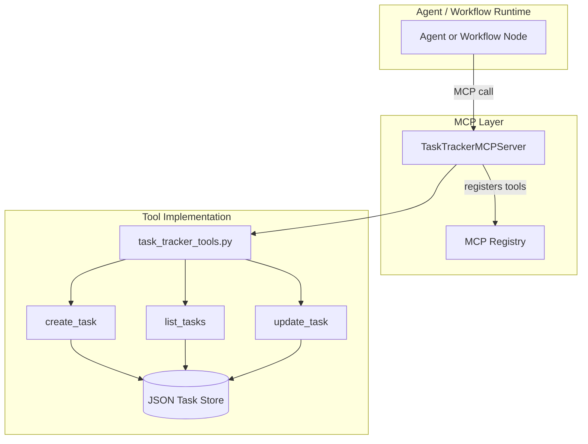
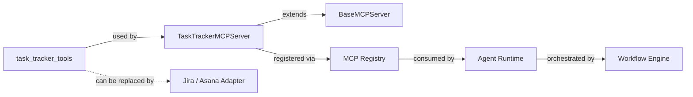
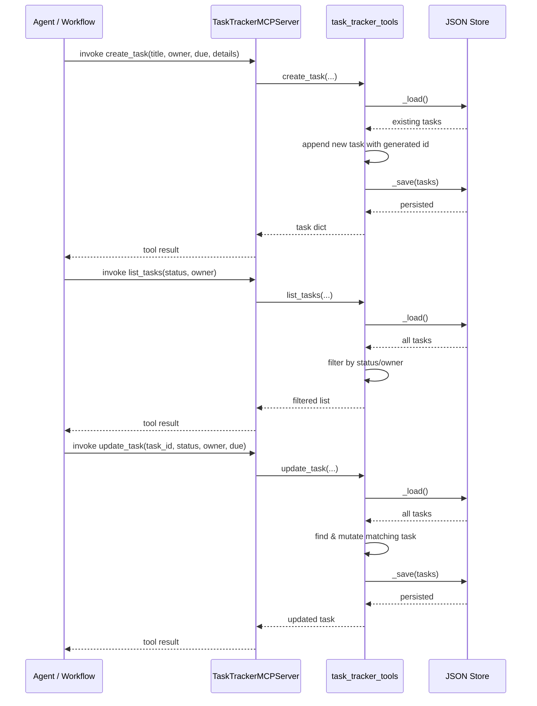
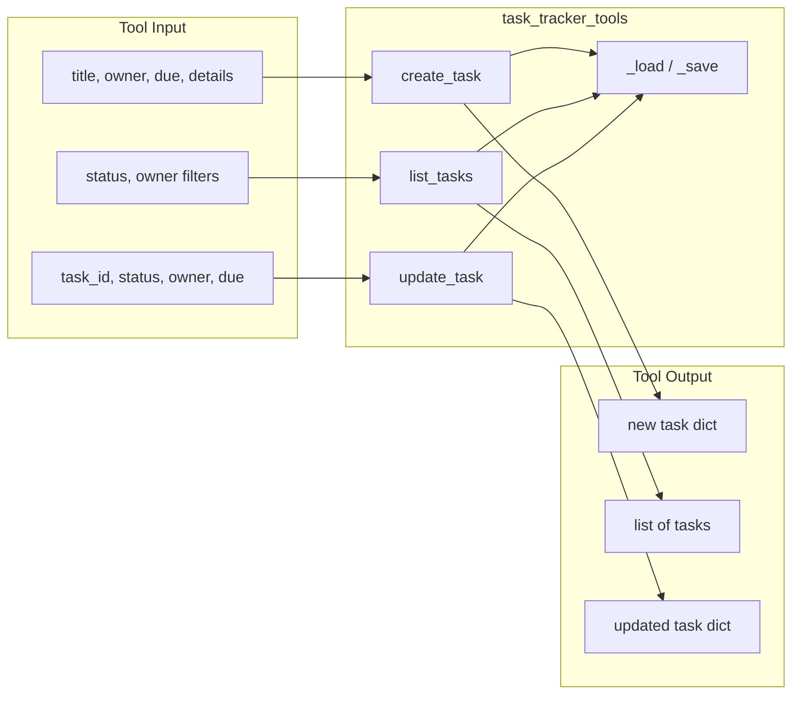
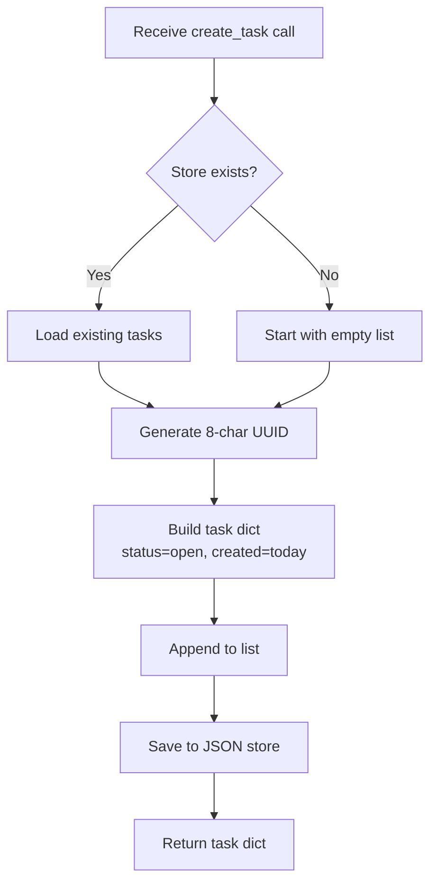
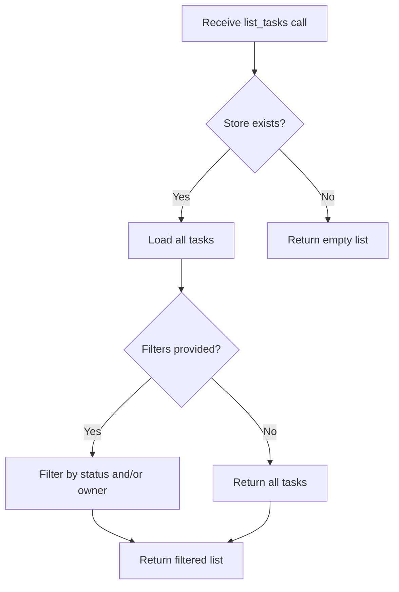

# task_tracker_tools

## Brief Introduction

`task_tracker_tools` is a lightweight, provider-agnostic task management toolkit for the NPCI Agentic Platform. It exposes a minimal MCP (Model Context Protocol) tool contract for creating, listing, and updating tasks. The default implementation persists tasks in a flat JSON file, making it suitable for demos and local development, while the clean function signature allows drop-in replacement with enterprise backends such as Jira or Asana.

The module is primarily consumed through the companion [TaskTrackerMCPServer](mcp_servers.md) and is registered into the platform's MCP registry. It supports use cases including action-item extraction from meeting notes (UC-57), onboarding checklists (UC-65), and inbox triage delegation (UC-86).

---

## Core Functionality

The module exposes three tool functions:

| Function | Purpose |
|----------|---------|
| `create_task` | Creates a new task with title, optional owner, due date, details, and default status `open`. |
| `list_tasks` | Returns tasks from the store, optionally filtered by `status` and/or `owner`. |
| `update_task` | Modifies an existing task's `status`, `owner`, or `due` date by `task_id`. |

All functions operate on a JSON-backed task store whose location is controlled by the `TASK_TRACKER_STORE_PATH` environment variable (default: `/data/mcp_outbox/tasks/tasks.json`).

---

## Architecture



### Component Responsibilities

- **`task_tracker_tools.py`**: Core business logic for task CRUD operations. It is backend-agnostic at the function level and relies only on `_load()` / `_save()` helpers for persistence.
- **`TaskTrackerMCPServer`**: Wraps the three tool functions as MCP tools with JSON schemas, descriptions, and audit flags. See [mcp_servers](mcp_servers.md) for details on MCP server construction.
- **MCP Registry**: Discovers and registers available MCP servers so that agents and workflows can invoke `task_tracker` tools by name. See [mcp_system](mcp_system.md).
- **JSON Task Store**: Default flat-file persistence. Production deployments can swap this for a database or external ticket system without changing the tool contract.

---

## Dependencies



### Internal Dependencies

- **[mcp_servers](mcp_servers.md)** — `TaskTrackerMCPServer` imports and exposes `create_task`, `list_tasks`, and `update_task` as MCP tools.
- **[mcp_system](mcp_system.md)** — The platform's MCP registry and bridge infrastructure make the task tracker tools discoverable to agents and workflows.
- **[shared_integrations](shared_integrations.md)** — Sibling tool modules (e.g., [jira_tools](shared_integrations.md#jira_tools), [calendar_tools](shared_integrations.md#calendar_tools)) follow the same pattern and may be composed with task tracker tools in workflows.

### External Dependencies

- Standard library only: `datetime`, `json`, `os`, `uuid`, `typing`.
- No third-party libraries, keeping the module portable and easy to embed.

---

## Data Flow



---

## Component Interaction



---

## Process Flows

### Create Task



### List Tasks



### Update Task

```mermaid
flowchart TD
    A[Receive update_task call] --> B[Load all tasks]
    B --> C{Find task by id}
    C -->|Not found| D[Raise ValueError]
    C -->|Found| E[Apply non-empty updates]
    E --> F[Save to JSON store]
    F --> G[Return updated task]
```



---

## Configuration

| Environment Variable | Default | Description |
|----------------------|---------|-------------|
| `TASK_TRACKER_STORE_PATH` | `/data/mcp_outbox/tasks/tasks.json` | Path to the JSON file used as the task store. |

The store directory is created automatically on first write via `os.makedirs(..., exist_ok=True)`.

---

## Task Schema

Each task persisted by the default store has the following shape:

```json
{
  "id": "a1b2c3d4",
  "title": "Follow up with vendor",
  "owner": "user@example.com",
  "due": "2025-12-31",
  "details": "Discuss SLA terms",
  "status": "open",
  "created": "2025-01-15"
}
```

| Field | Type | Description |
|-------|------|-------------|
| `id` | string | 8-character UUID fragment, generated on creation. |
| `title` | string | Required task title. |
| `owner` | string | Optional owner email or identifier. |
| `due` | string | Optional due date in `YYYY-MM-DD` format. |
| `details` | string | Optional free-form details. |
| `status` | string | Task status; defaults to `open`. |
| `created` | string | ISO date of creation. |

---

## Integration with the Broader System

`task_tracker_tools` is one of many tool modules in the [shared_integrations](shared_integrations.md) layer. It is designed to be:

- **Composable**: Agents can chain `create_task` with [email_tools](shared_integrations.md#email_tools) to send notifications, or with [calendar_tools](shared_integrations.md#calendar_tools) to schedule follow-ups.
- **Replaceable**: The function contract is intentionally simple so that a Jira/Asana-backed adapter can be dropped in without changing callers.
- **Governable**: `create_task` and `update_task` are flagged for PCI audit in the MCP server, aligning with platform governance requirements. See [mcp_servers](mcp_servers.md) and [core_governance](shared_core.md#core_governance) for audit handling.

In the [abstudio_backend](abstudio_backend.md), task tracker tools may be surfaced through the catalog API and referenced by agents or workflows built in the studio. Refer to [api_catalog](abstudio_backend.md#api_catalog) and [agent_factory_pipeline](abstudio_backend.md#agent_factory_pipeline) for how tools are discovered and bound to agents.

---

## Error Handling

- `update_task` raises `ValueError(f"task not found: {task_id}")` when the supplied `task_id` does not match any persisted task.
- `list_tasks` returns an empty list if the store file is missing or no tasks match the filters.
- `create_task` never fails due to missing store; it initializes the directory and file on demand.

---

## References

- [mcp_servers](mcp_servers.md) — Companion MCP server that exposes these tools.
- [mcp_system](mcp_system.md) — MCP registry, bridge, and client infrastructure.
- [shared_integrations](shared_integrations.md) — Sibling tool modules and integration patterns.
- [abstudio_backend](abstudio_backend.md) — Backend APIs for catalog, agents, and workflows.
