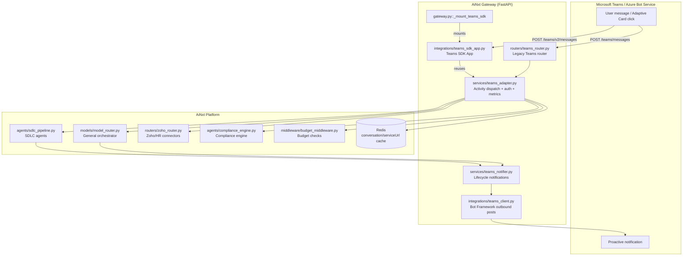
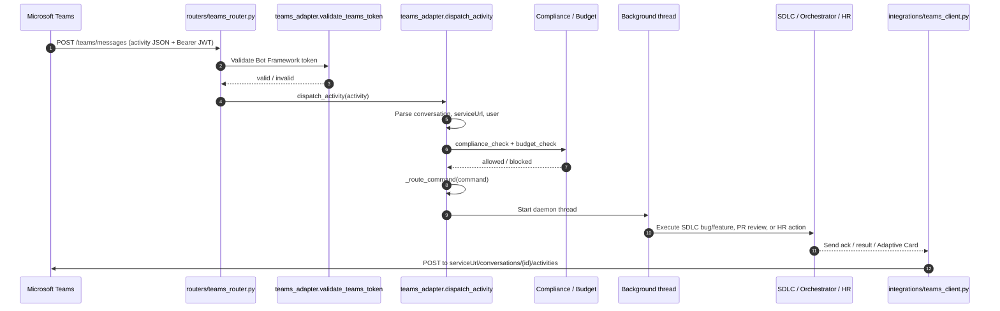
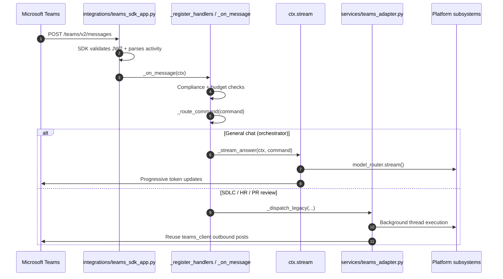
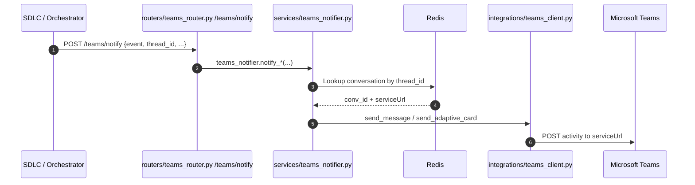

# Microsoft Teams Integration Module

## Brief Introduction

The `teams_integration` module connects the AiNxt platform to Microsoft Teams, allowing users to interact with AI agents, SDLC pipelines, HR workflows, and approval gates directly from a Teams channel or chat. It exposes a Bot Framework-compatible webhook endpoint that receives activities from Azure Bot Service, validates their JWT signatures, dispatches commands to the appropriate platform subsystems, and sends replies or Adaptive Cards back to Teams.

The module is intentionally split into two layers:

* **Legacy Bot Framework route** (`/teams/messages`) — the production endpoint used today, implemented in `routers/teams_router.py` and `services/teams_adapter.py`.
* **Official Microsoft Teams SDK route** (`/teams/v2/messages`) — a newer, SDK-based inbound path that is gated behind `TEAMS_SDK_ENABLED` and mounted at gateway startup via `gateway.py::_mount_teams_sdk`. It reuses the existing business logic and outbound notification layer for a low-risk migration.

Both paths share the same command routing, compliance/budget gating, Redis-backed conversation mapping, and outbound Teams client.

---

## Core Responsibilities

1. **Receive Teams activities** — messages, invoke actions, and conversation updates from Azure Bot Service.
2. **Validate Bot Framework JWTs** using Microsoft public signing keys (unless `TEAMS_SKIP_AUTH=true`).
3. **Parse `@AiNxt` mentions** and extract commands such as bug fixes, feature requests, PR reviews, and leave management.
4. **Apply platform guardrails** — compliance scanning and budget checks — before executing any command.
5. **Dispatch commands** to the SDLC pipeline, HR/Zoho connectors, or the general model orchestrator.
6. **Render HITL approval cards** in Teams and process Approve/Reject button clicks.
7. **Send proactive notifications** for pipeline events (PR created, bug fixed, approval required, failures).
8. **Expose metrics and health endpoints** for monitoring and the admin UI.

---

## Architecture

### High-Level Component Diagram



### Component Breakdown

| Component | File | Role |
|-----------|------|------|
| `_mount_teams_sdk` | `gateway.py` | FastAPI startup hook that conditionally mounts the official Teams SDK route onto the gateway app. |
| `mount_teams_sdk_app` | `integrations/teams_sdk_app.py` | Builds the SDK `App` with `FastAPIAdapter`, registers message handlers, and calls `App.initialize()` without spawning a second server. |
| Teams router | `routers/teams_router.py` | Legacy FastAPI router exposing `/teams/messages`, `/teams/notify`, `/teams/metrics`, `/teams/meeting/process`, `/teams/health`, and the preflight `OPTIONS` handler. |
| Teams adapter | `services/teams_adapter.py` | Validates JWTs, parses activities, extracts commands, runs compliance/budget checks, routes commands, and tracks metrics. |
| Teams notifier | `services/teams_notifier.py` | High-level helpers that push SDLC/HR/HITL lifecycle notifications back to Teams. |
| Teams client | `integrations/teams_client.py` | Low-level outbound Bot Framework client that posts messages and Adaptive Cards to the cached `serviceUrl`. |
| Teams config UI | `ai-ui/src/components/TeamsConfig.jsx` | Admin screen for viewing bot status, copying the webhook URL, and monitoring live metrics. |

---

## Data Flows

### Inbound Message Flow (Legacy Route)



### Inbound Message Flow (Teams SDK Route)



### Proactive Notification Flow



---

## Command Routing

The adapter extracts the text after `@AiNxt` and classifies it into one of the following routes (`services/teams_adapter.py::_route_command`):

| Route | Example command | Destination |
|-------|-----------------|-------------|
| `sdlc_bug` | `@AiNxt fix NPCI-123` | `_propose_sdlc_bug` → SDLC bug pipeline |
| `sdlc_feature` | `@AiNxt feature NPCI-456` | `_propose_sdlc_feature` → SDLC feature pipeline |
| `pr_review` | `@AiNxt review PR 128` | `_run_orchestrator` / PR review flow |
| `hr_leave` | `@AiNxt apply leave ...` | `_run_hr_leave` → Zoho People |
| `hr_leave_balance` | `@AiNxt leave balance` | `_run_hr_leave_balance` → Zoho People |
| `hr_my_leaves` | `@AiNxt my leaves` | `_run_hr_my_leaves` → Zoho People |
| `hr_cancel_leave` | `@AiNxt cancel leave ...` | `_run_hr_cancel_leave` → Zoho People |
| `orchestrator` | `@AiNxt explain this error: ...` | `model_router` general chat |

SDLC and HR commands are acknowledged immediately and executed in background threads so the Bot Framework webhook returns within the required timeout.

---

## HITL (Human-in-the-Loop) Approval

When an SDLC pipeline reaches an approval gate, `services/teams_notifier.py::notify_approval_required` sends an Adaptive Card to the originating Teams thread. The card contains:

* Run ID and stage label
* Summary of the proposal
* Links to Jira, GitLab issue, Confluence, or PR when available
* **Approve** and **Reject** `Action.Submit` buttons

When a user clicks a button, Teams posts an `invoke` or `message` activity back to the webhook with `value.codenxt_action` set to `hitl_approve` or `hitl_reject`. The adapter (`dispatch_activity` or the SDK `_on_message`) calls `_handle_hitl_action`, which resumes or cancels the corresponding SDLC run.

---

## Configuration

The module is controlled by environment variables. The most important ones are:

| Variable | Purpose | Default |
|----------|---------|---------|
| `TEAMS_SDK_ENABLED` | Mount the official Teams SDK route at startup. | `false` |
| `TEAMS_SDK_MESSAGING_ENDPOINT` | Path for the SDK inbound webhook. | `/ainxt/v1/api/teams/v2/messages` |
| `TEAMS_BOT_APP_ID` | Azure Bot Service / AAD app registration client ID. | `""` |
| `TEAMS_BOT_SECRET` | Bot client secret for outbound posts. | `""` |
| `TEAMS_BOT_TENANT_ID` | AAD tenant ID for token validation. | `""` |
| `TEAMS_SKIP_AUTH` | Skip JWT validation (local dev only). | `false` |
| `TEAMS_SDK_STREAM_CHUNK` | Minimum characters between progressive stream updates. | `200` |

> **Security note:** `TEAMS_SKIP_AUTH` must be `false` in production. When `TEAMS_APP_ID` is not configured, the legacy adapter also skips validation as a local-dev convenience.

---

## Key Design Decisions

1. **Two endpoints, safe cutover.** The legacy route remains untouched while the SDK route is validated. Production traffic can be migrated by changing the Azure Bot Service messaging endpoint from `/teams/messages` to `/teams/v2/messages`.
2. **Reuse outbound layer.** Both inbound paths reuse `services/teams_adapter.py` for command routing and `integrations/teams_client.py` for outbound messages/cards. This avoids rewriting the proven SDLC/HITL flows.
3. **Progressive streaming for general chat.** The SDK path uses `ctx.stream` to render model answers token-by-token, while legacy routes send a single final message.
4. **Redis-backed conversation cache.** `serviceUrl` and `conversation_id ↔ thread_id` mappings are cached in Redis with a TTL so proactive notifications can reach the right Teams thread even when there is no active inbound activity.
5. **Background execution.** Long-running commands are offloaded to daemon threads to keep the Bot Framework webhook responsive.

---

## Dependencies on Other Modules

The Teams integration module is a thin adapter layer that delegates all business logic to other platform modules. Refer to their documentation for deeper details:

* **Authentication / RBAC:** JWT validation relies on platform auth utilities. See [auth](auth.md) and [rbac](rbac.md).
* **Compliance engine:** Input/output scanning is performed by `agents/compliance_engine.py`. See [compliance_engine](compliance_engine.md).
* **Budget middleware:** Per-user budget checks reuse the platform budget layer. See [budget](budget.md).
* **Model routing:** General chat commands are sent to `models/model_router.py`. See [model_router](model_router.md).
* **SDLC pipeline:** Bug/feature/PR commands invoke the SDLC agent loop. See [sdlc_pipeline](sdlc_pipeline.md).
* **Zoho/HR connectors:** Leave commands are handled by the Zoho router. See [zoho_router](zoho_router.md).
* **Job queue:** Meeting processing enqueues work via `core/job_queue.py`. See [job_queue](job_queue.md).
* **Redis/KV:** Conversation and serviceUrl caching uses the shared Redis client. See [kv_store](kv_store.md).
* **ABStudio / Agent runtime:** Agent and workflow execution paths are documented in [abstudio_backend](abstudio_backend.md).

---

## Metrics and Monitoring

`services/teams_adapter.py::_TeamsMetrics` maintains an in-memory counter/gauge snapshot that is exposed by `routers/teams_router.py::teams_metrics_endpoint`:

| Metric | Type | Description |
|--------|------|-------------|
| `codenxt_teams_requests_total` | counter | Total inbound Teams activities received. |
| `codenxt_teams_agent_runs_total` | counter | Agent/pipeline invocations triggered from Teams. |
| `codenxt_teams_success_total` | counter | Successful completions. |
| `codenxt_teams_failure_total` | counter | Failures (compliance, budget, runtime errors). |
| `codenxt_teams_success_rate` | gauge | `success / (success + failure)`. |
| `codenxt_teams_avg_latency_ms` | gauge | Average orchestrator latency in milliseconds. |

The `teams_health` endpoint returns whether `TEAMS_BOT_APP_ID` and `TEAMS_BOT_SECRET` are configured, the current auth mode, and the messaging endpoint. The `TeamsConfig.jsx` admin UI consumes both endpoints.

---

## Process Flow: Mounting the Teams SDK at Startup

```mermaid
flowchart LR
    A[gateway.py::startup] --> B[FastAPI app ready]
    B --> C{@app.on_event startup<br/>_mount_teams_sdk}
    C --> D{TEAMS_SDK_ENABLED?}
    D -->|false| E[Log disabled, no-op]
    D -->|true| F[integrations/teams_sdk_app.py::mount_teams_sdk_app]
    F --> G[Build FastAPIAdapter]
    G --> H[Create App with endpoint + auth opts]
    H --> I[_register_handlers]
    I --> J[await app.initialize]
    J --> K[Route registered on gateway]
```

---

## Error Handling and Resilience

* **Startup mount failures** are logged as warnings and do not crash the gateway.
* **JWT validation failures** return HTTP 401.
* **Missing bot credentials** return a clear error message instructing operators to set `TEAMS_BOT_APP_ID` and `TEAMS_BOT_SECRET`.
* **Outbound notification failures** are fire-and-forget; `TeamsNotifier` catches and logs exceptions without breaking the calling pipeline.
* **Compliance/budget blocks** reply immediately to the user with the reason and increment the failure metric.

---

## How It Fits into the Overall System

The Teams integration module sits at the edge of the AiNxt platform, alongside the main chat UI, IDE router, Slack router, and webhooks. It translates Microsoft Teams' Bot Framework protocol into the platform's internal command model, applies the same compliance and budget guardrails as the web UI, and then dispatches to the same SDLC, HR, and orchestrator subsystems. Proactive notifications allow long-running pipelines to push updates back into Teams threads, making Teams a first-class client for both synchronous chat and asynchronous workflow collaboration.
