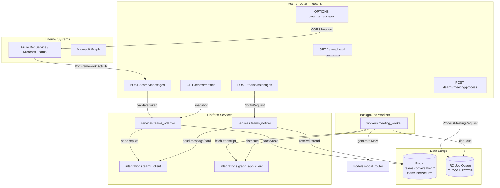
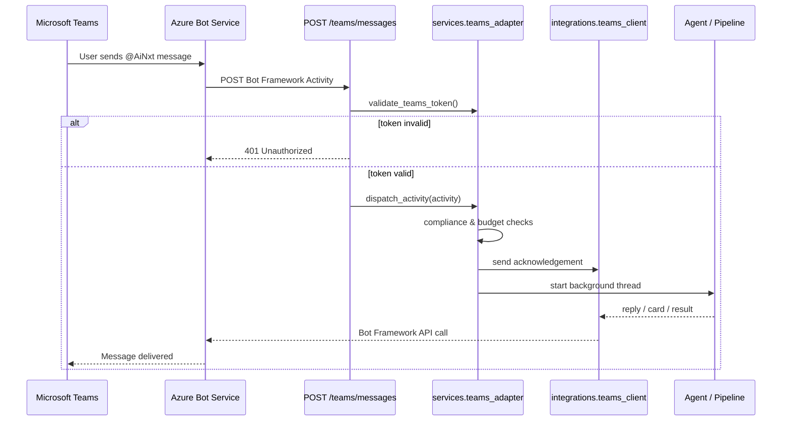
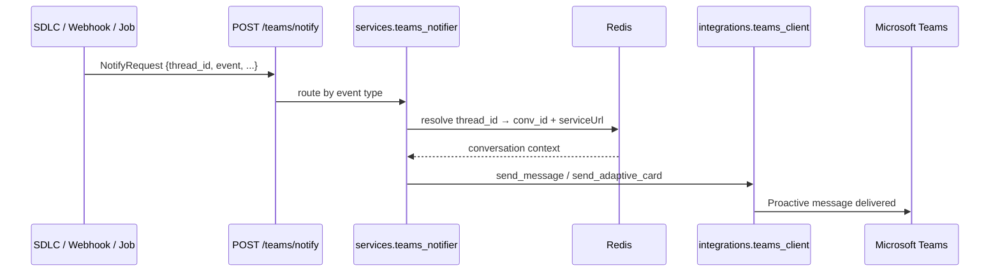
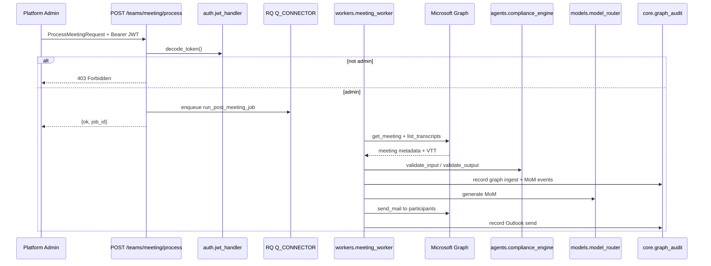

# Teams Router

The `teams_router` module exposes the `/teams` HTTP surface that connects the AiNxt platform to Microsoft Teams and Azure Bot Service. It receives Bot Framework activities, dispatches user commands to the appropriate platform agents, sends proactive notifications back into Teams conversations, and provides health and metrics endpoints for operations teams.

This router is a thin FastAPI layer. The heavy lifting—token validation, activity dispatch, command routing, compliance/budget checks, and Adaptive Card rendering—is delegated to the [teams_adapter](teams_adapter.md) and [teams_notifier](teams_notifier.md) services, while meeting automation is handled by the [meeting_worker](meeting_worker.md).

---

## Core Responsibilities

| Responsibility | Description |
| -------------- | ----------- |
| **Bot Framework webhook** | `POST /teams/messages` receives every activity sent by Azure Bot Service (messages, invokes, conversation updates). |
| **JWT validation** | Verifies the Bot Framework Bearer token using Microsoft public keys (skippable in dev via `TEAMS_SKIP_AUTH`). |
| **Command dispatch** | Hands valid user messages and Adaptive Card actions to `services.teams_adapter.dispatch_activity`. |
| **Proactive notifications** | `POST /teams/notify` lets internal platform components push PR created, bug fixed, workflow done, approval, and failure notifications into a Teams thread. |
| **Meeting automation** | `POST /teams/meeting/process` enqueues post-meeting summarization jobs that generate Minutes of Meeting (MoM) and distribute them via Outlook. |
| **Observability** | `GET /teams/metrics` returns Prometheus-style counters/gauges for Teams traffic and success rates. |
| **Health & preflight** | `GET /teams/health` answers Azure Bot Service reachability probes; `OPTIONS /teams/messages` handles browser CORS preflight. |

---

## Module Architecture

---

## Component Reference

### `teams_messages(request, authorization)`
Primary Bot Framework webhook handler. Receives all activities from Azure Bot Service, validates the Bearer JWT, parses the payload, and dispatches `message`/`invoke` activities to `services.teams_adapter.dispatch_activity`. Handles `conversationUpdate` events locally to cache the `serviceUrl` and greet users when the bot is added to a channel.

### `teams_notify(body: NotifyRequest)`
Internal endpoint used by platform components to push proactive notifications into a Teams conversation identified by an AiNxt `thread_id`. Supports the event types `pr_created`, `bug_fixed`, `workflow_done`, `approval_required`, `failed`, and `message`.

### `teams_meeting_process(body: ProcessMeetingRequest, authorization)`
Admin-only endpoint that enqueues a post-meeting job. The job fetches the meeting transcript via Microsoft Graph, generates a redacted and audited Minutes of Meeting inside AiNxt, and emails it to participants through Outlook. Requires a valid platform JWT with the `admin` role.

### `teams_metrics_endpoint()`
Returns a snapshot of Teams integration metrics plus a Prometheus text exposition. Metrics include total requests, agent/pipeline runs, successes, failures, success rate, and average orchestrator latency.

### `teams_health()`
Simple health probe reporting whether `TEAMS_BOT_APP_ID` and `TEAMS_BOT_SECRET` are configured, the value of `TEAMS_SKIP_AUTH`, and the messaging endpoint path.

### `teams_messages_preflight()`
Explicit `OPTIONS` handler for `POST /teams/messages`. Returns CORS headers so that Azure Portal browser-based preflight checks succeed.

### `NotifyRequest`
Pydantic model for proactive notification payloads. Fields include `thread_id`, `event`, `run_id`, `jira_key`, `pr_url`, `branch`, `state`, `summary`, `message`, `workflow`, and `error`.

### `ProcessMeetingRequest`
Pydantic model for manual meeting processing. Fields include `meeting_id` (Graph onlineMeeting id), `organizer_id` (Entra user oid), and `detected_via`.

---

## Data Flows

### Receiving and Dispatching a Teams Message

### Proactive Notification Flow

### Post-Meeting Automation Flow

---

## Dependencies

| Dependency | Role in this module | Linked documentation |
| ---------- | ------------------- | -------------------- |
| `services.teams_adapter` | Token validation, activity dispatch, metrics, conversation mapping. | [teams_adapter](teams_adapter.md) |
| `services.teams_notifier` | Proactive notification helpers for SDLC lifecycle events. | [teams_notifier](teams_notifier.md) |
| `integrations.teams_client` | Low-level Bot Framework message and Adaptive Card delivery. | [teams_client](teams_client.md) |
| `auth.jwt_handler` | Decodes platform JWT for the meeting processing endpoint. | [auth/jwt_handler](auth_jwt_handler.md) |
| `core.job_queue` | Enqueues meeting automation jobs on `Q_CONNECTOR`. | [core/job_queue](core_job_queue.md) |
| `workers.meeting_worker` | Background worker that fetches transcripts, generates MoM, and distributes email. | [meeting_worker](meeting_worker.md) |
| `core.logger` | Structured logging. | [core/logger](core_logger.md) |

---

## Configuration

| Environment Variable | Purpose |
| -------------------- | ------- |
| `TEAMS_BOT_APP_ID` | Azure Bot / Entra application ID. Required for production replies. |
| `TEAMS_BOT_SECRET` | Bot Framework app secret. Required for production replies. |
| `TEAMS_SKIP_AUTH` | Set to `true` to skip Bot Framework JWT validation (local dev only). |
| `MEETING_POLL_LOOKBACK_MIN` | How far back `poll_recent_meetings` looks for call records. |
| `MOM_MAX_TRANSCRIPT_CHARS` | Max transcript characters passed to the MoM model. |

---

## Security & Governance

- **JWT validation** is enforced in production using Microsoft Bot Framework public keys. The router validates issuer, audience, and signature.
- **HITL actions** (`hitl_approve`, `hitl_reject`) from Adaptive Cards are handled synchronously so Azure Bot Service receives an immediate HTTP 200.
- **Compliance and budget checks** are applied by `services.teams_adapter` before any agent or pipeline is invoked.
- **Meeting processing** requires a platform JWT with the `admin` role.
- **Audit records** for meeting transcript ingestion, MoM generation, and Outlook distribution are written via `core.graph_audit`.

---

## How It Fits into the System

The Teams router is one of several channel-facing entry points in the shared API layer. It is mounted alongside other routers such as [slack_router](slack_router.md), [webhooks_router](webhooks_router.md), and [sdlc_router](sdlc_router.md). While the Slack router handles Slack events and the webhooks router handles GitLab/Jira callbacks, the Teams router is the exclusive endpoint for Microsoft Teams interactions.

The [gateway](gateway.md) may optionally mount the official Teams SDK endpoint via `_mount_teams_sdk`, but the `teams_router` remains the primary integration surface for custom command handling, proactive notifications, and meeting automation.

---

## Related Modules

- [teams_adapter](teams_adapter.md) — token validation, dispatch, command routing, metrics.
- [teams_notifier](teams_notifier.md) — proactive notification helpers.
- [meeting_worker](meeting_worker.md) — post-meeting transcript summarization and distribution.
- [gateway](gateway.md) — top-level gateway that mounts platform routers and the Teams SDK.
- [slack_router](slack_router.md) — comparable router for Slack integration.
- [webhooks_router](webhooks_router.md) — GitLab/Jira webhook handling that can trigger Teams notifications.
- [sdlc_router](sdlc_router.md) — SDLC pipeline control that emits HITL approval notifications.
