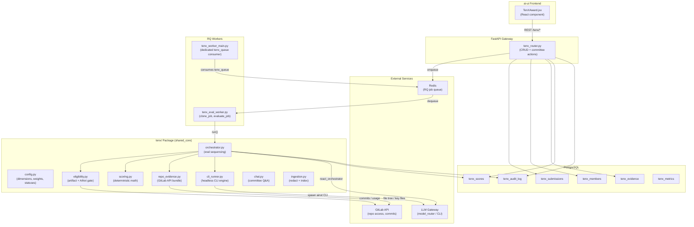
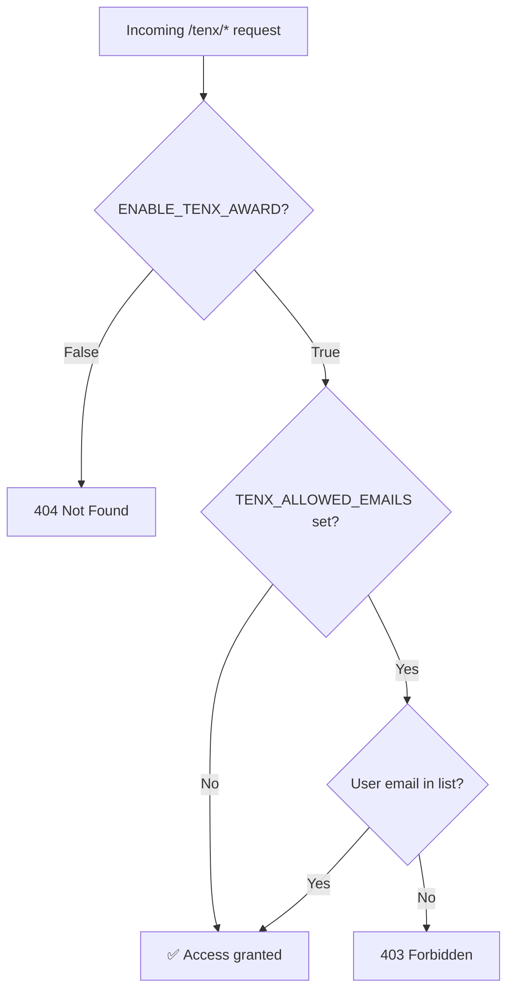
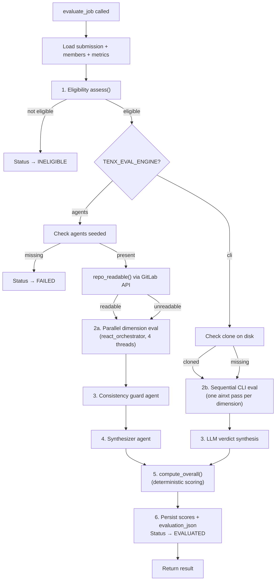
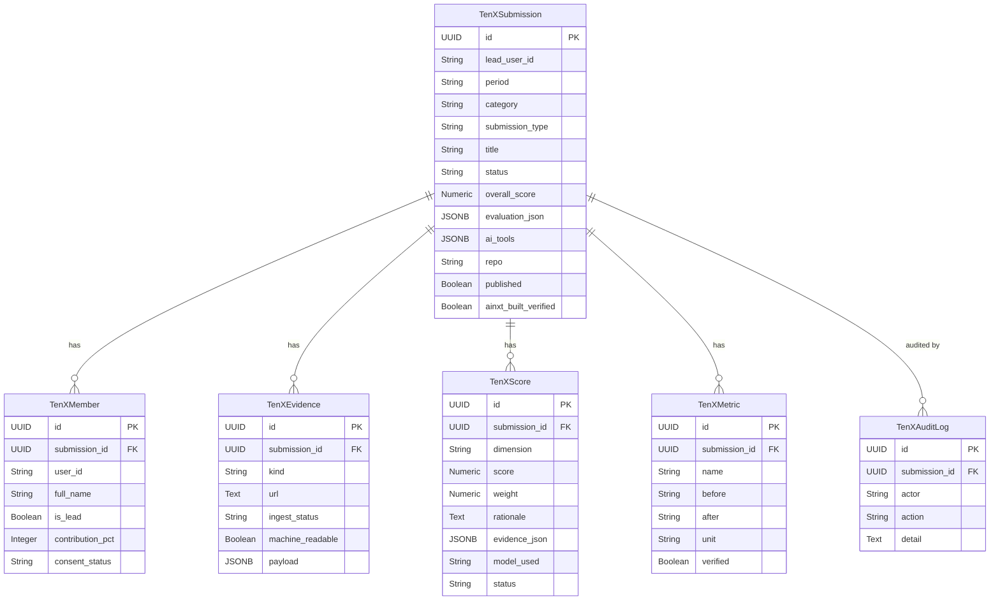
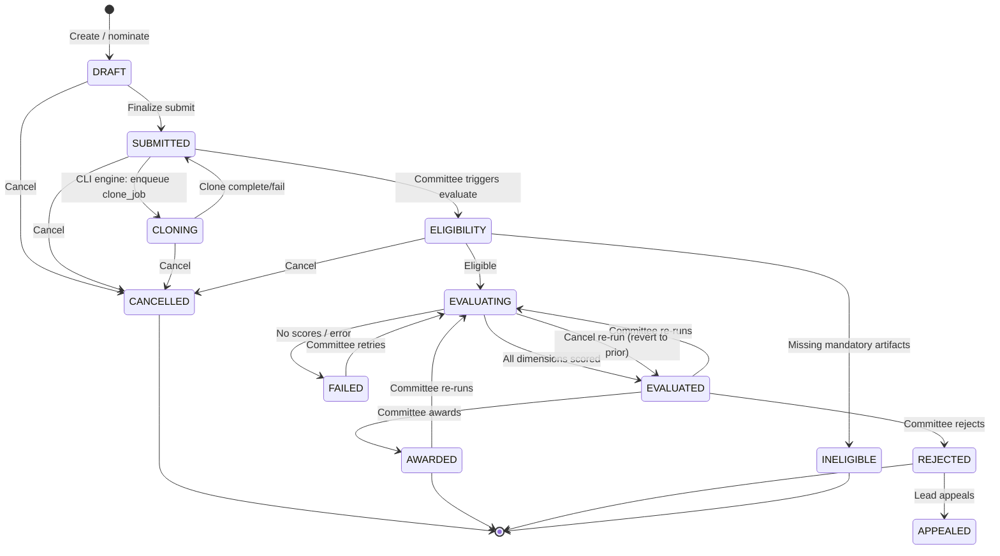
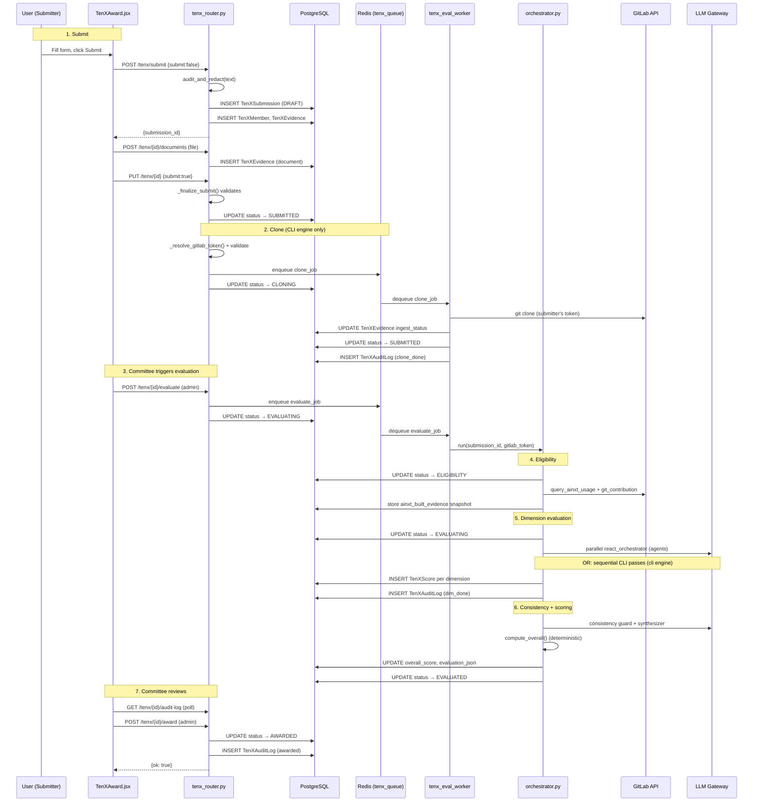
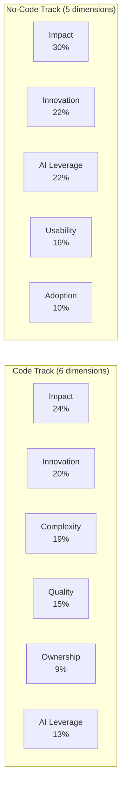

# 10X AI Professional Awards (`tenx_award`)

## Overview

The **10X AI Professional Awards** module is a self-contained feature that lets employees submit projects built with AiNxt tools, evaluates those projects through an AI-driven multi-dimension rubric, and empowers a committee of admins to review, score, award, and publish results. The module spans the entire stack: a React frontend component, a FastAPI router, an evaluation orchestrator with two pluggable engines, a dedicated RQ worker, and six database tables.

**Key characteristics:**

- **Two submission tracks** — *Code* (engineers; requires a GitLab repository) and *No-code* (non-engineers; scored on narrative + artifacts, committee-verified manually).
- **Committee-triggered evaluation** — employees never trigger AI evaluation; admins decide when to run it.
- **Two evaluation engines** — `agents` (server-side LLM agents via `react_orchestrator`) and `cli` (headless `ainxt` CLI binary reading a cloned repo on disk). Selected via `TENX_EVAL_ENGINE`.
- **Deterministic scoring** — dimension agents return 1–10 scores; a pure-math scoring module applies per-type weights and a consistency multiplier. No LLM eyeballs the final number.
- **Strict score isolation** — evaluation data (scores, rationale, verdict) is admin-only. Employees never see scores, even on their own published submissions.
- **All persistence server-side** — no `localStorage`; the frontend is a thin view over REST endpoints.

---

## Architecture



### Module Dependencies

The `tenx_award` module depends on several other platform modules:

| Dependency | Purpose | Documentation |
|---|---|---|
| `shared_api_routers` → `tenx_router` | REST API endpoints for all 10X operations | — (this module) |
| `shared_core` → `tenx` package | Config, orchestrator, scoring, eligibility, CLI runner, chat | — (this module) |
| `ai_ui_frontend` → `tenx_award` | React UI component | — (this module) |
| `workers` → `tenx_evaluation_workers` | RQ worker entrypoints and dedicated worker process | [worker_orchestration](worker_orchestration.md) |
| `shared_core` → `authentication` | JWT auth, admin guards (`get_current_user`, `require_admin`) | [authentication](authentication.md) |
| `shared_core` → `database` | SQLAlchemy models (`TenXSubmission`, `TenXScore`, etc.) | [database](database.md) |
| `shared_core` → `core_infrastructure` | Job queue (`enqueue_job`, `Q_TENX`), config flags, storage | [core_infrastructure](core_infrastructure.md) |
| `shared_core` → `agent_system` | `react_orchestrator` for agentic evaluation runs | [agent_system](agent_system.md) |
| `shared_core` → `model_routing` | `model_router` for LLM calls (verdict synthesis, chat comparison) | [model_routing](model_routing.md) |
| `shared_integrations` → `gitlab_tools` | GitLab API access (repo evidence, commit authorship, token resolution) | [shared_integrations](shared_integrations.md) |
| `ai_ui_frontend` → `config` | `authFetch`, `API_BASE` for authenticated API calls | [config](config.md) |
| `ai_ui_frontend` → `ui_dialog` | `useConfirm`, `useToast` for user interactions | [ui_dialog](ui_dialog.md) |

---

## Component Reference

### Frontend (`ai-ui/src/components/TenXAward.jsx`)

The entire frontend is a single self-contained React file with no `localStorage` persistence. It is gated by two server-side checks: the `ENABLE_TENX_AWARD` feature flag (404 → disabled) and the `TENX_ALLOWED_EMAILS` allowlist (403 → restricted).

#### `TenXAward` — Root Component

The top-level component that fetches `/tenx/meta` to determine feature state, admin status, tracks, dimensions, and the current evaluation period. It renders a tabbed interface:

| Tab | Visible To | Component |
|---|---|---|
| Submit | Admins only (temporarily closed for users) | `SubmitForm` |
| My Submissions | Everyone | `MySubmissions` |
| Other's Submissions | Everyone | `OtherSubmissions` |
| Leaderboard | Admins only | `Leaderboard` |
| Committee | Admins only | `Committee` |

The `SubmitForm` is always mounted (hidden via CSS when not active) so form data is preserved across tab switches. A dirty-state indicator (amber dot on the Submit tab) signals unsaved form data.

#### `SubmitForm` — Submission Entry

A multi-section form with field-level validation (`blurValidate`), dirty-state tracking (`onDirtyChange`), and a two-phase save flow:

1. **POST `/tenx/submit`** — creates/updates the submission (status `DRAFT` or `SUBMITTED`).
2. **POST `/tenx/{id}/documents`** — uploads supporting documents (and optional video).
3. **PUT `/tenx/{id}`** with `submit: true` — finalizes (server validates all mandatory fields, uniqueness, declarations).

Key form sections:
- **Team & submission type** — code vs no-code toggle, project name, `MemberPicker` (searches AD users via `/tenx/resolve-user`, max 3 members).
- **About your project** — summary (140 chars), executive description, problem statement, `MultiplierField` (claimed 10X impact), `AiToolsMultiSelect` + `AiToolsDescription`.
- **Code & repository** (code track only) — repo URL, branch, stack, tests/CI URL. Gated by a GitLab token check (`/profile/tokens`).
- **Documents** — `FileUploadZone` with 25 MB total cap.
- **Declarations** — consent checkbox.

The `_withMemberDefaults` helper injects default roles ("Contributor") and splits contribution percentages to total 100%, since the form no longer collects these fields explicitly.

#### `MemberPicker` — Team Member Search

Debounced AD user search (250 ms) via `/tenx/resolve-user`. Renders selected members as chips with initials avatars; the lead (submitter) is non-removable.

#### `MySubmissions` / `OtherSubmissions` — List Views

Both render `SubmissionCard` components. `MySubmissions` includes a cancel action (with `useConfirm` dialog) for submissions in pre-evaluation statuses. `OtherSubmissions` hides the View button for non-admins and never reveals scores.

#### `SubmissionCard` — List Item

Displays project title, status pill, one-line summary, submission type, team member avatars + names, and creation date. Cancel button appears only for the submitter's own cancellable submissions.

#### `SubmissionDetail` / `ProjectDetailView` — Detail View

Fetches a single submission via `/tenx/{id}` and renders the full project information: team, summary, description, problem, claimed 10X impact, AI tools used, repository details, and attachments. Evaluation data (scores, verdict, progress panel) is intentionally hidden from submitters — it only appears in the admin `AdminEvalPanel`.

#### `EvalProgressPanel` — Live Evaluation Progress

Polls `/tenx/{id}/audit-log` every 2.5 seconds while a submission is in an active status. Renders a pipeline step list (clone → eligibility → dimension evaluations → scoring → verdict) with done/active/pending states, plus a live log feed filtered to the current run. The `isVisibleStep` function conditionally shows/hides steps based on submission type, engine, and evidence presence.

#### `AdminEvalPanel` — Admin Evaluation View

Embedded in the `Committee` tab's accordion. Combines `EvalProgressPanel` with per-dimension `DimScoreCard` components and a verdict block. During a live run, dimension cards are driven by audit-log events (`_liveDimsFromLogs`); after completion, they read from `evaluation_json` snapshot.

#### `Committee` — Admin Review Console

The most complex frontend component. Provides:
- Period + type + status filters.
- **Chat with codebase** — select submissions, ask a question, get per-project answers + a comparison synthesis.
- Per-row actions: Run evaluation, Retry, Re-run, Clone (manual repo clone), Publish/Unpublish, Download report, Award, Reject, Cancel.
- Inline live-evaluation accordion (`AdminEvalPanel`).
- "View submission" modal (`SubmissionModal`).
- XLSX/CSV export matching on-screen filters.

Code-track submissions use the AI evaluation pipeline; no-code submissions go straight to manual Award/Reject with no AI pipeline.

#### `Leaderboard` — Ranked Board

Admin-only. Fetches `/tenx/leaderboard?period=...`, filters client-side by code/no-code, and displays ranked submissions with overall scores and cohort percentiles.

#### UI Primitives

| Component | Purpose |
|---|---|
| `StatusPill` | Colored status badge (green/amber/red/indigo) |
| `Badge` | Small status chip (done/run/queued) |
| `Section` | Titled card with icon, optional badge/right-slot |
| `Field` | Label + input wrapper (not shown; used inline) |
| `CharCount` | Character counter for textareas |
| `ExpandableText` | Truncated text with "show more" |
| `RationaleList` | Bullet-list of rationale sentences |
| `DimScoreCard` | Per-dimension score + rationale card |
| `FileUploadZone` | Drag/click file upload with size guards |
| `AiToolsMultiSelect` | Dropdown checklist for AI tool selection |
| `AiToolsDescription` | Shared "how you used them" textarea |
| `MultiplierField` | Claimed 10X impact input + guidance |
| `PeriodBadge` | Submission period display |
| `LogEntry` | Single audit-log entry with expand/collapse |
| `Loading` / `Empty` | Placeholder states |

---

### Backend Router (`routers/tenx_router.py`)

A FastAPI `APIRouter` with all routes prefixed `/tenx/`. Every route depends on `_require_enabled` (feature flag + allowlist). Admin-only routes additionally depend on `require_admin`.

#### Access Control



The `/tenx/access` endpoint is intentionally exempt from `_require_enabled` so it can answer for all users (used by the nav gate).

#### API Endpoints

| Method | Path | Auth | Purpose |
|---|---|---|---|
| GET | `/tenx/access` | User | Access probe (nav gate) |
| GET | `/tenx/meta` | User | Tracks, dimensions, period, admin flag, eval engine |
| GET | `/tenx/resolve-user` | User | AD user search for team picker |
| POST | `/tenx/submit` | User | Create draft/submission |
| PUT | `/tenx/{id}` | User | Update draft / finalize submit |
| POST | `/tenx/{id}/documents` | Owner/Admin | Upload supporting document/video |
| GET | `/tenx/{id}/documents` | Owner/Admin | List documents |
| GET | `/tenx/{id}/documents/{doc_id}/download` | Owner/Admin | Download document |
| GET | `/tenx/mine` | User | My submissions (no scores) |
| GET | `/tenx/others` | User | Others' submissions (no scores) |
| GET | `/tenx/{id}` | Owner/Admin | Submission detail (scores admin-only) |
| GET | `/tenx/{id}/audit-log` | Owner/Admin | Evaluation progress feed |
| GET | `/tenx/{id}/report` | Admin | PDF evaluation report |
| POST | `/tenx/{id}/evaluate` | Admin | Trigger AI evaluation |
| POST | `/tenx/{id}/clone` | Admin | Trigger manual repo clone |
| POST | `/tenx/{id}/publish` | Admin | Publish/unpublish scores to submitter |
| POST | `/tenx/{id}/award` | Admin | Award 🏆 |
| POST | `/tenx/{id}/reject` | Admin | Reject |
| POST | `/tenx/{id}/cancel` | Owner/Admin | Cancel submission |
| POST | `/tenx/{id}/appeal` | Lead | Appeal evaluation |
| POST | `/tenx/{id}/consent` | Member | Accept/decline team credit |
| POST | `/tenx/nominate` | User | Nominate a colleague |
| GET | `/tenx/leaderboard` | Admin | Ranked board for a period |
| GET | `/tenx/committee/list` | Admin | All submissions for a period |
| POST | `/tenx/committee/chat` | Admin | Chat with codebase |
| GET | `/tenx/committee/export` | Admin | XLSX/CSV export |
| GET | `/tenx/person/{id}/history` | Admin | Person's submission history |
| GET | `/tenx/admin/calibration` | Admin | Agent score vs award drift |
| GET | `/tenx/admin/seed-status` | Admin | Check if eval agents are seeded |
| POST | `/tenx/admin/seed` | Admin | Seed eval agents + skills |
| GET/POST | `/tenx/admin/eval-model` | Admin | Get/set eval model (local/cloud/auto) |
| POST | `/tenx/admin/terminate-evaluations` | Admin | Kill stuck evaluations |

#### Score Isolation

The `_sub_dict` serializer takes a `reveal` parameter. Scores, rationale, verdict, eligibility details, and evaluation JSON are only included when `reveal=True`, which is set to `is_admin` for all employee-reachable endpoints. This is enforced at the serialization layer, not just the route layer.

#### Submission Finalization (`_finalize_submit`)

Validates all mandatory fields (title, summary, description, problem, claimed multiplier, AI tools, repo+branch for code track, at least one document, declarations, member roles, contribution totals). Enforces one-person-one-team-per-month via `_membership_conflict`. For CLI engine + code track, pre-validates the submitter's GitLab token and enqueues a `clone_job`.

---

### TenX Core Package (`tenx/`)

#### `config.py` — Canonical Configuration

Defines the evaluation rubric structure:

- **`DIMENSION_DEFS`** — 9 possible dimensions, each mapped to a DB agent + folder-skill + model tier.
- **`TYPE_WEIGHTS`** — Per-submission-type dimension sets with weights summing to 1.0:
  - *Code*: impact (0.24), innovation (0.20), complexity (0.19), quality (0.15), ownership (0.09), ai_leverage (0.13)
  - *No-code*: impact (0.30), innovation (0.22), ai_leverage (0.22), usability (0.16), adoption (0.10)
- **`SubmissionStatus`** — 13-state lifecycle enum.
- **`CONSISTENCY_MULTIPLIERS`** — high (1.0), partial (0.85), low (0.6).
- **`TRACKS`** — 5 leaderboard categories (Code, Automation, Platform, Data, Process).
- **`previous_month_period()`** — always returns the previous calendar month as `YYYY-MM`.
- **`EVAL_PASSES`** — number of evaluation passes per dimension (median taken); default 1, set 3 for finals.
- **`ELIGIBILITY_MODE`** — `enforce` (hard gate) or `warn` (penalize-don't-block).

#### `eligibility.py` — Eligibility Gate

Deterministic (no LLM). Checks mandatory artifacts (repo for code track) and computes bonus corroboration:
- **AiNxt usage telemetry** — queries `request_audit_log` for CLI/IDE sessions by team members in the build window.
- **Git authorship** — lists GitLab commits, maps authors to team members, derives contribution percentages.

Returns an immutable snapshot stored on the submission. AiNxt telemetry is a bonus signal (`ai_corroborated`), never a hard gate.

#### `orchestrator.py` — Evaluation Sequencer

The core `run()` function executes the full evaluation pipeline:



**Agents engine** runs dimension evaluators in parallel (4 threads) via `react_orchestrator`, which gives each agent tool access to explore the repo via `gitlab_read_file` / `gitlab_search_code`. After dimensions, a consistency guard agent assesses story-vs-code alignment, and a synthesizer agent writes the final verdict.

**CLI engine** runs one dedicated `ainxt` CLI process per dimension sequentially. The CLI reads files directly from a cloned repo on disk (no GitLab API). A `REPO_INDEX.md` file is generated listing all repo files so the model knows the full tree. After all dimensions, an LLM call synthesizes the verdict.

Both engines write per-dimension audit entries (`dim_started`/`dim_done` or `cli_dim_started`/`cli_dim_done`) that the frontend `EvalProgressPanel` consumes in real time.

#### `scoring.py` — Deterministic Scoring

Pure module with no platform imports beyond `tenx.config`. The `compute_overall()` function:
1. Retrieves normalized weights for the submission type (sum → 1.0).
2. Clamps each dimension score to [1.0, 10.0] (missing dims floor to 1.0).
3. Computes weighted sum.
4. Applies consistency multiplier (high=1.0, partial=0.85, low=0.6).
5. Returns full breakdown with per-dimension contributions.

`cohort_normalize()` computes percentile and z-score for leaderboard fairness.

#### `repo_evidence.py` — GitLab API Evidence Bundle

Pulls a bounded, representative evidence bundle directly from the GitLab API (no indexing, no RAG, no clone):
- File tree (up to 400 entries)
- Languages
- Key files (up to 12, prioritized: README → build/deps → config → CI → test → source)
- Git stats (from eligibility snapshot)

Bounded by `MAX_TOTAL_CHARS` (48,000) to keep LLM context sane. The `render()` function formats the bundle into a text block for evaluator prompts.

#### `cli_runner.py` — Headless CLI Engine

Alternative to the agents engine. Spawns the `ainxt` Linux CLI binary headless against a cloned repo:
- `clone_repo()` — shallow git clone into persistent workspace (`<WORKSPACE_DIR>/<period>/<id>/repo`), scrubs PAT from remote.
- `clone_state()` — classifies on-disk clone as `cloned` / `empty` / `missing` without touching git/network.
- `_prepare()` — ensures clone exists (self-heals if missing), builds `REPO_INDEX.md`.
- `run_eval_dimension()` — spawns one CLI process per dimension with a JSON schema contract, collects the final JSON answer.
- `_rubrics()` — loads `SKILL.md` rubric files from `skills-10x-award/<skill>/`.

#### `chat.py` — Committee Chat with Codebase

Allows the committee to ask questions about one or more submissions. For each, a `react_orchestrator` agent explores the repo and answers, citing files. With 2+ submissions, an LLM generates a comparison synthesis. Read-only.

#### `ingestion.py` — Evidence Ingestion Plumbing

- `audit_and_redact()` — redacts PAN/PII/secrets from free text (redact-and-proceed, never blocks).
- `enqueue_repo_index()` — enqueues repo indexing via the platform index pipeline.
- `classify_artifact()` — classifies artifact URLs as machine-readable or human-verify.

---

### Workers (`workers/tenx_eval_worker.py`, `workers/tenx_worker_main.py`)

#### `tenx_eval_worker.py` — RQ Job Entrypoints

Thin RQ worker functions with no scoring logic:

- **`clone_job(payload)`** — resolves GitLab token (submitter PAT → `TENX_GITLAB_TOKEN` → `GITLAB_TOKEN`), validates token via GitLab API, calls `cli_runner.clone_repo()`, updates repo evidence status. Reverts `CLONING` → `SUBMITTED` on completion/failure.
- **`evaluate_job(payload)`** — resolves token, delegates to `orchestrator.run()`.

Token precedence:
1. Submitter's own stored GitLab PAT (Profile → Connected accounts) — PRIMARY
2. `TENX_GITLAB_TOKEN` — dedicated evaluator service account
3. `GITLAB_TOKEN` — generic platform service token

#### `tenx_worker_main.py` — Dedicated Worker Process

A standalone RQ worker that consumes ONLY `tenx_queue`. Isolated from other worker pools so long CLI runs never starve or get starved by other jobs. Run under PM2:

```
pm2 start venv/bin/python --name tenx-worker -- workers/tenx_worker_main.py
```

Requires: `ENABLE_TENX_AWARD`, `AINXT_CLI_BIN`, `TENX_EVAL_ENGINE=cli`, `TENX_GITLAB_TOKEN`, `TENX_WORKSPACE_DIR`, `TENX_UPLOAD_DIR`.

---

### Database Models (`db/models.py`)



---

## Submission Lifecycle



### Status Definitions

| Status | Label | Description |
|---|---|---|
| `DRAFT` | Draft | Created but not finalized |
| `SUBMITTED` | Submitted | Finalized; awaiting committee evaluation |
| `CLONING` | Cloning repo… | CLI engine: repo clone in progress |
| `INDEXING` | Indexing repo… | Legacy (kept for DB compat) |
| `ELIGIBILITY` | Checking eligibility… | Orchestrator running eligibility gate |
| `INELIGIBLE` | Ineligible | Missing mandatory artifacts |
| `EVALUATING` | Agents evaluating… | Dimension evaluators running |
| `EVALUATED` | Evaluated | All dimensions scored; awaiting committee decision |
| `AWARDED` | Awarded 🏆 | Committee awarded |
| `REJECTED` | Rejected | Committee rejected |
| `APPEALED` | Appealed | Lead appealed a rejection |
| `FAILED` | Failed | Evaluation error (agents not seeded, CLI unavailable, etc.) |
| `CANCELLED` | Cancelled | Submitter or admin withdrew |

---

## Data Flow: Submission & Evaluation



---

## Evaluation Dimensions & Weights



Each dimension maps to a seeded DB agent and a folder-skill (`skills-10x-award/<skill>/SKILL.md`). The `leverage` dimension exists in `DIMENSION_DEFS` but is intentionally excluded from both weight sets — its weight was redistributed proportionally. The frontend `DIM_SETS` constant mirrors this exactly.

### Scoring Formula

```
overall_score = (Σ dimension_score × normalized_weight) × consistency_multiplier
```

- Dimension scores are clamped to [1.0, 10.0]; missing/failed dimensions floor to 1.0.
- Consistency multiplier: high = 1.0, partial = 0.85, low = 0.6.
- The result is on a 1–10 scale.

---

## Configuration

### Environment Variables

| Variable | Default | Purpose |
|---|---|---|
| `ENABLE_TENX_AWARD` | `false` | Master feature flag |
| `TENX_ALLOWED_EMAILS` | (empty) | Comma-separated email allowlist; empty = open to all |
| `TENX_EVAL_ENGINE` | `agents` | Evaluation engine: `agents` or `cli` |
| `TENX_EVAL_PASSES` | `1` | Passes per dimension (median taken); 3 for finals |
| `TENX_ELIGIBILITY_MODE` | `enforce` | `enforce` (hard gate) or `warn` (penalize) |
| `TENX_MIN_AINXT_SESSIONS` | `1` | Min AiNxt sessions for corroboration |
| `TENX_BUILD_WINDOW_DAYS` | `180` | How far back to look for AiNxt usage |
| `TENX_GITLAB_TOKEN` | (empty) | Dedicated evaluator GitLab service account |
| `AINXT_CLI_BIN` | `ainxt` | Path to the ainxt CLI binary (CLI engine) |
| `TENX_CLI_TIMEOUT` | `900` | CLI hard cap in seconds (15 min) |
| `TENX_WORKSPACE_DIR` | `/tmp/ainxt_tenx_workspaces` | Persistent clone workspace root |
| `TENX_UPLOAD_DIR` | (config) | Document upload directory |
| `TENX_DOC_TOTAL_MAX_MB` | `25` | Total document upload cap |

### UI Visibility Flags

The frontend has several intentionally hidden fields/sections (toggled via constants in `TenXAward.jsx`):

| Flag | Default | Controls |
|---|---|---|
| `SHOW_JUDGED_PANEL` | `false` | "How you're judged" dimension-weights panel |
| `SHOW_LEAD_LABEL` | `false` | "Lead" text chip next to submitter |
| `SHOW_NOVELTY_FIELD` | `false` | "What's new or different" field |
| `SHOW_MULTIPLIER_VAL` | `false` | Short "Your multiplier" value input |

---

## Frontend Polling Strategy

The frontend uses 2.5-second polling intervals to stay current during active evaluation:

| Component | Polls | Condition |
|---|---|---|
| `SubmissionDetail` | `/tenx/{id}` | Status in active set (`CLONING`, `ELIGIBILITY`, `EVALUATING`) |
| `EvalProgressPanel` | `/tenx/{id}/audit-log` | Status in active set |
| `AdminEvalPanel` | `/tenx/{id}` + `/tenx/{id}/audit-log` | Status in active set |
| `Committee` list | `/tenx/committee/list` | Any submission in running set |

All polls use reference equality checks to avoid unnecessary re-renders when data hasn't changed.

---

## Security & Compliance

- **Score isolation** — evaluation data is admin-only at the serialization layer (`_sub_dict(reveal=is_admin)`). Employees never see scores, even on published submissions.
- **PII redaction** — all free-text fields are redacted via `ComplianceEngine.redact_text()` at submit time (redact-and-proceed, never blocks).
- **GitLab token handling** — tokens are resolved per-submitter, validated before use, and scrubbed from git remotes after clone. The token precedence prioritizes the submitter's own PAT.
- **One-person-one-team-per-month** — `_membership_conflict` prevents a user from being on multiple live submissions in the same period.
- **Consent** — non-lead team members must accept or decline being credited; consent requests are sent via inbox notifications.
- **Audit trail** — every state change and committee action writes an immutable `TenXAuditLog` row.

---

## Related Documentation

- [worker_orchestration](worker_orchestration.md) — How RQ workers are started and managed
- [authentication](authentication.md) — JWT auth, admin guards, RBAC
- [database](database.md) — SQLAlchemy models and database access patterns
- [core_infrastructure](core_infrastructure.md) — Job queue, config, storage, telemetry
- [agent_system](agent_system.md) — `react_orchestrator` and agent framework
- [model_routing](model_routing.md) — Model router for LLM calls
- [shared_integrations](shared_integrations.md) — GitLab tools and connector infrastructure
- [config](config.md) — Frontend API configuration (`authFetch`, `API_BASE`)
- [ui_dialog](ui_dialog.md) — Toast and confirm dialog providers
