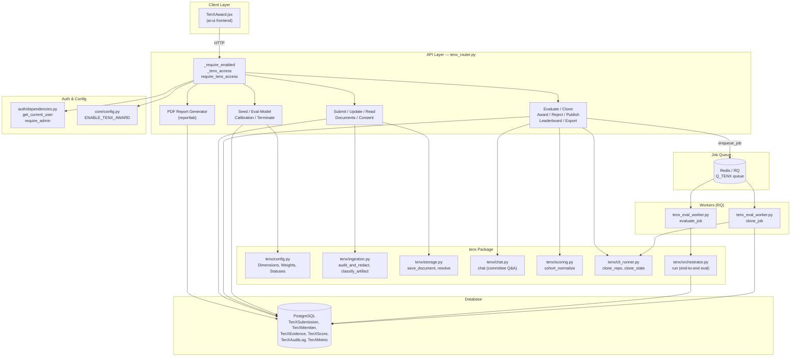
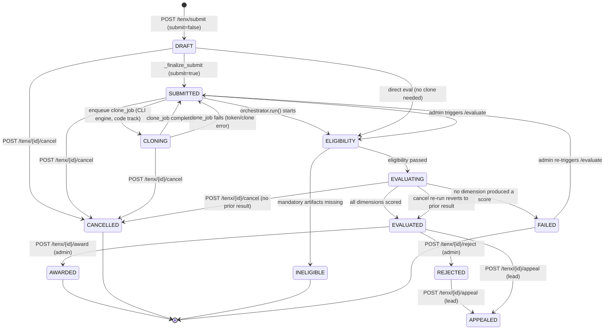
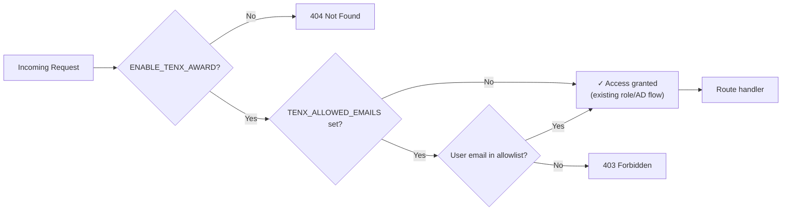
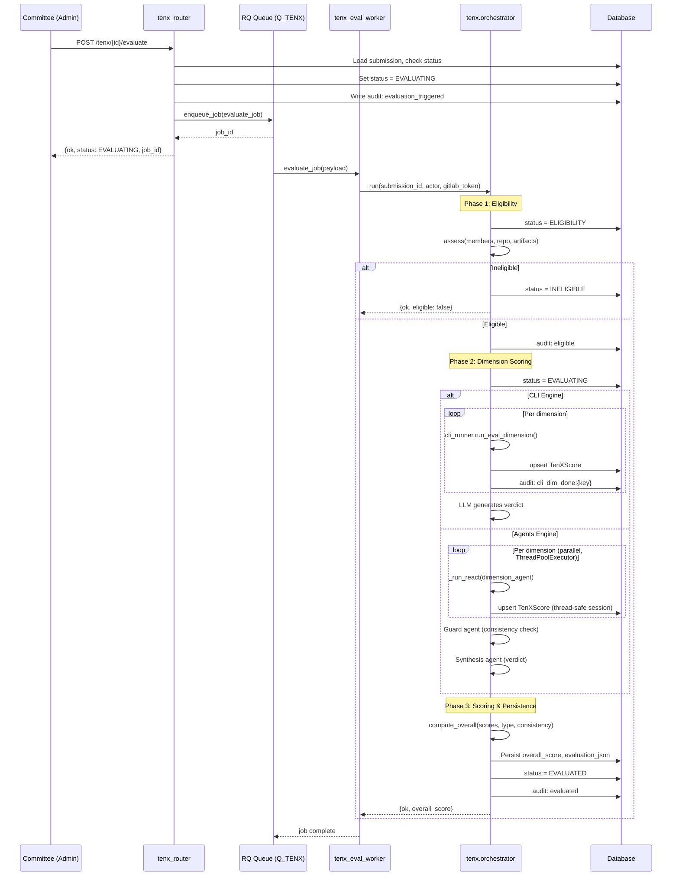
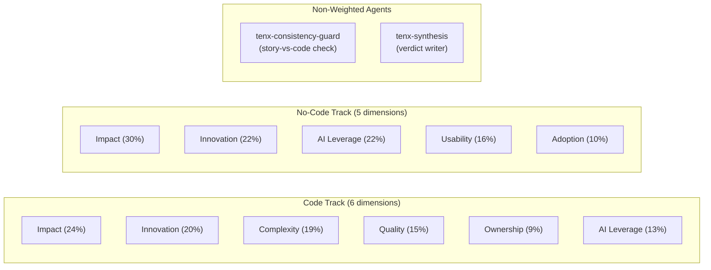
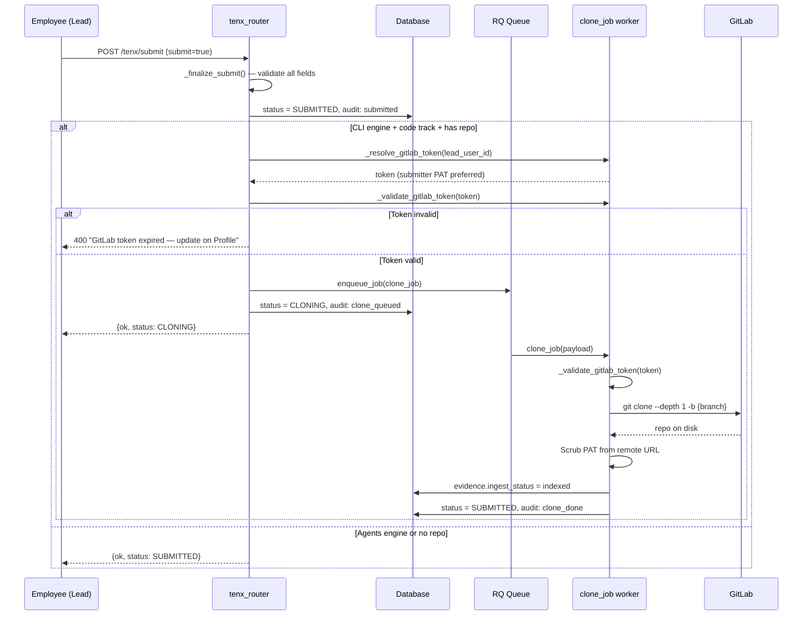
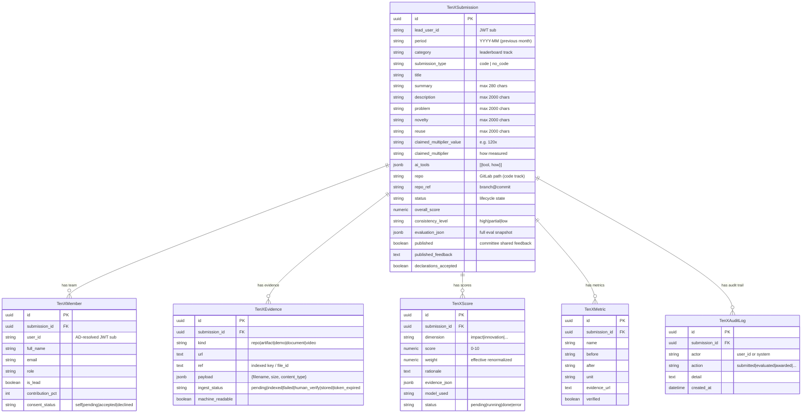
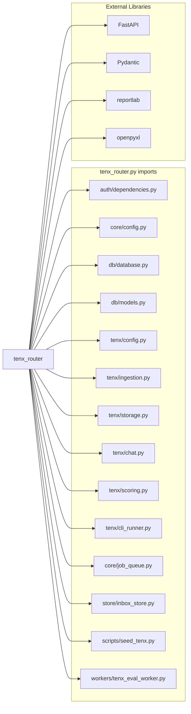
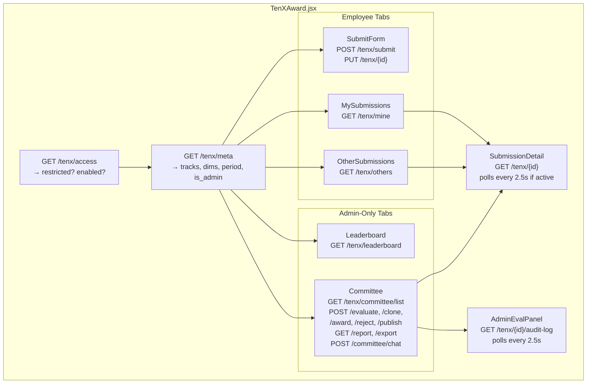

# TenX Router — 10x Engineer Award API

## Overview

The `tenx_router` module is the FastAPI API router for the **10x Professional Award** program — a platform-internal recognition system that evaluates engineering work built with AiNxt tools. The router is deliberately **thin**: it handles CRUD, access control, compliance redaction, and job enqueueing, while all evaluation logic lives in the `tenx` package and runs asynchronously on RQ workers.

### Key Design Principles

| Principle | Implementation |
|---|---|
| **Feature-gated** | Every route depends on `_require_enabled`, which checks `ENABLE_TENX_AWARD` and the optional `TENX_ALLOWED_EMAILS` allowlist |
| **Score isolation** | Evaluation scores, verdicts, and rationale are **admin-only** — never returned to employees, even for their own submissions or published entries |
| **Audit everything** | Every state change writes an immutable `TenXAuditLog` row via the `_audit()` helper |
| **Committee-driven evaluation** | Employees submit; only admins (committee) trigger evaluation, award, reject, or publish |
| **Compliance redact-and-proceed** | All free-text fields are PII/secret-redacted via `ComplianceEngine` before persistence — never blocked |
| **Two evaluation engines** | `agents` (server-side ReAct orchestrator) or `cli` (headless CLI per-dimension passes), selected by `TENX_EVAL_ENGINE` env var |

---

## Architecture

---

## Submission Lifecycle

The submission progresses through a well-defined state machine. The router enforces transitions; the orchestrator and workers drive the automated phases.

### Status Definitions (from `tenx/config.py::SubmissionStatus`)

| Status | Meaning | Who can reach it |
|---|---|---|
| `DRAFT` | Created but not finalized | Employee (lead) |
| `SUBMITTED` | Finalized, awaiting committee evaluation | Employee → system |
| `CLONING` | Repo clone in progress (CLI engine only) | System (clone_job) |
| `ELIGIBILITY` | Checking mandatory artifacts + git authorship | System (orchestrator) |
| `INELIGIBLE` | Missing mandatory artifacts — hard stop | System |
| `EVALUATING` | Agent/CLI dimension scoring in progress | System (orchestrator) |
| `EVALUATED` | All dimensions scored, verdict written | System |
| `AWARDED` | Committee awarded the submission | Admin |
| `REJECTED` | Committee rejected the submission | Admin |
| `APPEALED` | Lead submitted an appeal | Employee (lead) |
| `FAILED` | Evaluation error (agent/CLI/worker) | System |
| `CANCELLED` | Submitter or admin withdrew | Employee (lead) / Admin |

---

## Component Reference

### Access Control

| Component | Type | Description |
|---|---|---|
| `_require_enabled` | Guard dependency | Enforces feature flag + email allowlist on every route **except** `/tenx/access` |
| `_tenx_access` | Helper | Non-raising access check — returns `bool` for the `/access` probe endpoint |
| `require_tenx_access` | Guard dependency | 403 when allowlist is active and caller isn't on it; no-op when allowlist is empty |
| `tenx_access` | Endpoint `GET /tenx/access` | Non-raising probe for the frontend nav gate — answers for all users |

### Request Models (Pydantic)

| Model | Purpose | Key Fields |
|---|---|---|
| `SubmissionIn` | Create/update submission | `title`, `period`, `category`, `submission_type`, `ai_tools[]`, `members[]`, `metrics[]`, `repo`, `repo_ref`, `submit` |
| `MemberIn` | Team member entry | `user_id`, `full_name`, `email`, `department`, `role`, `is_lead`, `contribution_pct` |
| `MetricIn` | Impact metric | `name`, `before`, `after`, `unit`, `evidence_url` |
| `AiToolIn` | AI tool declaration | `tool`, `how` (description, max 2000 chars) |
| `NominateIn` | Peer/manager nomination | `nominee_user_id`, `nominee_name`, `title`, `note` |
| `AppealIn` | Submission appeal | `reason` |
| `ConsentIn` | Teammate consent | `decision` (`accepted` \| `declined`) |
| `AwardIn` | Award/reject reason | `reason` |
| `PublishIn` | Publish evaluation to submitter | `publish`, `feedback` |
| `CommitteeChatIn` | Committee codebase Q&A | `submission_ids[]`, `question` |
| `EvalModelIn` | Set evaluation model mode | `mode` (`local` \| `cloud` \| `auto`) |

### Core Helper Functions

| Function | Description |
|---|---|
| `_audit(db, submission_id, actor, action, detail)` | Writes an immutable `TenXAuditLog` row; best-effort (never blocks) |
| `_owned_or_admin(db, submission_id, user)` | Returns `(sub, is_admin, is_owner)` or raises 403/404 |
| `_membership_conflict(db, period, user_ids, exclude_id)` | Enforces one-person-one-team-per-month rule |
| `_finalize_submit(db, submission_id, user)` | Validates all mandatory fields, transitions DRAFT→SUBMITTED, optionally enqueues clone |
| `_sub_dict(db, sub, full, reveal)` | Serializes a submission; `reveal` controls whether scores/verdict are included (admin-only) |
| `_compute_clone_state(sub)` | Returns `cloned` \| `empty` \| `missing` \| `failed` \| `token_expired` \| `n/a` for the committee Clone button |
| `_notify_team(db, sub, message)` | Best-effort inbox notification to all team members |
| `_request_consent(db, sub)` | Notifies non-lead teammates to accept being credited |

### Serialization & Score Isolation

The `_sub_dict()` function is the **single serialization chokepoint** for all submission data. The `reveal` parameter controls whether evaluation data (scores, rationale, verdict, eligibility) is included:

- `reveal=False` → **always** for employee-facing endpoints (`/mine`, `/others`, own draft responses)
- `reveal=is_admin` → for `/tenx/{id}` (committee drill-in shows scores; employee drill-in does not)
- `reveal=True` → for committee-only endpoints (`/committee/list`, `/leaderboard`)

> **Security invariant**: Scores are never returned to employees — not even for published submissions. The `published` flag only controls whether the committee's manual `published_feedback` text is visible.

---

## API Endpoints

### Employee Endpoints

| Method | Path | Handler | Description |
|---|---|---|---|
| `GET` | `/tenx/access` | `tenx_access` | Non-raising access probe (no `_require_enabled` guard) |
| `GET` | `/tenx/meta` | `meta` | Tracks, dimensions, max team size, current period, eval engine |
| `GET` | `/tenx/resolve-user` | `resolve_user` | AD user picker (name/email search) |
| `POST` | `/tenx/submit` | `submit` | Create draft or submit (with `submit=true`) |
| `PUT` | `/tenx/{id}` | `update_draft` | Update draft fields |
| `GET` | `/tenx/mine` | `mine` | Lead + member submissions (no scores) |
| `GET` | `/tenx/others` | `others` | Other org submissions for current period (no scores) |
| `GET` | `/tenx/{id}` | `get_one` | Single submission detail (scores only if admin) |
| `GET` | `/tenx/{id}/audit-log` | `get_audit_log` | Chronological audit trail (lead/member/admin) |
| `POST` | `/tenx/{id}/documents` | `upload_document` | Upload supporting doc/video |
| `GET` | `/tenx/{id}/documents` | `list_documents` | List uploaded documents |
| `GET` | `/tenx/{id}/documents/{doc_id}/download` | `download_document` | Download a document |
| `POST` | `/tenx/{id}/consent` | `consent` | Teammate accept/decline consent |
| `POST` | `/tenx/{id}/appeal` | `appeal` | Lead appeals an evaluated/rejected submission |
| `POST` | `/tenx/{id}/cancel` | `cancel_submission` | Cancel active submission (lead/admin) |
| `POST` | `/tenx/nominate` | `nominate` | Nominate a colleague (creates a draft for them) |

### Committee / Admin Endpoints

| Method | Path | Handler | Description |
|---|---|---|---|
| `POST` | `/tenx/{id}/evaluate` | `evaluate` | Trigger AI evaluation (enqueues `evaluate_job`) |
| `POST` | `/tenx/{id}/clone` | `clone_repo_endpoint` | Trigger repo (re)clone (enqueues `clone_job`) |
| `POST` | `/tenx/{id}/award` | `award` | Mark as awarded |
| `POST` | `/tenx/{id}/reject` | `reject` | Mark as rejected |
| `POST` | `/tenx/{id}/publish` | `publish` | Toggle score/feedback visibility for submitter |
| `GET` | `/tenx/leaderboard` | `leaderboard` | Ranked board with cohort-normalized scores |
| `GET` | `/tenx/{id}/report` | `download_report` | PDF evaluation report (reportlab) |
| `POST` | `/tenx/committee/chat` | `committee_chat` | Chat-with-codebase across 1–5 submissions |
| `GET` | `/tenx/committee/list` | `committee_list` | All submissions for a period (full detail + scores) |
| `GET` | `/tenx/committee/export` | `committee_export` | XLSX/CSV export with full form + scores |
| `GET` | `/tenx/person/{person_id}/history` | `person_history` | Longitudinal view of a person's submissions |

### Admin Configuration Endpoints

| Method | Path | Handler | Description |
|---|---|---|---|
| `GET` | `/tenx/admin/seed-status` | `seed_status` | Check if 8 eval agents + 2 guard/synth agents are seeded |
| `POST` | `/tenx/admin/seed` | `run_seed` | Idempotent seed of eval agents/skills |
| `GET` | `/tenx/admin/eval-model` | `get_eval_model` | Current eval mode (local/cloud/auto) |
| `POST` | `/tenx/admin/eval-model` | `set_eval_model` | Switch eval model preference on all tenx agents |
| `GET` | `/tenx/admin/calibration` | `calibration` | Agent score vs committee decision drift analysis |
| `POST` | `/tenx/admin/terminate-evaluations` | `terminate_evaluations` | Kill all stuck evaluations + purge queue |

---

## Evaluation Flow

The evaluation pipeline is triggered by the committee via `POST /tenx/{id}/evaluate`. The router enqueues an RQ job; the `tenx_eval_worker.evaluate_job` calls `tenx.orchestrator.run()` which executes the full pipeline.

### Two Evaluation Engines

| Engine | Env Var | How It Works | Repo Access |
|---|---|---|---|
| **agents** | `TENX_EVAL_ENGINE=agents` (default) | Server-side ReAct orchestrator per dimension; guard + synthesis agents | GitLab API (`gitlab_read_file` tool) |
| **cli** | `TENX_EVAL_ENGINE=cli` | Headless CLI binary runs one dedicated pass per dimension | Reads from disk (pre-cloned at submit time) |

### Dimension Configuration (from `tenx/config.py`)

Each dimension maps to a seeded DB agent (`tenx-{dimension}-eval`) backed by a folder-skill. The consistency guard applies a multiplier: `high` → 1.0, `partial` → 0.85, `low` → 0.6.

---

## Submit & Clone Flow (CLI Engine)

For code-track submissions with the CLI engine, the router enqueues a background clone job immediately at submit time so the repo is ready on disk before the committee evaluates.

### GitLab Token Resolution Priority

The `_resolve_gitlab_token()` function in `tenx_eval_worker.py` resolves tokens in this order:

1. **Submitter's own PAT** (Profile → Connected accounts) — authenticates as the user who has repo access
2. **`TENX_GITLAB_TOKEN`** env var — dedicated evaluator service account
3. **`GITLAB_TOKEN`** env var — generic platform service token

---

## Data Model

---

## Dependencies

### Key Module References

| Dependency | Module Doc | Purpose |
|---|---|---|
| `auth/dependencies.py` | [authentication](authentication.md) | JWT/API-key auth, `get_current_user`, `require_admin` |
| `core/config.py` | [core_infrastructure](core_infrastructure.md) | `ENABLE_TENX_AWARD` feature flag |
| `core/job_queue.py` | [core_infrastructure](core_infrastructure.md) | `enqueue_job`, `cancel_job`, `Q_TENX` queue |
| `db/models.py` | [database](database.md) | `TenXSubmission`, `TenXMember`, `TenXEvidence`, `TenXScore`, `TenXAuditLog`, `TenXMetric` |
| `db/database.py` | [database](database.md) | `SessionLocal` SQLAlchemy session factory |
| `tenx/config.py` | [tenx_system](tenx_system.md) | Dimensions, weights, tracks, `SubmissionStatus`, `previous_month_period` |
| `tenx/ingestion.py` | [tenx_system](tenx_system.md) | `audit_and_redact`, `classify_artifact`, `valid_url`, `repo_index_key` |
| `tenx/storage.py` | [tenx_system](tenx_system.md) | `save_document`, `resolve`, `kind_for`, `is_video` |
| `tenx/orchestrator.py` | [tenx_system](tenx_system.md) | `run()` — end-to-end evaluation pipeline |
| `tenx/cli_runner.py` | [tenx_system](tenx_system.md) | `clone_repo`, `clone_state`, `run_eval_dimension` |
| `tenx/chat.py` | [tenx_system](tenx_system.md) | `chat()` — committee codebase Q&A |
| `tenx/scoring.py` | [tenx_system](tenx_system.md) | `cohort_normalize` — percentile + z-score |
| `workers/tenx_eval_worker.py` | [tenx_evaluation_workers](tenx_evaluation_workers.md) | `evaluate_job`, `clone_job`, `_resolve_gitlab_token`, `_validate_gitlab_token` |
| `store/inbox_store.py` | [store_layer](store_layer.md) | `publish_inbox_item` — team notifications |
| `ai-ui/src/components/TenXAward.jsx` | [tenx_award](tenx_award.md) | Frontend UI (5 tabs: Submit, My, Others, Leaderboard, Committee) |

---

## Frontend Integration

The `TenXAward.jsx` component in the `ai-ui` frontend consumes this router. It renders 5 tabs with role-based visibility:

### Polling Strategy

The frontend polls two endpoints every 2.5 seconds while a submission is in an active status (`CLONING`, `ELIGIBILITY`, `EVALUATING`):

1. **`GET /tenx/{id}`** — refreshes the submission object (status, scores if admin)
2. **`GET /tenx/{id}/audit-log`** — feeds the `EvalProgressPanel` live step-by-step progress

The `EvalProgressPanel` scopes the audit log to the **current run** (from the last `evaluation_triggered` action onward) so re-runs don't inherit stale completion markers.

---

## PDF Report Generation

The `download_report` endpoint (`GET /tenx/{id}/report`) generates a structured PDF using `reportlab`. It is **admin-only** — the report contains scores, per-dimension rationale, verdict, and committee feedback.

### Report Structure

1. **Header** — title, category, period, submission type, team
2. **Project description** — full description (up to 2000 chars)
3. **Overall score banner** — color-coded score with /10 denominator
4. **Eligibility** — eligibility reason text
5. **Per-dimension scores** — dimension name, score, rationale bullets
6. **Verdict** — synthesizer summary in a tinted callout
7. **Committee feedback** — published feedback in a green callout
8. **Annexure** (new page) — verbatim submission form: all fields, team table, AI tools, repo details, attachments

---

## Export (XLSX/CSV)

The `committee_export` endpoint (`GET /tenx/committee/export`) produces a spreadsheet matching the committee's on-screen filters. It includes:

- All base submission fields (title, summary, description, problem, novelty, etc.)
- Team composition (lead first, with roles and contribution %)
- AI tools used (tool name + description)
- Repository details (repo, branch, stack, tests/CI URL)
- Attachments list
- Overall score + consistency level
- Per-dimension scores (union of code + no-code dimension sets)

The XLSX variant uses `openpyxl` with styled headers (indigo fill, frozen panes, auto-width). The CSV variant includes a UTF-8 BOM for Excel compatibility.

---

## Environment Variables

| Variable | Default | Description |
|---|---|---|
| `ENABLE_TENX_AWARD` | `false` | Master feature flag — gates all TenX endpoints |
| `TENX_ALLOWED_EMAILS` | _(empty)_ | Comma-separated email allowlist; when set, only listed users can access TenX |
| `TENX_EVAL_ENGINE` | `agents` | Evaluation engine: `agents` (server-side ReAct) or `cli` (headless CLI) |
| `TENX_EVAL_PASSES` | `1` | Number of evaluation passes per dimension (median taken); 3 for high-stakes |
| `TENX_DOC_TOTAL_MAX_MB` | `25` | Total size cap for supporting documents per submission |
| `TENX_GITLAB_TOKEN` | _(empty)_ | Dedicated evaluator GitLab service account token |
| `GITLAB_TOKEN` | _(empty)_ | Generic platform GitLab service token (fallback) |
| `TENX_MIN_AINXT_SESSIONS` | `1` | Minimum AiNxt tool sessions for eligibility |
| `TENX_BUILD_WINDOW_DAYS` | `180` | How far back to look for AiNxt usage |
| `TENX_ELIGIBILITY_MODE` | `enforce` | `enforce` (hard gate) or `warn` (penalize-don't-block) |
| `TENX_WORKSPACE_DIR` | `/tmp/ainxt_tenx_workspaces` | Root directory for cloned repos (CLI engine) |

---

## Security Considerations

1. **Score isolation**: The `reveal` parameter in `_sub_dict()` is the enforcement mechanism. It is set to `is_admin` for the single-submission endpoint and `False` for all employee list endpoints. There is no `published` exception — published submissions only expose `published_feedback`, never scores.

2. **PII redaction**: All free-text fields (`description`, `problem`, `novelty`) pass through `ingestion.audit_and_redact()` which uses `ComplianceEngine.redact_text()` to strip PAN/PII/secrets before persistence. The redaction is best-effort (redact-and-proceed) — compliance failure never blocks a submission.

3. **GitLab token handling**: Tokens are resolved at submit time and validated synchronously before enqueueing the clone job. The clone worker scrubs the PAT from the stored remote URL (`git remote set-url origin`) so it isn't persisted on disk.

4. **One-person-one-team-per-month**: The `_membership_conflict()` function checks all "occupying" statuses (`SUBMITTED` through `AWARDED`) to prevent a person from being on multiple teams in the same period.

5. **Audit trail**: Every state transition, committee action, and system event writes an immutable `TenXAuditLog` row. The audit log is visible to the lead, team members, and admins — it powers the live evaluation progress panel.

6. **Admin-only operations**: Evaluation trigger, award, reject, publish, leaderboard, export, report, calibration, seed, eval-model, and terminate-evaluations all require `require_admin` in addition to `_require_enabled`.
