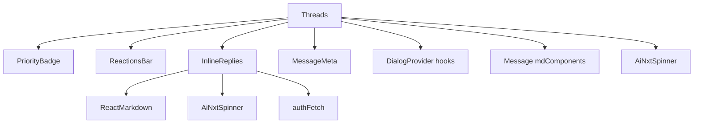
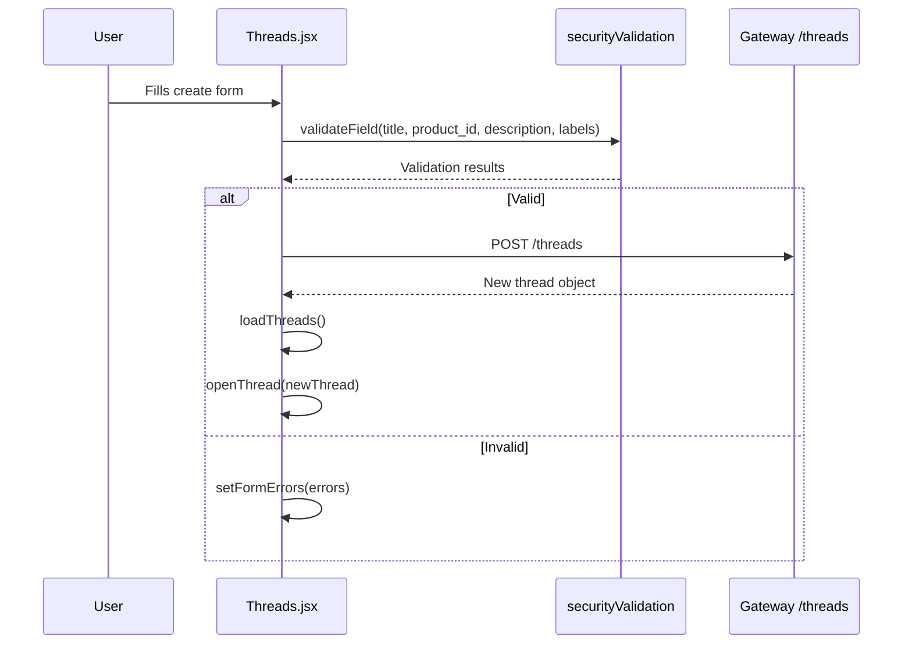
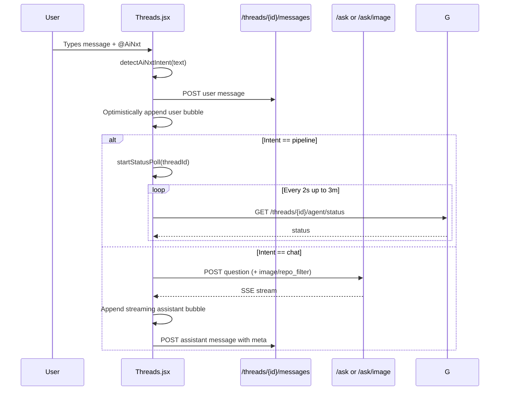
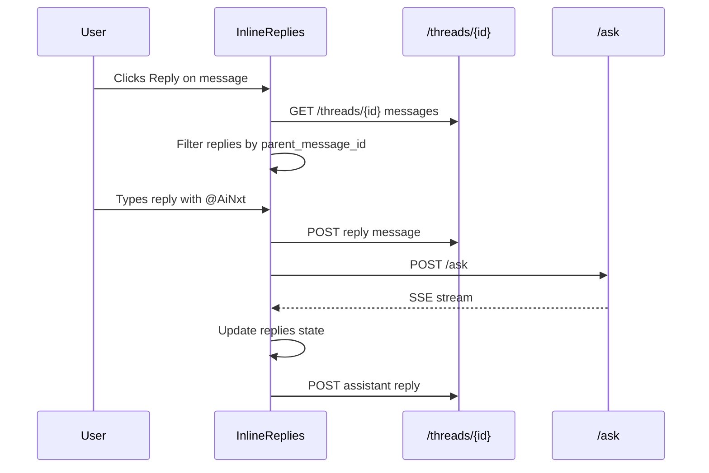

# Threads Module

## Brief Introduction

The **Threads** module provides the primary collaborative discussion interface in the `ai-ui` frontend. It allows users to create topic-centric conversation threads, exchange messages, reply inline, react with emojis, attach images, and invoke the `@AiNxt` AI assistant for either conversational answers or full SDLC pipeline workflows. Threads are scoped to products and optional code repositories, enabling RAG-grounded discussions and AI-driven analysis within a product context.

This module is a React component (`Threads.jsx`) that owns both the thread list sidebar and the message-detail view. It communicates directly with the platform gateway for thread CRUD, messaging, reactions, HITL actions, and AI streaming responses.

---

## Core Functionality

### Thread Management
- **List threads**: Displays threads filtered by product and search query.
- **Create thread**: Validates and submits a new thread with title, description, product, optional repo, priority, and labels.
- **Delete thread**: Admin-only deletion with confirmation.
- **Open thread**: Loads top-level messages and resolves product repos for RAG scoping.

### Messaging
- **Send messages**: Posts user messages to `/threads/{id}/messages`.
- **AI streaming**: Sends `@AiNxt` mentions to `/ask` (or `/ask/image` for image uploads) and streams SSE responses.
- **Edit user messages**: Loads a previous user prompt into the composer and truncates subsequent messages.
- **Copy messages**: Copies message content to clipboard.
- **Image attachments**: Validates and previews images before sending.

### Inline Replies
- **Reply panel**: Opens below any message to show threaded sub-conversations.
- **Nested AI answers**: Replies mentioning `@AiNxt` also stream AI responses scoped to the thread's repo.

### Reactions
- **Emoji reactions**: Toggle reactions per message via `/threads/{id}/messages/{msgId}/react`.
- **Emoji picker**: Uses `emoji-picker-react` for selecting reactions.

### HITL (Human-in-the-Loop)
- **Review gates**: For `ainxt_analysis` messages with `pending` status, users can approve, modify, or reject.
- **Action endpoints**: Posts decisions to `/threads/{id}/messages/{msgId}/hitl`.

### AI Intent Detection
- **Chat vs. pipeline**: Mentions of `@AiNxt` are classified as either `chat` or `pipeline` based on keywords like "fix", "analyze", "triage", "generate solution", "start SDLC", etc.
- **Pipeline mode**: Triggers a background SDLC flow and polls `/threads/{id}/agent/status` until completion.

---

## Architecture

```mermaid
graph TB
    subgraph "ai-ui Frontend"
        A[Threads.jsx]
        B[MessageMeta]
        C[Message.jsx mdComponents]
        D[DialogProvider]
        E[AiNxtSpinner]
        F[securityValidation]
        G[time utilities]
    end

    subgraph "Platform Gateway"
        H[/threads/*]
        I[/ask]
        J[/ask/image]
        K[/budget/me]
        L[/index/repos]
        M[/products/*]
    end

    subgraph "Backend Services"
        N[Threads Router]
        O[Chat / Ask Router]
        P[Budget Router]
        Q[Index Router]
        R[Products Router]
    end

    A --> B
    A --> C
    A --> D
    A --> E
    A --> F
    A --> G
    A --> H
    A --> I
    A --> J
    A --> K
    A --> L
    A --> M
    H --> N
    I --> O
    J --> O
    K --> P
    L --> Q
    M --> R
```

### Component Hierarchy



---

## Data Flow

### Creating a Thread



### Sending a Message with @AiNxt



### Inline Reply Flow



---

## Component Relationships

| Component / Utility | Responsibility | Used By |
|---------------------|----------------|---------|
| `Threads` | Main container: thread list, create form, message view, composer | `App.jsx` |
| `PriorityBadge` | Renders priority chip (High/Medium/Low) | `Threads` |
| `ReactionsBar` | Emoji reactions + picker | `Threads` |
| `InlineReplies` | Threaded reply panel with nested AI streaming | `Threads` |
| `MessageMeta` | Displays model, tokens, cost, latency, budget info | `Threads` (assistant messages) |
| `Message` / `mdComponents` | Shared markdown rendering components | `Threads`, `InlineReplies` |
| `DialogProvider` | `useConfirm` / `useToast` hooks | `Threads` |
| `AiNxtSpinner` | Loading indicator | `Threads`, `InlineReplies` |
| `securityValidation` | Validates title, description, labels | `Threads` |
| `time` (`toISTRelative`) | Relative timestamp formatting | `Threads` |

---

## API Endpoints Used

| Endpoint | Method | Purpose |
|----------|--------|---------|
| `/threads` | GET | List user's threads |
| `/threads` | POST | Create a new thread |
| `/threads/{id}` | GET | Load thread messages |
| `/threads/{id}` | DELETE | Delete a thread |
| `/threads/{id}/messages` | POST | Add a message |
| `/threads/{id}/messages/{msgId}/react` | POST | Toggle reaction |
| `/threads/{id}/messages/{msgId}/hitl` | POST | HITL approve/modify/reject |
| `/threads/{id}/agent/status` | GET | Poll SDLC pipeline status |
| `/ask` | POST | Stream AI chat response |
| `/ask/image` | POST | Stream AI response with image |
| `/budget/me` | GET | Fetch user's budget |
| `/index/repos` | GET | List indexed repositories |
| `/products` | GET | List products |
| `/products/{id}` | GET | Get product repos |

For details on the backend routers that serve these endpoints, see:
- [threads_router.md](threads_router.md)
- [chat_router.md](chat_router.md)
- [budget_router.md](budget_router.md)
- [index_router.md](index_router.md)
- [products_router.md](products_router.md)

---

## State Management

The component uses local React state (`useState`) for:
- `threads` / `selected` / `messages`
- `input` / `loading` / `codenxtWorking`
- `showCreate` / `form` / `formErrors`
- `replyTo` / `imageFile` / `imagePreviewUrl`
- `budget` / `indexedRepos` / `products` / `productRepos`

Refs are used for:
- `containerRef`: auto-scroll message list
- `abortRef`: `AbortController` for stopping generation
- `pollRef`: interval handle for pipeline status polling
- `textareaRef` / `imageInputRef`: DOM access

---

## Security & Validation

- Title and product are required.
- Title is validated via `validateProductName`.
- Description is validated via `validateDescription`.
- Labels are validated via `validateSecurity` with SQL injection checks disabled.
- Image uploads are restricted to JPEG, PNG, GIF, WebP and max 10 MB.
- User identity (`USER_ID`, `USER_NAME`, `IS_ADMIN`) is derived from the `user` prop, not `localStorage`.

---

## Integration with the Overall System

The Threads module sits in the `ai-ui` frontend and is one of the primary user-facing collaboration surfaces. It bridges:

- **Chat/Ask backend**: For streaming AI responses and image-based Q&A.
- **Threads backend**: For persistent threaded conversations, reactions, and HITL gates.
- **Product/Repo metadata**: For scoping discussions to products and codebases.
- **Budget system**: For displaying cost and budget metadata after AI turns.
- **SDLC pipeline**: For triggering long-running governance/fix workflows via `@AiNxt` pipeline intent.

It complements other `ai-ui` modules such as [chat.md](chat.md), [kb_chat.md](kb_chat.md), [discussions.md](discussions.md), and [sdlc_pipeline.md](sdlc_pipeline.md) by providing a project-threaded context for both human collaboration and AI-assisted engineering workflows.

---

## Key Design Decisions

1. **Optimistic UI**: User messages are appended locally before the server confirms.
2. **SSE streaming**: AI responses stream token-by-token for low perceived latency.
3. **Pipeline polling**: Long-running SDLC flows use status polling instead of keeping a streaming connection open.
4. **Inline replies**: Replies are rendered directly beneath the parent message to keep context visible.
5. **RAG scoping**: If a thread has a product but no explicit repo, the first product repo is used as the `repo_filter`.
6. **HITL integration**: Analysis messages can pause the workflow for human approval before proceeding.
