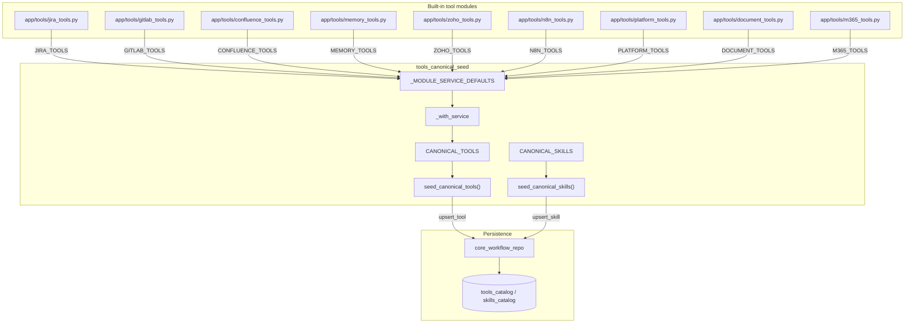
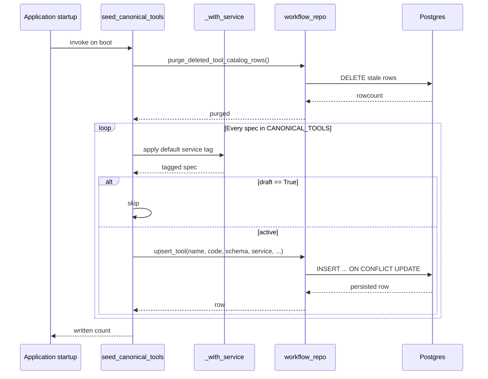
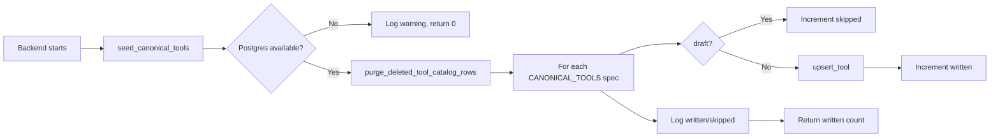

# tools_canonical_seed

## Brief Introduction

`tools_canonical_seed` is the backend bootstrap module that populates the
persistent tool and skill catalogs on every AB Studio startup. It aggregates
built-in tool specifications from the `app/tools/*` family of modules, tags
them with a service identifier, skips any integration that is still marked as
a draft, and upserts the active entries into PostgreSQL via
[`core_workflow_repo`](core_workflow_repo.md). The module is intentionally
small and data-driven: adding a new canonical tool is usually a matter of
exporting a spec from the relevant tool module and adding the module to the
`_MODULE_SERVICE_DEFAULTS` list.

The companion `CANONICAL_SKILLS` list currently ships empty but follows the
same seeding contract, so skills can be added to the catalog at startup using
the same idempotent upsert path.

---

## Core Responsibilities

| Responsibility | Description |
|----------------|-------------|
| **Catalog aggregation** | Collects tool specs from Jira, GitLab, Confluence, Memory, Zoho, n8n, Platform, Document, and Microsoft 365 tool modules. |
| **Service tagging** | Injects a `service` field into every spec so the UI and engine can group, filter, and scope tools by integration family. |
| **Draft gating** | Skips tools marked with `"draft": True` until the integration is configured and the flag is removed. |
| **Idempotent seeding** | Runs on every startup, upserting rows into `tools_catalog` and `skills_catalog` without duplicating entries. |
| **Stale-row cleanup** | Calls `workflow_repo.purge_deleted_tool_catalog_rows()` to remove catalog rows for tool families that have been deleted or renamed in code. |

---

## Component Reference

### `_with_service(specs, default_service)`

Helper that returns a copy of a list of tool specs with `service` set to the
provided default when the spec does not already declare one. This preserves
any explicit per-tool service override while guaranteeing that every catalog
row has a non-empty grouping tag.

### `CANONICAL_TOOLS`

A flattened list of all built-in tool specs. It is built by iterating over
`_MODULE_SERVICE_DEFAULTS` and applying `_with_service` to each module's
exported tool list. The resulting specs are consumed by
`seed_canonical_tools()`.

### `CANONICAL_SKILLS`

A placeholder list for built-in skills. It is currently empty but is iterated
by `seed_canonical_skills()` using the same upsert contract as tools.

### `seed_canonical_tools()`

Async entry point invoked during application startup. It:

1. Purges stale/deleted MCP tool catalog rows.
2. Iterates `CANONICAL_TOOLS`.
3. Skips any spec where `draft` is truthy.
4. Upserts the remaining specs into `tools_catalog` via
   `workflow_repo.upsert_tool()`.
5. Logs counts of written and skipped entries and returns the number of rows
   touched.

### `seed_canonical_skills()`

Async entry point that mirrors `seed_canonical_tools()` for skills. It
iterates `CANONICAL_SKILLS` and upserts each entry into `skills_catalog` via
`workflow_repo.upsert_skill()`.

---

## Architecture

---

## Data Flow

---

## Tool Spec Shape

Each entry in `CANONICAL_TOOLS` is a dictionary with the following fields:

| Field | Type | Purpose |
|-------|------|---------|
| `name` | `str` | Unique tool identifier used by the engine and catalog API. |
| `description` | `str` | Human-readable summary surfaced in the tool picker. |
| `input_schema` | `dict` | JSON Schema describing the arguments the tool accepts. |
| `code` | `str` | Python source executed by the tool dispatcher. |
| `service` | `str` | Integration family (e.g. `jira`, `gitlab`, `microsoft_365`). |
| `draft` | `bool` (optional) | When `True`, the spec is skipped during seeding. |

The `service` value is used by [`api_catalog`](api_catalog.md) to filter the
public catalog and by the [`engine_native_engine`](engine_native_engine.md)
to scope tool manifests per agent node.

---

## Integration with the Rest of the System

### Catalog API

[`api_catalog`](api_catalog.md) exposes endpoints such as
`list_tools_catalog`, `list_skills_catalog`, and `generate_catalog_tool`. The
rows written by `seed_canonical_tools()` and `seed_canonical_skills()` are the
source of truth for those endpoints. The catalog layer also applies runtime
filters, for example hiding Microsoft 365 tools when the user has no active
M365 OAuth connection.

### Workflow Engine

[`engine_native_engine`](engine_native_engine.md) resolves agent-attached
tools by looking them up in `tools_catalog` and wrapping each row in a
`_CatalogTool`. The `name`, `description`, and `input_schema` persisted by the
seeder are exactly what the engine needs to build the LLM function spec and
dispatch calls.

### Tool Modules

The seeder does not implement tool behavior itself. The actual logic lives in
sibling modules such as:

- [`tools_m365_bridge`](tools_m365_bridge.md) — Microsoft 365 connector-bridge
  shims.
- [`tools_swarm_spawn`](tools_swarm_spawn.md) — synthetic `spawn_swarm` tool
  used by the swarm runtime.
- `app/tools/jira_tools.py`, `app/tools/gitlab_tools.py`,
  `app/tools/platform_tools.py`, etc. — domain-specific tool implementations.

### Workflow Repository

[`core_workflow_repo`](core_workflow_repo.md) provides the persistence
primitives used by this module:

- `upsert_tool()` — idempotent insert/update of a `tools_catalog` row.
- `upsert_skill()` — idempotent insert/update of a `skills_catalog` row.
- `purge_deleted_tool_catalog_rows()` — removes rows for deleted MCP tool
  families or individually removed tools.

---

## Configuration and Environment

Each integrated service has its own required environment variables. The
seeder's module docstring lists them explicitly; a summary is included here
for reference:

| Service | Required environment variables |
|---------|-------------------------------|
| Jira | `JIRA_URL`, `JIRA_EMAIL`, `JIRA_API_TOKEN`, `JIRA_PROJECT` |
| GitLab | `GITLAB_URL`, `GITLAB_TOKEN` |
| Confluence | `CONFLUENCE_URL`, `CONFLUENCE_EMAIL`, `CONFLUENCE_API_TOKEN`, `CONFLUENCE_SPACE_KEY` |
| Memory | `REDIS_URL` (session), `DATABASE_URL` (episodic) |
| Zoho | `ZOHO_PEOPLE_URL`, `ZOHO_CRM_URL`, `ZOHO_ACCESS_TOKEN` |
| n8n | `N8N_URL`, `N8N_API_KEY` |
| Microsoft 365 | `PLATFORM_BASE_URL`, `AZURE_AD_CLIENT_SECRET` (also `AZURE_AD_CLIENT_ID`, `AZURE_AD_TENANT_ID`, `LLM_PROXY_URL` on the platform host) |
| Platform | `LLM_PROXY_URL` |

Tools whose backend integration is not yet configured should be kept as
drafts (`"draft": True`) so they are not seeded into the catalog until the
environment is ready.

---

## Adding a New Canonical Tool

1. Implement the tool in the appropriate `app/tools/<family>_tools.py` file.
2. Export the spec in that module's `<FAMILY>_TOOLS` list.
3. Add the module and its default `service` tag to
   `_MODULE_SERVICE_DEFAULTS` in `app/tools/canonical_tools.py` if it is not
   already present.
4. Restart the backend. `seed_canonical_tools()` will upsert the new spec on
   startup.

If the integration is not yet wired up, set `"draft": True` in the spec; the
seeder will skip it and log the count of skipped drafts.

---

## Process Flow

---

## Error Handling and Observability

- Each upsert is wrapped in its own `try/except` so a single malformed spec
cannot prevent the rest of the catalog from being seeded.
- Failures are logged at `WARNING` level with the tool name and exception
message.
- The function returns the number of successfully written rows, while skipped
drafts are reported separately.
- Stale-row cleanup is best-effort: a purge failure is logged but does not
abort the seeding loop.
