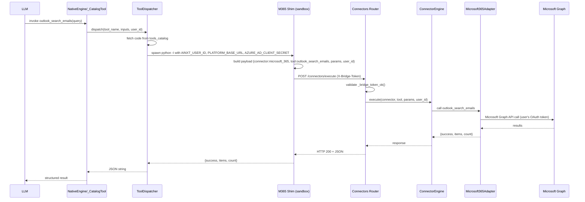

# tools_m365_bridge

The `tools_m365_bridge` module provides Microsoft 365 (Outlook, Teams, Calendar, People) tool definitions for AB Studio agents. Instead of re-implementing Microsoft Graph, each tool is a thin sandbox shim that calls back into the platform's internal connector layer via `POST /connectors/execute`. This delegates OAuth token management, scope enforcement, pagination, compliance checks, and egress to the existing [Microsoft 365 connector](connectors_microsoft365_adapter.md).

---

## Core Purpose

AB Studio agents need to act on behalf of a user inside Microsoft 365. The bridge solves this without duplicating Graph logic by:

1. **Defining tool specs** (`name`, `description`, `input_schema`, `code`) that the LLM can invoke.
2. **Embedding a small Python shim** (`_SHIM`) as the tool's executable code.
3. **Running the shim in the sandbox subprocess** via [ToolDispatcher](agent_factory_pipeline.md#tooldispatcher).
4. **Having the shim call the platform connector endpoint**, which routes to `ConnectorEngine.execute(...)` and the Microsoft 365 adapter.

The result is that agents get first-class M365 capabilities while authentication, token refresh, and Graph API details remain in the connector subsystem.

---

## Architecture

```mermaid
flowchart LR
    subgraph AgentRuntime["Agent Runtime"]
        LLM["LLM / Planner"]
        Engine["NativeEngine / _CatalogTool"]
        Dispatcher["ToolDispatcher"]
    end

    subgraph Sandbox["Subprocess Sandbox"]
        Shim["m365_tools._SHIM"]
    end

    subgraph Platform["Platform Backend"]
        Router["/connectors/execute router"]
        Engine2["ConnectorEngine"]
        Adapter["Microsoft365Adapter"]
    end

    subgraph External["External"]
        Graph["Microsoft Graph API"]
    end

    LLM -->|function call| Engine
    Engine -->|dispatch| Dispatcher
    Dispatcher -->|python -I + env vars| Shim
    Shim -->|HTTP POST + X-Bridge-Token| Router
    Router --> Engine2
    Engine2 --> Adapter
    Adapter --> Graph
```

### Key Design Decisions

- **No Graph re-implementation**: All Graph semantics live in `connectors/adapters/microsoft365.py`.
- **Sandbox isolation**: Tool code executes in a fresh `python -I` subprocess with no `PYTHONPATH` or `connectors` import access.
- **User-scoped calls**: The shim sends `user_id` to the connector endpoint so every Graph call uses that user's own OAuth token.
- **Bridge authentication**: `AZURE_AD_CLIENT_SECRET` is reused as an internal `X-Bridge-Token` secret between the sandbox and the platform host.
- **Proxy aware**: The shim honors `HTTPS_PROXY`, `https_proxy`, and `FORWARD_PROXY_URL`.

---

## Components

### `_make_tool(name, description, input_schema, draft=False)`

Factory that builds a canonical tool spec. It prepends `_TOOL = "<name>"` to the shared `_SHIM` source so the shim knows which connector tool to invoke.

Each spec contains:

| Field | Description |
|-------|-------------|
| `name` | Tool identifier (e.g. `outlook_search_emails`). |
| `description` | LLM-facing guidance, including write-action warnings. |
| `input_schema` | JSON Schema for the tool's parameters. |
| `code` | The executable shim (Python source run in the sandbox). |
| `service` | `"microsoft_365"` — used for catalog grouping and seeding. |
| `draft` | Optional flag; draft tools are skipped by `seed_canonical_tools`. |

### `_SHIM`

A block of Python source injected into every M365 tool. Responsibilities:

- Reads environment variables injected by [ToolDispatcher](agent_factory_pipeline.md#tooldispatcher):
  - `AINXT_USER_ID` — the agent-run's user.
  - `PLATFORM_BASE_URL` — platform base URL; defaults to `http://127.0.0.1:8000`.
  - `AZURE_AD_CLIENT_SECRET` — reused as `X-Bridge-Token`.
- Builds a JSON payload for `POST {PLATFORM_BASE_URL}/ainxt/v1/api/connectors/execute`.
- Handles HTTP errors, mapping `401` to auth errors, `422` to compliance blocks, and `success: false` responses to user-facing re-auth guidance.
- Returns a dict; reads include `items` + `count`, writes include `success`.

### `M365_TOOLS`

A list of Phase-1 tool specs covering:

- **Outlook**: `outlook_search_emails`, `outlook_read_email`, `outlook_send_mail`
- **Teams**: `teams_send_message`, `teams_start_chat`, `teams_get_chat_messages`
- **Calendar**: `calendar_list_events`, `calendar_create_event`
- **People**: `people_search`

Descriptions and schemas mirror the connector seed definitions so the LLM sees identical guidance whether using Cowork or an AB Studio agent.

---

## Data Flow

---

## Security & Environment

| Concern | Handling |
|---------|----------|
| User identity | `AINXT_USER_ID` is injected into the sandbox; every Graph call runs against that user's own M365 OAuth connection. |
| Bridge secret | `AZURE_AD_CLIENT_SECRET` is reused as `X-Bridge-Token`. The platform host validates it in `routers/connectors_router._bridge_token_ok`. |
| Secret leakage | The shim never prints secrets; `AZURE_AD_CLIENT_SECRET` flows through the sanitized environment. |
| Proxy / egress | `_make_opener()` honors `HTTPS_PROXY` / `FORWARD_PROXY_URL` and disables hostname verification for internal loopback calls. |
| Sandbox isolation | Tool code runs under `python -I` with no `PYTHONPATH` and a 1 MB stdout cap. See [ToolDispatcher](agent_factory_pipeline.md#tooldispatcher) for details. |
| Token rotation | Microsoft forces Azure AD secret rotation ~every 180 days. Both the platform host and the sandbox environment must be redeployed together to avoid a 401 window. |

---

## Error Handling

The shim maps common failure modes to agent-friendly messages:

- **Missing bridge token**: `"Microsoft 365 bridge is not configured on this host"`
- **Missing user context**: `"No user context; cannot call Microsoft 365."`
- **HTTP 401**: `"Microsoft 365 bridge rejected the request (auth)."`
- **HTTP 422**: `"Blocked by compliance policy."`
- **`success: false` with `REAUTH_REQUIRED` / `ACCESS_DENIED`**: prompts the user to reconnect M365 under Settings → Connectors.
- **Network errors**: surfaced as `"Microsoft 365 bridge unreachable: ..."`.

[ToolDispatcher](agent_factory_pipeline.md#tooldispatcher) retries transient errors (timeouts, 5xx, connection issues) up to `TOOL_MAX_ATTEMPTS` with exponential backoff, but does not retry deterministic failures such as `401`, `403`, `404`, or `422`.

---

## Integration with the Tool Catalog

`M365_TOOLS` is intended to be seeded into the `tools_catalog` table. The seeding logic lives in [tools_canonical_seed](tools_canonical_seed.md):

- `seed_canonical_tools()` iterates over `CANONICAL_TOOLS` (which includes the M365 specs via `_with_service`).
- Tools marked `draft=True` are skipped until the integration is fully configured.
- Once seeded, [NativeEngine](engine_native_engine.md) wraps each row as a `_CatalogTool` and dispatches it through [ToolDispatcher](agent_factory_pipeline.md#tooldispatcher).

---

## Dependencies

- [agent_factory_pipeline](agent_factory_pipeline.md) — `ToolDispatcher` runs the shim in a sandbox and injects `AINXT_USER_ID`.
- [tools_canonical_seed](tools_canonical_seed.md) — seeds `M365_TOOLS` into `tools_catalog`.
- [engine_native_engine](engine_native_engine.md) — `_CatalogTool` loads tool specs from the catalog and invokes the dispatcher.
- [connectors_microsoft365_adapter](connectors_microsoft365_adapter.md) — the actual Microsoft Graph adapter executed by the connector bridge.
- [routers_connectors](routers_connectors.md) — exposes `/connectors/execute` and validates `X-Bridge-Token`.

---

## When to Modify This Module

- Adding a new Microsoft 365 capability: add a new `_make_tool(...)` entry to `M365_TOOLS` and ensure the corresponding tool exists in `connectors/adapters/microsoft365.py`.
- Changing bridge authentication: update both `_SHIM` and `routers/connectors_router._bridge_token_ok` in lockstep.
- Adjusting error messages or proxy behavior: edit `_SHIM`.
- Marking tools unavailable until configuration: set `draft=True`.
