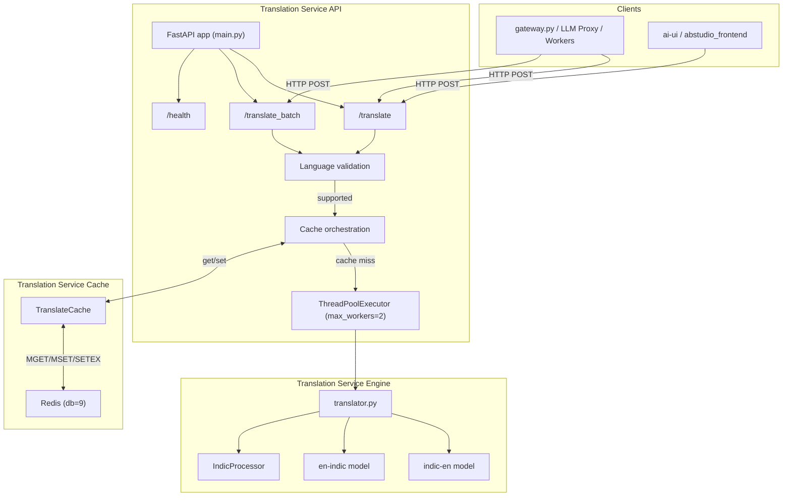
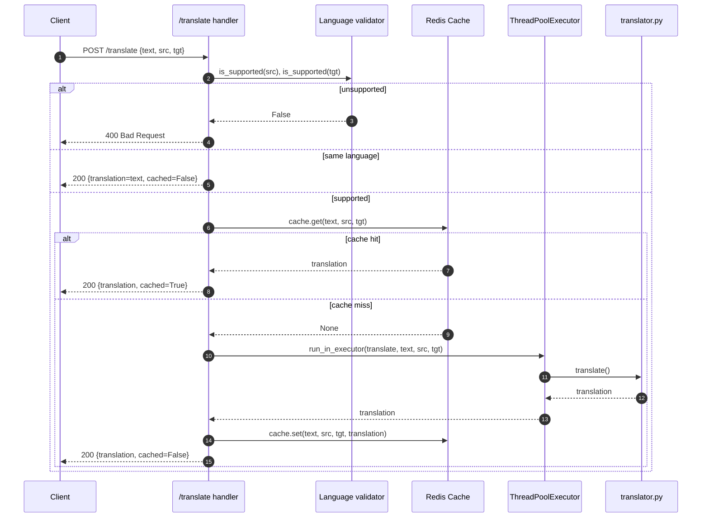
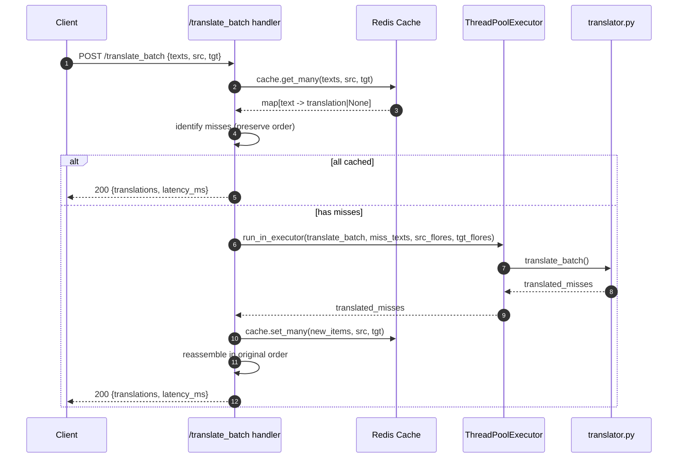
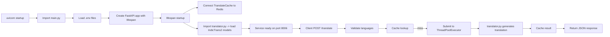

# Translation Service API

## Brief Introduction

The **Translation Service API** (`services/translate_svc/main.py`) is a FastAPI microservice that exposes HTTP endpoints for translating text between English and 22 scheduled Indian languages. It is built on top of the [IndicTrans2](https://ai4bharat.iitm.ac.in/indictrans2) sequence-to-sequence models and is designed to operate as a dedicated, horizontally-scalable service within the AiNxt platform. The service runs on port `8006` by default, loads both translation directions at module import time, and uses a Redis-backed cache to avoid redundant model inference.

This module is the API layer only: it validates requests, orchestrates caching, delegates blocking model work to a thread pool, and returns structured responses. The actual model inference lives in [translation_service_engine.md](translation_service_engine.md), and the Redis cache wrapper is documented in [translation_service_cache.md](translation_service_cache.md).

---

## Core Responsibilities

| Responsibility | Description |
| --- | --- |
| **Request validation** | Validates ISO language codes, request payloads, and same-language short-circuits. |
| **Cache orchestration** | Looks up and stores translations in a dedicated Redis database (DB `9`) with a 24-hour TTL. |
| **Async bridge to sync inference** | Runs blocking `model.generate()` calls in a `ThreadPoolExecutor` so the asyncio event loop stays responsive. |
| **Health reporting** | Exposes a `/health` endpoint that reports model load state, cache connectivity, and device configuration. |
| **Observability** | Optionally instruments the FastAPI app with OpenTelemetry when `OTLP_ENDPOINT` is configured. |

---

## Architecture

### Why a dedicated service?

The IndicTrans2 models are large, CPU/GPU-intensive, and not thread-safe for concurrent `generate()` calls. Isolating them in a single-worker microservice:

- Prevents blocking the main [gateway](gateway.md) asyncio loop.
- Allows independent scaling, resource allocation, and GPU pinning.
- Makes it easy to cache deterministic translations and share them across callers.

---

## Component Breakdown

### `app` — FastAPI application

Created with a `lifespan` context manager that:

1. Connects the [translation_service_cache](translation_service_cache.md) to Redis.
2. Imports `services.translate_svc.translator` to confirm models are loaded at startup.
3. Shuts down the thread pool gracefully on exit.

### `lifespan(app: FastAPI)`

| Phase | Action |
| --- | --- |
| Startup | Connect Redis cache; import translator module to verify model load. |
| Runtime | Yield control to FastAPI. |
| Shutdown | Call `_translate_pool.shutdown(wait=False)`. |

### `translate(req: TranslateRequest)` → `TranslateResponse`

Handler for `POST /translate`.

1. Validates `source_lang` and `target_lang` using `is_supported()`.
2. Returns the input unchanged if source equals target.
3. Checks Redis cache; returns `cached=True` on hit.
4. On miss, submits the blocking translation to the thread pool.
5. Stores the result in Redis and returns `cached=False`.

### `translate_batch(req: TranslateBatchRequest)` → `TranslateBatchResponse`

Handler for `POST /translate_batch`.

1. Validates language codes.
2. Performs a bulk cache lookup via `TranslateCache.get_many()`.
3. Translates only the cache misses in one engine call.
4. Writes misses back to Redis with `set_many()`.
5. Reassembles results in original order and reports latency + hit/miss counts.

### `health()`

Handler for `GET /health`.

- Verifies both IndicTrans2 model objects exist.
- Pings Redis to report `cache_ok`.
- Returns `status`, `models_loaded`, `cache_ok`, `device`, and `port`.

### Request/Response Models

| Model | Purpose |
| --- | --- |
| `TranslateRequest` | `{ text, source_lang, target_lang }` |
| `TranslateResponse` | `{ translation, source_lang, target_lang, cached }` |
| `TranslateBatchRequest` | `{ texts: list[str], source_lang, target_lang }` |
| `TranslateBatchResponse` | `{ translations: list[str], latency_ms }` |

---

## Data Flow

### Single Translation Flow

### Batch Translation Flow

---

## Dependencies

### Internal Modules

| Module | Relationship | Link |
| --- | --- | --- |
| `services/translate_svc/translator.py` | Delegates all blocking model inference. | [translation_service_engine.md](translation_service_engine.md) |
| `services/translate_svc/cache.py` | Provides async Redis get/set/get_many/set_many. | [translation_service_cache.md](translation_service_cache.md) |
| `services/translate_svc/config.py` | Supplies port, device, model IDs, FLORES map, and `is_supported()`. | (configuration, no separate doc) |
| `core/logger.py` | Optional structured logger; falls back to stdlib `logging`. | [shared_core.md](shared_core.md) |

### External Libraries

- **FastAPI** — HTTP framework and request/response models.
- **Pydantic** — `BaseModel` validation.
- **redis.asyncio** — Async Redis client.
- **transformers + torch** — Loaded inside `translator.py`.
- **IndicTransToolkit** — Pre/post-processing for IndicTrans2.
- **OpenTelemetry** — Optional FastAPI auto-instrumentation.

---

## Configuration

| Environment Variable | Default | Purpose |
| --- | --- | --- |
| `TRANSLATE_SVC_PORT` | `8006` | HTTP port for the service. |
| `TRANSLATE_DEVICE` | `cpu` | Torch device (`cpu` or `cuda`). |
| `INDIC_EN_MODEL` | `ai4bharat/indictrans2-indic-en-dist-200M` | Hugging Face model for Indic → English. |
| `EN_INDIC_MODEL` | `ai4bharat/indictrans2-en-indic-dist-200M` | Hugging Face model for English → Indic. |
| `REDIS_HOST` | `localhost` | Redis host for the cache. |
| `REDIS_PORT` | `6379` | Redis port. |
| `REDIS_TRANSLATE_DB` | `9` | Dedicated Redis database. |
| `TRANSLATE_CACHE_TTL` | `86400` | Cache TTL in seconds (24h). |
| `OTLP_ENDPOINT` | — | Optional OpenTelemetry collector endpoint. |
| `ENABLE_TRACING` | `1` | Set to `0` to disable OTel even if endpoint is set. |
| `SERVICE_NAME` | `ainxt-translate-svc` | Service name for OTel resource. |

> **Deployment note:** The service must run with `--workers 1` because the IndicTrans2 models are loaded at module import time and are not thread-safe for concurrent `generate()` calls. The internal `ThreadPoolExecutor` (max 2 workers) is used only to keep the asyncio loop unblocked.

---

## Supported Languages

The service supports ISO codes mapped to FLORES-200 codes used by IndicTrans2. Supported codes include:

`as`, `bn`, `brx`, `doi`, `kok`, `gu`, `hi`, `kn`, `ks_Arab`, `ks_Deva`, `mai`, `ml`, `mr`, `mni_Beng`, `mni_Mtei`, `ne`, `or`, `pa`, `sa`, `sat`, `sd_Arab`, `sd_Deva`, `ta`, `te`, `ur`, `en`.

See `services/translate_svc/config.py` for the full `FLORES` mapping.

---

## Error Handling

| Scenario | HTTP Status | Detail |
| --- | --- | --- |
| Unsupported `source_lang` | `400` | `Unsupported source_lang '<code>'` |
| Unsupported `target_lang` | `400` | `Unsupported target_lang '<code>'` |
| Translation engine `ValueError` | `400` | Error message propagated |
| Unexpected engine failure | `500` | Error message logged and returned |

Cache failures are intentionally non-fatal: the service logs a warning and continues without caching.

---

## How It Fits into the Overall System

The Translation Service API is one of several specialized AI microservices in the AiNxt platform, alongside:

- [embedding_service.md](embedding_service.md) — text embedding and reranking.
- [privacy_service.md](privacy_service.md) — PII/screening inference.
- [whisper_service.md](whisper_service.md) — speech-to-text.
- [compression_service.md](compression_service.md) — text compression.
- [llm_proxy.md](llm_proxy.md) — general LLM routing.

Callers such as the [gateway](gateway.md), [shared_core](shared_core.md) (`core/translation_wrapper.py`), and background [workers](workers.md) send HTTP requests to `POST /translate` or `POST /translate_batch` when they need deterministic, cached English ↔ Indic translations. The service is not invoked directly by end-user browsers; it is consumed server-side by other platform components.

---

## Process Flow: Startup to First Request

---

## Maintenance & Operational Notes

- **Single-worker requirement:** Never start this service with more than one Uvicorn worker; model objects are shared globals and concurrent `generate()` calls are unsafe.
- **Thread pool size:** `max_workers=2` balances throughput with the single-worker constraint. Increase only if profiling shows headroom.
- **Cache warming:** The batch endpoint is the preferred path for high-volume callers because it performs a single bulk cache lookup and one model call for misses.
- **GPU production:** Set `TRANSLATE_DEVICE=cuda` and override `INDIC_EN_MODEL` / `EN_INDIC_MODEL` to the 1B variants. The code automatically selects `float16` on CUDA.
- **Observability:** Health checks should verify both `models_loaded` and `cache_ok`; a degraded state with `models_loaded=false` requires a restart.
