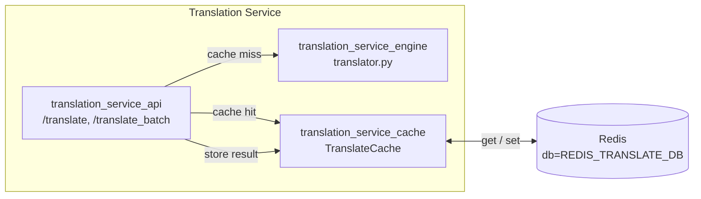
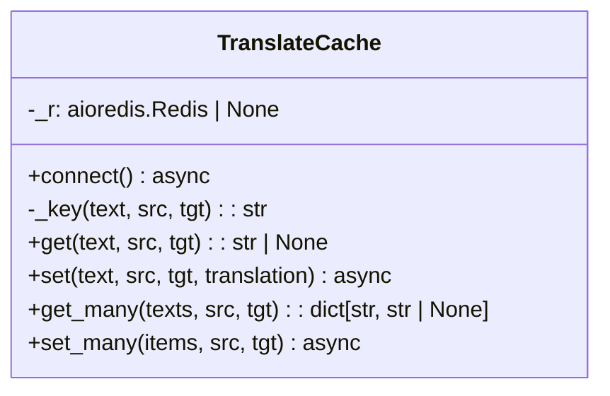
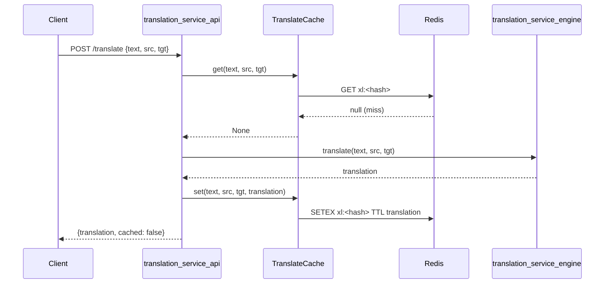
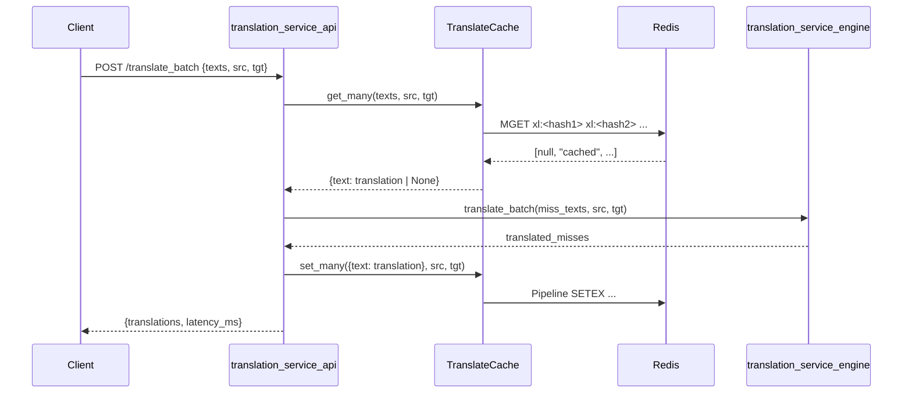
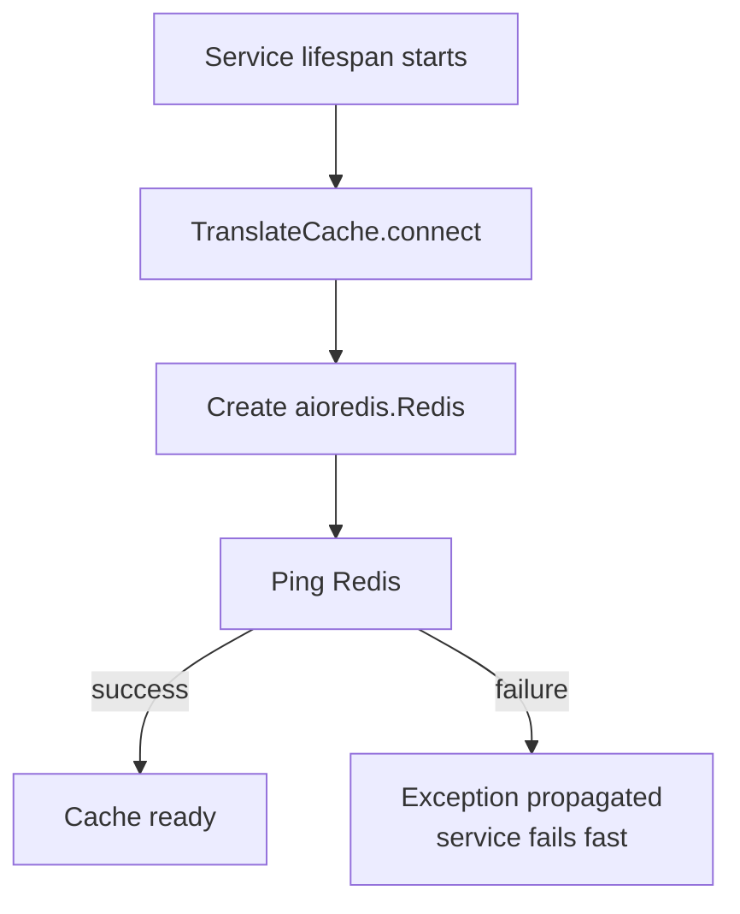
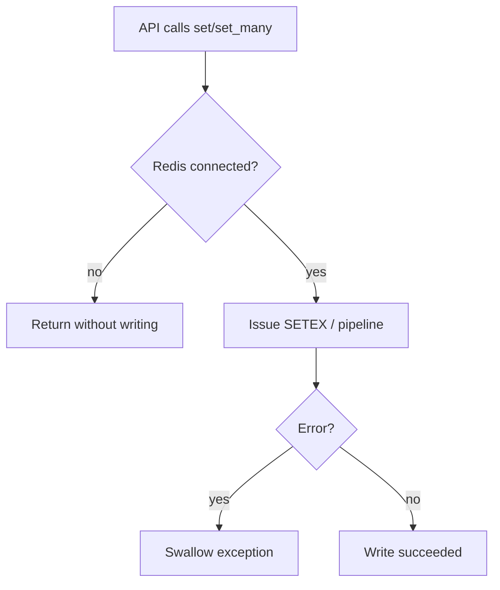

# Translation Service Cache

## Brief Introduction

The `translation_service_cache` module provides a Redis-backed result cache for the [translation_service](translation_service.md). It stores previously computed translations keyed by a deterministic hash of the source text, source language, and target language, and returns cached results on subsequent requests. By caching at the service level, the module reduces redundant calls to the underlying translation model, lowers latency for repeated phrases, and improves overall throughput for both single-text and batch translation endpoints.

The cache is designed to be **fail-open**: if Redis is unavailable or returns an error, the translation pipeline falls back to invoking the model and serving the result without caching. This keeps the translation service resilient to cache infrastructure issues.

---

## Core Responsibilities

| Responsibility | Description |
| -------------- | ----------- |
| **Result caching** | Store translated strings in Redis with a 24-hour TTL. |
| **Cache lookup** | Retrieve cached translations for single texts or batches. |
| **Deterministic keys** | Generate stable cache keys from `(source_lang, target_lang, text)` using SHA-256. |
| **Fail-open behavior** | Swallow Redis errors and return `None` so the caller can translate normally. |
| **Batch operations** | Support `mget`/`pipeline` based batch reads and writes to minimize Redis round trips. |

---

## Architecture

### Component Overview



### `TranslateCache`

`TranslateCache` is the only public class in this module. It wraps an `redis.asyncio.Redis` connection and exposes a small, purpose-built API for translation caching.



### Cache Key Design

Keys are deterministic and compact:

```
xl:<sha256(f"{src}|{tgt}|{text}")[:32]>
```

- Prefix `xl:` scopes keys to the translation service.
- SHA-256 truncation keeps keys short while keeping collision risk negligible.
- The key includes both language codes and the full source text, so the same phrase translated between different language pairs is cached independently.

---

## Data Flow

### Single-Text Translation



### Batch Translation



---

## Component Interactions

| Caller | Callee | Purpose |
| ------ | ------ | ------- |
| `translation_service_api` | `TranslateCache.get` / `TranslateCache.get_many` | Check for cached translations before invoking the model. |
| `translation_service_api` | `TranslateCache.set` / `TranslateCache.set_many` | Persist newly translated results for future reuse. |
| `TranslateCache` | `redis.asyncio.Redis` | Async Redis I/O (`get`, `mget`, `setex`, `pipeline`). |
| `TranslateCache` | `services.translate_svc.config` | Reads Redis host, port, DB index, and TTL constants. |

For details on how the API layer orchestrates cache hits and misses, see [translation_service_api](translation_service_api.md). For the model invocation logic, see [translation_service_engine](translation_service_engine.md).

---

## Process Flows

### Connection Initialization



### Read Path (Fail-Open)

```mermaid
flowchart TD
    A[API calls get/get_many] --> B{Redis connected?}
    B -->|no| C[Return None / all None]
    B -->|yes| D[Issue Redis command]
    D --> E{Error?}
    E -->|yes| C
    E -->|no| F[Return value(s)]
```

### Write Path (Fail-Silent)



---

## Configuration

The module imports the following values from `services.translate_svc.config`:

| Setting | Usage |
| ------- | ----- |
| `REDIS_HOST` | Redis server hostname. |
| `REDIS_PORT` | Redis server port. |
| `REDIS_TRANSLATE_DB` | Logical Redis database number for translation cache. |
| `TRANSLATE_CACHE_TTL` | Expiration time for cached entries (default 24 hours). |

---

## Error Handling & Operational Notes

- **Cache miss on Redis failure**: `get` and `get_many` catch all exceptions and return `None` (or a map of `None` values). The API layer treats this as a cache miss and proceeds to the translation engine.
- **Write failures are non-fatal**: `set` and `set_many` catch exceptions and do not propagate them. A single failed cache write will not fail the translation request.
- **Connection is lazy but validated**: `connect()` creates the client and issues a `PING`. If Redis is unreachable at startup, the service fails fast so operators can detect misconfiguration.
- **No serialization overhead**: Values are stored as plain UTF-8 strings (`decode_responses=True`), matching the string output of the translation engine.

---

## Dependencies

- **External**: `redis.asyncio` for async Redis access, `hashlib` for key hashing.
- **Internal**: `services.translate_svc.config` for Redis and TTL configuration.
- **Related modules**:
  - [translation_service_api](translation_service_api.md) — HTTP endpoints that drive the cache.
  - [translation_service_engine](translation_service_engine.md) — model-based translation invoked on cache misses.

---

## How It Fits into the Overall System

The translation service is a standalone microservice in the broader AI platform. The cache layer sits between the FastAPI endpoints and the CPU/GPU-bound translation model, providing a low-latency, high-hit-rate buffer for repeated content. It is consumed by:

- The [translation_service_api](translation_service_api.md) for `/translate` and `/translate_batch`.
- Potentially other platform services (e.g., chat, document processing, knowledge base ingestion) that route translation requests through the translation service.

Because the cache is language-pair specific and text-hash specific, it works safely across multilingual workloads without collisions. The 24-hour TTL balances reuse with the need to refresh translations after model updates.
