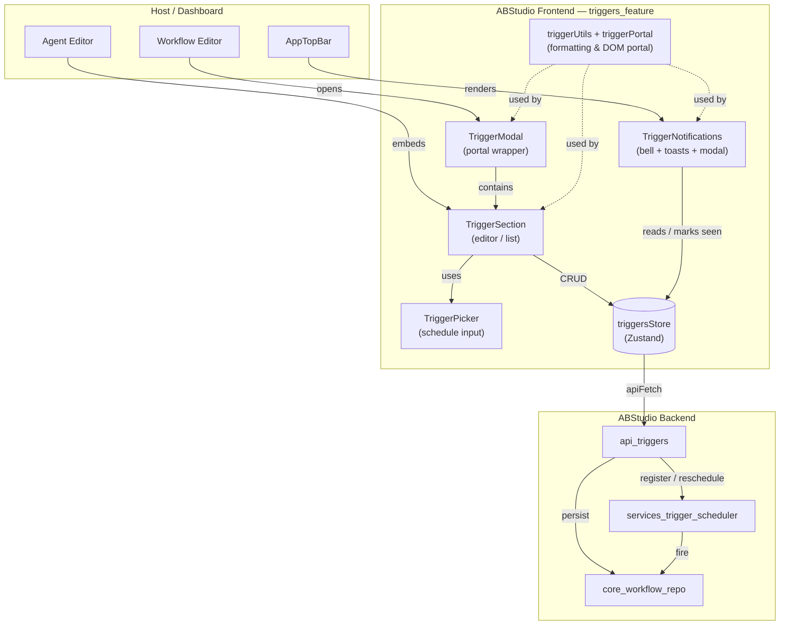
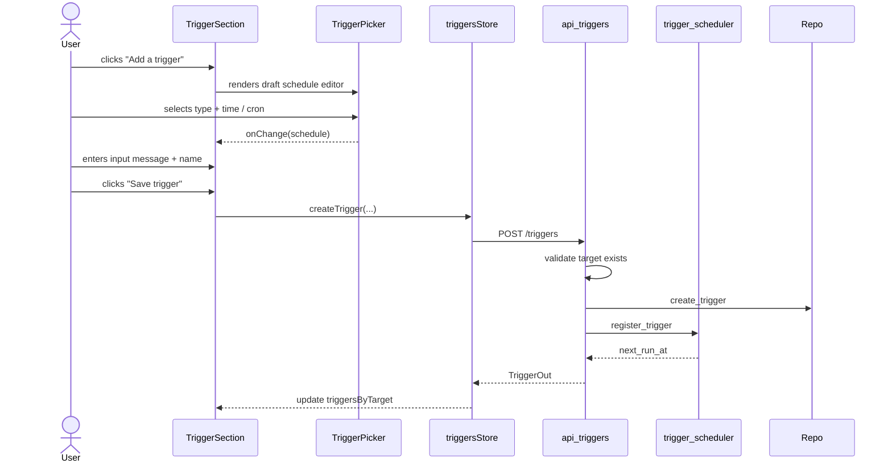
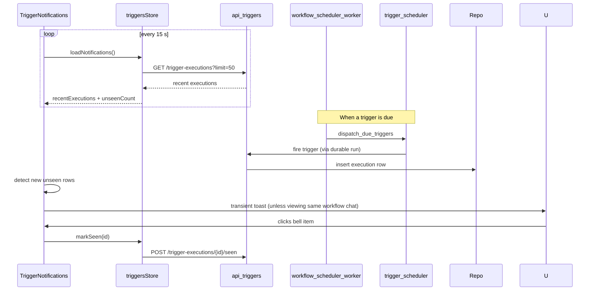

# Triggers Feature

The **Triggers Feature** module provides the frontend UI for scheduling and monitoring automated runs of workflows and agents in ABStudio. It is the user-facing "Routines" layer that lets users attach time-based (and, on the backend, event-based) schedules to a `workflow` or an `agent`, review upcoming runs, and inspect execution history.

## Purpose

- Allow users to create, edit, enable/disable, and delete triggers attached to workflows or agents.
- Provide a schedule picker with presets (once, hourly, daily, weekdays, weekly) and a custom cron mode.
- Surface trigger execution history through a global notification bell, per-trigger history panels, and a detail modal.
- Keep all displayed times in IST (Asia/Kolkata), matching the backend scheduler semantics.

## Where It Fits

The feature lives in `ABStudio/frontend/src/features/triggers/` and is consumed by:

- `workflows_feature` — workflow cards and the workflow editor can open the trigger editor for the whole workflow or for a specific agent node.
- `agents_feature` — the agent editor embeds the trigger section so an agent can be scheduled independently.
- `app_core` — the top bar hosts the global `TriggerNotifications` bell.

Backend support is provided by `api_triggers` (REST endpoints), `services_trigger_scheduler` (scheduler engine), and `core_workflow_repo` (persistence). See the module tree for links to those modules.

## Architecture Overview

## Data Flow

### Creating a Trigger

### Notification Lifecycle

## Sub-modules

| Sub-module | Responsibility | Key Files |
|---|---|---|
| [triggers_feature_editor](triggers_feature_editor.md) | Trigger list, draft creation, inline editing, per-trigger execution history, and the modal wrapper used by dashboards. | `TriggerSection.jsx`, `TriggerModal.jsx` |
| [triggers_feature_scheduler](triggers_feature_scheduler.md) | Schedule type tabs and inputs: once, hourly, daily, weekdays, weekly, and custom cron. | `TriggerPicker.jsx` |
| [triggers_feature_notifications](triggers_feature_notifications.md) | Global notification bell, transient toasts, execution detail modal, and seen-state management. | `TriggerNotifications.jsx` |
| [triggers_feature_utils](triggers_feature_utils.md) | Shared helpers: IST formatting, duration labels, and the DOM portal used to escape containing blocks. | `triggerUtils.js`, `triggerPortal.js` |

## External Dependencies

- **[triggersStore](../store/triggersStore.js)** — Zustand store that owns all API calls and client-side caching for triggers and executions.
- **[workflowStore](../store/workflowStore.js)** — Used by `TriggerNotifications` to suppress duplicate toasts when the user is already viewing the chat for the workflow that just ran.
- **[api_triggers](api_triggers.md)** — REST endpoints: `/triggers`, `/trigger-executions`, `/triggers/{id}/webhook`, `/triggers/config`.
- **[services_trigger_scheduler](services_trigger_scheduler.md)** — APScheduler-based engine that registers, reschedules, and fires triggers.
- **[core_workflow_repo](core_workflow_repo.md)** — Persistence layer for triggers and executions.

## Key Design Decisions

1. **IST everywhere** — The backend stores and interprets all schedule times in Asia/Kolkata. The frontend mirrors this by labeling inputs "IST" and formatting timestamps with `timeZone: 'Asia/Kolkata'`.
2. **Portal-based overlays** — `useTriggerPortalContainer` appends a dedicated `div` to `document.body` so modals and toasts are not clipped by `backdrop-filter`, `transform`, or scrollable dashboard ancestors.
3. **History is persistent, not an inbox** — The bell shows the last 50 executions and keeps rows after they are read; `seen` only dims the row and decrements the badge.
4. **Immediate persistence** — Every create, update, enable/disable, and delete is saved to the backend right away; there is no batch "Save" button.
5. **Node-scoped workflow triggers** — A trigger can be bound to a specific agent node inside a workflow. The cache key encodes `targetKind:targetId:nodeId` so different nodes see independent trigger lists.
