# ChatActions Module

## 1. Introduction

The **ChatActions** module is a sub-module of the [ChatPanel](ChatPanel.md) component in ABStudio's Workflow Editor. It encapsulates the **user-facing action handlers and render helpers** that operate on individual chat messages and live execution timeline steps within the workflow preview chat panel.

The module is not a standalone React component; rather, it is a logical grouping of three functions defined inside `ChatPanel.jsx`:

| Component | Type | Responsibility |
|---|---|---|
| `handleRegenerate` | Event handler | Replays the last user message through the workflow, replacing the previous assistant reply. |
| `handleCopy` | Event handler | Copies formatted tool-call argument text to the clipboard with a transient "Copied" indicator. |
| `renderRoundChip` | Render helper | Renders an inline "round N of M · score%" chip for loop-iteration timeline steps. |

These functions sit at the intersection of the **chat transcript** (message list) and the **live execution timeline** (thinking card), giving users the ability to retry responses, copy structured data, and monitor loop progress without leaving the chat surface.

---

## 2. Architecture Overview

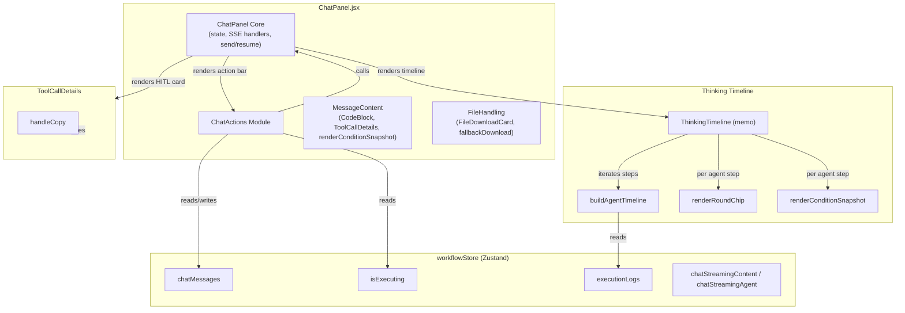

### 2.1 Module Boundaries

The ChatActions module is one of four logical sub-modules carved out of `ChatPanel.jsx`:

| Sub-module | Scope |
|---|---|
| **ChatPanelCore** | Main component: state management, SSE stream handling, send/resume, thread history, attachments, HITL cards. |
| **ChatActions** *(this module)* | Message-level action handlers (`handleRegenerate`, `handleCopy`) and timeline chip rendering (`renderRoundChip`). |
| **MessageContent** | Markdown rendering helpers: `CodeBlock`, `ToolCallDetails`, `renderConditionSnapshot`. |
| **FileHandling** | Generated-file download cards: `FileDownloadCard`, `fallbackDownload`. |

---

## 3. Core Components

### 3.1 `handleRegenerate`

**Purpose:** Allows the user to regenerate the most recent assistant response by replaying the last user message through the workflow.

**Location:** Defined as a function declaration inside the `ChatPanel` component body (closure over `messages`, `isExecuting`, `setMessages`, `setMessage`, `handleSend`).

#### Algorithm

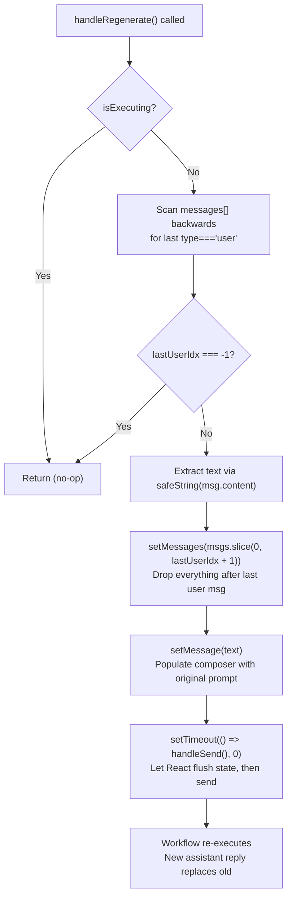

#### Key Design Decisions

| Decision | Rationale |
|---|---|
| **Guard on `isExecuting`** | Prevents overlapping runs — the backend's `/run-stream` endpoint is not designed for concurrent executions on the same thread. |
| **Backward scan for last user message** | Handles multi-turn conversations correctly; only the most recent user prompt is replayed, not the first. |
| **`slice(0, lastUserIdx + 1)`** | Removes the previous assistant reply (and any error/rejection messages) so the regenerated response replaces it cleanly rather than appending. |
| **`setTimeout(() => handleSend(), 0)`** | Defers the send to the next microtask so React can flush the `setMessages` and `setMessage` state updates before `handleSend` reads them. Without this, `handleSend` would see stale state. |
| **Reuses `handleSend`** | Ensures the regenerated run goes through the exact same validation, attachment handling, SSE streaming, and debug-log population as a normal send — no duplicated code paths. |

#### UI Integration

The regenerate button is rendered in the **assistant message action bar** — but only for the **latest** assistant message and only when **not executing**:

```jsx
{isLatestAssistant && !isExecuting && (
    <button onClick={handleRegenerate} title="Regenerate response">
        {/* refresh icon */}
    </button>
)}
```

The action bar also includes copy, share, and Teams-share buttons (handled by `handleCopyMessage`, `handleShareMessage`, and `handleTeamsShare` respectively — these are sibling handlers in the ChatPanelCore scope, not part of this module).

---

### 3.2 `handleCopy`

**Purpose:** Copies the formatted tool-call arguments from a `ToolCallDetails` component to the system clipboard, with a transient "Copied" visual confirmation.

**Location:** Defined as an arrow function inside the `ToolCallDetails` component (closure over `formatted`, `copyTextToClipboard`, `setCopied`, `copyTimerRef`).

#### Algorithm

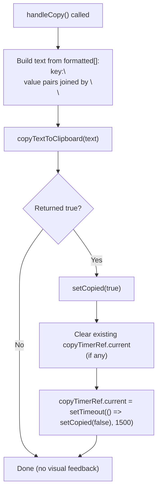

#### Context: `ToolCallDetails` Component

`handleCopy` lives inside `ToolCallDetails`, which renders the expandable argument list for a tool call in the HITL (Human-in-the-Loop) approval card. The component:

1. Pre-formats each argument entry once via `useMemo` — `argEntries.map(([k, v]) => [k, safeString(v)])` — so `handleCopy`, the line-count heuristic, and the JSX body don't each re-run `safeString` on the same values.
2. Auto-expands when the total line count across all arguments is ≤ 6 (lazy `useState` initializer).
3. Cleans up the pending "Copied" reset timer on unmount via `useEffect` to avoid `setState` on an unmounted component.

#### Clipboard Fallback

`copyTextToClipboard` (a module-level utility in `ChatPanel.jsx`) provides a fallback for environments where `navigator.clipboard` is unavailable (e.g., Electron's renderer process):

```javascript
function copyTextToClipboard(text) {
    const textArea = document.createElement('textarea');
    textArea.value = text;
    textArea.style.position = 'fixed';
    textArea.style.left = '-9999px';
    document.body.appendChild(textArea);
    textArea.select();
    let ok = false;
    try { ok = document.execCommand('copy'); } catch (err) { /* ... */ }
    document.body.removeChild(textArea);
    return ok;
}
```

This same utility is shared by `CodeBlock.handleCopy` (in the [MessageContent](ChatPanel.md) sub-module) and `handleCopyMessage` (in ChatPanelCore), ensuring consistent clipboard behavior across all copy affordances in the chat panel.

---

### 3.3 `renderRoundChip`

**Purpose:** Renders an inline chip showing the current loop iteration number and (optionally) the confidence score for loop-iteration timeline steps in the `ThinkingTimeline`.

**Location:** Module-level function (not a component), called during `ThinkingTimeline`'s render of each agent step.

#### Signature

```javascript
function renderRoundChip(step) → JSX.Element | null
```

#### Input: `step` Object

The `step` object is produced by `buildAgentTimeline` (see [ChatPanel](ChatPanel.md) for full timeline construction). Relevant fields:

| Field | Type | Source | Description |
|---|---|---|---|
| `step.loopRound` | `number \| null` | `buildAgentTimeline` — set from `activeLoops.get(nodeId).index + 1` | 1-based current round number. `null` means the step is not inside a loop. |
| `step.loopTotal` | `number \| null` | `buildAgentTimeline` — set from `activeLoops.get(nodeId).total` | Total expected iterations (may be `null` for `while`-mode loops with no fixed count). |
| `step.condition` | `object \| null` | `buildAgentTimeline` — merged from `loop_condition`, `loop_iter_summary`, and `loop_iter_eval` logs | Loop condition snapshot containing `evalState.score`, `willContinue`, `caseResults`, `evaluation`, `stopDecision`. |

#### Rendering Logic

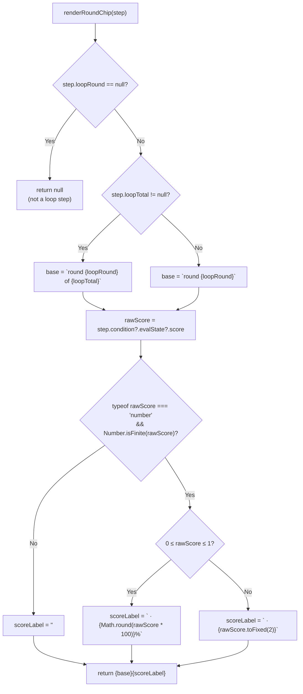

#### Score Display Rules

| Score Range | Display Format | Example |
|---|---|---|
| `0 ≤ score ≤ 1` | Percentage | `round 2 of 5 · 80%` |
| Finite but outside `[0,1]` | Two-decimal fixed | `round 3 · 1.25` |
| Not a number / not finite | Omitted | `round 1 of 3` |
| `null` / `undefined` | Omitted | `round 1 of 3` |

#### Relationship with `renderConditionSnapshot`

The confidence score surfaced by `renderRoundChip` is the **same score** rendered in more detail by `renderConditionSnapshot` (in the [MessageContent](ChatPanel.md) sub-module). Both read from `step.condition.evalState.score`. The chip provides an at-a-glance inline summary ("round 1 · 65% → round 2 · 80%") while `renderConditionSnapshot` provides the full breakdown:

- Confidence Score pill (with "(judged)" suffix when an LLM evaluator ran)
- Continue/Stop verdict
- "What changed" summary
- Expandable LLM-judge rubric table (criterion, score, weight, reasoning)

Both are rendered together inside each agent timeline step:

```jsx
<span className="thinking-step-agent">
    {step.agent}
    {renderRoundChip(step)}
</span>
{renderConditionSnapshot(step.condition)}
```

---

## 4. Data Flow

### 4.1 Regenerate Flow

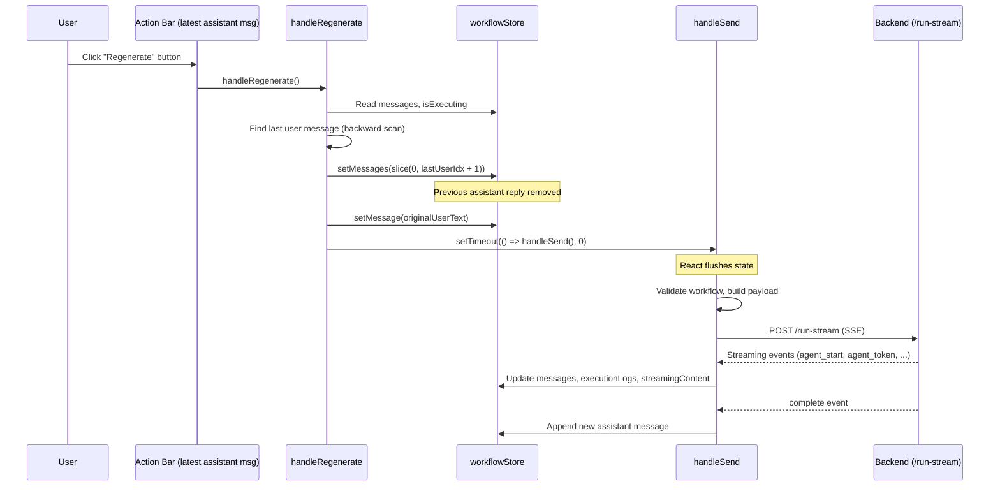

### 4.2 Copy Flow

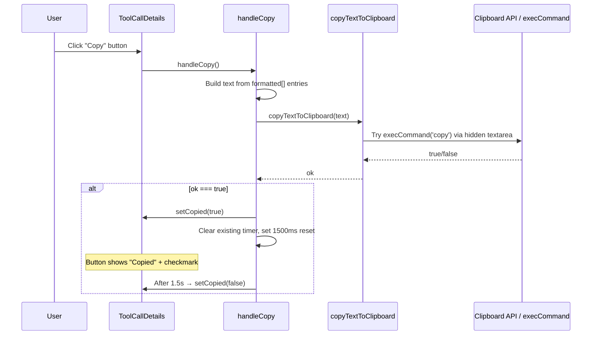

### 4.3 Round Chip Rendering Flow

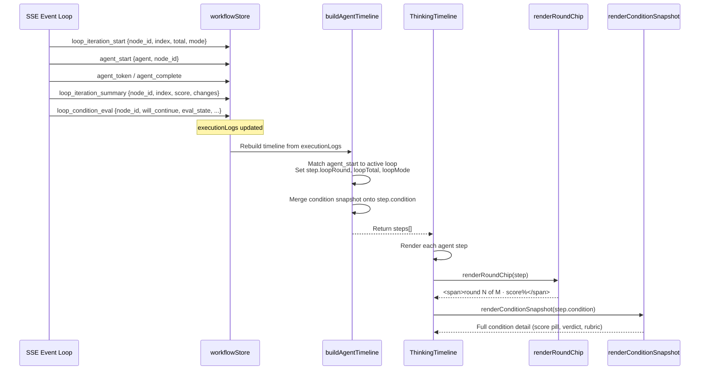

---

## 5. Dependencies

### 5.1 Internal Dependencies (within ChatPanel.jsx)

| Dependency | Used By | Purpose |
|---|---|---|
| `safeString(value)` | `handleRegenerate` | Safely converts message content (string/object/null) to a string for replay. |
| `copyTextToClipboard(text)` | `handleCopy` | Cross-environment clipboard write (falls back to `execCommand` when `navigator.clipboard` is unavailable). |
| `handleSend()` | `handleRegenerate` | The normal send path — regenerate delegates to it after state reset. |
| `buildAgentTimeline(executionLogs, streamingAgent)` | `ThinkingTimeline` (consumes `renderRoundChip`) | Constructs the `step` objects that `renderRoundChip` reads from. |
| `renderConditionSnapshot(condition)` | `ThinkingTimeline` (rendered alongside `renderRoundChip`) | Provides the detailed condition breakdown that complements the round chip's inline score. |

### 5.2 External Dependencies (stores and utilities)

| Dependency | Module | Purpose |
|---|---|---|
| `useWorkflowStore` | [store/workflowStore.js](../storage/store.md) | Zustand store providing `chatMessages`, `setChatMessages`, `isExecuting`, `executionLogs`, `chatStreamingContent`, `chatStreamingAgent`. |
| `loadComposerDraft` / `saveComposerDraft` | [utils/editorPersistence.js](utils.md) | Persists unsent composer text per (workflow, thread) — `handleRegenerate` repopulates the composer via `setMessage`, which triggers the draft-persistence effect. |
| `mapHistoryToUiMessages` | [utils/threadHelpers.js](utils.md) | Maps backend chat history to UI message objects — relevant because `handleRegenerate` operates on the `messages` array that may have been hydrated from history. |

### 5.3 Dependency Graph

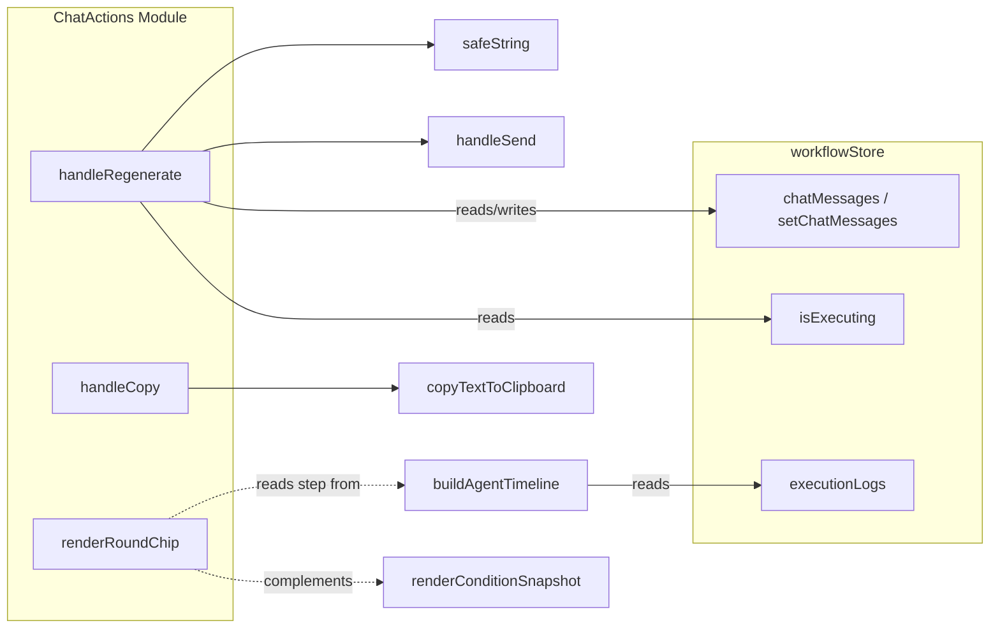

---

## 6. Component Interaction

### 6.1 Action Bar Integration

The assistant message action bar is rendered for every assistant message that has non-empty content. It contains four buttons, of which **regenerate** belongs to this module:

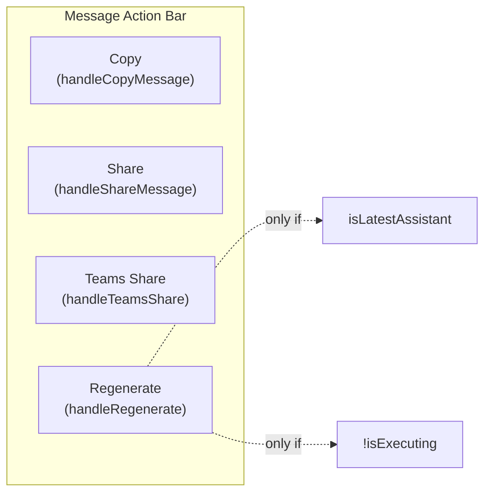

The copy button in the action bar uses `handleCopyMessage` (a ChatPanelCore handler), which is distinct from `handleCopy` (this module's ToolCallDetails handler). Both ultimately rely on the same `copyTextToClipboard` utility.

### 6.2 Timeline Integration

`renderRoundChip` is called inside `ThinkingTimeline`'s render loop for every agent step. The timeline is a memoised component that re-renders only when the boolean `hasStreamingContent` changes (not on every token), but the `timeline` array itself is rebuilt via `useMemo` on every `executionLogs` update.

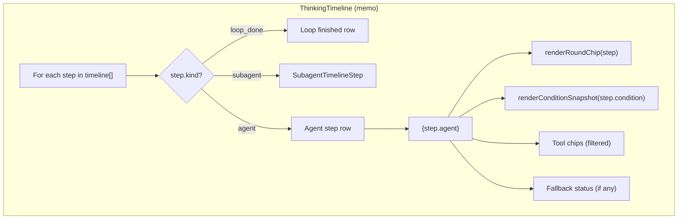

### 6.3 ToolCallDetails Integration

`handleCopy` is wired to the "Copy" button in the `ToolCallDetails` header, which appears inside HITL `before_tool` approval cards. The component manages its own expand/collapse state and auto-determines the initial open state based on argument line count.

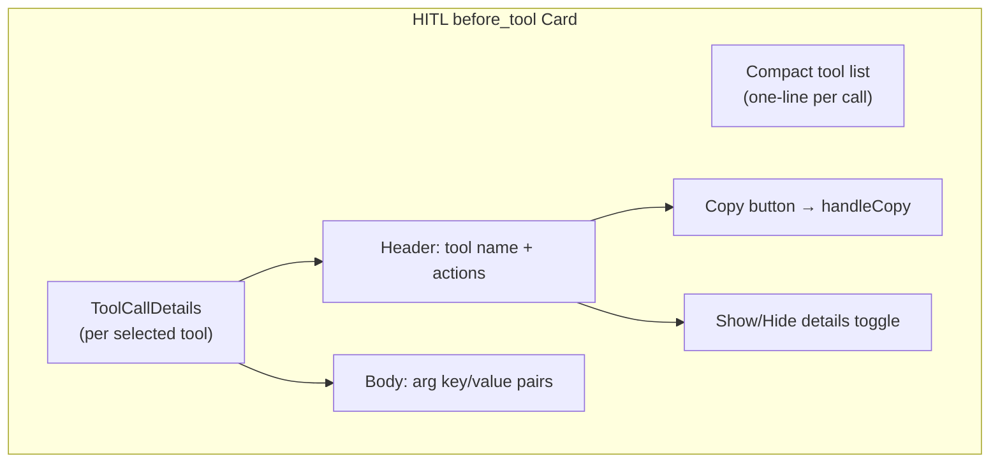

---

## 7. Process Flows

### 7.1 Loop Iteration Timeline Construction

The round chip's data originates from a multi-event SSE sequence processed by `buildAgentTimeline`:

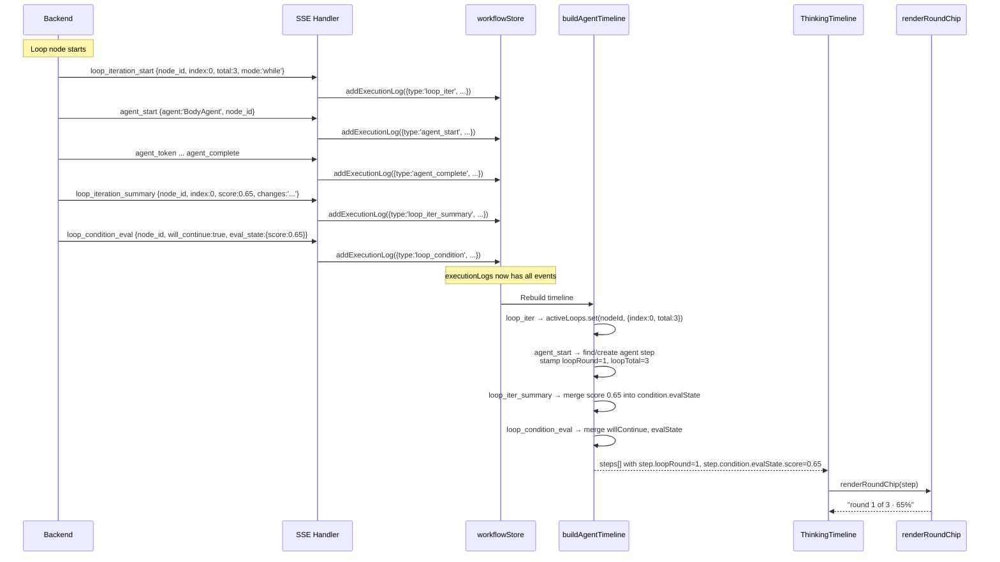

### 7.2 Regenerate vs. Normal Send

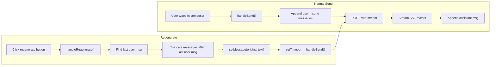

The key difference: regenerate **does not append a new user message** — it truncates the conversation back to the last user message and re-sends it. The user message is already in `messages` (preserved by the slice), so `handleSend` sees it as the current `message` state and processes it normally.

---

## 8. State Management

### 8.1 State Touched by ChatActions

| State | Location | Read/Write | Components |
|---|---|---|---|
| `messages` | `workflowStore.chatMessages` | Read + Write | `handleRegenerate` (reads to find last user msg, writes to truncate) |
| `message` | `ChatPanel` local state | Write | `handleRegenerate` (sets to original user text) |
| `isExecuting` | `workflowStore.isExecuting` | Read | `handleRegenerate` (guard) |
| `copied` | `ToolCallDetails` local state | Write | `handleCopy` (transient feedback) |
| `copyTimerRef` | `ToolCallDetails` ref | Write | `handleCopy` (timer management) |
| `executionLogs` | `workflowStore.executionLogs` | Read (indirect) | `renderRoundChip` (via `buildAgentTimeline`) |

### 8.2 State Lifecycle

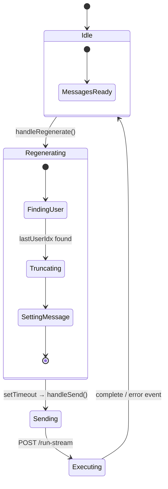

---

## 9. Edge Cases and Error Handling

### 9.1 `handleRegenerate`

| Edge Case | Handling |
|---|---|
| `isExecuting === true` | Early return — no action. The button is also disabled in the UI, but the guard provides defense in depth. |
| No user message in `messages` (`lastUserIdx === -1`) | Early return — nothing to regenerate. |
| User message content is an object (not a string) | `safeString()` converts it to `JSON.stringify(value, null, 2)`. |
| `handleSend` is not yet defined (TDZ) | Not an issue — `handleRegenerate` is declared after `handleSend` in the component body, so the closure captures a valid reference. |
| Concurrent regenerate clicks | The `isExecuting` guard prevents the second click from doing anything. The first click sets `isExecuting` to `true` inside `handleSend` before the second click's guard check. |

### 9.2 `handleCopy`

| Edge Case | Handling |
|---|---|
| `navigator.clipboard` unavailable (Electron) | Falls back to `copyTextToClipboard` which uses a hidden textarea + `execCommand('copy')`. |
| `execCommand('copy')` fails | Returns `false` — `setCopied(true)` is not called, so no false "Copied" feedback. |
| Rapid successive copy clicks | `copyTimerRef.current` is cleared before setting a new timer, preventing premature reset of the "Copied" indicator. |
| Component unmounts during the 1.5s timer | `useEffect` cleanup clears `copyTimerRef.current`, preventing `setState` on an unmounted component. |
| Empty arguments (`formatted.length === 0`) | The copy button is not rendered (`hasArgs === false`), so `handleCopy` is never called. |

### 9.3 `renderRoundChip`

| Edge Case | Handling |
|---|---|
| `step.loopRound === null` | Returns `null` — no chip rendered. This is the normal case for non-loop agent steps. |
| `step.loopTotal === null` | Renders `round {loopRound}` without the "of N" suffix. Common for `while`-mode loops with no predetermined count. |
| `step.condition` is `null` or `undefined` | Optional chaining (`step.condition?.evalState?.score`) returns `undefined`, so `scoreLabel` is empty. |
| Score is `NaN` or `Infinity` | `Number.isFinite(rawScore)` check returns `false`, so `scoreLabel` is empty. |
| Score is negative or > 1 | Treated as a raw decimal — displayed with `toFixed(2)` instead of as a percentage. |

---

## 10. Related Documentation

| Document | Relationship |
|---|---|
| [ChatPanel.md](ChatPanel.md) | Parent module — contains the full `ChatPanel` component, `ChatPanelCore`, `MessageContent`, and `FileHandling` sub-modules. |
| [ChatPanelCore.md](ChatPanelCore.md) | Sibling sub-module — covers `ChatPanel`, `getThreadMeta`, `handleClick`, `handleKeyPress`, `onDocumentClick`, `stopGeneration`, `abortRunSession`. |
| [MessageContent.md](MessageContent.md) | Sibling sub-module — covers `CodeBlock`, `ToolCallDetails`, `renderConditionSnapshot`. `handleCopy` lives inside `ToolCallDetails`. |
| [FileHandling.md](FileHandling.md) | Sibling sub-module — covers `FileDownloadCard`, `fallbackDownload`. |
| [DebugLogView.md](../ui/DebugLogView.md) | The Debug Log view that can swap in place of the chat body — consumes the same `runContext` store slice that `handleRegenerate` indirectly populates via `handleSend`. |
| [store.md](../storage/store.md) | The `workflowStore` Zustand store — provides `chatMessages`, `isExecuting`, `executionLogs`, and related actions. |
| [utils.md](utils.md) | Utility modules including `threadHelpers.js` (message mapping) and `editorPersistence.js` (composer draft persistence). |
