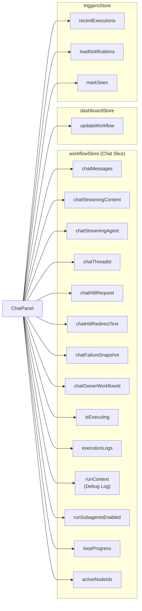
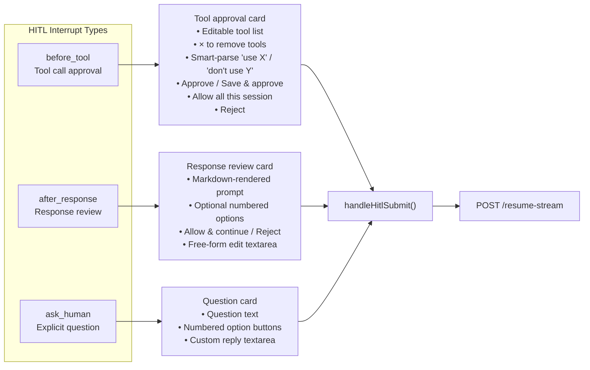
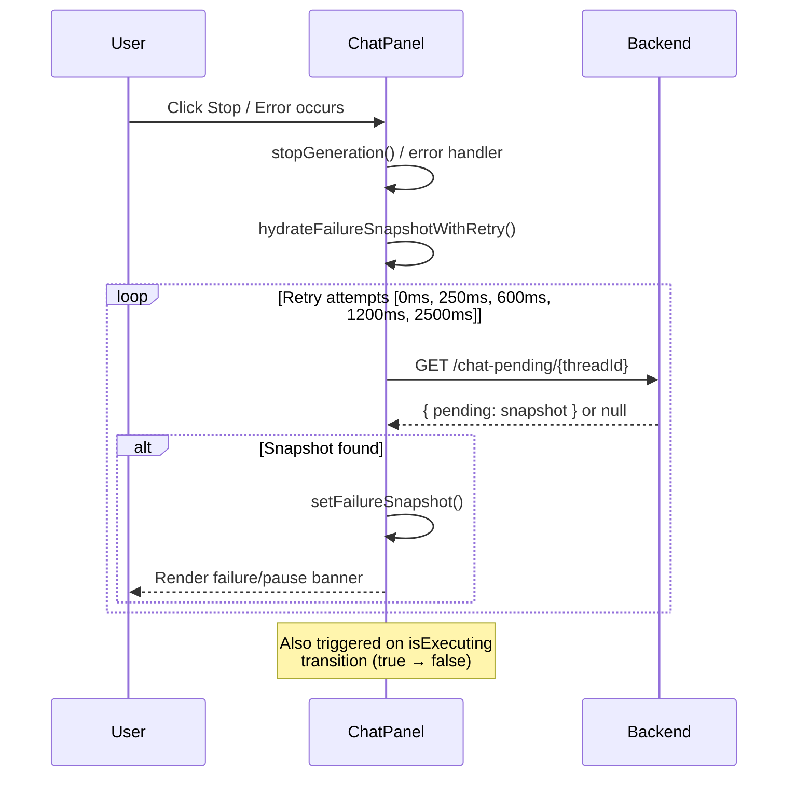
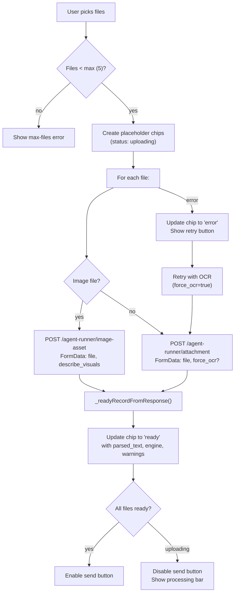
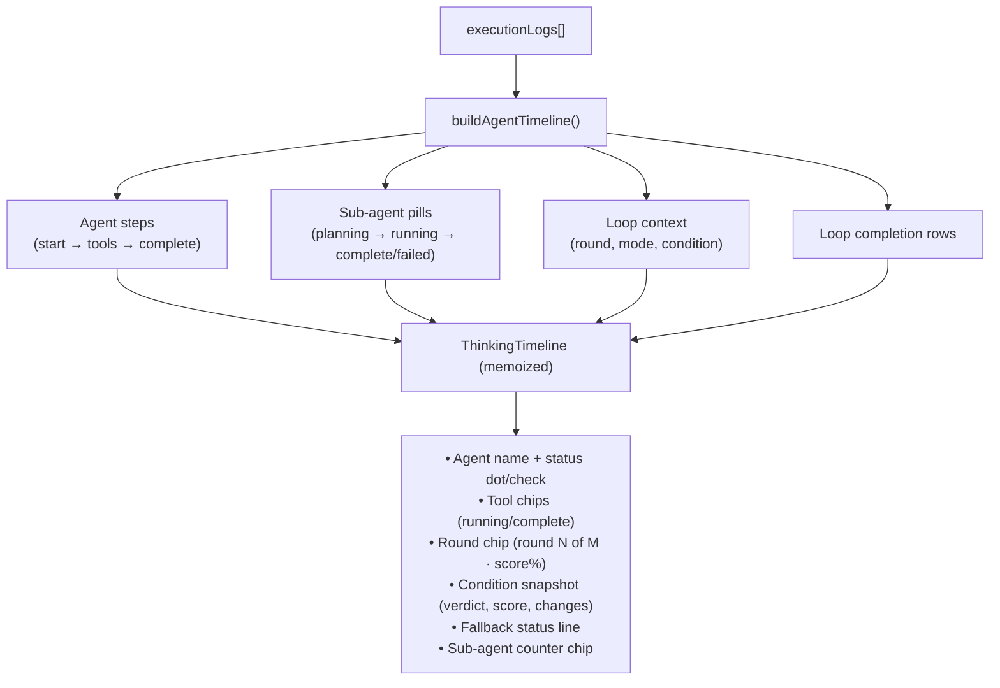
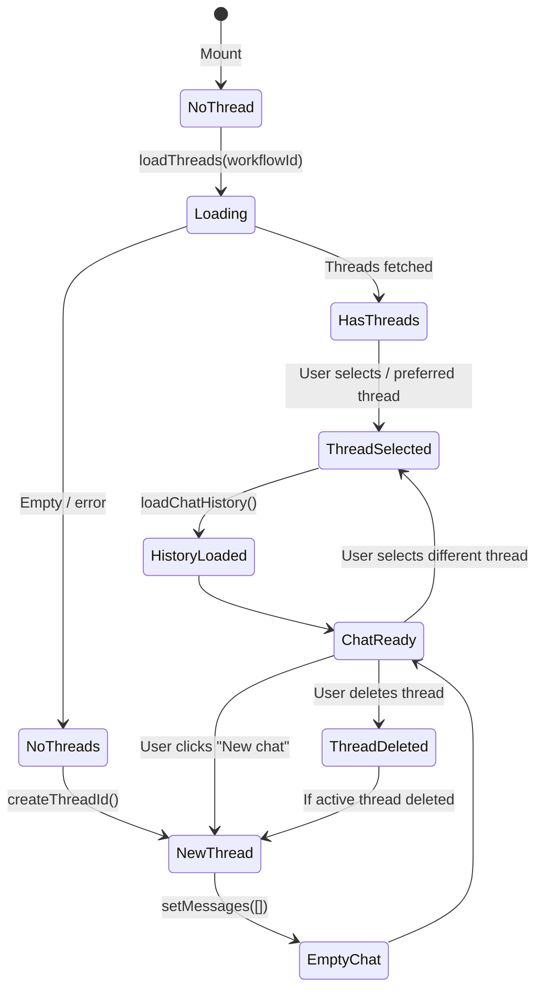
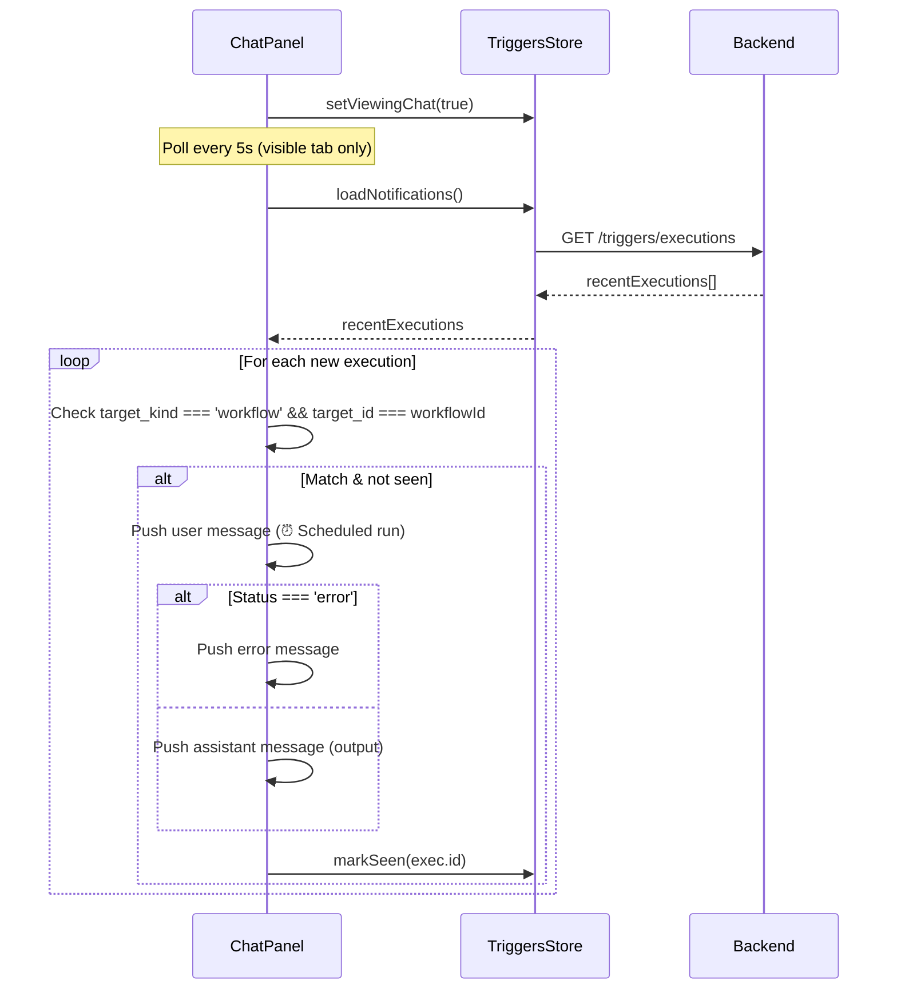
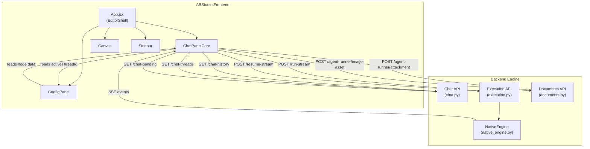

# ChatPanelCore

## Introduction

The **ChatPanelCore** module is the central conversational interface within the ABStudio Workflow Editor. It provides the `ChatPanel` React component — a full-featured chat surface that lets users test, debug, and interact with visual workflows in real time. The module manages the entire lifecycle of a workflow execution chat session: sending user messages, streaming Server-Sent Events (SSE) from the backend engine, rendering live agent timelines, handling Human-in-the-Loop (HITL) approval interrupts, managing file attachments, displaying generated file downloads, and maintaining a persistent Debug Log.

ChatPanelCore lives under the `ChatPanel` parent module in the `workflow_editor` feature tree and is the primary component exported from `ChatPanel.jsx`. It is designed to remain mounted across editor mode toggles (edit ↔ preview) so that in-flight SSE streams and chat state survive without interruption.

---

## Architecture Overview

```mermaid
graph TB
    subgraph "ABStudio Frontend"
        subgraph "Workflow Editor"
            ChatPanel["ChatPanel Component<br/>(ChatPanelCore)"]
            Canvas["Canvas"]
            ConfigPanel["ConfigPanel"]
            DebugLogView["DebugLogView"]
            RunSettings["RunSettingsStrip"]
        end

        subgraph "State Stores"
            WorkflowStore["workflowStore<br/>(Zustand)"]
            DashboardStore["dashboardStore"]
            TriggersStore["triggersStore"]
        end

        subgraph "Shared Utilities"
            ThreadHelpers["threadHelpers"]
            EditorPersistence["editorPersistence"]
            SniffFiles["sniffGeneratedFiles"]
            DownloadHelper["useGeneratedDownload"]
            ExtractedPreview["ExtractedTextPreview"]
        end
    end

    subgraph "ABStudio Backend"
        RunStream["/run-stream<br/>(SSE)"]
        ResumeStream["/resume-stream<br/>(SSE)"]
        ChatHistory["/chat-history/{id}"]
        ChatThreads["/chat-threads/{id}"]
        ChatPending["/chat-pending/{id}"]
        AttachEndpoint["/agent-runner/attachment"]
        ImageEndpoint["/agent-runner/image-asset"]
        ToolsCatalog["/tools-catalog"]
        Health["/health"]
    end

    ChatPanel --> WorkflowStore
    ChatPanel --> DashboardStore
    ChatPanel --> TriggersStore
    ChatPanel --> DebugLogView
    ChatPanel --> RunSettings
    ChatPanel --> RunStream
    ChatPanel --> ResumeStream
    ChatPanel --> ChatHistory
    ChatPanel --> ChatThreads
    ChatPanel --> ChatPending
    ChatPanel --> AttachEndpoint
    ChatPanel --> ImageEndpoint
    ChatPanel --> ToolsCatalog
    ChatPanel --> Health
    ChatPanel --> ThreadHelpers
    ChatPanel --> EditorPersistence
    ChatPanel --> SniffFiles
    ChatPanel --> DownloadHelper
    ChatPanel --> ExtractedPreview
```



### Component Hierarchy

The `ChatPanel.jsx` file is logically decomposed into sub-modules (documented separately):

| Sub-module | Responsibility | Reference |
|---|---|---|
| **ChatPanelCore** | Main component, state management, SSE orchestration, thread lifecycle | *(this document)* |
| **ChatActions** | Message action bar (copy, share, regenerate, round chips) | [ChatActions](ChatActions.md) |
| **MessageContent** | Markdown rendering, code blocks, tool call details, condition snapshots | [MessageContent](MessageContent.md) |
| **FileHandling** | File download cards, fallback download, generated file sniffing | [FileHandling](FileHandling.md) |

---

## Core Components

### `ChatPanel`

The primary exported React component. It is a large, stateful component (~4,200 lines) that orchestrates the entire chat experience.

**Props:**

| Prop | Type | Default | Description |
|---|---|---|---|
| `style` | `object` | — | Inline style passthrough for layout positioning |
| `isActive` | `boolean` | `true` | Whether the chat panel is the active surface; gates trigger-notification polling and `isViewingChat` flag |

**Key Responsibilities:**

1. **Chat State Management** — All chat state (messages, streaming content, HITL requests, failure snapshots, thread ID) lives in the global `workflowStore` (Zustand) rather than local `useState`, ensuring survival across editor mode switches and dashboard navigation.
2. **SSE Stream Processing** — Parses the `/run-stream` and `/resume-stream` SSE feeds, dispatching 20+ event types to update UI, execution logs, and the Debug Log.
3. **HITL Interrupt Handling** — Renders approval cards for `before_tool`, `after_response`, and `ask_human` interrupt types; supports tool-list editing, session auto-approve, and workflow persistence.
4. **Attachment Pipeline** — Uploads documents via `/agent-runner/attachment` (OCR/text extraction) and images via `/agent-runner/image-asset` (sandbox asset saving), with retry-with-OCR support.
5. **Thread History** — Loads, searches, groups, and deletes conversation threads; persists active thread and composer drafts across reloads.
6. **Debug Log Integration** — Feeds normalized run-event rows into the store's `runContext` for the `DebugLogView` component.
7. **Trigger Execution Injection** — Polls for scheduled trigger executions and injects completed runs as chat messages.

### `getThreadMeta`

```javascript
function getThreadMeta(thread) {
    const count = thread.message_count || 0;
    const countLabel = count === 1 ? '1 message' : `${count} messages`;
    const time = formatRelativeTime(thread.last_updated);
    return [time, countLabel].filter(Boolean).join(' / ');
}
```

A pure utility that formats a thread's metadata into a human-readable summary string (e.g., `"5m / 3 messages"`). Used in the thread history sidebar.

### `handleClick` (FileDownloadCard)

The click handler for generated-file download cards. Intercepts the default anchor navigation and routes through the authenticated download helper (`onDownload` or `fallbackDownload`) to ensure auth headers are attached. Ignores repeat clicks while a download is in flight (`busy` flag).

### `handleKeyPress`

```javascript
const handleKeyPress = (e) => {
    if (e.key === 'Enter' && !e.shiftKey) {
        e.preventDefault();
        handleSend();
    }
};
```

Keyboard handler for the chat textarea. **Enter** sends the message; **Shift+Enter** inserts a newline.

### `onDocumentClick`

A `mousedown` document listener that closes the thread history popover when the user clicks outside both the history button and the history panel. Registered/unregistered via `useEffect` tied to `isHistoryOpen`.

### `stopGeneration`

Called when the user clicks the stop button during an active run. Performs:

1. Aborts the in-flight `AbortController` (closes the SSE stream).
2. Clears streaming content, agent, and fallback status.
3. Sets `isExecuting` to `false` and clears all active node highlights.
4. Calls `stopRunPreservingLog()` — resets transient UI state but **preserves the Debug Log timeline** (marked as `'stopped'`) so the interrupted run remains reviewable.
5. Triggers `hydrateFailureSnapshotWithRetry()` — polls `/chat-pending/{threadId}` with exponential backoff (5 attempts: 0ms, 250ms, 600ms, 1200ms, 2500ms) to capture the backend's post-abort snapshot, which is written asynchronously after the ASGI stream closes.

### `abortRunSession`

An async handler invoked from the failure-snapshot banner's "Abort session" button. It:

1. Captures the snapshot's thread ID and agent name **before** clearing state.
2. Sends a `DELETE` request to `/chat-pending/{threadId}` to destroy the server-side checkpoint.
3. Tracks whether the server acknowledged the delete (`serverAcknowledged`).
4. Pushes a `session-aborted` system message into the chat transcript with a timestamp, providing an audit trail of the deliberate discard.

---

## State Architecture

ChatPanelCore reads from and writes to three Zustand stores. The chat-specific state was lifted from local `useState` into `workflowStore` to survive mode switches and dashboard navigation.



### Store Setters with No-Op Short-Circuit

All chat-related setters in `workflowStore` short-circuit when the value is unchanged. This is critical because SSE token streams can fire 60+ times per second, and without short-circuiting, every selector subscriber would re-render on each token even when the value (e.g., the agent name) hasn't changed.

---

## SSE Event Processing

The core of ChatPanelCore's complexity lies in its SSE event dispatcher. The `handleSend` function opens a `fetch` connection to `/run-stream` and reads the response body as a stream, parsing `data: {json}` frames separated by `\n\n`.

### Event Flow Diagram

```mermaid
flowchart TD
    Start["User sends message"] --> Validate["Validate workflow<br/>isWorkflowValid()"]
    Validate -->|invalid| ErrorMsg["Show validation error"]
    Validate -->|valid| CheckSnapshot{"Failure snapshot<br/>pending?"}

    CheckSnapshot -->|yes| ResumePath["Route to /resume-stream<br/>via handleHitlSubmit()"]
    CheckSnapshot -->|no| RunStream["POST /run-stream"]

    RunStream --> SSELoop["SSE Event Loop"]
    ResumePath --> SSELoop

    SSELoop --> EventDispatch{"Event type?"}

    EventDispatch -->|start| OnStart["Set thread ID<br/>Begin run context<br/>Push Input + Start rows"]
    EventDispatch -->|agent_start| OnAgentStart["Set streaming agent<br/>Activate node<br/>Track node stats"]
    EventDispatch -->|agent_token| OnToken["Append to streaming content<br/>Count SSE chunks"]
    EventDispatch -->|agent_progress| OnProgress["Map intermediate agents<br/>to timeline"]
    EventDispatch -->|agent_complete| OnAgentComplete["Clear node active<br/>Track output + model<br/>Push debug row"]
    EventDispatch -->|agent_retry| OnRetry["handleRetryNotice()<br/>Transient fallback status"]
    EventDispatch -->|agent_fallback| OnFallback["handleFallbackNotice()<br/>Transient fallback status"]
    EventDispatch -->|tool_call_start| OnToolStart["Add tool log<br/>Update streaming agent label"]
    EventDispatch -->|tool_call_result| OnToolResult["Add tool result log"]
    EventDispatch -->|swarm_plan| OnSwarmPlan["Add swarm plan log<br/>Show planning pills"]
    EventDispatch -->|swarm_error| OnSwarmError["Add swarm error log"]
    EventDispatch -->|kb_retrieval| OnKb["Add KB retrieval log<br/>Push Knowledge debug row"]
    EventDispatch -->|subagent_start| OnSubStart["Add subagent log<br/>Set delegation label"]
    EventDispatch -->|subagent_complete| OnSubComplete["Add completion log"]
    EventDispatch -->|condition_flash| OnCondFlash["Flash condition node"]
    EventDispatch -->|condition_routed| OnCondRouted["Add routing log"]
    EventDispatch -->|loop_iteration_start| OnLoopStart["Set loop progress<br/>Add iter log"]
    EventDispatch -->|loop_condition_eval| OnLoopCond["Add condition log"]
    EventDispatch -->|loop_iteration_summary| OnLoopSummary["handleLoopSummaryEvent()"]
    EventDispatch -->|loop_evaluation| OnLoopEval["handleLoopSummaryEvent()"]
    EventDispatch -->|loop_final_summary| OnLoopFinal["Push summary message"]
    EventDispatch -->|loop_complete| OnLoopDone["Clear loop progress"]
    EventDispatch -->|hitl_interrupt| OnHitl["Build HITL request<br/>Render approval card<br/>Pause execution"]
    EventDispatch -->|hitl_resumed| OnHitlResumed["Push HITL debug row"]
    EventDispatch -->|workflow_retrying| OnRetryNode["Push retry debug row"]
    EventDispatch -->|complete| OnComplete["Set execution result<br/>Push End + Output + Token rows<br/>Add assistant message"]
    EventDispatch -->|error| OnError["Set error message<br/>Set failure snapshot<br/>Hydrate with retry"]

    OnComplete --> Done["setExecuting(false)<br/>Refresh threads list"]
    OnError --> Done
    OnHitl --> Paused["setExecuting(false)<br/>Await user decision"]
```



### Token Usage Estimation

The backend does not report per-node LLM usage in the SSE stream. ChatPanelCore approximates token usage using the industry rule-of-thumb of **~1 token per 4 characters** of visible input + output text. This under-counts the true bill (misses system prompt, tool definitions, intermediate tool-calling turns) but provides a much better order-of-magnitude signal than counting streamed SSE chunks.

The estimate is computed per-node at `agent_complete` time and aggregated into a workflow-total row at the `complete` event. When the backend does provide a `usage` object (some models), it takes precedence over the estimate.

---

## HITL (Human-in-the-Loop) System

The HITL system pauses workflow execution and presents an approval card to the user. Three interrupt types are supported:



### Before-Tool Card Features

- **Editable tool list**: Each pending tool call is shown as a compact row with a × button. The user can remove tools before approving.
- **Smart-parse textarea**: Natural language instructions like `"don't use web_search"`, `"also use jira_get_issue"`, or `"fetch a Jira issue"` are parsed by `parseToolEdits()` which resolves tool names against the `/tools-catalog` endpoint using content-word overlap scoring.
- **Approve**: Runs the listed tools for this turn only.
- **Save & approve**: Persists tool-list edits onto the agent node's `data.tools` array and PUTs the workflow, so the change survives reload. Only enabled when edits are detected.
- **Allow all this session**: Sets `sessionAutoApproveRef.current = true`, which auto-approves all subsequent `before_tool` interrupts for the current chat tab without rendering the card.
- **Reject**: Sends `'reject'` to the engine, which ends the run.

### HITL Hydration on Thread Open

When a thread is loaded from history, ChatPanelCore fetches `/chat-pending/{threadId}` to check if the thread is paused server-side. If a pending snapshot exists, it reconstructs the HITL card (or failure banner for `node_failed` reason) so the user can resume the paused run.

---

## Failure Snapshot & Self-Healing

When a workflow run fails or is stopped, the backend writes a pending snapshot to the database. ChatPanelCore uses a retry-backed hydration strategy to capture this snapshot.



### Failure Banner Variants

| `errorType` | Visual Style | Label | Primary Action |
|---|---|---|---|
| `user_cancelled` | Warm amber | `RUN PAUSED` | Resume |
| `node_failed` | Red | `RUN FAILED` | Retry failed node |

Both variants also offer an **Abort session** button (`abortRunSession`) that deletes the server-side checkpoint and starts fresh on the next message.

---

## Attachment Pipeline

ChatPanelCore supports uploading documents and images as chat attachments. The pipeline routes files to different backend endpoints based on type.



### Attachment Record Shape

```javascript
{
    id: string,              // crypto.randomUUID()
    file_name: string,
    file_type: string,       // extension
    file_size: number,
    parsed_text: string,     // OCR/extracted text or image description
    blocked: boolean,
    block_reason: string,
    progress: number,        // 0 or 100
    status: 'uploading' | 'ready' | 'error',
    kind: 'image' | 'document',
    asset_path: string,      // image only — absolute sandbox path
    asset_name: string,      // image only — sandbox filename
    engine: string,          // OCR engine used
    warnings: string[],
    images_extracted: number,
    tables_extracted: number,
    cache_hit: boolean,
    char_count: number,
    page_count: number,
    truncated: boolean,
}
```

### Send-Time Attachment Handling

On send, ready attachments are split into two paths:

1. **Structured `attachments` array** — Sent in the `/run-stream` POST body so the engine can inject documents into agents size-aware (small → first agent only; large → every agent).
2. **`[File: name]` marker in `user_input`** — Prepended to the persisted user message so the attachment chip survives history reload. The `parsePersistedUserPrompt()` function strips this marker back into a clean chip + typed text on reload.

---

## Thinking Timeline

While a workflow is executing, ChatPanelCore renders a live "Thinking Timeline" inside the assistant bubble. The timeline is built by `buildAgentTimeline()`, which walks the `executionLogs` array and produces an ordered list of steps.



### Loop Iteration Collapsing

To prevent the timeline from growing linearly with loop iterations, `buildAgentTimeline()` collapses repeated iterations of the same agent inside the same loop into a single row. The round counter updates in place, and the condition snapshot is cleared on each new round to prevent stale scores.

### Sub-agent Splicing

Sub-agent pills are inserted immediately after the agent step that owns them, using `_spliceSubagentStep()`. Ownership is resolved by matching `nodeId` — if the subagent's `nodeId` matches an agent step's `nodeId`, the pill is inserted right after the last such agent. This ensures pills stay grouped beneath their parent in multi-node workflows.

---

## Debug Log Integration

ChatPanelCore feeds normalized event rows into the store's `runContext` via `pushDebugRow()`. The Debug Log view (`DebugLogView`) can be toggled to replace the chat body entirely.

### Row Enrichment

Each debug row is enriched with:

- **`nodeId`** — Resolved from the SSE payload's `node_id` or agent name fallback.
- **`nodeLabel`** — Human-readable label from the workflow graph (`node.data.name`).
- **`kind`** — A badge label derived from node type (`Agent`, `Condition`, `Loop`, `Subflow`, `Start`, `End`, `Tool`, `Sub-agent`, `Swarm`, `Knowledge`, `HITL`, `Input`, `Output`, `Tokens`).
- **`kbHint`** — Surfaces `"Knowledge base: <mode>"` when the node has active KB configuration.
- **`generatedFiles`** — File artifacts produced by the node.

### Story-Style Bookends

Every run is framed with explicit bookend rows:

1. **Input** — The user's chat message.
2. **Start** — "Workflow execution started".
3. *(node events)*
4. **End** — "Workflow execution finished" (or "ended with errors" / "stopped by reviewer").
5. **Output** — The assistant's final output (skipped on error/rejection).
6. **Tokens** — Token usage summary (backend usage or char-based estimate).

---

## Thread History Management



### Persistence

- **Active thread per workflow**: Saved via `saveActiveThread('workflow', workflowId, threadId)` and restored on reload.
- **Composer draft per thread**: Saved via `saveComposerDraft('workflow', workflowId, threadId, message)` and restored when switching threads.
- **Thread list refresh**: After execution, the sidebar list is refreshed (without reloading current chat history) with an 800ms delay to let the backend finish its async history save.

### Thread Grouping

Threads are grouped by recency: **Today**, **Yesterday**, **Last 7 Days**, **Older**. Each thread shows a title (cleaned of attachment markers), preview, relative time, and a delete button. Threads with pending interrupts display an amber dot indicator.

---

## Trigger Execution Injection

ChatPanelCore polls `triggersStore.loadNotifications()` every 5 seconds (only when the tab is visible) and injects completed trigger executions for the current workflow as chat messages.



The `isViewingChat` flag also suppresses trigger toast notifications in `TriggerNotifications` since the user is already seeing the results inline.

---

## Backend Health Monitoring

ChatPanelCore polls `/health` every 30 seconds (skipped when the tab is hidden) and tracks a three-state backend status:

| Status | Meaning | UI Effect |
|---|---|---|
| `null` | Unknown (initial) | "Connecting…" spinner |
| `'ok'` | Backend healthy, DB OK | Normal chat empty state |
| `'error'` | Backend unreachable | "Backend offline. Retrying automatically." |
| `'db_error'` | Backend up, DB issue | Normal empty state (DB issue is non-blocking for chat) |

When the backend transitions from down to up, threads are automatically reloaded if they haven't been loaded yet.

---

## Dependencies

### Internal Modules

| Dependency | Purpose |
|---|---|
| workflowStore | Primary state store (chat slice, execution state, run context, node graph) |
| `dashboardStore` | Workflow persistence (`updateWorkflow` for Save & approve) |
| `triggersStore` | Trigger execution polling and notification management |
| `subagentSelectors` | Pure selectors for active/all sub-agent derivation from execution logs |
| `RunSettingsStrip` | Run-settings popover (subagent/swarm toggle) |
| `DebugLogView` | Debug Log full-swap view |
| `ExtractedTextPreview` | Modal preview of OCR-extracted attachment text |
| `DownloadNotice` | 410 "file already consumed" banner |
| `sniffGeneratedFiles` | Detects generated file references in assistant prose |
| `useGeneratedDownload` | Authenticated download hook with 410 handling |
| `downloadGeneratedFile` | Authenticated file download helper |
| `threadHelpers` | History-to-UI message mapping, thread title/preview formatting |
| `editorPersistence` | Active thread and composer draft persistence |

### Backend Endpoints

| Endpoint | Method | Purpose |
|---|---|---|
| `/run-stream` | POST | Start workflow execution (SSE stream) |
| `/resume-stream` | POST | Resume paused workflow (SSE stream) |
| `/chat-history/{threadId}` | GET | Load conversation history |
| `/chat-threads/{workflowId}` | GET | List conversation threads |
| `/chat-threads/{threadId}` | DELETE | Delete a conversation thread |
| `/chat-pending/{threadId}` | GET | Fetch pending interrupt/failure snapshot |
| `/chat-pending/{threadId}` | DELETE | Discard a paused checkpoint |
| `/agent-runner/attachment` | POST | Upload document for OCR/text extraction |
| `/agent-runner/image-asset` | POST | Upload image as sandbox asset |
| `/tools-catalog` | GET | Fetch available tools for smart-parse resolution |
| `/health` | GET | Backend health check |
| `/generated-files/{path}` | GET | Download generated file artifacts |

### External Libraries

| Library | Purpose |
|---|---|
| `react` | Component framework (hooks: useState, useRef, useEffect, useCallback, useMemo, memo) |
| `react-markdown` | Markdown rendering for assistant messages |
| `remark-gfm` | GitHub-Flavored Markdown (tables, strikethrough, task lists) |
| `zustand` | State management (via workflowStore) |

---

## Key Design Decisions

### 1. State in Global Store, Not Local useState

Chat state was lifted from local `useState` into `workflowStore` so that switching editor modes (preview ↔ edit) or navigating to the dashboard doesn't drop chat history, in-flight streamed replies, or HITL approval cards. ChatPanel is also kept mounted across mode toggles in `App.jsx`.

### 2. Dual SSE Handler (Run + Resume)

The `handleSend` and `handleHitlSubmit` functions each contain a full SSE event loop. While this duplicates ~300 lines of event handling, it was chosen over a shared dispatcher because the two paths have subtle differences (e.g., the resume path doesn't emit `start` events, and `pipedInput` is seeded differently).

### 3. Retry-Backed Snapshot Hydration

The backend's pending-snapshot write happens **after** the ASGI stream closes, creating a race condition. ChatPanelCore solves this with `hydrateFailureSnapshotWithRetry()`, which polls `/chat-pending` across 5 attempts with increasing delays. This is called from three places: `stopGeneration`, the SSE error handler, and the `isExecuting` transition effect.

### 4. Char-Based Token Estimation

Since the backend doesn't report per-node LLM usage in SSE, ChatPanelCore estimates tokens from visible text length (~1 token / 4 chars). This is clearly labeled in the Debug Log JSON as an under-counting estimate, and backend-provided `usage` objects take precedence when available.

### 5. Attachment Marker Persistence

To make attachment chips survive history reload without a backend change, a name-only `[File: <name>]` marker is prepended to `user_input` (the persisted user message content). The `parsePersistedUserPrompt()` function strips this marker back into a clean chip + typed text on reload. The full document content still reaches the LLM via the structured `attachments` body field.

### 6. Memoised Thinking Timeline

The `ThinkingTimeline` component is wrapped in `memo()` because `streamingContent` updates on every token (~50-100ms), but the timeline only cares about the boolean `hasStreamingContent`. Without memoization, the entire `<ol>` and every SVG would re-render on every keystroke from the model.

---

## Module Relationships



ChatPanelCore is the primary consumer of the workflow execution SSE stream. It sits alongside `Canvas` (the visual graph editor) and `ConfigPanel` (node configuration) in the `EditorShell` layout. The `activeThreadId` set by ChatPanelCore is read by `ConfigPanel`'s Loop configuration for connection-aware list picking (fetching upstream node output by thread ID).

---

## References

- [ChatActions](ChatActions.md) — Message action bar handlers (copy, share, regenerate, round chips)
- [MessageContent](MessageContent.md) — Markdown rendering, code blocks, tool call details, condition snapshots
- [FileHandling](FileHandling.md) — File download cards and generated file sniffing
- workflowStore — Global Zustand store for workflow editor state
- [DebugLogView](../ui/DebugLogView.md) — Debug Log timeline view component
- [RunSettingsStrip](../ui/RunSettingsStrip.md) — Run-settings popover for workflow-wide execution options
- [api_execution](../api/api_execution.md) — Backend execution API (`/run-stream`, `/resume-stream`)
- [api_chat](../api/api_chat.md) — Backend chat API (`/chat-history`, `/chat-threads`, `/chat-pending`)
- [api_documents](../api/api_documents.md) — Backend documents API (`/agent-runner/attachment`, `/agent-runner/image-asset`)
- [engine_native_engine](../agents/engine_native_engine.md) — Backend native workflow engine (SSE event source)
