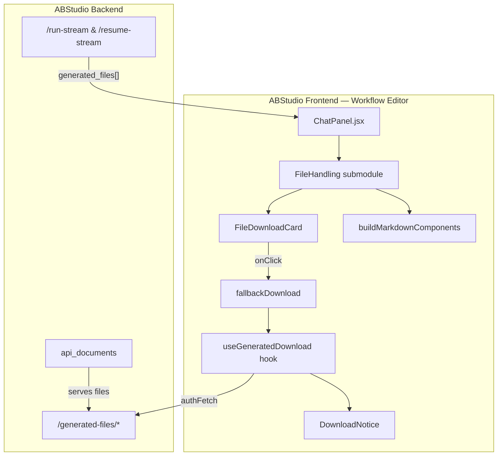
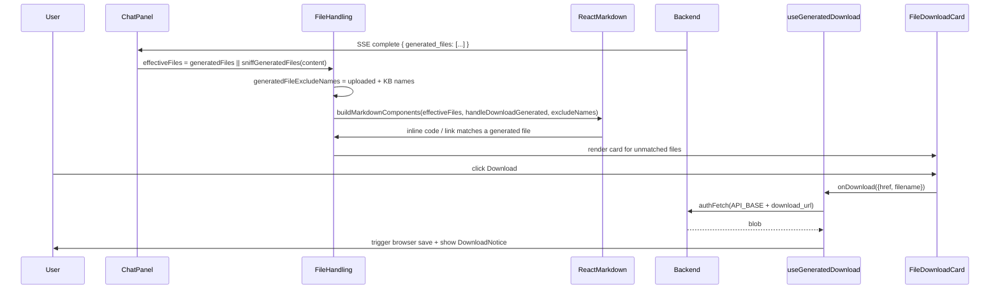
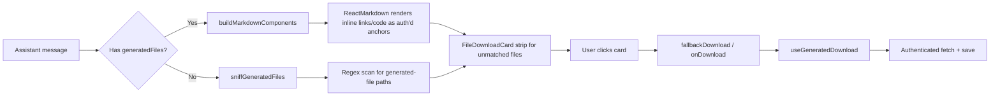
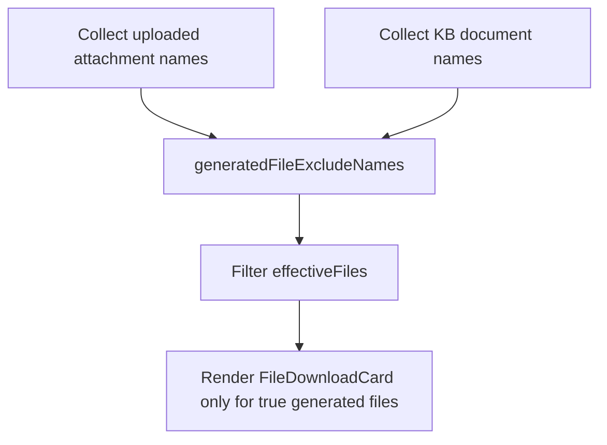
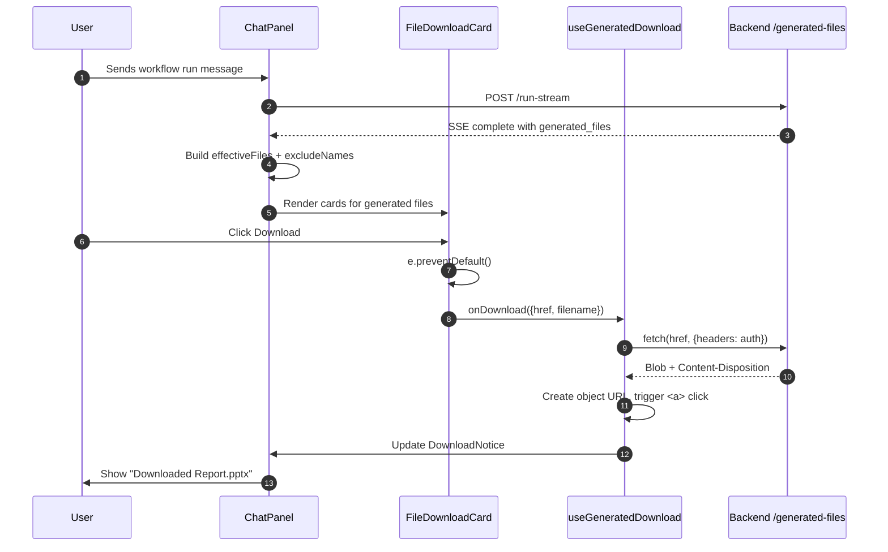

# FileHandling Module

## Brief Introduction

The **FileHandling** module is a focused UI subsystem within the ABStudio workflow editor's chat panel. It is responsible for rendering, discovering, and securely downloading files that are generated during workflow execution. Rather than letting the browser navigate to raw backend URLs (which would fail authentication or expose JSON error bodies), the module intercepts every download interaction and routes it through an authenticated helper. It also detects file references inside LLM-generated markdown so that inline filenames and links are consistently presented as styled download cards.

This module lives inside [`ChatPanel.jsx`](ChatPanel.md) and is tightly coupled to the workflow execution stream, the markdown renderer, and the generated-file download infrastructure.

---

## Core Responsibilities

1. **Render generated-file download cards** (`FileDownloadCard`) below assistant messages.
2. **Authenticate downloads** via `fallbackDownload` and the shared `useGeneratedDownload` hook so that auth headers are always present.
3. **Discover file references** in LLM prose using `sniffGeneratedFiles` and markdown-link scanning.
4. **Map markdown elements** (`code`, `a`) to authenticated download anchors through `buildMarkdownComponents`.
5. **Exclude false positives** such as uploaded input files and KB documents so they are not rendered as generated downloads.

---

## Architecture



### Component Breakdown

| Component | File | Purpose |
|-----------|------|---------|
| `FileDownloadCard` | `ABStudio/frontend/src/features/workflows/editor/ChatPanel.jsx` | Styled card that shows filename, kind label, and a download button. |
| `fallbackDownload` | `ABStudio/frontend/src/features/workflows/editor/ChatPanel.jsx` | Default download handler that delegates to the authenticated helper. |
| `buildMarkdownComponents` | `ABStudio/frontend/src/features/workflows/editor/ChatPanel.jsx` | Returns React-Markdown component overrides that turn inline file references into authenticated download links. |
| `useGeneratedDownload` | shared hook | Manages download state, executes authenticated fetch, and surfaces toast notices. |
| `DownloadNotice` | `ABStudio/frontend/src/features/_shared/DownloadNotice.jsx` | Renders transient success / error / info banners. |

---

## Dependencies

### Internal Frontend Modules

- **[ChatPanel](ChatPanel.md)** — The parent component that owns chat state, SSE streaming, and the assistant-message renderer. FileHandling is invoked from the `assistant` message branch.
- **DownloadNotice** — Displays the `notice` object produced by `useGeneratedDownload`.
- **workflowStore** — Provides `runContext`, execution logs, and generated-file metadata consumed by the message renderer.
- **AgentEditor** — Contains a sibling `FileDownloadCard` used in the agent-builder chat; both share the same backend download contract.

### Backend Modules

- **[api_execution](../api/api_execution.md)** — Emits `generated_files` arrays on `agent_complete` and `complete` SSE events.
- **[api_documents](../api/api_documents.md)** — Serves generated files at `/generated-files/*` and handles asset extraction.
- **[engine_native_engine](../agents/engine_native_engine.md)** — Produces the `generated_files` metadata that FileHandling renders.

### Utilities

- `downloadGeneratedFile(href, filename)` — Authenticated download helper.
- `buildAuthHeaders()` — Attaches the current user's auth token to requests.
- `API_BASE` — Backend base URL.
- `safeString`, `stripEmoji`, `stripGeneratedMarkdownLinks`, `stripBareGeneratedPaths` — Text normalisation helpers.

---

## Data Flow



### Generated-File Object Shape

The backend sends file metadata in the following shape (fields may vary slightly by engine version):

```ts
{
  filename:    string;   // Human-readable name, e.g. "Report.pptx"
  disk_name?:  string;   // Run-prefixed on-disk name
  download_url: string;  // Relative path, e.g. "/generated-files/..."
  mime_type?:  string;
  size?:       number;
}
```

`FileDownloadCard` builds the absolute href as `${API_BASE}${download_url}`.

---

## Component Interactions



### `FileDownloadCard`

```jsx
function FileDownloadCard({ href, filename, label, onDownload, busy = false })
```

| Prop | Type | Description |
|------|------|-------------|
| `href` | `string` | Absolute URL to the generated file. |
| `filename` | `string` | Suggested filename for the browser save dialog. |
| `label` | `string?` | Optional display text; falls back to `filename`. |
| `onDownload` | `function?` | Custom handler; defaults to `fallbackDownload`. |
| `busy` | `boolean` | Disables the card and shows "Preparing…". |

The component:

1. Derives a file extension and maps it to a human-readable kind label using `FILE_KIND_LABELS`.
2. Renders an accessible `<a>` element with `download={filename}` so middle-click / Ctrl-click still work.
3. Intercepts left-clicks and calls the authenticated download handler, ignoring repeat clicks while `busy`.

### `fallbackDownload`

```jsx
async function fallbackDownload({ href, filename }) {
    await downloadGeneratedFile(href, filename);
}
```

This is the safety net used when no parent-level `onDownload` is supplied (for example, in the HITL prompt's module-level markdown components). It guarantees that even standalone file links never trigger an unauthenticated browser navigation.

### `buildMarkdownComponents`

Returns a React-Markdown `components` object that overrides:

- **`code`** — When inline code matches a generated filename, it renders an authenticated download anchor instead of a `<code>` tag.
- **`a`** — When an anchor's `href` starts with `/generated-files/` or matches a known generated filename, it renders an authenticated download anchor.

The helper indexes files by `filename`, `disk_name`, and the URL tail so that references like `Report.pptx` or `` `Report.pptx` `` are both resolved.

---

## Exclusion Logic

To avoid rendering dead download cards for files that were not produced by the current run, the module maintains two exclusion sets:

1. **`uploadedAttachmentNames`** — Filenames the user uploaded as message attachments. These are echoed in prose (e.g. "Summary of Report.xlsx") but do not have a `/generated-files/` path.
2. **`kbDocumentNames`** — Names of documents attached to agent nodes via the knowledge-base picker.



---

## Process Flow: Downloading a Generated File



---

## Error Handling

- **410 Gone / file consumed** — `useGeneratedDownload` surfaces a notice such as "This file has already been consumed or expired" via `DownloadNotice`.
- **401 Unauthorized** — Prevented by design because every download route goes through `buildAuthHeaders`.
- **Network failure** — The download helper catches the error and renders an error banner.
- **Object-shaped backend errors** — `errText` unwraps `{code, message}` bodies so users see "Budget exceeded" instead of `[object Object]`.

---

## Integration with the Wider System

FileHandling is one of several file-related subsystems in ABStudio:

- **Workflow chat** (this module) — Downloads files produced by workflow/agent execution.
- **Agent chat** (AgentEditor) — Uses the same `FileDownloadCard` pattern for agent-runner outputs.
- **Knowledge upload** (KnowledgeUploadInline, [api_kb](../api/api_kb.md)) — Handles ingestion of documents into the knowledge base; not to be confused with generated-file downloads.
- **Document generation** ([doc_download_router](../documents/doc_download_router.md), [doc_generator](../documents/doc_generator.md)) — Produces DOCX/PPTX/XLSX files on the backend; the resulting download URLs are consumed here.

---

## Design Notes

- **Accessibility**: `FileDownloadCard` retains a real `href` and `download` attribute, so screen readers and right-click actions work as expected.
- **Security**: Left-click is always intercepted to ensure the request carries authentication. Native navigation would 401 or leak raw JSON.
- **Performance**: File metadata is indexed in a `Map` inside `buildMarkdownComponents` so inline lookups are O(1).
- **Consistency**: The same `FILE_KIND_LABELS` mapping and card styling are used across workflow chat and agent chat.

---

## See Also

- [ChatPanel](ChatPanel.md) — Parent component and SSE event handling.
- AgentEditor — Sibling file-download usage in agent builder.
- DownloadNotice — Toast / banner renderer.
- [api_execution](../api/api_execution.md) — Backend endpoints that emit generated files.
- [api_documents](../api/api_documents.md) — Backend file/asset serving.
- [engine_native_engine](../agents/engine_native_engine.md) — Engine that produces `generated_files`.
