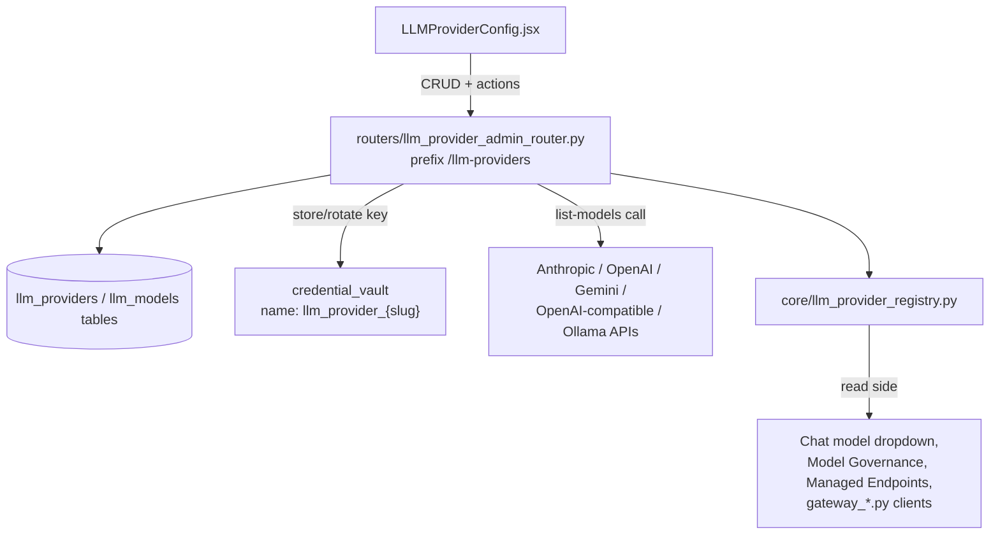

# LLMProviderConfig

**LLMProviderConfig** (`ai-ui/src/components/LLMProviderConfig.jsx`) is the admin-only screen for registering the LLM providers the platform can call — Anthropic, OpenAI, Gemini, an OpenAI-compatible endpoint (e.g. OpenRouter), or a self-hosted Ollama instance — and for managing which models under each are enabled. It is the write side of `core/llm_provider_registry.py`, which every other subsystem (chat model dropdown, model governance, managed endpoints) resolves models through.

Sidebar entry: `llm-provider-config` (`maxLevel: 0`, admin only). Rendered at `/llm-provider-config`.

---

## Architecture



API keys are never stored on the provider row directly — they live in `credential_vault` under the deterministic name `llm_provider_{slug}` and are never echoed back in any response (`credential_configured: true/false` is all the frontend gets).

---

## Component Responsibilities

### `LLMProviderConfig` (default export)

The main screen. Loads the provider list and the family metadata (`GET /families`) on mount, admin-gated via `usePermission`. Renders a table of providers with inline actions (test connection, edit, delete) and an expandable row per provider showing `ProviderModels`.

### `ProviderModal`

Create/edit form. Slug is auto-derived from the name (slugified) until the admin edits it manually; locked after creation. Base URL / API key fields are shown conditionally based on the selected family's `requires_base_url` / `requires_api_key` metadata from `GET /families`.

### `ProviderModels`

The models table for one expanded provider: toggle enabled, set the platform default (`Star` icon — enforced globally unique server-side, see Notes), delete, "Sync models from provider", and "Remove N discovered" (bulk-clears auto-discovered rows without touching manually-added ones).

### `AddModelForm` / `TypeaheadAddModelForm` / `OllamaPullForm`

Three different "add a model" UIs, chosen by provider family:
- **`AddModelForm`** — plain manual entry (model id, display name, context window). Used by Anthropic/OpenAI/Gemini as a fallback alongside sync.
- **`TypeaheadAddModelForm`** — used only for `openai_compatible`. Fetches the catalog once via `GET /{id}/discover-models` as autocomplete suggestions; the admin picks or types one name and adds exactly that one. Bulk sync is deliberately disabled for this family (see Notes).
- **`OllamaPullForm`** — used only for `ollama`. Kicks off an async `docker`/Ollama model pull via `POST /{id}/pull-model` and polls `GET /{id}/pull-status/{job_id}` every 1.5s until `done`/`error`, since a download can take minutes.

---

## Backend API (`routers/llm_provider_admin_router.py`, prefix `/llm-providers`)

Every route requires admin (`Depends(require_admin)`).

| Method & path | Purpose |
|---|---|
| `GET /` | List all configured providers |
| `POST /` | Add a provider — auto-discovers and syncs its model catalog, and ensures a platform default exists, in the same call (skipped for `openai_compatible`) |
| `GET /families` | Supported provider families and their `requires_api_key`/`requires_base_url` metadata, for the Add Provider form |
| `GET /ollama-suggestions` | Autocomplete suggestions for the Ollama pull form |
| `GET /{id}` | Get one provider |
| `PUT /{id}` | Update name/base URL/enabled/extra config; rotates the API key if one is supplied |
| `DELETE /{id}?cascade=` | Delete a provider; refuses if it has enabled models unless `cascade=true` |
| `PATCH /{id}/toggle` | Enable/disable a provider |
| `POST /{id}/test-connection` | Verify reachability by calling the provider's list-models API; records `last_verify_status`/`last_verify_error` |
| `GET /{id}/discover-models` | Read-only catalog preview — the only discovery path for `openai_compatible` |
| `POST /{id}/sync-models` | Discover and upsert models from the provider API; `422` for `openai_compatible` |
| `POST /{id}/pull-model` | Ollama only — start an async model pull, returns a `job_id` |
| `GET /{id}/pull-status/{job_id}` | Poll a pull job |
| `GET /{id}/models` | List a provider's models |
| `DELETE /{id}/models?source=` | Bulk-delete a provider's models, optionally filtered by `source` (`discovered`/`manual`/`seed`) |
| `POST /{id}/models` | Manually add a model |
| `PUT /models/{model_id}` | Update a model (display name, capabilities, enabled, `is_default`, sort order) |
| `DELETE /models/{model_id}` | Delete a model — refused if a managed endpoint's allowlist still references its `model_id` |

---

## Process Flows

### Adding a provider

```mermaid
flowchart LR
    A[Admin fills Add Provider form] --> B[POST /llm-providers/]
    B --> C[Store API key in credential_vault]
    C --> D{family == openai_compatible?}
    D -->|No| E[Auto-discover + upsert models]
    D -->|Yes| F[Skip auto-sync\nadmin adds models one at a time]
    E --> G[ensure_default_model]
    F --> G
    G --> H[Toast: connected, N model(s) synced]
```

### Ollama model pull

```mermaid
flowchart LR
    A[Admin types/picks a model name] --> B[POST /{id}/pull-model]
    B --> C[Background thread streams\nOllama /api/pull]
    C -.->|every 1.5s| D[GET /{id}/pull-status/{job_id}]
    D -->|status=pulling| C
    D -->|status=done| E[Model row inserted, toast success]
    D -->|status=error| F[Toast: pull failed]
```

---

## Notes for Maintainers

- **Single global default.** Only one `LLMModel` row across the entire platform may have `is_default = true`. Setting a new default clears the flag on every other row (`update_model` in the router) — `core.llm_provider_registry.get_default_model_id()` returns the first `is_default` row it finds, so more than one would make "the" default ambiguous.
- **`openai_compatible` never bulk-syncs.** Aggregators like OpenRouter expose catalogs of hundreds of unrelated-vendor models; `POST /sync-models` returns `422` for this family. The frontend routes it through `TypeaheadAddModelForm` + `GET /discover-models` instead, adding exactly one model at a time.
- **Deleting a model is guarded.** The router checks every enabled `ManagedEndpoint`'s allowlist for the model id being deleted and refuses (`422`) if one still references it — disable it instead if you need it gone from rotation without breaking an endpoint.
- **Ollama models are always `billing_tier: free`.** Set explicitly wherever an Ollama model row is created (discovery, manual add, pull) — without it, capability-driven price-tier UI elsewhere would default a self-hosted model to "paid".
- **Auto-sync on create is best-effort.** A provider record is still created even if the initial discovery call fails (bad key, transient network error) — the admin can retry via "Sync models" afterward rather than losing the whole "add provider" action.
