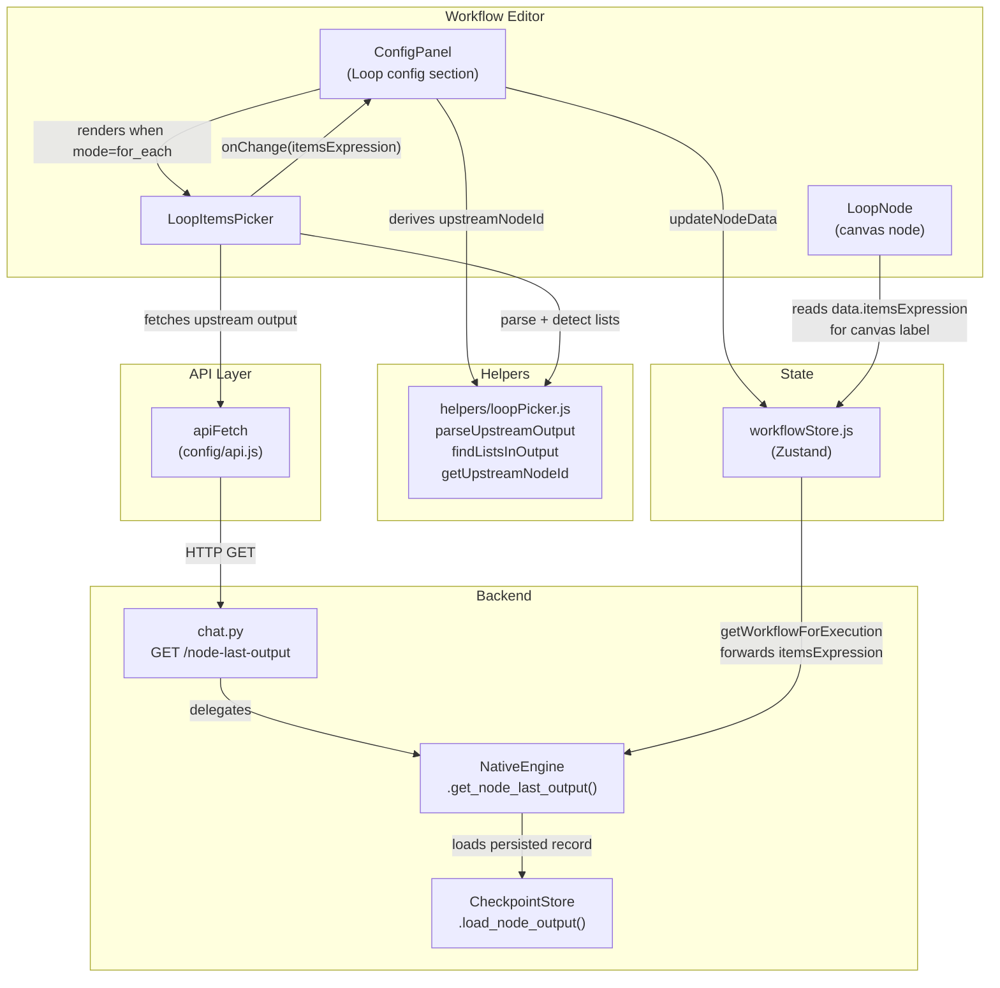
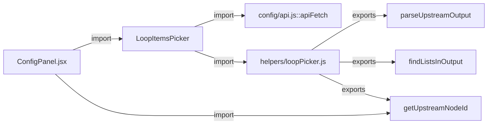
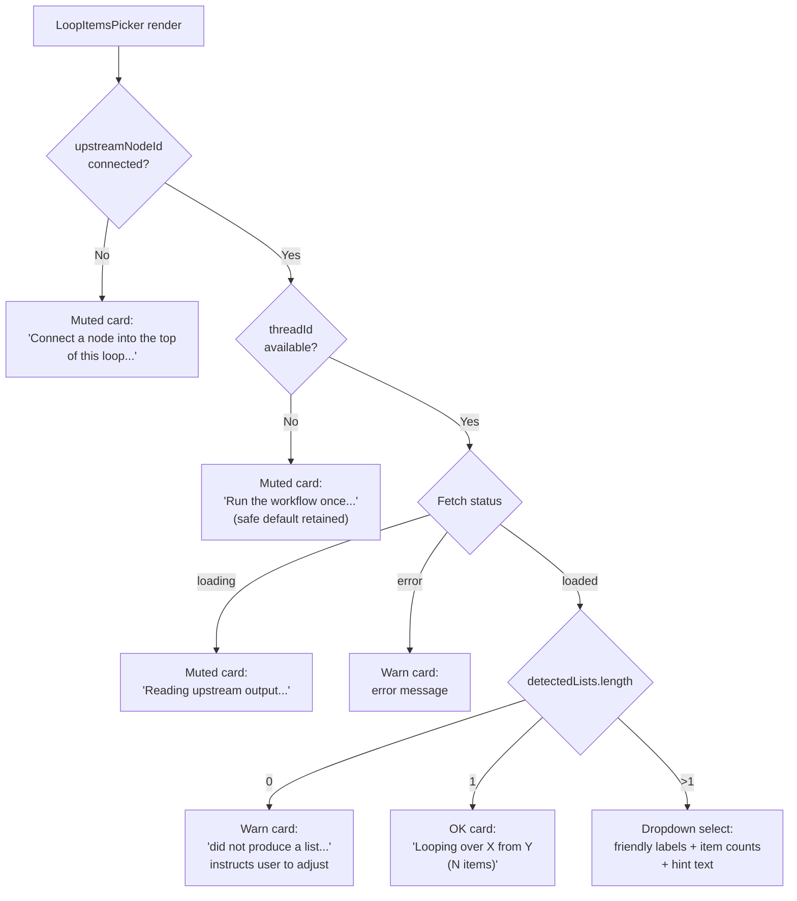
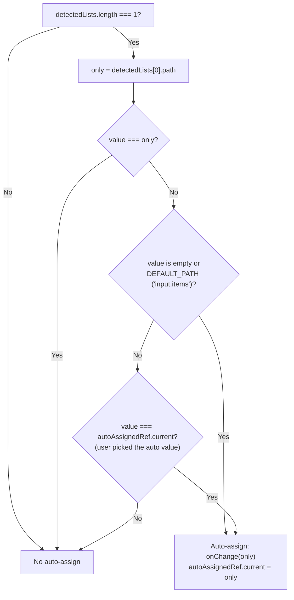
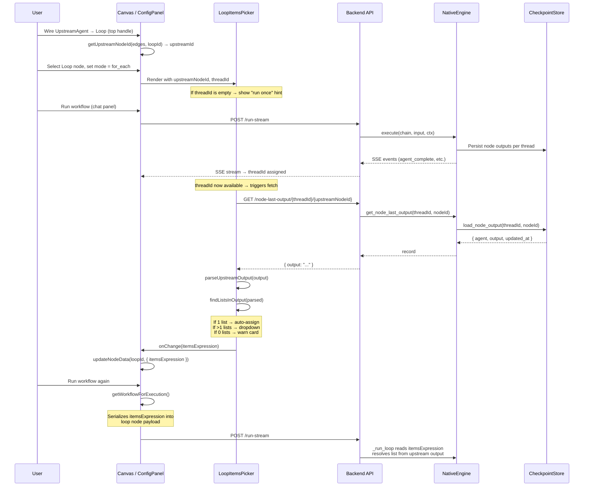

# LoopItemsPicker

## Overview

`LoopItemsPicker` is a React component in the ABStudio frontend workflow editor that provides a **connection-aware list picker** for the Loop node's "for each" iteration mode. Instead of forcing users to type a raw dotted-path expression (e.g. `input.results.docs`), it inspects the upstream node's last-run output, automatically detects any lists within it, and presents them as plain-language, click-to-pick options (e.g. "Docs (5 items)"). When exactly one list is found, it is selected silently with no user interaction required.

The component is part of the [workflow editor](#workflow-editor-context) sub-module tree and is rendered inside the [ConfigPanel](../infrastructure/ConfigPanel.md) when a Loop node is selected and its mode is set to `for_each`.

---

## Architecture

### Component Location

```
ABStudio/frontend/src/features/workflows/editor/LoopItemsPicker.jsx
```

### High-Level Architecture



### Module Dependencies



---

## Core Component: `LoopItemsPicker`

### Props

| Prop | Type | Description |
|------|------|-------------|
| `value` | `string` | The current dotted-path items expression (e.g. `input.items`, `input.results.docs`). Defaults to `'input.items'` when unset. |
| `onChange` | `(path: string) => void` | Callback invoked when the user (or auto-detect) selects a different list path. The ConfigPanel wires this to `updateNodeData(nodeId, { itemsExpression: next })`. |
| `upstreamNodeId` | `string \| null` | The node ID whose output feeds the Loop node's top input. Derived by `getUpstreamNodeId(edges, loopNodeId)` in the ConfigPanel. `null` when nothing is connected. |
| `upstreamNodeName` | `string` | Human-friendly name of the upstream node (from `node.data.name` or `node.type`), used in hint messages. |
| `threadId` | `string` | The active chat thread ID. Required to fetch the upstream node's last-run output. Empty/absent before the workflow has been run at least once. |

### Internal State

| State | Type | Description |
|-------|------|-------------|
| `output` | `any \| null` | The raw upstream node output fetched from the backend. |
| `status` | `'idle' \| 'loading' \| 'loaded' \| 'error'` | Current fetch lifecycle state. |
| `error` | `string` | Error message when `status === 'error'`. |
| `autoAssignedRef` | `Ref<string \| null>` | Tracks the last path that was auto-assigned so a subsequent manual override is never clobbered by a later auto-detect cycle. |

### Render Branches

The component renders different UI based on the connection and fetch state:



### Auto-Assignment Logic

When exactly one list is detected in the upstream output, the component silently locks the items expression to that list's path — but only if the user hasn't already manually chosen a different path:



This ensures that:
1. A user who manually selects a different list from a multi-list dropdown is never overridden.
2. A user who accepts the auto-assigned single list and later re-opens the config sees the same value (no flicker).
3. The safe default (`input.items`) is always present so the canvas can be saved even before the workflow has been run.

---

## Helper Module: `helpers/loopPicker.js`

Three pure functions support the picker. They are also imported directly by the [ConfigPanel](../infrastructure/ConfigPanel.md) for upstream-node derivation.

### `parseUpstreamOutput(raw)`

Parses the cached upstream output string into a JS value.

- If `raw` is `null` → returns `null`.
- If `raw` is not a string → returns it as-is.
- If the trimmed string starts with `{` or `[` → attempts `JSON.parse`; on failure, falls through.
- Otherwise → returns the raw string (prose output).

### `findListsInOutput(value)`

Walks a parsed JS value (object tree) and collects every array, paired with its dotted path.

**Returns:** `Array<{ path: string, length: number, samplePreview: string }>`

**Safety limits:**

| Constant | Value | Purpose |
|----------|-------|---------|
| `MAX_DEPTH` | 4 | Prevents deep recursion into nested objects. |
| `MAX_LISTS` | 12 | Caps the number of detected lists (dropdown stays usable). |
| `MAX_NODES_VISITED` | 5000 | Guards against pathological structures. |
| `SAMPLE_PREVIEW` | 80 | Truncates the first item's preview string. |

Arrays are detected but their items are **not** recursed into (avoids noise). The root path is always `'input'`, matching the engine's `_run_loop` pathing convention.

### `getUpstreamNodeId(edges, loopNodeId)`

Finds the source node ID of the edge connected to the Loop node's top input handle (`'target'`). Accepts edges with an empty `targetHandle` for backward compatibility with older edges created before the handle ID was added.

**Returns:** `string | null`

---

## Data Flow

### End-to-End Flow: From Canvas Wiring to Loop Execution



### Items Expression Path Convention

The dotted-path value maintained by the picker mirrors the backend engine's `_run_loop` resolution:

| Path | Meaning |
|------|---------|
| `input` | The whole upstream value (treated as the list itself if it's an array). |
| `input.items` | Default safe path — expects an `items` array in the upstream output. |
| `input.results.docs` | Walks `upstream_output["results"]["docs"]` to find the list. |

Inside the loop body, agents reference the current item as `{{loop.item}}` and the iteration number as `{{loop.index}}`.

---

## Integration Points

### ConfigPanel Integration

The [ConfigPanel](../infrastructure/ConfigPanel.md) renders `LoopItemsPicker` only when the selected node is a Loop node and its mode is `for_each`:

```jsx
{loopMode === 'for_each' && (
    <div className="form-group">
        <label className="form-label">List to iterate</label>
        <LoopItemsPicker
            value={loopData.itemsExpression || 'input.items'}
            onChange={(next) => handleChange('itemsExpression', next)}
            upstreamNodeId={loopUpstreamId}
            upstreamNodeName={loopUpstreamNode?.data?.name || loopUpstreamNode?.type || ''}
            threadId={activeThreadId}
        />
    </div>
)}
```

The `loopUpstreamId` is derived reactively from the store's edges via `getUpstreamNodeId`, so the picker re-renders only when the edge wiring into the selected Loop node actually changes — not on every unrelated edge edit.

### Workflow Store Integration

The `itemsExpression` value flows through the [workflow store](../storage/store.md) (`workflowStore.js`):

1. **Default:** `getDefaultNodeData('loop')` sets `itemsExpression: 'input.items'`.
2. **Update:** `updateNodeData(nodeId, { itemsExpression })` persists the picker's selection into `node.data`.
3. **Serialization:** `getWorkflowForExecution()` forwards `itemsExpression` in the loop node payload sent to the backend.
4. **Validation:** `loopBodyClosesOnNode()` validates that the loop body subgraph closes back on the loop node (body/exit handles wired correctly).

### Backend API Endpoint

The picker fetches upstream output via:

```
GET /node-last-output/{thread_id}/{node_id}
```

Defined in `ABStudio/backend/app/api/chat.py::get_node_last_output`, this endpoint delegates to `NativeEngine.get_node_last_output(thread_id, node_id)`, which loads the persisted record from the [CheckpointStore](../reference/checkpoint.md) via `load_node_output(thread_id, node_id)`.

**Response shape:**

```json
{
    "thread_id": "...",
    "node_id": "...",
    "output": "...",
    "agent": "...",
    "updated_at": "..."
}
```

Returns `{"output": null}` when the node hasn't run in the given thread yet.

### LoopNode Canvas Display

The [LoopNode](../workflows/workflow_editor_nodes.md) component reads `data.itemsExpression` to render a human-friendly label on the canvas (e.g. "For each doc" instead of the raw path). This label is purely cosmetic — the dotted path remains the source of truth in `node.data`.

---

## Related Modules

| Module | Relationship |
|--------|-------------|
| [ConfigPanel](../infrastructure/ConfigPanel.md) | Parent component that renders `LoopItemsPicker` inside the Loop configuration form. |
| [LoopNode](../workflows/workflow_editor_nodes.md) | Canvas node component that displays the loop mode and reads `itemsExpression` for its label. |
| [workflowStore](../storage/store.md) | Zustand store holding nodes, edges, and the `getWorkflowForExecution` serializer that forwards `itemsExpression` to the backend. |
| [api_execution](../api/api_execution.md) | Backend execution endpoints (`/run-stream`) that drive the NativeEngine, which persists per-node outputs consumed by the picker. |
| [api_chat](../api/api_chat.md) | Backend chat endpoints including `GET /node-last-output` that the picker calls to fetch upstream output. |
| [engine_native_engine](../reference/engine_native_engine.md) | The `NativeEngine` class that executes workflows, runs `_run_loop`, and provides `get_node_last_output()`. |
| [checkpoint](../reference/checkpoint.md) | Checkpoint store layer that persists per-node outputs (`load_node_output`) queried by the picker. |
| [LoopWhileEditor](../workflows/workflow_editor_conditions.md) | Sibling component rendered in the ConfigPanel for the Loop node's `while` mode (condition-driven iteration). |

---

## Design Principles

1. **No raw paths visible to users.** The dotted-path value (`input.results.docs`) is maintained in the store for the backend engine but is never surfaced as an editable string in the UI. Users see humanised labels ("Docs").

2. **Progressive disclosure.** The component adapts its UI to the available context:
   - No upstream connection → instruct user to wire one.
   - No thread (workflow not run) → instruct user to run once; safe default retained.
   - Loading → transient status message.
   - Error → warn card with the error.
   - No lists found → actionable guidance to adjust upstream instructions.
   - Exactly one list → silent auto-selection with confirmation card.
   - Multiple lists → structured dropdown with item counts.

3. **Non-clobbering auto-assign.** The `autoAssignedRef` ensures that once a user manually picks a list from a multi-list dropdown, a subsequent re-detect (e.g. after re-running the workflow) never overrides their choice — even if the re-detect finds only one list.

4. **Safe defaults.** The `DEFAULT_PATH` (`input.items`) is always present so the canvas can be saved and the workflow can execute (with a potentially empty list) even before the upstream node has produced output.
