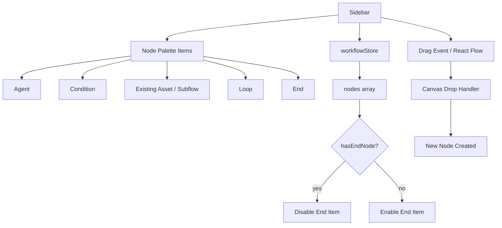
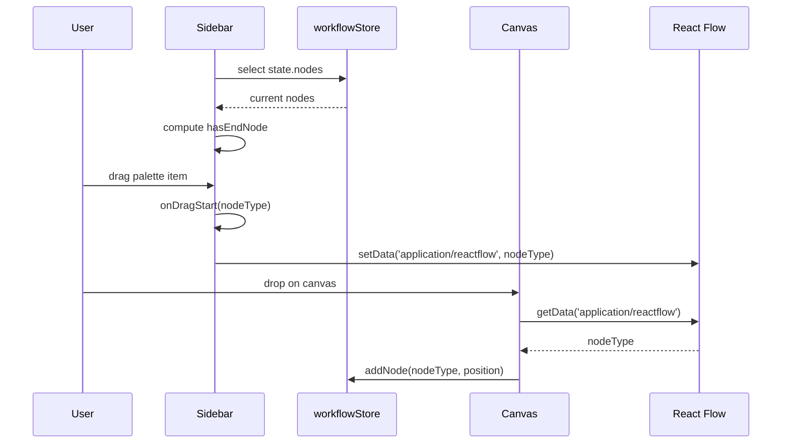
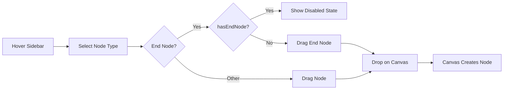
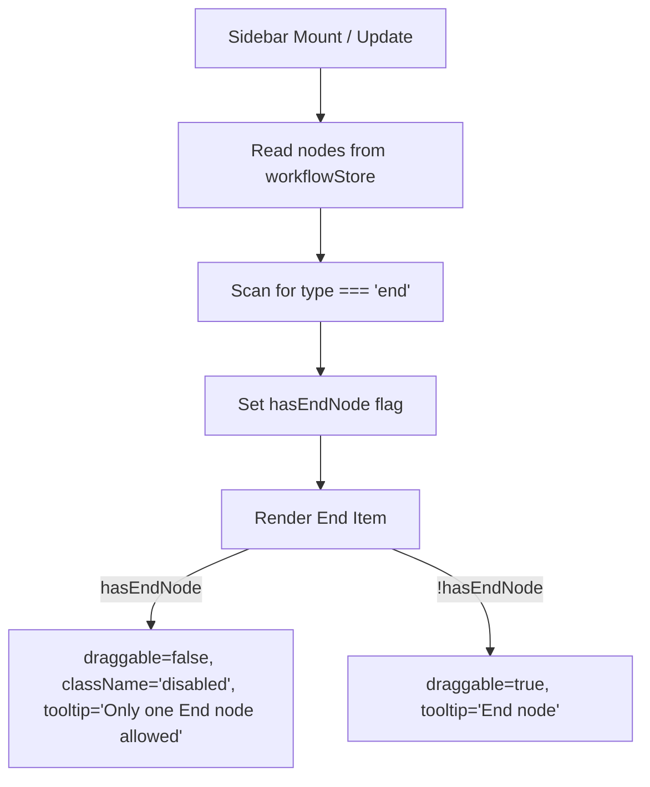

# Sidebar (Workflow Editor)

The **Sidebar** is the node palette component in the ABStudio workflow editor. It renders a draggable list of node types that users can drop onto the [Canvas](Canvas.md) to build workflows. It is a thin, presentation-focused React component that relies on the workflowStore for workflow state and on React Flow's native drag-and-drop contract for node creation.

---

## Purpose

- Provide a visual catalog of available node types in the workflow editor.
- Allow users to create new workflow nodes by dragging items onto the canvas.
- Enforce simple structural constraints (e.g., only one `end` node per workflow).
- Remain decoupled from node rendering logic and execution semantics.

---

## Core Functionality

### Node Palette

The Sidebar exposes five draggable node types, each mapped to a React Flow node type string:

| Palette Item | Node Type | Description |
|--------------|-----------|-------------|
| **Agent** | `agent` | Represents an agent invocation step. See AgentNode. |
| **Condition** | `condition` | Branches execution based on configurable rules. See ConditionNode. |
| **Existing Asset** | `subflow` | Embeds or links an existing workflow or agent as a subflow. See SubflowNode. |
| **Loop** | `loop` | Iterates a body subgraph until a termination condition is met. See LoopNode. |
| **End** | `end` | Terminates the workflow. See EndNode. |

### Drag-and-Drop Integration

When a user starts dragging a palette item, the Sidebar writes the node type into the drag event using React Flow's expected MIME type:

```javascript
event.dataTransfer.setData('application/reactflow', nodeType);
event.dataTransfer.effectAllowed = 'move';
```

The [Canvas](Canvas.md) listens for drops, reads the same data key, and creates a new node at the drop coordinates. This follows the standard React Flow drag-and-drop pattern.

### End-Node Constraint

The Sidebar reads the current workflow nodes from workflowStore to determine whether an `end` node already exists:

```javascript
const hasEndNode = nodes.some((n) => n.type === 'end');
```

If an end node is present, the End palette item is visually disabled, made non-draggable, and shows a tooltip explaining the restriction. This is a lightweight client-side guard; the authoritative validation for workflow topology lives in the store and backend execution engine.

---

## Architecture

### Component Structure



### Data Flow



---

## Component Relationships

### Upstream Dependencies

| Dependency | Role |
|------------|------|
| workflowStore | Provides the current `nodes` array used to enforce the single-end-node rule. |
| React Flow | Provides the drag-and-drop contract (`application/reactflow`) used by both Sidebar and Canvas. |

### Downstream Consumers

| Consumer | Relationship |
|----------|--------------|
| [Canvas](Canvas.md) | Receives the dragged node type and instantiates the corresponding node on the graph. |
| Node type components (AgentNode, ConditionNode, LoopNode, SubflowNode, EndNode) | Render the nodes after they are dropped; the Sidebar only knows their type strings. |

---

## Process Flows

### Adding a Node from the Palette



### End-Node Validation



---

## How It Fits into the System

The Sidebar is one of several editor panels that make up the workflow authoring experience in ABStudio:

- **[Canvas](Canvas.md)** – the main graph surface where nodes are placed and connected.
- **[ConfigPanel](ConfigPanel.md)** – the property editor for the selected node.
- **[ChatPanel](ChatPanel.md)** – the assistant chat used to generate or modify workflows.
- **[DebugLogView](DebugLogView.md)** – execution trace and debug output viewer.
- **workflowStore** – the shared Zustand store that holds the workflow graph state.

The Sidebar does not manage node data, edges, or execution logic. It is purely an entry point for node creation and delegates all state changes to the Canvas and workflow store.

---

## Notes for Maintainers

- The node type strings (`agent`, `condition`, `subflow`, `loop`, `end`) must stay in sync with the node type registrations in the [Canvas](Canvas.md) and the corresponding node component files.
- The single-end-node check is a UX convenience. Do not rely on it for backend validation; the execution engine and store validators should enforce workflow correctness independently.
- To add a new palette item, add a new draggable `div`, assign a unique node type, and provide an icon and label. Ensure the Canvas and node registry support the new type.
- The component uses plain CSS classes (`sidebar`, `node-palette`, `draggable-node`, etc.) for styling; coordinate with the design system when adding or modifying palette items.
