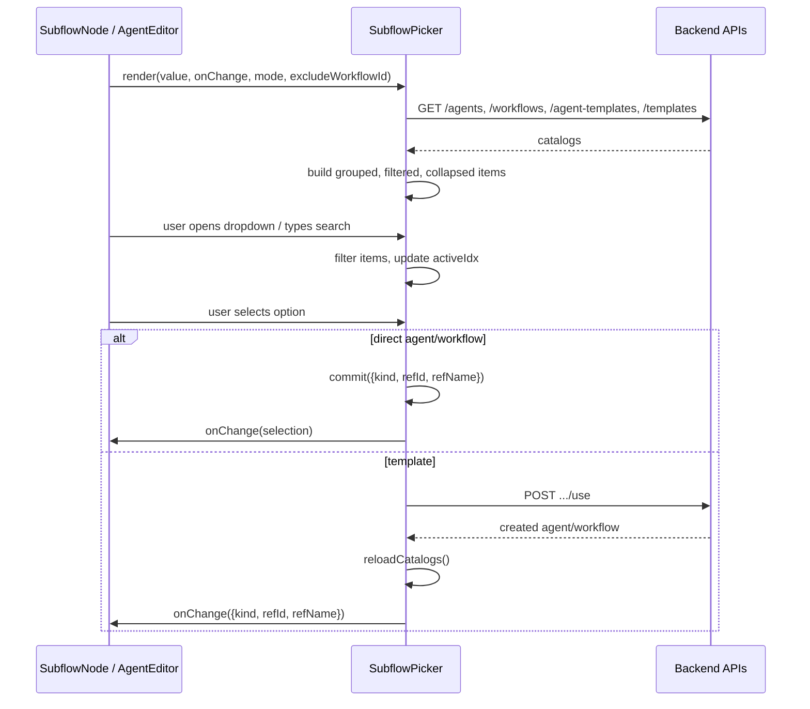
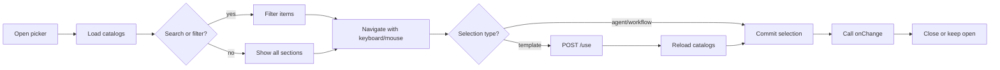

# SubflowPicker

The `SubflowPicker` is a React component in the ABStudio workflow editor that provides a searchable, keyboard-navigable dropdown for linking existing saved agents, workflows, or templates into the current canvas. It is used both when configuring a single subflow node and when attaching multiple subflows in the agent editor.

---

## Overview

`SubflowPicker` is a self-contained UI component that fetches four asset catalogs from the backend, presents them in a grouped and filterable list, and resolves template selections into real agent/workflow instances before notifying the parent. It supports two modes:

- **`single`** — selects one `{ kind, refId, refName }` object (used by the SubflowNode configuration panel).
- **`multi`** — builds a list of such objects (used by the AgentEditor to attach workflows or agents).

The component handles loading, error, empty, and instantiation states, and is fully operable via keyboard.

---

## Core Responsibilities

| Responsibility | Description |
| -------------- | ----------- |
| Catalog loading | Fetches `/agents`, `/workflows`, `/agent-templates`, and `/templates` in parallel. |
| Search & filtering | Filters by name/description and by asset kind (`all`, `agent`, `workflow`, `template`). |
| Sectioned display | Groups results under collapsible headers: Agents, Workflows, Agent templates, Workflow templates. |
| Template instantiation | Converts template selections into real agents/workflows via `POST .../use` endpoints. |
| Keyboard navigation | Supports `↑`, `↓`, `Enter`, and `Escape` for accessibility. |
| Multi-select chips | Renders removable chips for attached items in `multi` mode. |
| Self-reference guard | Hides the currently open workflow from the list via `excludeWorkflowId`. |

---

## Architecture

```mermaid
graph TB
    subgraph "SubflowPicker Component"
        SP[SubflowPicker]
        HK[handleKeyDown]
        CM[commit / instantiateTemplate]
        RL[reloadCatalogs]
        IM[items useMemo]
    end

    subgraph "Parent Context"
        SN[SubflowNode ConfigPanel]
        AE[AgentEditor]
    end

    subgraph "Backend APIs"
        A[/GET /agents\]
        W[/GET /workflows\]
        AT[/GET /agent-templates\]
        T[/GET /templates\]
        AU[/POST /agent-templates/{id}/use\]
        TU[/POST /templates/{id}/use\]
    end

    SN -->|value / onChange| SP
    AE -->|value[] / onChange| SP
    SP --> RL
    RL --> A & W & AT & T
    SP --> IM
    IM --> HK
    HK --> CM
    CM -->|template| AU & TU
    CM -->|onChange| SN & AE
```

---

## Component API

### Props

| Prop | Type | Default | Description |
| ---- | ---- | ------- | ----------- |
| `value` | `object` or `object[]` | — | Current selection. Object in `single` mode; array in `multi` mode. |
| `onChange` | `(next) => void` | — | Called when a selection is committed. |
| `mode` | `'single' \| 'multi'` | `'single'` | Selection behavior. |
| `excludeWorkflowId` | `string` | `''` | Workflow ID to omit from the list (prevents self-reference). |

### Selection shape

```javascript
{
  kind: 'agent' | 'workflow',
  refId: '<asset-id>',
  refName: '<display-name>'
}
```

---

## Data Flow



---

## Internal State

| State | Purpose |
| ----- | ------- |
| `agents`, `workflows`, `agentTemplates`, `workflowTemplates` | Cached catalogs from the backend. |
| `status` / `error` | Loading lifecycle (`loading`, `loaded`, `error`). |
| `open` | Whether the dropdown popover is visible. |
| `search` | Current search query. |
| `activeIdx` | Keyboard cursor index within selectable options. |
| `filterKind` | Active kind tab (`all`, `agent`, `workflow`, `template`). |
| `collapsed` | `Set` of section IDs that are collapsed. |
| `instantiating` | Spinner state while a template is being materialized. |

---

## Keyboard & Accessibility

- `ArrowDown` / `ArrowUp` — move the active option cursor.
- `Enter` — commit the active option.
- `Escape` — close the popover.
- `aria-selected`, `role="option"`, and `role="listbox"` are applied to option rows.
- Section headers use `aria-expanded` and `aria-controls`.
- The active option is scrolled into view automatically.

---

## Template Instantiation

Templates are presets and cannot be executed directly. When a user selects an agent or workflow template, `SubflowPicker`:

1. Calls `POST /agent-templates/{id}/use` or `POST /templates/{id}/use`.
2. Reloads the catalogs to include the newly created instance.
3. Commits a selection pointing to the new real agent/workflow.

This keeps subflow execution uniform: the runtime always receives a concrete `agent` or `workflow` reference.

---

## Dependencies

| Dependency | Relationship |
| ---------- | ------------ |
| apiFetch | HTTP helper used for all backend calls. |
| SubflowNode | Primary consumer in single-mode for subflow node configuration. |
| AgentEditor | Consumer in multi-mode for attaching workflows/agents to an agent. |
| [ConfigPanel](ConfigPanel.md) | Hosts the picker when a subflow node is selected on the canvas. |
| workflowStore | Provides the open workflow ID used for `excludeWorkflowId`. |

---

## Process Flow: Selecting a Subflow



---

## Notes for Maintainers

- The component is intentionally self-contained: it owns its own catalog fetching and template instantiation logic so that parent components only need to manage the final selection shape.
- `excludeWorkflowId` is only applied to the `/workflows` list; templates and agents are always shown.
- In `multi` mode, already-attached items are hidden from the option list to prevent duplicates.
- The `items` memo is rebuilt whenever any catalog, search, filter, or collapse state changes; keep this dependency list in sync when extending the component.
- Errors during catalog loading are surfaced inside the popover and, in `single` mode, also rendered below the trigger when closed.
