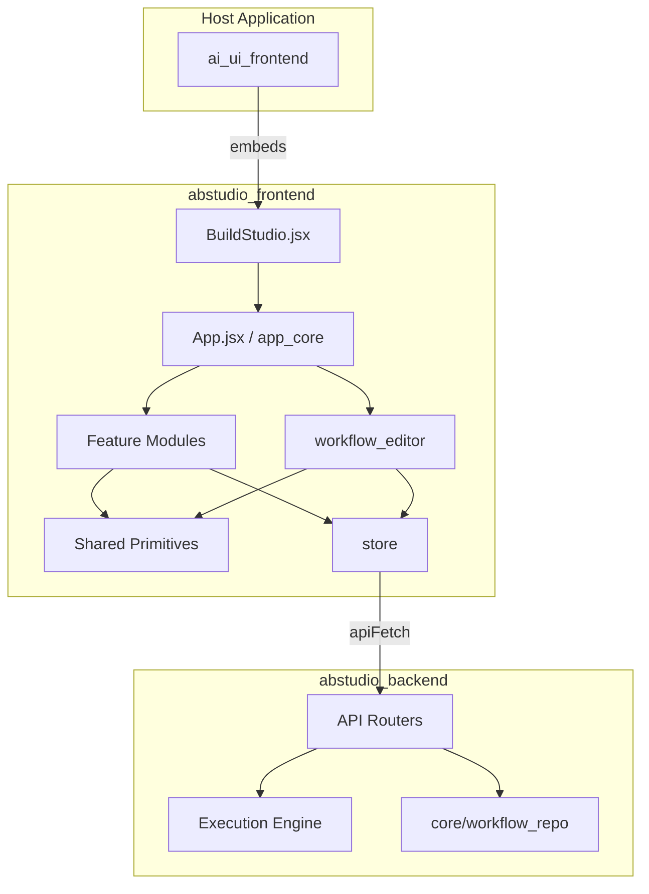
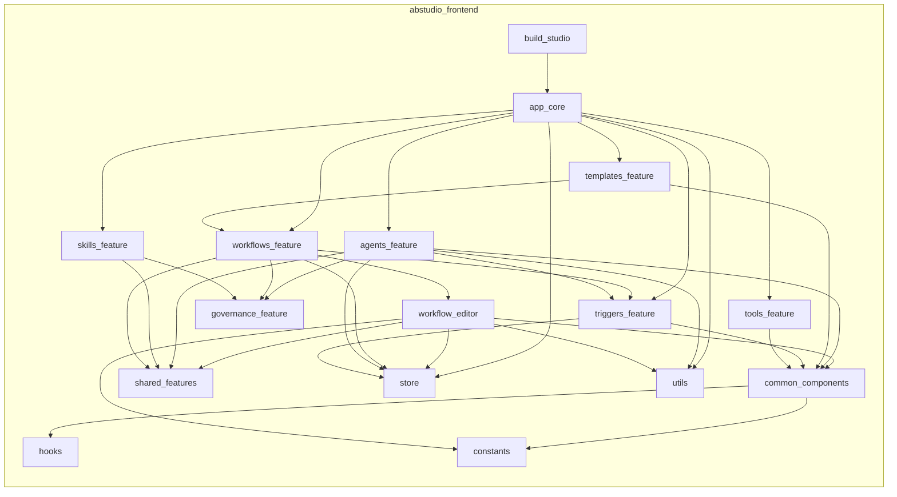
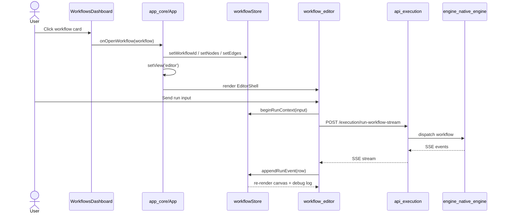

# `abstudio_frontend` Module Overview

## Purpose

`abstudio_frontend` is the React-based user interface for **ABStudio**, the visual builder inside the larger AI platform. It is located under `ABStudio/frontend` and provides the single-page application (SPA) where users design, run, and govern AI agents, workflows, skills, tools, triggers, and templates.

The module's responsibilities are:

- **Visual workflow authoring** — a React Flow canvas for building multi-agent pipelines with nodes, edges, conditions, loops, sub-flows, and evaluation gates.
- **Agent builder** — a full-screen editor for configuring agent instructions, models, tools, skills, knowledge, guardrails, memory, and runtime parameters, plus an integrated preview chat.
- **AI-assisted factories** — conversational chat interfaces that generate workflows, agents, and skills from plain-language descriptions.
- **Catalog & governance surfaces** — dashboards for workflows, agents, skills, tools, templates, and triggers, with governance status badges and approval submission.
- **State management & persistence** — Zustand stores for workflow graph state, trigger state, and client-side UI persistence.
- **Embeddable shell** — a self-contained `BuildStudio` component that can be dropped into the host platform without leaking styles or layout.

The frontend treats the ABStudio backend (`abstudio_backend`) as the single source of truth. It does not own execution semantics, catalog generation, or governance lifecycle logic; it serializes editor state into backend payloads and renders the returned streams and statuses.

---

## Architecture

### High-Level Placement

### Internal Module Structure

### Data Flow: Opening and Running a Workflow

---

## Core Components & Sub-Modules

| Sub-module | Responsibility | Documentation |
|---|---|---|
| **app_core** | Root `App` component, top-level navigation, dashboard/editor view switch, autosave orchestration, reload-restore, template preview/clone, and error boundary. | [app_core.md](../reference/app_core.md) |
| **build_studio** | Embeddable entry point `BuildStudio` that scopes styles, measures the parent container, and hosts the full application tree. | [build_studio.md](build_studio.md) |
| **workflows_feature** | Workflow dashboard, workflow factory chat, `RunningWorkflowToast`, and orchestration of the visual editor. | [workflows_feature.md](../workflows/workflows_feature.md) |
| **workflow_editor** | React Flow canvas (`Canvas`), node configuration (`ConfigPanel`), run chat (`ChatPanel`), debug log (`DebugLogView`), sidebar palette, condition builders, node/edge renderers, and run settings. | [workflow_editor.md](../workflows/workflow_editor.md) |
| **agents_feature** | Agents dashboard, `AgentEditor`, and `AgentFactoryChat` for building and previewing agents. | [agents_feature.md](../agents/agents_feature.md) |
| **skills_feature** | Skills catalog dashboard and `SkillFactoryChat` for AI-assisted skill authoring. | [skills_feature.md](../agents/skills_feature.md) |
| **tools_feature** | Read-only tools catalog with search, grouping, and detail modal. | [tools_feature.md](../reference/tools_feature.md) |
| **templates_feature** | Feature-flagged template admin UI: create, edit, reset, save-to-seed, and delete templates. | [templates_feature.md](../reference/templates_feature.md) |
| **triggers_feature** | Trigger scheduler UI, execution history, and global notification bell. | [triggers_feature.md](../reference/triggers_feature.md) |
| **governance_feature** | `StatusBadge` and `SubmitApprovalButton` for workflow/agent/skill approval lifecycle. | [governance_feature.md](../sdlc/governance_feature.md) |
| **common_components** | Reusable UI primitives: `CatalogPicker`, `InlinePicker`, `KnowledgeSection`, `KnowledgeUploadInline`, `PlanCard`, `AnswerCards`, `ConfirmModal`, `HoverTooltip`, `GenerateInstructionsModal`, `TemplatesEmptyState`. | [common_components.md](common_components.md) |
| **shared_features** | Cross-cutting factory chat shell, file chips, OCR text preview, and download notices. | [shared_features.md](../reference/shared_features.md) |
| **store** | Zustand stores: `workflowStore` (canvas + execution state) and `triggersStore` (trigger CRUD + notifications). | [store.md](../storage/store.md) |
| **utils** | Client-side persistence (`editorPersistence`), transient ID generation (`makeId`), and thread/chat formatting helpers (`threadHelpers`). | [utils.md](../reference/utils.md) |
| **hooks** | Reusable React hooks, currently `useHoverTooltip` for accessible hover/focus tooltips. | [hooks.md](../reference/hooks.md) |
| **constants** | Canonical field/operator catalogs and expression-preview helpers for the visual condition builder. | [constants.md](../reference/constants.md) |

---

## Key Design Decisions

1. **Backend is the source of truth.** The frontend stores only view-state pointers in `localStorage`; all workflow, agent, skill, and trigger data is fetched from and persisted to `abstudio_backend`.
2. **Centralized state.** Canvas graph state, execution telemetry, and chat state live in `workflowStore`; trigger state lives in `triggersStore`.
3. **Shared factory chat infrastructure.** `FactoryChatShell` and `useFactoryChatStream` are reused across workflow, agent, and skill factories for consistent streaming UX.
4. **Embeddable by default.** `BuildStudio` scopes styles to `[data-ac]` and dynamically measures its container so it can be embedded in `ai_ui_frontend` without layout side effects.
5. **Editor stays mounted during execution.** When a user navigates back to the dashboard while a workflow runs, `EditorShell` is hidden rather than unmounted so the SSE reader and abort controller remain alive.
6. **Governance-aware UI.** `StatusBadge` and `SubmitApprovalButton` are small, self-contained components that poll the backend approval lifecycle and can be dropped into any card or editor header.

---

## Related Backend Modules

The frontend consumes the following backend modules via REST and Server-Sent Events:

- [api_workflows.md](../api/api_workflows.md) — workflow CRUD
- [api_execution.md](../api/api_execution.md) — synchronous and streaming workflow execution
- [api_factories.md](../api/api_factories.md) — workflow, agent, and skill factory chat/confirm
- [api_agents.md](../api/api_agents.md) — agent CRUD
- [api_agent_chat.md](../api/api_agent_chat.md) — agent chat thread metadata
- [api_catalog.md](../api/api_catalog.md) — skills/tools catalog
- [api_templates.md](../api/api_templates.md) — template listing and usage
- [api_template_admin.md](../api/api_template_admin.md) — template admin CRUD + seed persistence
- [api_triggers.md](../api/api_triggers.md) — trigger CRUD and execution history
- [api_governance.md](../api/api_governance.md) — governance status and approval submission
- [api_documents.md](../api/api_documents.md) — file/image upload and OCR extraction
- [core_workflow_repo.md](../reference/core_workflow_repo.md) — backend persistence layer
- [engine_native_engine.md](../reference/engine_native_engine.md) — workflow execution engine