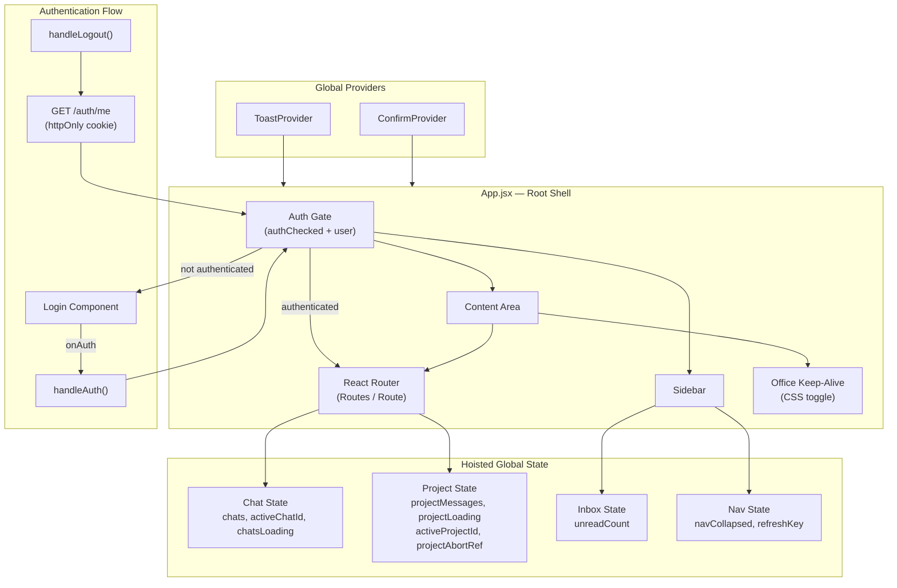
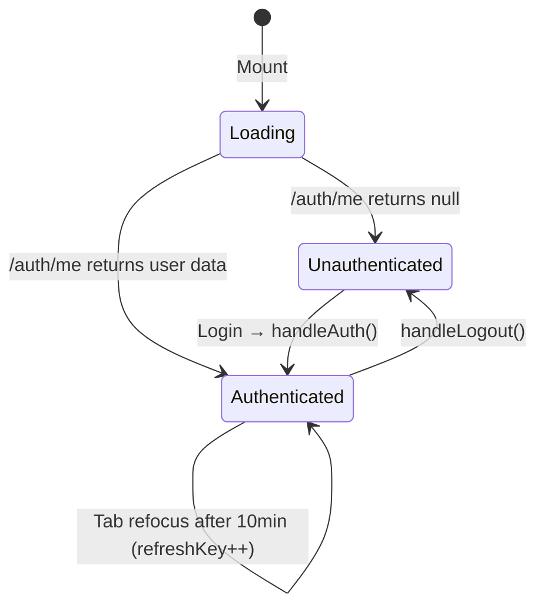
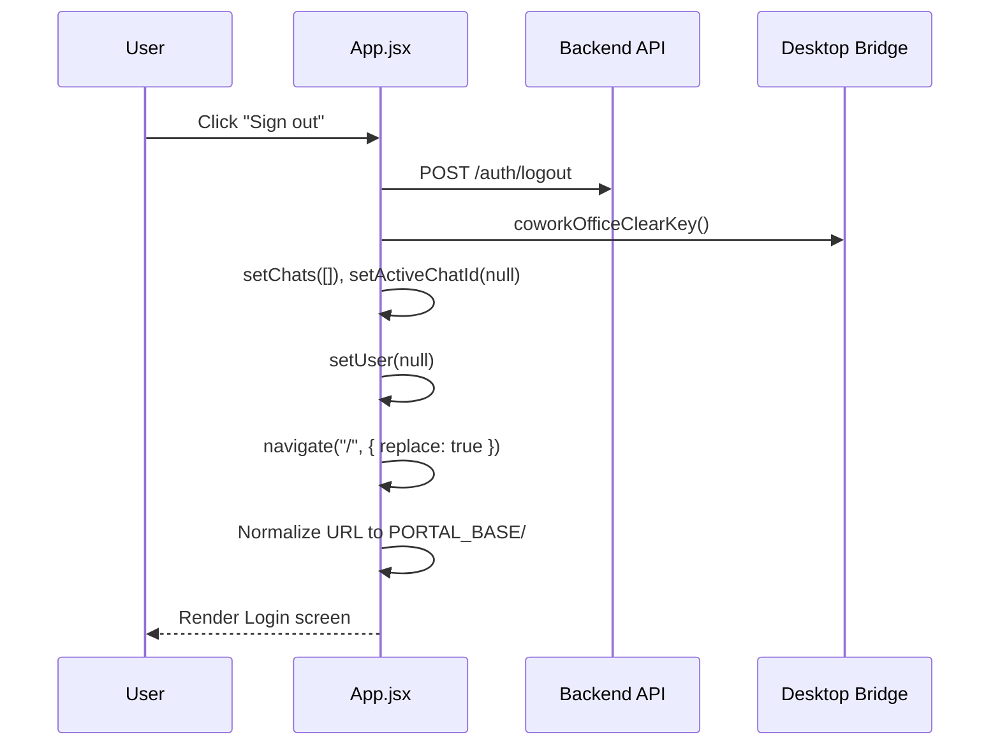
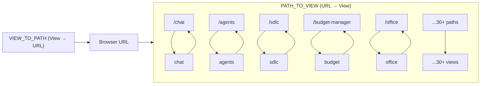
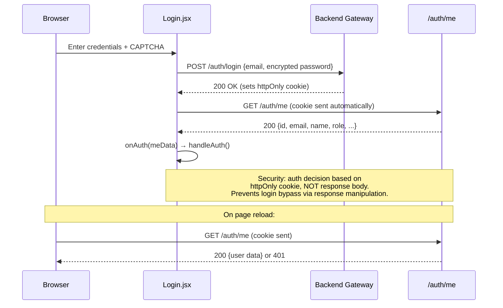
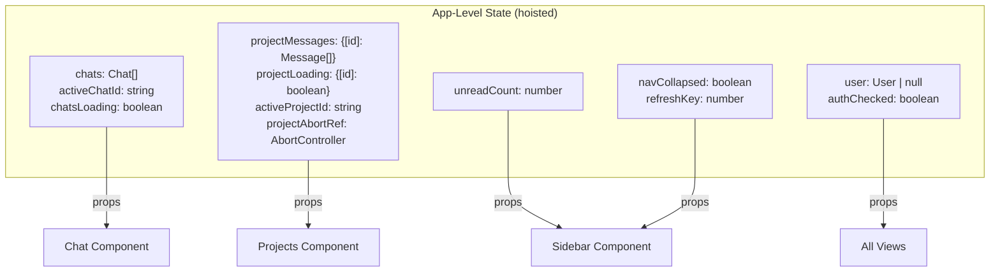
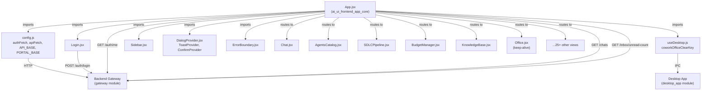
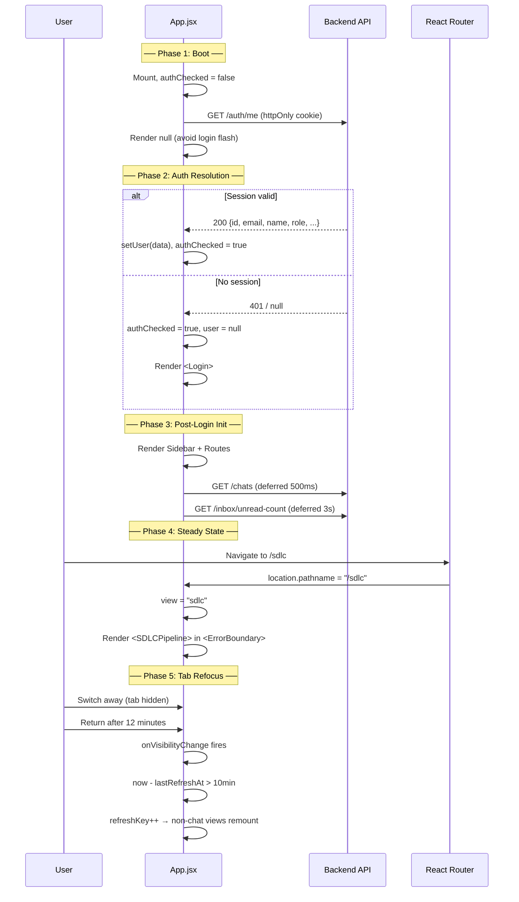

# AI-UI Frontend App Core

## 1. Introduction

The `ai_ui_frontend_app_core` module is the **root application shell** of the AI-UI (AiNxt Enterprise) frontend. It is the single entry point that bootstraps the entire single-page application (SPA), managing authentication, routing, global state, and the layout skeleton (sidebar + content area). Every feature view in the platform — Chat, Agents, Knowledge Base, SDLC Pipeline, Budget Manager, and dozens more — is mounted, unmounted, and kept alive through this module.

At its core, `App.jsx` is a React functional component that:

- **Authenticates** users via server-side httpOnly cookies (never localStorage), rendering a `Login` screen until `/auth/me` confirms a valid session.
- **Routes** between 30+ feature views using React Router, with URL-path ↔ view-key bidirectional mapping.
- **Hoists shared state** (chat list, project messages, inbox unread count) so streaming responses survive route navigation.
- **Preserves the Office (Buddy) component** via a CSS keep-alive pattern, preventing the loss of in-flight CLI streamed tokens when users switch tabs.
- **Wraps every route** in an `ErrorBoundary` and provides global `Toast` and `Confirm` dialog contexts.

---

## 2. Architecture Overview



---

## 3. Core Components

### 3.1 `App` — Root Component

The `App` component is the top-level React component exported as default from `App.jsx`. It orchestrates the entire application lifecycle.

**Key responsibilities:**

| Responsibility | Mechanism |
|---|---|
| Session restoration | `useEffect` calls `GET /auth/me` on mount; sets `user` state from response |
| Authentication gate | Renders `Login` until `authChecked` is `true` and `user` is non-null |
| View routing | Derives `view` from `location.pathname`; `setView()` navigates via `useNavigate` |
| Chat list management | Fetches `/chats` on login (deferred 500ms); maps backend response to local chat objects |
| Project state hoisting | Maintains `projectMessages`, `projectLoading`, `activeProjectId`, `projectAbortRef` |
| Inbox polling | Polls `/inbox/unread-count` every 5 minutes (deferred 3s after login) |
| Tab-visibility refresh | Remounts non-chat views after 10+ minutes of tab inactivity via `refreshKey` |
| Sidebar persistence | `navCollapsed` state persisted to `localStorage` |
| Office keep-alive | Renders `<Office>` outside `<Routes>` with CSS `hidden`/`flex` toggle |

**State diagram:**



### 3.2 `handleAuth(authData)`

Called by the `Login` component after a successful server-side session verification. Sets the `user` state and marks `authChecked` as `true`, causing the app to transition from the login screen to the main shell.

```javascript
function handleAuth(authData) {
  setUser(authData);
  setAuthChecked(true);
}
```

**User object shape:**
```javascript
{
  userId, email, name, role,
  ad_level,           // Access-control level (default 6)
  department,
  can_approve,
  is_hod,
  hod_departments,
  is_reporting_manager
}
```

### 3.3 `handleLogout()`

Performs a full session teardown:

1. Sends `POST /auth/logout` to invalidate the server-side session.
2. Calls `coworkOfficeClearKey()` to wipe the desktop-persisted CLI API key and Entra refresh token (no-op on web).
3. Clears local chat state (`chats`, `activeChatId`).
4. Resets `user` to `null` and navigates to `/`.
5. Normalizes the URL to `${PORTAL_BASE}/` for hard-reload compatibility.



### 3.4 `onVisibilityChange()`

An event listener attached to `document.visibilitychange`. When the tab becomes visible again after being hidden, it checks the elapsed time since the last refresh:

- **< 10 minutes**: No action — preserves in-progress form data during short tab switches.
- **≥ 10 minutes**: Increments `refreshKey`, which causes non-chat views (those keyed with `refreshKey`) to remount and fetch fresh data.

This prevents stale data after long absences while avoiding unnecessary state destruction during quick alt-tab switches.

### 3.5 `toggleNav()`

Toggles the sidebar between collapsed (14px wide) and expanded (56px wide) states. The preference is persisted to `localStorage` under the key `nav_collapsed`.

---

## 4. Routing Architecture

The app uses React Router v6 with a bidirectional URL-path ↔ view-key mapping. This enables deep-linking and browser back/forward navigation.



**Route rendering strategy:**

| Pattern | Views | Behavior |
|---|---|---|
| **Stable key** (no `refreshKey`) | `chat`, `products`, `build-studio`, `office` | Never remounted on tab refocus; preserves form/streaming state |
| **`refreshKey`-suffixed key** | `agents`, `sdlc`, `budget`, `monitoring`, `analytics`, etc. | Remounted after 10+ min tab inactivity to fetch fresh data |
| **Keep-alive (outside Routes)** | `office` | Rendered once; toggled with CSS `hidden`/`flex` to preserve CLI event listeners |
| **Fallback** | `*` | Redirects to `/chat` |

### Office Keep-Alive Pattern

```mermaid
graph TD
    subgraph Problem["Problem (if Office were a Route)"]
        A1["User on /office, CLI streaming answer"] --> A2["User switches to /chat"]
        A2 --> A3["Route unmounts Office"]
        A3 --> A4["coworkOffice:onEvent listener destroyed"]
        A4 --> A5["Streamed tokens lost"]
        A5 --> A6["Turn surfaces as 'error' / '0 tok'"]
    end

    subgraph Solution["Solution (CSS Keep-Alive)"]
        B1["User on /office, CLI streaming answer"] --> B2["User switches to /chat"]
        B2 --> B3["Office stays mounted (CSS hidden)"]
        B3 --> B4["coworkOffice:onEvent listener alive"]
        B4 --> B5["Tokens keep streaming"]
        B5 --> B6["User returns — answer is there"]
    end
```

The `Office` (Buddy) component is deliberately rendered **outside** the `<Routes>` block. This is a critical architectural decision:



---

## 5. Authentication & Security

### 5.1 Session Model

The application uses a **cookie-based, server-validated** authentication model. No tokens or user data are stored in `localStorage` or `sessionStorage`.



### 5.2 `authFetch` — Authenticated Request Helper

All API calls from the app shell use `authFetch` from the [config](../infrastructure/config.md) module, which:

- Sets `credentials: 'include'` to send httpOnly cookies.
- Adds `x-client-request-id` header for tracing.
- Retries idempotent (GET/HEAD) requests once after a 400ms backoff on network failure.
- Uses `cache: 'no-store'` to prevent stale responses.

> **See also:** [config](../infrastructure/config.md) module for `authFetch` and `apiFetch` implementation details.

### 5.3 Access Control

User visibility of sidebar items is controlled by `ad_level` (Active Directory level) and `role`. The `Sidebar` component uses a `canSee(maxLevel)` function: items with `maxLevel >= user.ad_level` (or admin role) are shown. Some items also have server-side allowlist probes (e.g., `/broadcast/access`, `/tenx/access`).

> **See also:** [sidebar](../sidebar.md) module for nav group configuration and visibility logic.

---

## 6. Global State Management

The `App` component hoists several pieces of shared state that must survive route navigation:



### 6.1 Chat State

Chat data is fetched from the database (not localStorage) on login. The fetch is deferred 500ms to prioritize initial UI rendering. Each chat object includes KB-chat metadata (`rag_mode`, `product_id`, `domain`, `spec_version`, `kb_doc_id`) to ensure KB chat history persists across page refreshes.

### 6.2 Project State

Project messages and loading state are keyed by project ID, allowing each workspace to have independent streaming state. An `AbortController` ref (`projectAbortRef`) enables canceling in-flight streams when switching projects.

### 6.3 Inbox Polling

Inbox unread count is polled every 5 minutes, with the first poll deferred 3 seconds after login to avoid competing with the critical rendering path.

---

## 7. Dependency Map



### Key Dependencies

| Dependency | Module | Purpose |
|---|---|---|
| `authFetch`, `apiFetch` | [config](../infrastructure/config.md) | Authenticated HTTP requests with retry and correlation IDs |
| `coworkOfficeClearKey` | [ai_ui_frontend_hooks](ai_ui_frontend_hooks.md) | Desktop bridge — clears OS-persisted CLI keys on logout |
| `Login` | [login](../reference/login.md) | Authentication screen with CAPTCHA and server-side session verification |
| `Sidebar` | [sidebar](../sidebar.md) | Navigation sidebar with role-based visibility, budget widget, SDLC pulse |
| `ToastProvider`, `ConfirmProvider` | [ui_dialog](ui_dialog.md) | Global toast notifications and confirmation dialogs |
| `ErrorBoundary` | — | Per-route error isolation preventing full-app crashes |
| `Chat` | [chat](../chat/chat.md) | Main chat interface (receives hoisted chat state) |
| `Office` | — | Buddy/Office component (keep-alive pattern) |
| `Projects` | [projects](../reference/projects.md) | Project workspace (receives hoisted project state) |

---

## 8. View Registry

The following table lists all registered routes and their corresponding feature modules:

| URL Path | View Key | Component | Module Reference |
|---|---|---|---|
| `/chat` | `chat` | `Chat` | [chat](../chat/chat.md) |
| `/agents` | `agents` | `AgentsCatalog` | [agents_catalog](../agents/agents_catalog.md) |
| `/knowledge` | `knowledge` | `KnowledgeBase` | [knowledge_base](../knowledge/knowledge_base.md) |
| `/graph` | `graph` | `KnowledgeGraph` | [knowledge_graph](../knowledge/knowledge_graph.md) |
| `/products` | `products` | `ProductManager` | [product_manager](../reference/product_manager.md) |
| `/codebase` | `codebase` | `CodebaseManager` | [codebase_manager](../reference/codebase_manager.md) |
| `/projects` | `projects` | `Projects` | [projects](../reference/projects.md) |
| `/threads` | `threads` | `Threads` | [threads](../chat/threads.md) |
| `/discussions` | `discussions` | `Discussions` | [discussions](../chat/discussions.md) |
| `/inbox` | `inbox` | `Inbox` | [inbox](../chat/inbox.md) |
| `/sdlc` | `sdlc` | `SDLCPipeline` | [sdlc_pipeline](../sdlc/sdlc_pipeline.md) |
| `/build-studio` | `build-studio` | `BuildStudio` | [ai_ui_frontend_build_studio](ai_ui_frontend_build_studio.md) |
| `/monitoring` | `monitoring` | `Monitoring` | [monitoring](../infrastructure/monitoring.md) |
| `/analytics` | `analytics` | `AgentAnalytics` | [agent_analytics](../agents/agent_analytics.md) |
| `/evals` | `evals` | `EvalsDashboard` | [evals_dashboard](../evaluation/evals_dashboard.md) |
| `/model-governance` | `model-governance` | `ModelGovernance` | [model_governance](../sdlc/model_governance.md) |
| `/budget-manager` | `budget` | `BudgetManager` | [budget_manager](../models/budget_manager.md) |
| `/level-overrides` | `level-overrides` | `LevelOverrides` | [level_overrides](../clients/level_overrides.md) |
| `/broadcast` | `broadcast` | `EmailBroadcast` | [email_broadcast](../chat/email_broadcast.md) |
| `/endpoint-manager` | `endpoint-manager` | `EndpointManager` | [endpoint_manager](../reference/endpoint_manager.md) |
| `/dept-metrics` | `dept-metrics` | `DeptMetrics` | [dept_metrics](../infrastructure/dept_metrics.md) |
| `/memory` | `memory` | `Memory` | [memory](../reference/memory.md) |
| `/connectors` | `connectors` | `Connectors` | [connectors](../connectors/connectors.md) |
| `/cowork-setup` | `cowork-setup` | `CoworkSettings` | [cowork_settings](../buddy/cowork_settings.md) |
| `/office` | `office` | `Office` (keep-alive) | — |
| `/code` | `cowork` | `Code` | [code](../reference/code.md) |
| `/documents` | `docs` | `DocsPanel` | [documents](../documents/documents.md) |
| `/profile` | `profile` | `Profile` | [profile](../reference/profile.md) |
| `/tenx` | `tenx` | `TenXAward` | — |
| `/coach` | `coach` | `Coach` | [coach](../evaluation/coach.md) |
| `/skill-proposals` | `skill-proposals` | `SkillProposals` | [skill_proposals](../agents/skill_proposals.md) |

---

## 9. Application Lifecycle



---

## 10. Error Handling

Every route is wrapped in an `ErrorBoundary` component with a unique key. This ensures:

1. **Isolation**: A crash in one view (e.g., `SDLCPipeline`) does not bring down the entire application.
2. **Recovery**: Users can navigate away from a crashed view and return to a fresh mount.
3. **Refresh compatibility**: Views keyed with `refreshKey` get a new `ErrorBoundary` instance on tab refocus, clearing any error state along with the remount.

The `ToastProvider` and `ConfirmProvider` wrap the entire app shell, providing imperative APIs (`toast.success()`, `toast.error()`, `confirm()`) accessible to all child components via React context.

> **See also:** [ui_dialog](ui_dialog.md) for `ToastProvider` and `ConfirmProvider` implementation details.

---

## 11. Backend Integration Points

The `App` component directly calls the following backend endpoints:

| Endpoint | Method | Purpose | Timing |
|---|---|---|---|
| `/auth/me` | GET | Session restoration on mount | On mount |
| `/auth/logout` | POST | Session invalidation | On logout |
| `/chats` | GET | Fetch chat list from DB | 500ms after login |
| `/inbox/unread-count` | GET | Poll inbox unread count | 3s after login, then every 5 min |

All other API calls are made by individual feature components (e.g., `Chat`, `SDLCPipeline`, `BudgetManager`) and are documented in their respective module pages.

> **See also:** [gateway](../models/gateway.md) module for the backend API gateway that serves these endpoints.

---

## 12. Desktop Integration

When running inside the Electron desktop app, the `App` component integrates with the desktop bridge via `coworkOfficeClearKey()` from the [useDesktop](ai_ui_frontend_hooks.md) hook. On logout, this clears:

- The OS-persisted CLI API key
- The Entra (Azure AD) refresh token

This ensures that on shared machines, the next user cannot inherit the previous user's session. The call is a no-op when running in a web browser (the function returns `{ ok: false }` if `window.ainxtDesktop` is not present).

> **See also:** [desktop_app](../clients/desktop_app.md) module for the Electron desktop application and IPC bridge.
