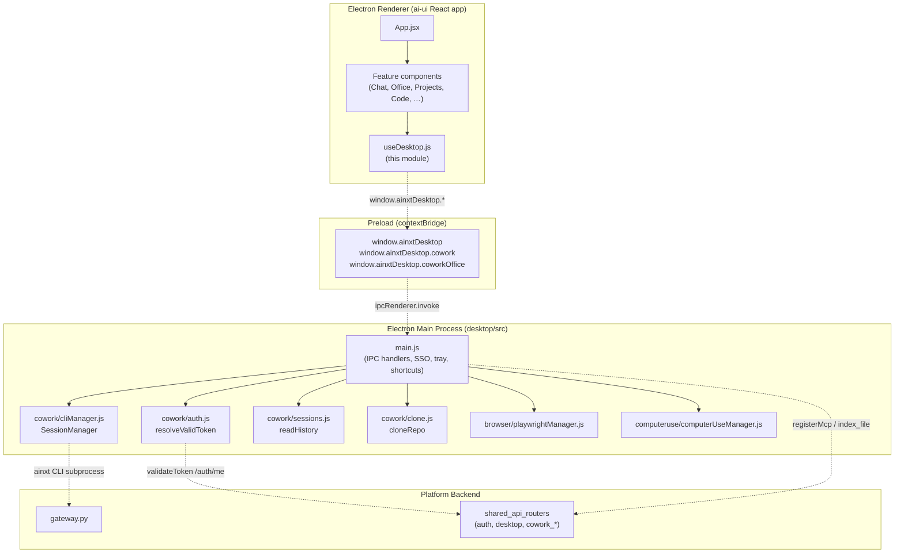
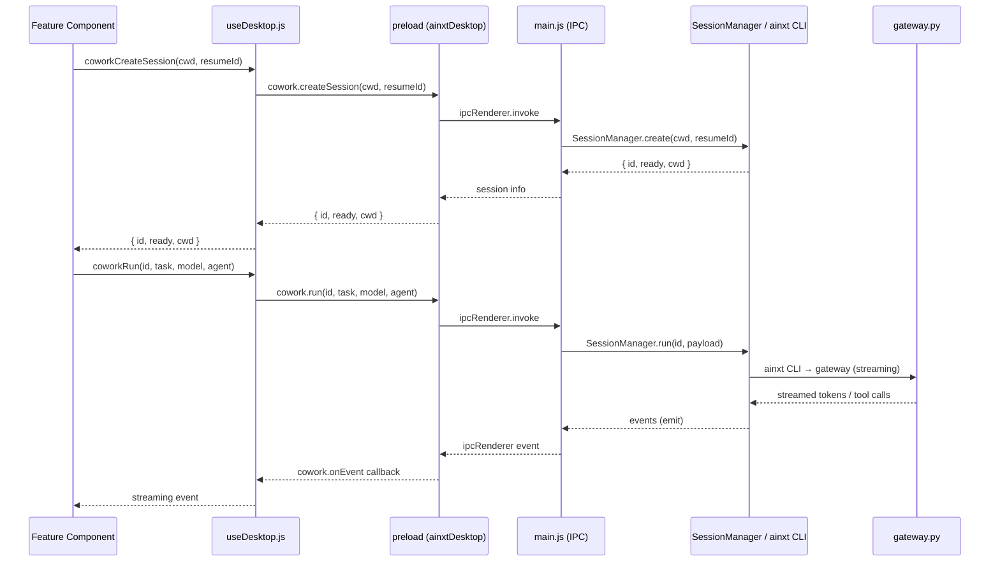
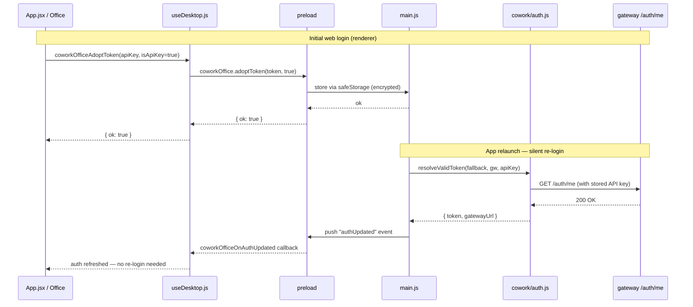
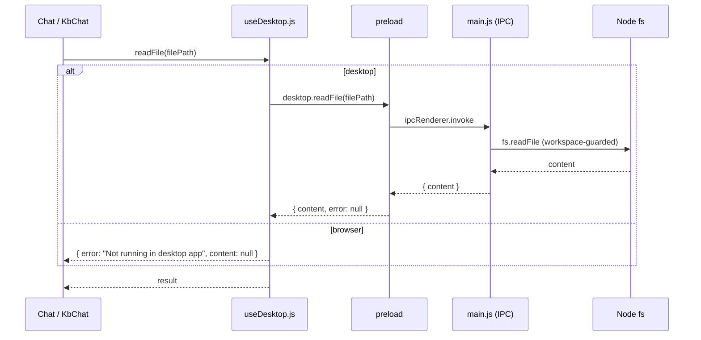
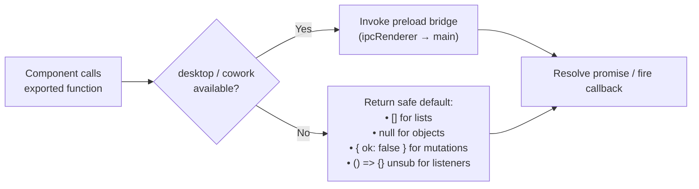
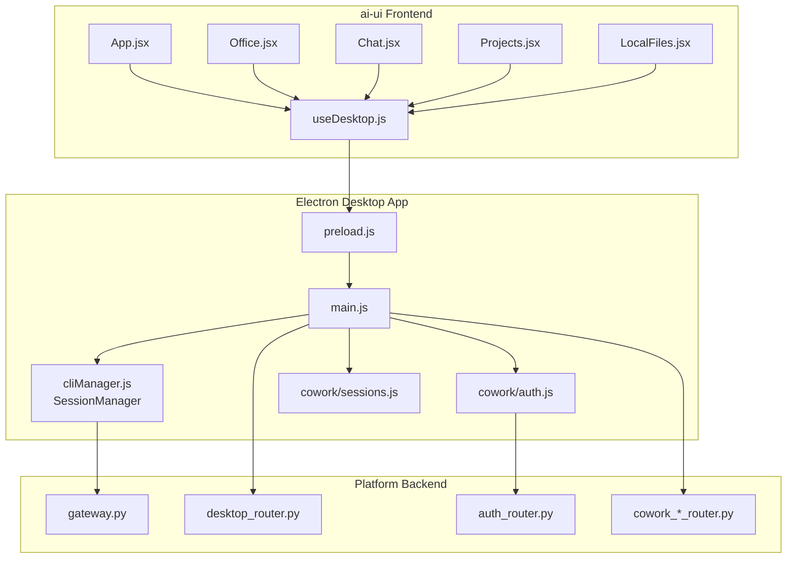

# ai_ui_frontend_hooks_desktop

> **File:** `ai-ui/src/hooks/useDesktop.js`

## 1. Introduction

The `useDesktop` module is the **renderer-side bridge** between the ai-ui React
frontend and the AiNxt Electron desktop application. It detects whether the web
app is running inside the Electron shell (via the `window.ainxtDesktop` preload
injection) and exposes a unified set of helper functions that:

- **Gracefully degrade** to browser-native APIs (or safe no-ops) when the app is
  opened in a regular browser tab, so callers never need their own `isDesktop`
  guards.
- **Proxy** privileged operations — native file dialogs, filesystem reads/writes,
  clipboard, OS notifications, workspace watching, local MCP server, and the
  local Cowork CLI — through the preload bridge to the Electron main process.
- **Manage Cowork sessions** (both the lightweight local-agent mode and the
  full "Office" agent mode), including auth-token adoption, session lifecycle,
  streaming event subscriptions, and a desktop-managed conversation history
  store.

This module is the single integration point that every ai-ui component uses to
reach desktop-only capabilities. It is consumed broadly by feature components
such as `Chat`, `KbChat`, `Office`, `CoworkDesktop`, `Projects`, `LocalFiles`,
`Code`, and the top-level `App`.

---

## 2. Architecture Overview



### 2.1 Desktop detection

At module load time the bridge object is resolved once:

```js
const desktop = typeof window !== "undefined" && window.ainxtDesktop?.isDesktop
  ? window.ainxtDesktop
  : null;
export const isDesktop = !!desktop;
```

Every exported helper checks `desktop` (or a sub-object such as `cowork` /
`coworkOffice`) and returns a safe default when running in a browser. This
**null-object pattern** means feature components can call, e.g.,
`coworkListSessions(cwd)` unconditionally — in the browser it simply resolves to
`[]`.

### 2.2 Capability phases

The helpers are organised into numbered "phases" that mirror the rollout of
desktop features:

| Phase | Capability | Representative exports |
|-------|------------|------------------------|
| — | Detection & notifications | `isDesktop`, `desktopNotify`, `openExternal`, `getApiBase` |
| 1 | File access | `pickFolder`, `pickFile`, `readFile`, `readFileBinary`, `readFileSpreadsheet`, `listFolder` |
| — | Lite IDE filesystem mutations | `writeFile`, `createPath`, `deletePath`, `renamePath` |
| 2 | Workspace watcher | `watchFolder`, `unwatchFolder`, `getWatchedFolders`, `onWorkspaceChange` |
| 3 | Clipboard | `getClipboard`, `onClipboardChange` |
| 4 | Shortcut context | `getShortcutContext`, `onShortcutContext` |
| 5 | Local MCP | `getMcpPort`, `registerMcpWithBackend`, `onMcpServerReady` |
| — | Token sync | `syncTokenToDesktop` |
| — | Cowork (local-agent) | `coworkListSessions`, `coworkRun`, `coworkOnEvent`, … |
| — | Cowork Office (full agent) | `coworkOfficeCreateSession`, `coworkOfficeRun`, … |
| — | Desktop-managed history | `coworkHistListProjects`, `coworkHistSave`, … |

---

## 3. Component Reference

### 3.1 Notifications, links & API base

| Export | Desktop behaviour | Browser fallback |
|--------|-------------------|------------------|
| `desktopNotify(title, body)` | `desktop.notify(title, body)` — OS native notification | `new Notification(title, { body })` if permission granted |
| `openExternal(url)` | `desktop.openExternal(url)` — opens in system default browser | `window.open(url, "_blank", "noopener,noreferrer")` |
| `getApiBase()` | `desktop.getApiBase()` — returns the configured gateway URL | `null` |

`desktopNotify` is used by trigger-notification toasts and the inbox badge to
surface alerts even when the window is minimised to the tray.

### 3.2 File access (Phase 1)

These functions open native OS dialogs and read files through the main process,
which enforces that all paths stay inside an open workspace (see
[desktop_app](#9-related-modules)).

| Export | Returns | Notes |
|--------|---------|-------|
| `pickFolder()` | `string \| null` | Native folder picker |
| `pickFile()` | `string[]` | Native multi-file picker |
| `readFile(filePath)` | `{ content, error }` | UTF-8 text read |
| `readFileBinary(filePath)` | `{ base64, error }` | Binary read as base64 |
| `readFileSpreadsheet(filePath)` | `{ text, sheets, tables, warnings, error }` | SheetJS parse; output format matches server-side `parse_excel()` so desktop and web Chat produce identical content |
| `listFolder(dir, opts)` | `Entry[]` | Recursive listing with opts |

### 3.3 Lite IDE filesystem mutations

Guarded mutations that only succeed for paths inside the currently open
workspace. Each returns `{ ok, error }`.

| Export | Purpose |
|--------|---------|
| `writeFile(filePath, content)` | Create/overwrite a file |
| `createPath(p, isDir)` | Create a file or directory |
| `deletePath(p)` | Delete a file or directory |
| `renamePath(oldP, newP)` | Rename/move within workspace |

### 3.4 Workspace watcher (Phase 2)

| Export | Purpose |
|--------|---------|
| `watchFolder(dir)` | Begin watching a directory for changes |
| `unwatchFolder(dir)` | Stop watching |
| `getWatchedFolders()` | List currently watched directories |
| `onWorkspaceChange(cb)` / `offWorkspaceChange(cb)` | Subscribe/unsubscribe to file-change events |

Used by `LocalFiles` and the Code editor to live-refresh the file tree.

### 3.5 Clipboard (Phase 3)

| Export | Desktop | Browser |
|--------|---------|---------|
| `getClipboard()` | `desktop.getClipboard()` | `navigator.clipboard.readText()` |
| `onClipboardChange(cb)` / `offClipboardChange(cb)` | Main-process clipboard monitor | No-op |

### 3.6 Shortcut context (Phase 4)

| Export | Purpose |
|--------|---------|
| `getShortcutContext()` | Returns `{ clipboard, activeApp }` for global shortcut triggers |
| `onShortcutContext(cb)` / `offShortcutContext(cb)` | Subscribe to context updates |

### 3.7 Local MCP (Phase 5)

| Export | Purpose |
|--------|---------|
| `getMcpPort()` | Port of the desktop's local MCP server |
| `registerMcpWithBackend()` | Registers the local MCP server with the platform backend (see [desktop_router](#9-related-modules)) |
| `onMcpServerReady(cb)` | Callback when the MCP server starts |

### 3.8 Token sync

```js
export function syncTokenToDesktop(token) {
  if (desktop) desktop.saveToken(token);
}
```

Called after a successful web login to hand the JWT to the desktop so the local
Cowork CLI can authenticate without a second sign-in.

### 3.9 Cowork — local-agent mode

The `cowork` sub-object (`desktop.cowork`) drives the local `ainxt` CLI
subprocess via the [SessionManager](#9-related-modules) in the main process.

| Export | Purpose |
|--------|---------|
| `isCoworkAvailable` | Boolean — whether `cowork` bridge exists |
| `coworkAuthState()` | `{ authenticated, gatewayUrl, error }` |
| `coworkLogin()` / `coworkOnLoginOutput(cb)` | Interactive SSO login + output stream |
| `coworkListSessions(cwd)` | List CLI sessions for a working directory |
| `coworkSessionHistory(id)` | Retrieve turn history for a session |
| `coworkCreateSession(cwd, resumeId)` | Create (or resume) a CLI session |
| `coworkRun(id, task, model, agent)` | Send a task to the CLI |
| `coworkRespondConfirm(id, confirmId, answer)` | Answer a confirmation prompt |
| `coworkInterrupt(id)` | Interrupt a running task |
| `coworkClone(args)` | Clone a Git repo locally |
| `coworkSetModel(id, model)` | Switch the model mid-session |
| `coworkSetPermissionMode(id, mode)` | Set permission mode (e.g. `auto-edit`) |
| `coworkContextUsage(id)` | Token/context usage for a session |
| `coworkCloseSession(id)` | Dispose a session |
| `coworkOnEvent(cb)` | Subscribe to streaming events (tokens, tool calls, diffs) |
| `coworkAdoptToken(token, isApiKey)` | Adopt a web-session credential (API key preferred for durability) |
| `coworkHasValidKey()` | Check if desktop already holds a working long-lived API key |
| `coworkOnAuthUpdated(cb)` | Listen for silent-relogin success from `silentRelogin()` |

**Auth flow:** The renderer mints an API key via `POST /profile/api-keys` and
calls `coworkAdoptToken(token, true)`. The desktop stores it encrypted via
Electron `safeStorage` for durable silent re-login. On app launch,
`silentRelogin()` in `main.js` exchanges a stored Entra refresh token for a
fresh API key and pushes the result through `coworkOnAuthUpdated`.

### 3.10 Cowork Office — full agent mode

The `coworkOffice` sub-object (`desktop.coworkOffice`) drives the full Cowork
agent (not just the lightweight CLI). It mirrors the local-agent API with
additional parameters for role and project:

| Export | Purpose |
|--------|---------|
| `isCoworkOfficeAvailable` | Boolean |
| `coworkOfficeAuthState()` | Auth state |
| `coworkOfficeAdoptToken(token, isApiKey)` | Adopt web credential |
| `coworkOfficeHasValidKey()` | Check for stored API key |
| `coworkOfficeClearKey()` | Wipe stored key (called on logout) |
| `coworkOfficeLogin()` / `coworkOfficeCancelLogin()` | Interactive login |
| `coworkOfficeOnFlushBeforeQuit(cb)` / `coworkOfficeFlushDone()` | Graceful shutdown handshake |
| `coworkOfficeOnLoginOutput(cb)` | Login output stream |
| `coworkOfficeCreateSession(cwd, role, project, resumeId)` | Create a session with role + project context |
| `coworkOfficeRun(id, task)` | Run a task |
| `coworkOfficeRespondConfirm(id, confirmId, answer)` | Confirm prompt |
| `coworkOfficeInterrupt(id)` | Interrupt |
| `coworkOfficeCloseSession(id)` | Close session |
| `coworkOfficeSetModel(id, model)` | Switch model |
| `coworkOfficeSetPermissionMode(id, mode)` | Set permission mode |
| `coworkOfficeOnEvent(cb)` | Streaming events |
| `coworkOfficeOnAuthUpdated(cb)` | Silent-relogin callback |

> **Keep-alive note:** The `Office` component is rendered once outside
> `<Routes>` in `App.jsx` and toggled with CSS (`hidden`) rather than
> unmounted on tab switch. This preserves the `coworkOfficeOnEvent` listener
> so mid-answer tab switches don't drop streamed tokens.

### 3.11 Desktop-managed history

A local persistence layer (`cowork.history`) that stores Cowork conversations
on disk, organised by project. This is independent of the server-side chat
history and enables offline browsing of past Cowork sessions.

| Export | Purpose |
|--------|---------|
| `coworkHistListProjects()` | List all projects that have saved conversations |
| `coworkHistListConversations(projectPath)` | List conversations within a project |
| `coworkHistGet(projectPath, convId)` | Retrieve a single conversation |
| `coworkHistSave(projectPath, conv)` | Persist/update a conversation |
| `coworkHistTouch(projectPath)` | Update a project's last-accessed timestamp |
| `coworkHistDelete(projectPath, convId)` | Delete a conversation |

---

## 4. Data Flow

### 4.1 Cowork task execution flow



### 4.2 Token adoption & silent re-login



### 4.3 File read flow (Phase 1)



---

## 5. Graceful Degradation Strategy

A central design principle is that **every export is safe to call in a browser**.
The pattern is consistent across the module:



This means feature components like `Office`, `CoworkDesktop`, `Projects`, and
`LocalFiles` can be rendered in both the desktop app and the web portal without
conditional imports or feature-flag branching at the call site.

---

## 6. Integration with the Overall System



### Where it fits

- **`App.jsx`** calls `syncTokenToDesktop` after login and
  `coworkOfficeClearKey` on logout; it also keeps the `Office` component
  mounted (CSS-toggled) to preserve the `coworkOfficeOnEvent` listener.
- **`Office.jsx`** uses the full Cowork Office API set for session management,
  streaming, and auth.
- **`Chat.jsx` / `KbChat.jsx`** use `readFile`, `readFileSpreadsheet`, and
  `pickFile` for attachment handling, falling back to browser file inputs on
  web.
- **`Projects.jsx`** uses `coworkHist*` functions to persist and browse
  Cowork conversation history locally.
- **`LocalFiles.jsx`** uses `listFolder`, `watchFolder`, `onWorkspaceChange`,
  and the Lite IDE mutation functions.

---

## 7. Event Subscription Pattern

All `on*` event subscriptions return an **unsubscribe function** (or a no-op
function in browser mode), following the `useEffect` cleanup convention:

```js
useEffect(() => {
  const unsub = coworkOnEvent(handleEvent);
  return unsub; // cleanup on unmount
}, []);
```

| Subscription | Fires when |
|--------------|------------|
| `onWorkspaceChange(cb)` | A watched file/folder changes |
| `onClipboardChange(cb)` | OS clipboard content changes |
| `onShortcutContext(cb)` | Shortcut context updates |
| `onMcpServerReady(cb)` | Local MCP server starts |
| `coworkOnEvent(cb)` | CLI streams a token/tool-call/diff event |
| `coworkOnLoginOutput(cb)` | Login process emits output |
| `coworkOnAuthUpdated(cb)` | Silent re-login succeeds |
| `coworkOfficeOnEvent(cb)` | Office agent streams an event |
| `coworkOfficeOnLoginOutput(cb)` | Office login output |
| `coworkOfficeOnAuthUpdated(cb)` | Office silent re-login |
| `coworkOfficeOnFlushBeforeQuit(cb)` | Main process requests flush before quit |

---

## 8. Security Considerations

1. **Workspace-guarded filesystem access** — All `readFile`, `writeFile`,
   `createPath`, `deletePath`, and `renamePath` calls are validated in the main
   process to ensure paths resolve inside an open workspace. The renderer cannot
   escape this boundary.

2. **Encrypted credential storage** — API keys adopted via
   `coworkAdoptToken` / `coworkOfficeAdoptToken` are stored using Electron
   `safeStorage` (OS keychain), not plaintext. JWTs are kept only as a fallback.

3. **Token priority** — `resolveValidToken` in `cowork/auth.js` prioritises:
   long-lived API key → CLI config token → renderer JWT. The first that
   validates against `/auth/me` wins.

4. **Logout hygiene** — `handleLogout` in `App.jsx` calls
   `coworkOfficeClearKey()` to wipe the OS-persisted key, preventing session
   inheritance on shared machines.

5. **Silent re-login resilience** — `silentRelogin()` only drops the stored
   refresh token when Entra explicitly rejects it (`401 invalid_grant`).
   Transient failures (5xx, network) preserve the credential to avoid
   forcing interactive re-login during outages.

---

## 9. Related Modules

| Module | Relationship |
|--------|-------------|
| [ai_ui_frontend_app_core](ai_ui_frontend_app_core.md) | `App.jsx` consumes `syncTokenToDesktop`, `coworkOfficeClearKey`, and keeps `Office` mounted. |
| ai_ui_frontend_hooks_file_drop | Sibling hook (`useFileDrop.js`) for drag-and-drop; complements desktop file pickers. |
| [desktop_app](../cowork/desktop_app.md) | Electron main process (`main.js`, `preload.js`, `cowork/*`) that this module bridges to. |
| [gateway](../core/gateway.md) | Backend gateway that the Cowork CLI and auth validation call. |
| [shared_api_routers](../core/shared_api_routers.md) | `desktop_router` (MCP registration, file indexing), `auth_router` (SSO exchange/refresh), `cowork_*_router` (Cowork sessions, tasks, MCP, usage). |
| [cowork_desktop](../cowork/cowork_desktop.md) | `CoworkDesktop.jsx` component that renders Cowork local-agent UI using this hook. |
| [office](../documents/office.md) | `Office.jsx` component that renders the full Cowork Office agent UI using this hook. |
| [local_files](../documents/local_files.md) | `LocalFiles.jsx` component for workspace file browsing using `listFolder`, `watchFolder`, and Lite IDE mutations. |
| [config](../core/config.md) | `config.js` provides `authFetch` / `apiFetch` used alongside desktop helpers for API calls. |
