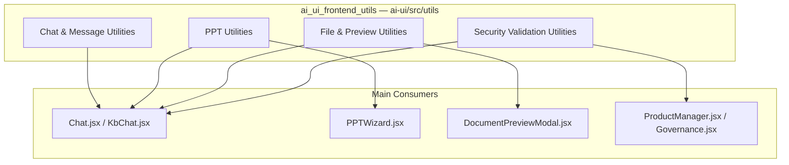
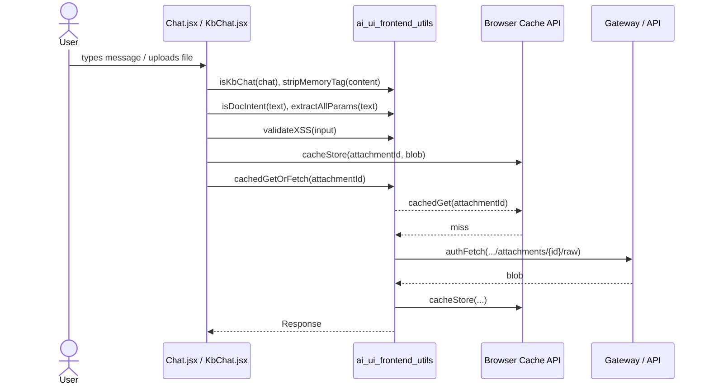

# ai_ui_frontend_utils

The `ai_ui_frontend_utils` module is a collection of small, pure, framework-agnostic JavaScript/TypeScript utilities used by the `ai-ui` React frontend. These helpers live under `ai-ui/src/utils/` and are intentionally stateless: they perform focused tasks such as classifying chat types, cleaning message content, detecting presentation-generation intent, parsing PPT parameters, caching file previews in the browser, validating user input for XSS, and parsing XLSX files without external dependencies.

Because the utilities are pure functions, they are easy to unit test and are reused across multiple UI surfaces (regular chat, KB chat, PPT wizard, document preview, product forms, etc.). They do not depend on React or application state, which keeps them portable and simple to reason about.

## Architecture Overview

The module is organized into four logical groups:

| Sub-module | Files | Responsibility |
|------------|-------|----------------|
| [ai_ui_frontend_utils_chat_message](ai_ui_frontend_utils_chat_message.md) | `kbChat.js`, `messageContent.js` | Distinguish KB chats from regular chats and clean assistant/user message content. |
| [ai_ui_frontend_utils_ppt](ai_ui_frontend_utils_ppt.md) | `pptIntentDetector.js`, `pptParamParser.js` | Detect when a user wants to generate a presentation and extract parameters such as slide count, theme, tone, and language. |
| [ai_ui_frontend_utils_file_preview](ai_ui_frontend_utils_file_preview.md) | `previewCache.js`, `xlsxParser.js` | Cache uploaded file previews locally and parse `.xlsx` files in the browser. |
| ai_ui_frontend_utils_security | `securityValidation.js` | Validate form input and guard against XSS, dangerous identifiers, and malformed URLs. |

## Module Boundaries

- **No React or state**: All utilities are pure functions or async I/O wrappers. They do not manage component state.
- **Browser-only where noted**: `previewCache.js` uses the Cache API; `xlsxParser.js` uses browser-native `DOMParser` and `TextDecoder`.
- **Shared across surfaces**: The same message-cleaning helpers are used by both `Chat.jsx` and `KbChat.jsx`; the same PPT helpers are used by `Chat.jsx` and `PPTWizard.jsx`.
- **Complement to config/hooks**: For authentication-aware HTTP calls the utilities import `authFetch` from `config.js` only at fallback time (`previewCache.js`); for desktop integration see [ai_ui_frontend_hooks](ai_ui_frontend_hooks.md).

## Data Flow

## Related Modules

- [ai_ui_frontend_app_core](ai_ui_frontend_app_core.md) — top-level routing, auth, and navigation shell.
- [chat](../chat/chat.md) and [kb_chat](../knowledge/kb_chat.md) — primary consumers of chat/message utilities.
- [ppt_wizard](../presentation/ppt_wizard.md) and [presenton_lib](../presentation/presenton_lib.md) — consumers and backend integration for PPT generation.
- [ai_ui_frontend_hooks](ai_ui_frontend_hooks.md) — desktop/cowork hooks that complement these utilities.
- [documents](../documents/documents.md) and [document_preview](../documents/document_preview.md) — consumers of preview/cache and XLSX parsing utilities.
