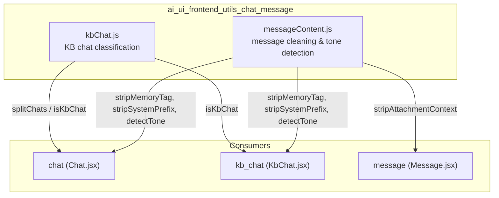
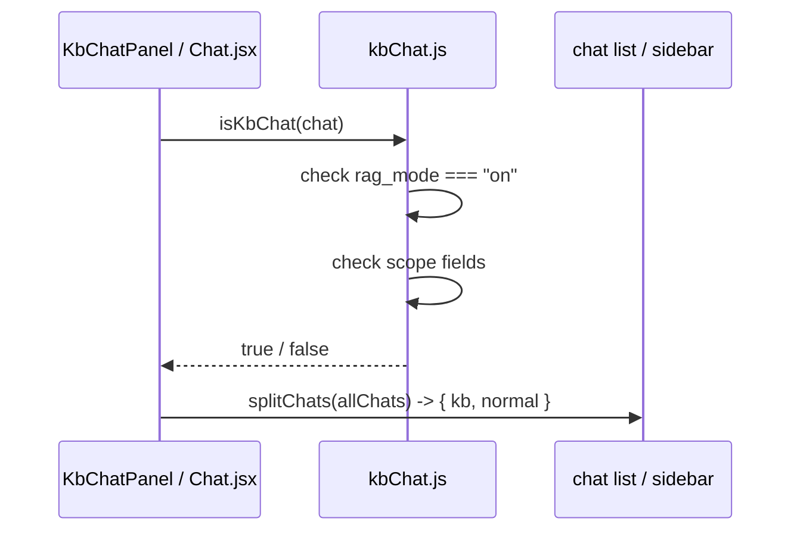
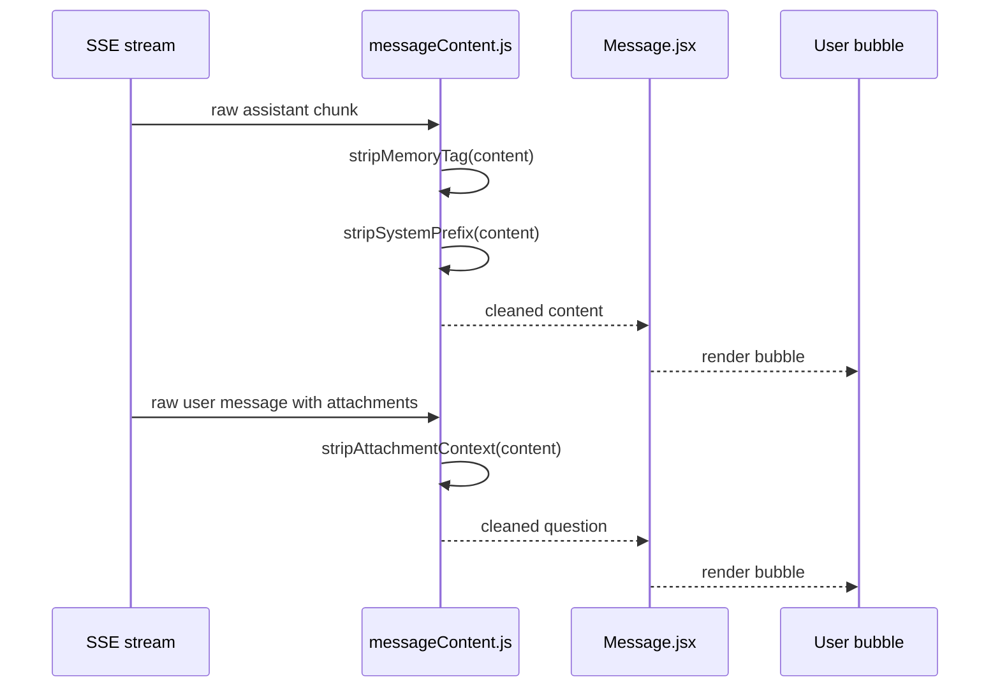
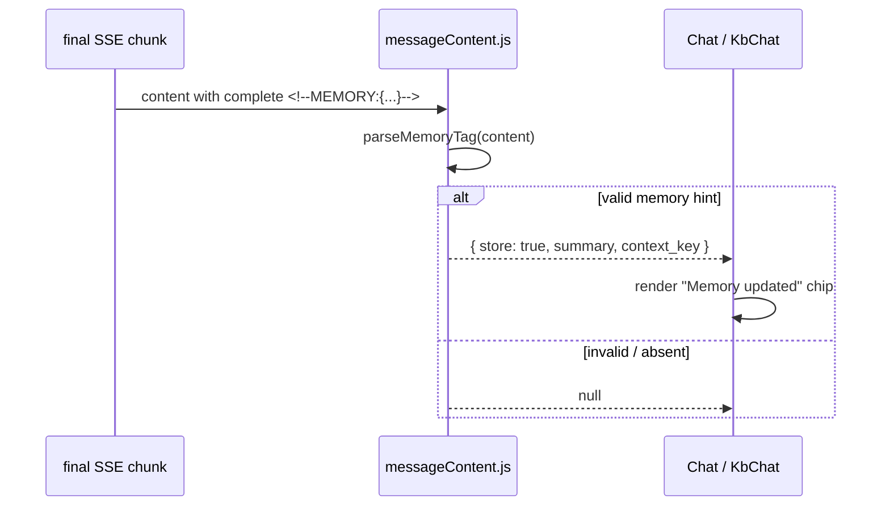
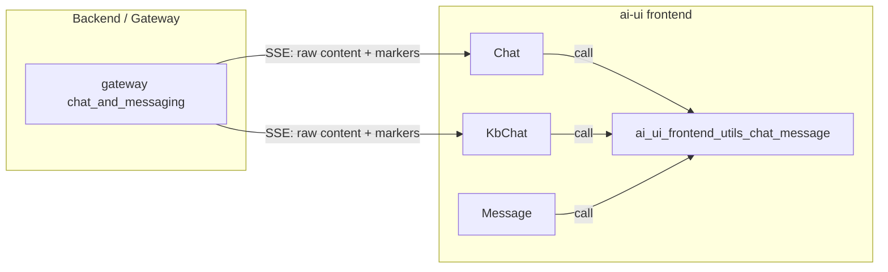
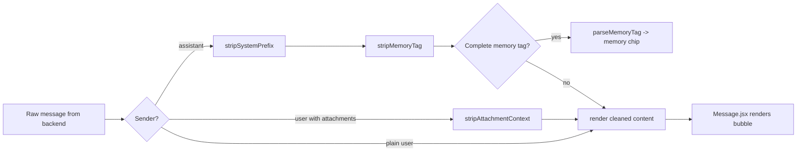

# ai_ui_frontend_utils_chat_message

## Brief Introduction

The `ai_ui_frontend_utils_chat_message` module is a small, pure-utility layer inside the `ai-ui` React frontend. It owns the shared logic for **classifying** chat sessions and **cleaning/normalizing** assistant and user message content before it is rendered.

The module is intentionally framework-agnostic: every export is a pure JavaScript function with no React, state, or side effects. It is consumed by the main chat surface ([chat](../chat/chat.md)), the knowledge-base-embedded chat ([kb_chat](../knowledge/kb_chat.md)), and the message renderer ([message](../chat/message.md)).

---

## Core Responsibilities

| Responsibility | File | Key Exports |
|---|---|---|
| Decide whether a chat is a "Knowledge Base chat" | `kbChat.js` | `isKbChat`, `splitChats` |
| Strip backend-emitted markers from assistant content | `messageContent.js` | `stripMemoryTag`, `parseMemoryTag`, `stripSystemPrefix` |
| Recover the user's real question from persisted attachment turns | `messageContent.js` | `stripAttachmentContext` |
| Detect casual/informal tone in user prompts | `messageContent.js` | `detectTone` |

---

## Architecture



### Design Principles

1. **Pure functions only** — no hooks, no state, no DOM access. This makes the utilities trivial to unit test and safe to import anywhere in the frontend.
2. **Single source of truth** — `kbChat.js` is the only place that defines what counts as a KB chat, and `messageContent.js` is the only place that knows how to strip the backend markers.
3. **Defensive streaming handling** — marker-stripping helpers are written to cope with partial Server-Sent Events (SSE) chunks, not just fully-formed messages.

---

## Component Reference

### `kbChat.js`

#### `isKbChat(chat)`

Returns `true` only when **all** of the following hold:

* `chat` is truthy.
* `chat.rag_mode === "on"`.
* At least one scope field is set: `product_id`, `domain`, `spec_version`, or `kb_doc_id`.

The dual check is deliberate:

* `rag_mode` alone could be a legacy value from an older Generic | Knowledge Base toggle.
* Scope fields alone could be the result of a manual DB edit or partial hydration.

A KB chat is therefore defined unambiguously as a **scope-driven, retrieval-on** chat.

#### `splitChats(chats)`

Convenience splitter. Iterates an array of chat objects and returns `{ kb: [...], normal: [...] }` based on `isKbChat`.

### `messageContent.js`

#### `stripMemoryTag(content)`

Removes the `<!--MEMORY:{...}-->` footer that the backend appends to assistant content when emitting a memory hint. Handles three streaming states:

1. Complete tag: `...answer text\n<!--MEMORY:{...}-->`
2. Partial tag mid-stream: `...answer text\n<!--MEMORY:{"store`
3. Very early partial: `...answer text\n<!--MEM`

Anchors on `<!--MEM` because that prefix never appears in legitimate content.

#### `parseMemoryTag(content)`

Parses a **complete** `<!--MEMORY:{...}-->` footer into a structured object:

```js
{ store: true, summary: "prefers dark mode", context_key: "ui_theme" }
```

Returns `null` when:

* There is no complete tag.
* `store` is not `true`.
* `summary` is empty.

Used to render an inline "Memory updated" chip in the UI.

#### `stripSystemPrefix(content)`

Removes `[STYLE INSTRUCTION:…]` or `[CONTEXT:…]` preambles that the backend prepends to assistant content for internal routing. These are never shown to the user.

#### `stripAttachmentContext(content)`

Recovers the user's actual question from a persisted user message that had attachments. The backend injects attachment context in two shapes:

1. Document form (`/ask`): `[File: a.pdf]\n<parsed text…>\n\nUser question: <q>`
2. Optimistic marker form: `<q>\n\n📎 file1, file2` or `<q>\n\n🖼 N images`

Returns only the trimmed question so that reloading a document turn does not dump the parsed PDF text into the chat bubble.

#### `detectTone(text)`

Classifies a user-typed prompt as `"casual"` if it contains any informal address term (e.g., `buddy`, `macha`, `bro`, `yaar`, `bhai`, `dude`). Returns `null` otherwise. The pattern is kept in sync with any backend-side tone recognition.

---

## Data Flow

### KB Chat Classification Flow



### Message Cleaning Flow



### Memory Hint Extraction Flow



---

## Dependencies

This module has **no runtime dependencies** and no imports of other application modules. It only uses built-in JavaScript APIs (`String.prototype.replace`, `String.prototype.match`, `JSON.parse`, etc.).

### Reverse Dependencies (who uses this module)

| Consumer | Uses | Purpose |
|---|---|---|
| [chat](../chat/chat.md) (`Chat.jsx`) | `splitChats`, `stripMemoryTag`, `stripSystemPrefix`, `detectTone` | Render the main chat list and clean assistant/user content. |
| [kb_chat](../knowledge/kb_chat.md) (`KbChat.jsx`) | `isKbChat`, `stripMemoryTag`, `stripSystemPrefix`, `detectTone` | Render the KB-embedded chat and clean its content. |
| [message](../chat/message.md) (`Message.jsx`) | `stripAttachmentContext` | Recover the real user question when rendering persisted attachment turns. |

---

## How It Fits Into the System



The module sits at the **presentation boundary** between the backend's raw message format and the user's screen. The backend is free to inject routing signals, memory hints, and attachment context into messages for its own purposes; this utility layer guarantees that those implementation details never leak into the rendered UI.

---

## Process Flow: Rendering a Chat Message



---

## Notes for Maintainers

* If the backend changes the shape of the `<!--MEMORY:...-->` tag, update both `stripMemoryTag` and `parseMemoryTag` together.
* If new scope fields are added to KB chats, update `isKbChat` so the classification remains consistent.
* The `CASUAL_PATTERNS` regex should be kept in sync with any backend tone classifier.
* Because these helpers are pure, they are safe to call inside `useMemo` or during render without causing extra re-renders.
