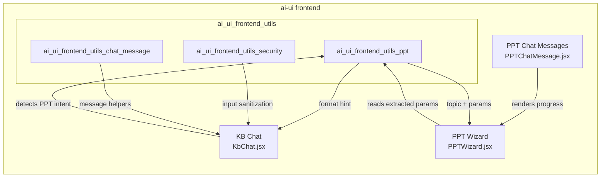
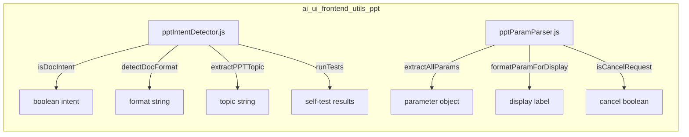
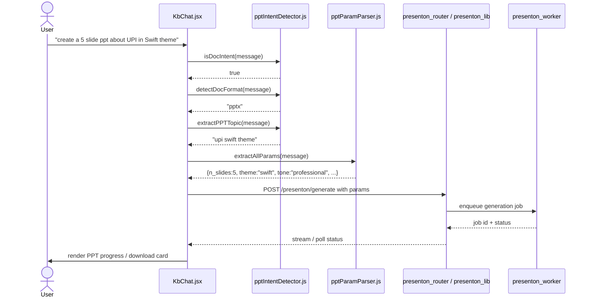
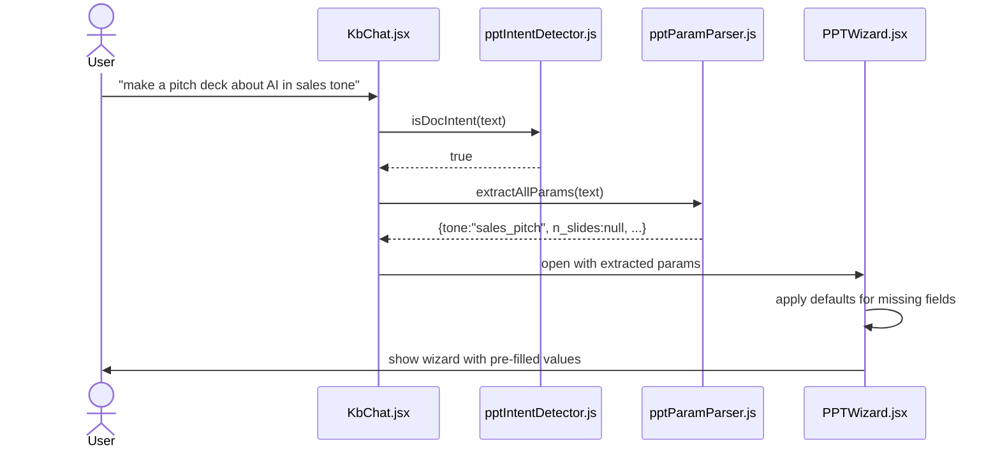
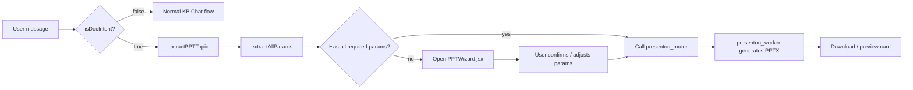
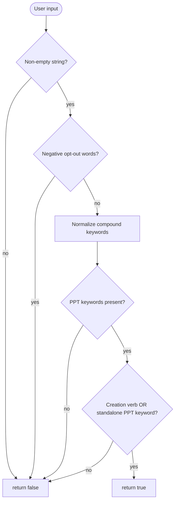
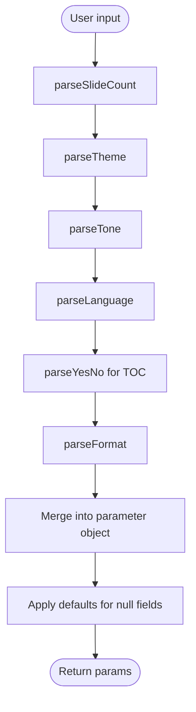

# ai_ui_frontend_utils_ppt

## Brief Introduction

The `ai_ui_frontend_utils_ppt` module is a small, deterministic utility layer inside the `ai-ui` React frontend. It is responsible for recognizing when a user wants to generate a PowerPoint / slide deck, extracting the topic and generation parameters from free-form chat text, and routing the request toward the PPT generation flow. The module contains two files:

- `ai-ui/src/utils/pptIntentDetector.js` – detects PPT intent, identifies the requested document format, and extracts the presentation topic.
- `ai-ui/src/utils/pptParamParser.js` – parses concrete generation parameters such as slide count, theme, tone, language, table-of-contents preference, and export format.

These utilities are intentionally lightweight and regex-based so that intent classification and parameter extraction can happen synchronously on the client without calling an LLM. They feed the [PPT Wizard](../reference/ppt_wizard.md) and [PPT Chat](../chat/ppt_chat.md) experiences and are consumed by the broader [KB Chat](../knowledge/kb_chat.md) flow.

---

## Module Purpose and Core Functionality

### 1. Intent Detection (`pptIntentDetector.js`)

`isDocIntent(text)` decides whether a user message should be treated as a request to create a presentation. It returns `true` when:

1. The input is a non-empty string.
2. The text does **not** contain negative opt-out words such as "don't", "no", "never", "delete", etc.
3. The text contains PPT-related keywords (e.g. `ppt`, `pptx`, `powerpoint`, `slide deck`, `slideshow`, `pitchdeck`, `keynote`, `preso`).
4. The text either contains a creation/intent verb ("create", "make", "generate", "build", etc.) **or** a standalone PPT keyword that is strong enough on its own.

The implementation normalizes compound forms with spaces, hyphens, and underscores (`power point` → `powerpoint`, `slide-deck` → `slidedeck`) and also handles character patterns such as `p.p.t` and `p-p-t`.

`detectDocFormat(text)` returns the requested document format string (`pptx`, `xlsx`, `docx`, `pdf`, `md`, `txt`) or `null`. PPT indicators are checked first so that PPT intent always wins over other formats.

`extractPPTTopic(text)` strips action phrases, articles, and PPT keywords from the message and returns the remaining subject. For example, *"can you create a ppt about quarterly results"* becomes *"quarterly results"*.

`runTests()` is a development helper that runs an exhaustive set of positive, negative, and edge-case assertions against `isDocIntent` and logs the results to the console.

### 2. Parameter Parsing (`pptParamParser.js`)

`extractAllParams(text)` returns a structured object with the following fields:

| Field | Parser | Default | Valid values |
|-------|--------|---------|--------------|
| `n_slides` | `parseSlideCount` | `8` | `1`–`8` (digits or English words "one"–"eight") |
| `theme` | `parseTheme` | `"general"` | `general`, `swift`, `modern`, `standard` |
| `tone` | `parseTone` | `"professional"` | `professional`, `educational`, `casual`, `sales_pitch`, `funny` |
| `language` | `parseLanguage` | `"English"` | `English`, `Hindi`, `Tamil`, `Telugu`, `Kannada`, `Malayalam`, `Bengali`, `Gujarati` |
| `include_table_of_contents` | `parseYesNo` | `false` | boolean |
| `export_as` | `parseFormat` | `"pptx"` | `pptx`, `pdf` |

Additional helpers include:

- `parseYesNo(text)` – maps affirmative/negative words to `true`/`false`.
- `parseFormat(text)` – resolves the export format, defaulting to `pptx`.
- `isCancelRequest(text)` – detects cancellation phrases such as "cancel", "stop", "nevermind".
- `getDefaultParam(paramKey)` – returns the default value for any parameter key.
- `formatParamForDisplay(paramKey, value)` – converts raw parameter values into human-readable labels for the UI.

---

## Architecture and Component Relationships

### High-level placement

### Internal module structure

---

## Dependencies

### Within `ai-ui`

| Consumer | File | What it uses |
|----------|------|--------------|
| KB Chat | `ai-ui/src/components/KbChat.jsx` | `isNonPPTDocIntent` / `detectNonPPTDocFormat` logic that mirrors or imports the detector utilities |
| PPT Wizard | `ai-ui/src/components/PPTWizard.jsx` | Extracted `n_slides`, `theme`, `tone`, `language`, `export_as` to pre-fill the wizard |
| PPT Chat | `ai-ui/src/components/PPTChatMessage.jsx` | Renders generation progress/completion based on detected intent |

### Related backend modules

| Module | Role |
|--------|------|
| [presenton_router](../api/presenton_router.md) | Receives `GenerateRequest` / `OutlineRequest` and orchestrates outline generation and presentation download |
| [presenton_lib](../reference/presenton_lib.md) | Client-side library that streams outlines, polls status, and builds slide payloads |
| [workers/presenton_worker](../workers/workers.md) | Background worker that executes the actual PPT generation job |

### No external runtime dependencies

Both files are pure JavaScript and rely only on built-in `String` and `RegExp` APIs. They do not import React, HTTP clients, or LLM services, which keeps them fast and testable in isolation.

---

## Data Flow

### Detecting PPT intent from a chat message

### Pre-filling the PPT Wizard

---

## Component Interaction

### Intent detector ↔ Parameter parser

The two utilities are usually used together but are independent:

- `pptIntentDetector.js` answers **whether** the user wants a presentation and **what** the topic/format is.
- `pptParamParser.js` answers **how** the presentation should be generated.

A typical call site first checks `isDocIntent`. If true, it calls `extractAllParams` and `extractPPTTopic` in parallel. The topic is used as the presentation title/outline prompt, while the parameter object is passed to the generation API.

### Interaction with the broader PPT generation stack

---

## Process Flows

### Intent detection algorithm

### Parameter extraction algorithm

---

## How It Fits into the Overall System

`ai_ui_frontend_utils_ppt` sits at the boundary between natural user input and structured PPT generation. It is part of the larger [ai_ui_frontend](ai_ui_frontend.md) application and relies on the following upstream/downstream modules:

- **Upstream:** [ai_ui_frontend_utils_chat_message](../chat/ai_ui_frontend_utils_chat_message.md) provides message formatting helpers used by `KbChat.jsx` after intent detection.
- **Upstream:** [ai_ui_frontend_utils_security](../ai_ui_frontend_utils_security.md) sanitizes user input before it reaches the PPT utilities.
- **Downstream:** [ppt_wizard](../reference/ppt_wizard.md) consumes extracted parameters to render the step-by-step presentation builder.
- **Downstream:** [presenton_lib](../reference/presenton_lib.md) and [presenton_router](../api/presenton_router.md) perform the actual outline streaming, status polling, and file generation.
- **Downstream:** [workers/presenton_worker](../workers/workers.md) executes the generation job asynchronously.

By keeping intent detection and parameter parsing on the client, the module reduces unnecessary backend round-trips and enables a snappy UX where the PPT Wizard can be pre-filled immediately after the user sends a message.

---

## References

- [ai_ui_frontend](ai_ui_frontend.md) – parent frontend application
- [ai_ui_frontend_utils](ai_ui_frontend_utils.md) – parent utilities module
- [ai_ui_frontend_utils_chat_message](../chat/ai_ui_frontend_utils_chat_message.md) – message content helpers
- [ai_ui_frontend_utils_security](../ai_ui_frontend_utils_security.md) – input validation helpers
- [kb_chat](../knowledge/kb_chat.md) – primary consumer of PPT intent detection
- [ppt_wizard](../reference/ppt_wizard.md) – UI that consumes extracted parameters
- [ppt_chat](../chat/ppt_chat.md) – chat-based PPT generation UI
- [presenton_lib](../reference/presenton_lib.md) – client-side PPT generation library
- [presenton_router](../api/presenton_router.md) – backend API for PPT generation
- [workers](../workers/workers.md) – background worker ecosystem, including `presenton_worker`
