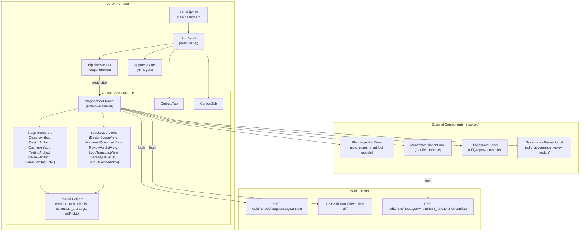
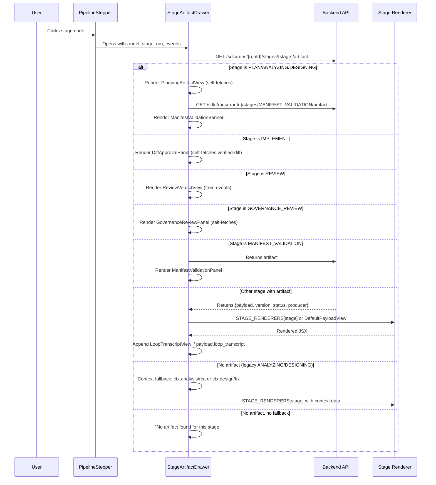
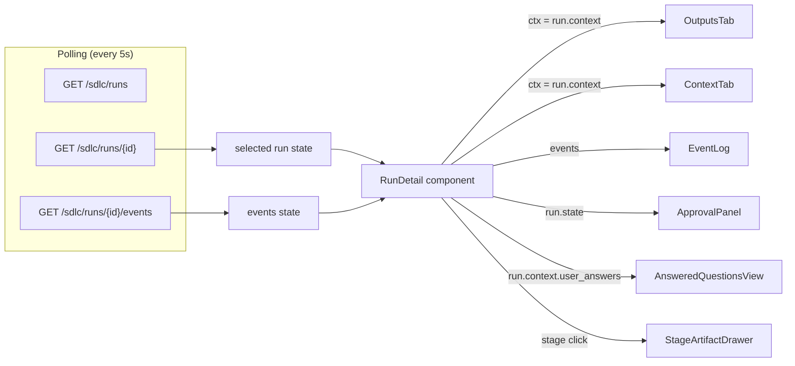
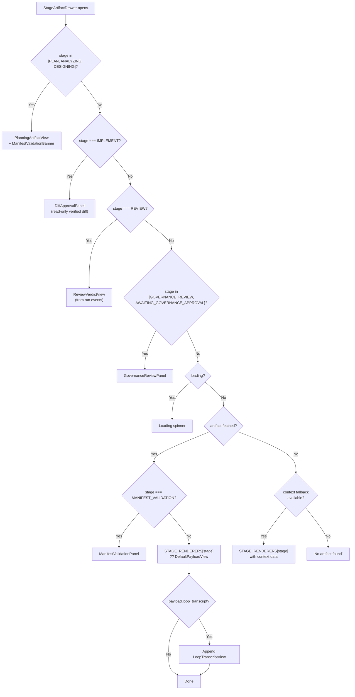
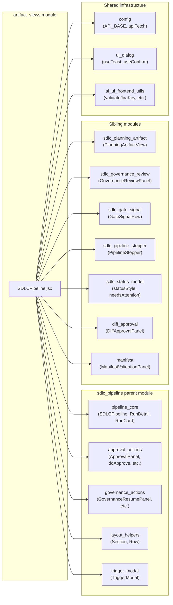
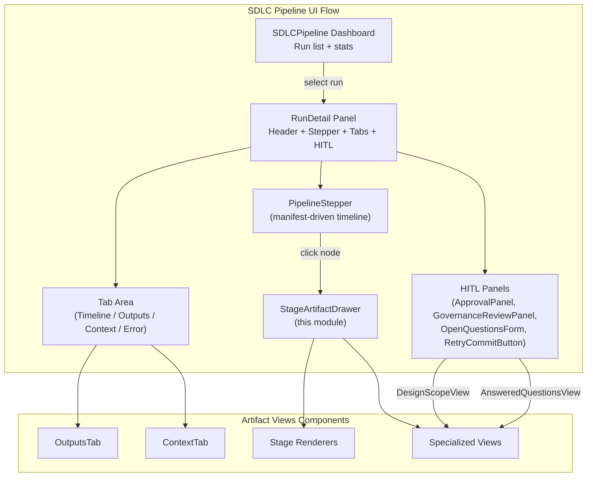

# Artifact Views Module

## Introduction

The **artifact_views** module is the presentation layer for SDLC pipeline stage artifacts in the AI-UI frontend. It resides within the `sdlc_pipeline` parent module and is responsible for rendering the structured outputs produced by each pipeline stage — from classification and planning through coding, testing, review, governance, and commit/MR creation.

All components in this module live in a single file (`ai-ui/src/components/SDLCPipeline.jsx`) and are consumed by two primary surfaces:

1. **`RunDetail`** — the run detail panel that renders tabbed content (Timeline, Outputs, Context, Error) and hosts the `StageArtifactDrawer` slide-over.
2. **`StageArtifactDrawer`** — a right-side slide-over drawer that fetches and renders the versioned artifact for a specific pipeline stage when a user clicks a stepper node.

The module bridges the backend-owned [pipeline stage manifest](#backend-contract) (the single source of truth for stage definitions, ordering, and aliases) with rich, stage-specific React renderers. It is designed so that **historical runs never blank** — legacy/removed stage keys always render via either a dedicated renderer or the `DefaultPayloadView` JSON fallback.

---

## Architecture Overview



### Component Hierarchy

```mermaid
graph TD
    RunDetail["RunDetail"] --> Tabs["Tab Content Area"]
    RunDetail --> StageArtifactDrawer["StageArtifactDrawer"]
    
    Tabs --> OutputsTab["OutputsTab"]
    Tabs --> ContextTab["ContextTab"]
    Tabs --> EventLog["EventLog<br/>(timeline tab)"]
    
    OutputsTab --> Section["Section"]
    OutputsTab --> Row["Row"]
    OutputsTab --> FileList["FileList"]
    OutputsTab --> BulletList["BulletList"]
    
    StageArtifactDrawer -->|stage routing| Routing{"Stage Type?"}
    
    Routing -->|PLAN / ANALYZING / DESIGNING| PlanningArtifactView["PlanningArtifactView<br/>(external)"]
    Routing -->|MANIFEST_VALIDATION| ManifestValidationPanel["ManifestValidationPanel<br/>(external)"]
    Routing -->|IMPLEMENT| DiffApprovalPanel["DiffApprovalPanel<br/>(external, read-only)"]
    Routing -->|REVIEW| ReviewVerdictView["ReviewVerdictView"]
    Routing -->|GOVERNANCE_REVIEW / AWAITING_GOVERNANCE_APPROVAL| GovernanceReviewPanel["GovernanceReviewPanel<br/>(external)"]
    Routing -->|CLASSIFYING| ClassifyArtifact["ClassifyArtifact"]
    Routing -->|CODING / FIXING / APPLYING| CodingArtifact["CodingArtifact"]
    Routing -->|TESTING / TEST_VERIFY| TestingArtifact["TestingArtifact"]
    Routing -->|REVIEWING / REVIEW_GATE| ReviewArtifact["ReviewArtifact"]
    Routing -->|CROSS_MODEL_REVIEW| CrossModelReviewArtifact["CrossModelReviewArtifact"]
    Routing -->|COMMITTING / MR_CREATION| CommitArtifact["CommitArtifact"]
    Routing -->|ANALYZING / DESIGNING<br/>(legacy fallback)| AnalyzeArtifact["AnalyzeArtifact"]
    Routing -->|DESIGNING<br/>(legacy fallback)| DesignArtifact["DesignArtifact"]
    Routing -->|unknown / fallback| DefaultPayloadView["DefaultPayloadView"]
    
    StageArtifactDrawer --> LoopTranscriptView["LoopTranscriptView<br/>(co-stored with any artifact)"]
```

---

## Core Components

### StageArtifactDrawer

The central orchestrator of the artifact_views module. It is a fixed-position right-side slide-over (`w-96`) that opens when a user clicks a stage node in the `PipelineStepper`. It fetches the versioned artifact for the clicked stage from `GET /sdlc/runs/{runId}/stages/{stage}/artifact` and routes it to the appropriate renderer.

**Key responsibilities:**
- Fetches the latest artifact for `(runId, stage)` on mount via `apiFetch`.
- Implements **context fallback**: for legacy `ANALYZING` and `DESIGNING` stages that have no stored artifact, it falls back to `run.context.analysis` / `run.context.rca` / `run.context.design` / `run.context.fix`.
- Routes to specialized external components for stages that need `run`/`runId`/`events` rather than a bare payload:
  - `PLAN` / `ANALYZING` / `DESIGNING` → `PlanningArtifactView` (self-fetching, with `ManifestValidationBanner` as a sibling)
  - `IMPLEMENT` → `DiffApprovalPanel` (read-only reuse of the verified-diff panel)
  - `REVIEW` → `ReviewVerdictView` (reads from run events)
  - `GOVERNANCE_REVIEW` / `AWAITING_GOVERNANCE_APPROVAL` → `GovernanceReviewPanel`
  - `MANIFEST_VALIDATION` → `ManifestValidationPanel`
- Routes to `STAGE_RENDERERS` lookup for all other stages.
- Appends `LoopTranscriptView` when an artifact payload contains a `loop_transcript` key (agentic loop metadata co-stored by coding/testing stages).

**Props:**

| Prop | Type | Description |
|------|------|-------------|
| `runId` | `string` | The SDLC run ID |
| `stage` | `string` | The manifest stage node ID (e.g. `"CLASSIFYING"`, `"IMPLEMENT"`) |
| `stageLabel` | `string` | Human-readable label for the drawer header |
| `run` | `object` | Full run object (used for context fallback and specialized views) |
| `events` | `array` | Run event log (used by `ReviewVerdictView`) |
| `onClose` | `function` | Callback to close the drawer |

### STAGE_RENDERERS Lookup Table

A static mapping from stage keys to their dedicated renderer components. This is the registry that `StageArtifactDrawer` consults for stages that do not require special-case handling.

```javascript
const STAGE_RENDERERS = {
  CLASSIFYING:        ClassifyArtifact,
  ANALYZING:          AnalyzeArtifact,      // legacy split-mode runs
  DESIGNING:          DesignArtifact,       // legacy split-mode runs
  REVIEWING:          ReviewArtifact,
  REVIEW_GATE:        ReviewArtifact,
  CROSS_MODEL_REVIEW: CrossModelReviewArtifact,  // historical only
  CODING:             CodingArtifact,
  FIXING:             CodingArtifact,             // historical only
  APPLYING:           CodingArtifact,
  TESTING:            TestingArtifact,
  TEST_VERIFY:        TestingArtifact,
  COMMITTING:         CommitArtifact,
  MR_CREATION:        CommitArtifact,
};
```

> **Design note:** `CROSS_MODEL_REVIEW` and `FIXING` are removed stages (consolidated into `REVIEW` and `IMPLEMENT` respectively). They are intentionally kept in the renderer map so that **historical artifacts** stored under those keys still render richly — the live backend manifest never surfaces them, so the new timeline cannot click them.

### Stage-Specific Artifact Renderers

Each renderer receives a single `p` prop (the artifact `payload` object) and renders a stage-specific visual summary. They are pure presentational components with no data fetching.

#### ClassifyArtifact

Renders the classification stage output for feature runs.

| Field | Display |
|-------|---------|
| `p.type` | Badge (bug = red, feature = indigo) |
| `p.complexity` | Blue badge |
| `p.hint` | Gray badge (only if different from complexity) |
| `p.risk_score` | Progress bar (0–100%) with color: green < 40%, yellow 40–70%, red ≥ 70% |

#### AnalyzeArtifact

Renders the analysis/root-cause-analysis stage. Handles **both** feature analysis and bug RCA fields:

- **Bug RCA:** `root_cause` (red callout), `hypotheses` (collapsible numbered list), `code_path` (collapsible pre), `missing_test` (yellow callout)
- **Feature analysis:** `files_to_change` / `new_files_needed` / `affected_files` (file lists with EDIT/NEW/AFFECTED badges), `sub_tasks` (checklist), `regression_risk` (badge), `implementation_spec` (collapsible pre)

#### DesignArtifact

Renders the solution design or fix design stage. Supports both feature design schema and bug fix schema:

- `solution_approach` / `fix_approach` / `fix_description` → blue callout
- `root_cause_analysis` (bug) → collapsible red callout
- `regression_risk` → colored badge
- `implementation_plan` → numbered ordered list
- `code_changes` → per-file cards with path + description
- `testing_strategy` / `rollback_strategy` → collapsible section

#### CodingArtifact

Renders the coding/applying stage output:

- `fix_attempt` badge, `trigger` badge
- `summary` text
- `files` / `changed_files` → file list with TEST/EDIT badges (distinguishes test files via `is_test` flag)

#### TestingArtifact

Renders test results with dual schema support (artifact booleans + context counts):

- Test pass/fail progress bar (when `tests_passed` + `tests_failed` counts available)
- Build status badge, test pass/fail badges
- Error messages list (scrollable, monospace)
- Collapsible raw test report

#### ReviewArtifact

Renders the PR/code review stage — the most complex renderer:

- Score bar (0–10) with color thresholds
- Approved/Changes Requested verdict badge
- Summary text
- Critical/blocking issues list
- **Security Review panel** (collapsible) with sub-sections for:
  - CheckMarx / OWASP issues (red)
  - SonarQube issues (purple)
  - PMD issues (blue)
  - PCI / General security issues (orange)
  - "Clean" state when no findings
- Suggestions list (yellow)
- Per-file review comments (collapsible)

#### CrossModelReviewArtifact

Renders the (historical) cross-model review stage:

- Agreement/disagreement badge + severity badge
- Models used (monospace chips)
- Issues list with category-colored badges (checkmarx/sonar/pmd/pci/general)

#### CommitArtifact

Renders the commit/MR creation stage:

- Branch name (monospace chip)
- Commit SHA (truncated to 10 chars)
- MR number
- External link to the merge request

### OutputsTab

A comprehensive read-only summary of all pipeline outputs, organized into `Section` blocks. It reads from `run.context` (not the artifact endpoint) and renders:

| Section | Context Key | Content |
|---------|-------------|---------|
| Repo Detection | `ctx.repo_ctx` | Language, tech stack, framework, test framework, confidence |
| Classification | `ctx.classification` | Intent, complexity, effort, affected files, risks |
| Bug Triage | `ctx.triage` | Severity (color-coded), category, assignee, reproduction, triage steps |
| Root Cause Analysis | `ctx.rca` | Root cause text, code path, missing test |
| Technical Analysis | `ctx.analysis` | Sub-tasks, files to change, regression risk |
| Solution/Fix Design | `ctx.design` / `ctx.fix` | Approach, implementation plan, testing/rollback strategy |
| Generated Code | `ctx.code_output` | Implementation files + test files (separated) |
| Test Results | `ctx.test_result` | Status, passed/failed counts, errors |
| PR Review | `ctx.pr_review` | Score, decision, summary, blocking issues, suggestions |
| Links | `ctx.jira_url` etc. | Jira, Confluence, GitLab Issue, PR, Branch links |

The tab auto-detects whether the run is a bug (`ctx.triage` present) or feature (`ctx.classification` present) and adapts labels accordingly.

### ContextTab

A raw debug view of `run.context` that filters out noisy/empty keys (defined by `_CTX_SKIP` set) and renders remaining entries as formatted JSON or string values in `<pre>` blocks. This is the "show me everything" tab for debugging.

**Skipped keys:** `repo_ctx`, `classification`, `triage`, `analysis`, `design`, `fix`, `rca`, `code_output`, `test_result`, `pr_review`, `jira_url`, `confluence_url`, `gitlab_issue_url`, `hitl_deadline`, `base_branch`, `working_branch` — these are already rendered in `OutputsTab`.

### DesignScopeView

Shown inside the `ApprovalPanel` at design/solution HITL gates (`AWAITING_CODE_APPROVAL`, `AWAITING_DESIGN_APPROVAL`, `AWAITING_SOLUTION_APPROVAL`). It displays the **full proposed file scope** that approving will authorize, with no truncation:

- Merges file lists from `ctx.design`/`ctx.fix`, `ctx.analysis`, and bug `ctx.fix.code_changes` (in priority order)
- Each file is tagged `EDIT` (blue) or `NEW` (emerald)
- Header shows total count with edit/new breakdown
- Scrollable list (`max-h-64`) — no truncation, all files visible

### AnsweredQuestionsView

Read-only display of clarifying Q&A history from `run.context.user_answers`. Shown after the `AWAITING_USER_INPUT` gate has been answered, for the rest of the run's life. Each entry shows:

- Question text
- Options list with `recommended` and `selected` badges
- The user's answer
- Optional rationale for why the question was asked

### ReviewVerdictView

Renders the Opus diff-review verdict from run events (not artifacts). Filters events for `stage === "REVIEW"` and displays the latest:

- Approved/Blocked verdict with icon
- Blocking issue count
- Reviewer notes (from `event.output`)
- Review round count (if multiple rounds)

### LoopTranscriptView

Renders the `loop_transcript` metadata that agentic stages (CODING/FIXING/TESTING/ANALYZING, BASELINE_BUILD agent-fix) co-store alongside their normal artifact payload. Displays:

- Loop status badge (completed/other)
- Summary line: rounds count, files edited, total token usage (input/output)
- Per-model token usage table
- Applied/edited files (chips)
- Per-round transcript: round number, model, tools used, budget-breach flag, text (line-clamped to 4 lines)

### SecurityIssueList

A reusable list renderer for security findings with configurable color theming. Used by `ReviewArtifact` to render CheckMarx, SonarQube, PMD, and PCI/general security issues with distinct color coding.

| Color | Text Class | Icon Class |
|-------|-----------|------------|
| red | `text-red-700` | `text-red-500` |
| orange | `text-orange-700` | `text-orange-500` |
| yellow | `text-yellow-800` | `text-yellow-500` |
| blue | `text-blue-700` | `text-blue-500` |
| purple | `text-purple-700` | `text-purple-500` |

### Shared Helpers

#### Section

A titled container with a gray background card. Used throughout `OutputsTab` to group related key-value pairs.

#### Row

A label-value pair line. Returns `null` for falsy values (except `0`). Supports `mono` (monospace indigo) and `color` (custom text color) props.

#### FileList

A file path list with "show more" expansion (shows first 6, then expandable). Normalizes file entries that may be strings or objects with `path`/`file`/`filename` properties.

#### BulletList

A simple bulleted list for string or object items. Returns `null` for empty arrays.

#### _artBadge

A colored pill badge factory. Maps color names to Tailwind class combinations. Used by all stage renderers for status/type indicators.

#### _artFileList

A file list item factory used by `AnalyzeArtifact`. Renders each file with a colored tag badge (EDIT/NEW/AFFECTED) and a monospace path.

#### DefaultPayloadView (FallbackArtifact)

The universal fallback renderer. Renders any artifact payload as pretty-printed JSON in a `<pre>` block. This ensures that **unknown, legacy, or newly-added stages never blank** — they always display their raw payload. Aliased as `FallbackArtifact` for use in the `STAGE_RENDERERS` lookup.

---

## Data Flow

### StageArtifactDrawer Fetch & Render Flow



### RunDetail Tab Data Flow



---

## Stage Routing Logic

The `StageArtifactDrawer` uses a priority-ordered routing chain to determine which view to render:



---

## Backend Contract

The artifact views module depends on several backend endpoints and data structures. Understanding these contracts is essential for maintaining the frontend.

### Artifact Endpoint

```
GET /sdlc/runs/{run_id}/stages/{stage}/artifact
```

Returns the latest versioned artifact for a stage. Response shape:

```json
{
  "version": 1,
  "status": "complete",
  "producer": "cli_engine",
  "reason": null,
  "payload": { /* stage-specific structured data */ },
  "input_hash": "..."
}
```

The `payload` is what gets passed as the `p` prop to stage renderers. See [sdlc_router](../api/sdlc_router.md) for the full API contract.

### Verified Diff Endpoint

```
GET /sdlc/runs/{run_id}/verified-diff
```

Returns the `VERIFIED_DIFF` artifact (the real, compiled, test-green diff the human approves at the HITL gate). Used by `DiffApprovalPanel` when rendered inside `StageArtifactDrawer` for the `IMPLEMENT` stage. See [sdlc_router](../api/sdlc_router.md) for details.

### Pipeline Stage Manifest

The backend-owned manifest (`store/sdlc_stage_manifest.py`) is the **single source of truth** for stage definitions, ordering, labels, icons, and aliases. The `PipelineStepper` component fetches and renders from this manifest. Key design principles:

- **Three-phase CLI engine:** Both feature and bug runs execute `PLAN → IMPLEMENT → REVIEW` pre-gate, then a deterministic delivery tail (`APPLYING → TEST_VERIFY → SLT_RUNNING → COMMITTING → MR_CREATION`).
- **Aliases map legacy/removed states** onto live manifest nodes so historical runs never blank the timeline. For example: `ANALYZING → PLAN`, `CODING → IMPLEMENT`, `REVIEWING → REVIEW`.
- **`MANIFEST_VALIDATION`** is now a sub-check inside `PLAN` (not a separate stepper node), but stores its own artifact for display/audit.

### Stage DAG & Mandatory Stages

The backend `store/sdlc_artifacts.py` defines:

- **`STAGE_DAG`** — upstream dependencies between stages (drives artifact input hashing).
- **`MANDATORY_STAGES`** — `{"CLASSIFYING", "IMPLEMENT", "COMMITTING"}` — stages that must produce an artifact before the pipeline can advance.
- **`OPTIONAL_STAGES`** — `{"GOVERNANCE_SCAN"}` — stages whose absence is not a hard gap.

These constants inform which stages the UI can expect artifacts for and which may legitimately be absent.

---

## Dependencies

### Internal Module Dependencies



### External Component Imports

The `StageArtifactDrawer` delegates to several imported components for stages that need more context than a bare payload:

| Imported Component | Source Module | Used For |
|-------------------|---------------|----------|
| `PlanningArtifactView` | [sdlc_planning_artifact](../sdlc/sdlc_planning_artifact.md) | PLAN / legacy ANALYZING+DESIGNING stages (self-fetches artifact, falls back to `run.context`) |
| `ManifestValidationPanel` | [manifest](../reference/manifest.md) | MANIFEST_VALIDATION stage (structural + OpenAI cross-check results) |
| `ManifestValidationBanner` | inline in SDLCPipeline.jsx | Auto-fetches MANIFEST_VALIDATION artifact as a sibling inside PLAN drawer |
| `DiffApprovalPanel` | [diff_approval](../sdlc/diff_approval.md) | IMPLEMENT stage (verified diff with compile/test status, file-level comments) |
| `GovernanceReviewPanel` | [sdlc_governance_review](../sdlc/sdlc_governance_review.md) | GOVERNANCE_REVIEW / AWAITING_GOVERNANCE_APPROVAL stages |
| `PipelineStepper` | [sdlc_pipeline_stepper](../sdlc/sdlc_pipeline_stepper.md) | Backend-manifest-driven stage timeline (triggers drawer via node click) |
| `statusStyle` / `needsAttention` | [sdlc_status_model](../sdlc/sdlc_status_model.md) | State badge colors/labels (single source replacing old STATE_STYLE map) |
| `GateSignalRow` | [sdlc_gate_signal](../sdlc/sdlc_gate_signal.md) | Trust-calibrated signal row at design/solution gates |

---

## Integration with the SDLC Pipeline

The artifact views module fits into the broader SDLC pipeline UI as follows:



### Where Artifact Views Components Are Rendered

| Component | Rendered By | Trigger |
|-----------|-------------|---------|
| `StageArtifactDrawer` | `RunDetail` | User clicks a `PipelineStepper` node |
| `OutputsTab` | `RunDetail` | User selects the "outputs" tab |
| `ContextTab` | `RunDetail` | User selects the "context" tab |
| `DesignScopeView` | `ApprovalPanel` | Run is at a design/solution HITL gate |
| `AnsweredQuestionsView` | `RunDetail` | `run.context.user_answers` exists and run is not at `AWAITING_USER_INPUT` |
| `ReviewVerdictView` | `StageArtifactDrawer` | Stage is `REVIEW` |
| `LoopTranscriptView` | `StageArtifactDrawer` | Artifact payload contains `loop_transcript` |
| All stage renderers | `StageArtifactDrawer` | Stage matches a `STAGE_RENDERERS` key |

---

## Design Principles

### 1. Historical Runs Never Blank

The most critical design principle. The module maintains renderers for removed stages (`CROSS_MODEL_REVIEW`, `FIXING`) and a `DefaultPayloadView` JSON fallback for any unknown stage key. The backend manifest's `aliases` map ensures legacy states always resolve to a renderable node. This is an **audit requirement** — historical runs must always display their data.

### 2. Context Fallback for Legacy Stages

Before the three-phase CLI cutover, `ANALYZING` and `DESIGNING` were separate stages that may not have stored artifacts. The `StageArtifactDrawer` falls back to `run.context.analysis` / `run.context.rca` (for bugs) and `run.context.design` / `run.context.fix` when no artifact is found, ensuring pre-cutover runs still render.

### 3. Dual Schema Support

Several renderers handle both feature and bug pipeline schemas:
- `AnalyzeArtifact` — feature `sub_tasks`/`files_to_change` vs. bug `root_cause`/`hypotheses`/`code_path`
- `DesignArtifact` — feature `solution_approach`/`implementation_plan` vs. bug `fix_approach`/`code_changes`/`root_cause_analysis`
- `OutputsTab` — auto-detects bug vs. feature via presence of `ctx.triage` vs. `ctx.classification`
- `TestingArtifact` — handles both artifact boolean fields (`passed`, `build_ok`) and context count fields (`tests_passed`, `tests_failed`)

### 4. Progressive Disclosure

Complex renderers use collapsible sections (`useState` toggles) to avoid overwhelming the user:
- `AnalyzeArtifact` — hypotheses, code path, implementation spec
- `DesignArtifact` — root cause analysis, testing & rollback
- `ReviewArtifact` — security review panel, per-file comments
- `TestingArtifact` — test report
- `AnsweredQuestionsView` — entire Q&A history

### 5. Self-Fetching Specialized Views

Stages that need `run`/`runId`/`events` (not just a payload) are delegated to imported components that self-fetch their data:
- `PlanningArtifactView` fetches the PLAN artifact and falls back to `run.context`
- `DiffApprovalPanel` fetches the verified diff
- `GovernanceReviewPanel` fetches the governance report
- `ManifestValidationBanner` fetches the MANIFEST_VALIDATION artifact

This keeps `StageArtifactDrawer` as a thin routing layer rather than a monolithic data-fetching component.

---

## Related Documentation

- [sdlc_pipeline](../sdlc/sdlc_pipeline.md) — Parent module overview (pipeline core, approval actions, governance actions, trigger modal, layout helpers)
- [sdlc_planning_artifact](../sdlc/sdlc_planning_artifact.md) — PlanningArtifactView component (PLAN stage rendering with coverage strip, files, sub-tasks, open questions, reasoning)
- [sdlc_governance_review](../sdlc/sdlc_governance_review.md) — GovernanceReviewPanel component (domain approval gate, finding triage)
- [sdlc_pipeline_stepper](../sdlc/sdlc_pipeline_stepper.md) — PipelineStepper component (backend-manifest-driven stage timeline)
- [sdlc_status_model](../sdlc/sdlc_status_model.md) — statusModel.js (state labels, colors, attention flags)
- [sdlc_gate_signal](../sdlc/sdlc_gate_signal.md) — GateSignalRow component (trust-calibrated review signals)
- [diff_approval](../sdlc/diff_approval.md) — DiffApprovalPanel component (verified diff with file-level comments)
- [manifest](../reference/manifest.md) — ManifestValidationPanel component (structural + OpenAI cross-check)
- [sdlc_router](../api/sdlc_router.md) — Backend API router for SDLC endpoints (artifact, verified-diff, governance)
