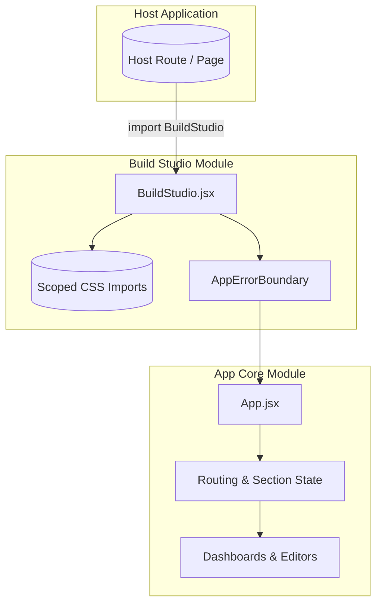
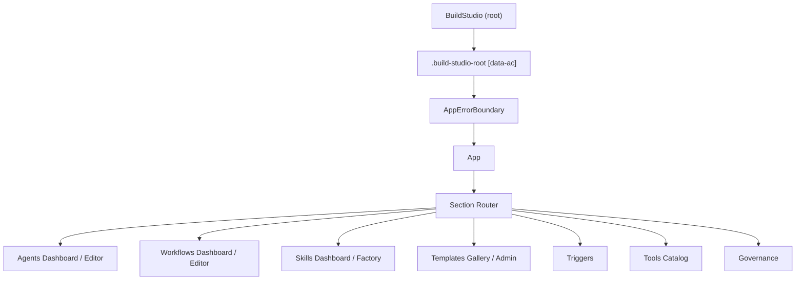
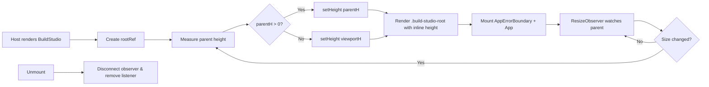

# Build Studio Module

## Brief Introduction

The **Build Studio** module is the embeddable frontend entry point for the ABStudio visual builder. It exposes a single, self-contained React component (`BuildStudio`) that hosts the entire Build Studio application — including workflow editors, agent builders, skill factories, template galleries, trigger designers, and governance views — inside a bounded DOM subtree.

The module is designed to be consumed by a host application (for example, the AI-UI shell or a standalone route) without leaking styles, layout, or event handling into the surrounding page. It solves the classic "embedded SPA" problem by:

- Scoping all styles to the `[data-ac]` subtree.
- Pinning `position:fixed` elements to the component root.
- Dynamically measuring the parent container and enforcing a pixel height so that internal flex/scroll layouts and React Flow canvases always have a known viewport.

For the actual application logic, routing, dashboards, and editors, see the [app_core](../core/app_core.md) module and its feature-area children.

---

## Core Responsibilities

| Responsibility | Description |
|----------------|-------------|
| **Embeddable Mount** | Exports a single default React component that can be dropped into any host route or layout. |
| **Style Isolation** | Imports all Build Studio styles at the root so they are scoped to the `[data-ac]` subtree at build time. |
| **Height Contract** | Uses `ResizeObserver` to measure the parent container and applies an inline pixel height, falling back to viewport height when the parent is unbounded. |
| **Error Boundary** | Wraps the inner application in `AppErrorBoundary` so runtime errors in the builder do not crash the host. |
| **React Flow Safety** | Guarantees a non-zero initial height to avoid React Flow's "0×0 container" initialization error. |

---

## Architecture

### High-Level Placement



### Component Hierarchy



---

## Core Component

### `BuildStudio.jsx`

The only exported component in this module. It is intentionally thin: all business logic, state management, and feature UI live in [app_core](../core/app_core.md) and the feature modules.

#### Key Behaviors

1. **Style imports** — `index.css`, `light-theme.css`, `agent-preview-polish.css`, `workflow-editor-premium.css`, and `styles/triggers.css` are loaded once at mount. The build pipeline scopes these selectors under `[data-ac]` so they do not affect the host page.
2. **Height measurement** — A `ResizeObserver` watches the parent element. If the parent has a measurable height, that value is applied to the root `div`; otherwise the viewport height is used.
3. **Initial height guard** — Before the observer fires, the root is given `100vh` so that child canvases (React Flow) never measure a `0×0` container.
4. **Cleanup** — The observer and window resize listener are disconnected on unmount.

---

## Data Flow

```mermaid
sequenceDiagram
    autonumber
    participant Host as Host Route
    participant BS as BuildStudio
    parent of BS as Parent Container
    participant App as App.jsx
    participant Store as Zustand / Local State

    Host->>BS: Render <BuildStudio />
    BS->>Parent: ResizeObserver.observe(parentElement)
    Parent-->>BS: parentRect.height
    alt parent height > 0
        BS->>BS: setHeight(parentHeight)
    else parent unbounded
        BS->>BS: setHeight(window.innerHeight)
    end
    BS->>App: Render App inside AppErrorBoundary
    App->>Store: Initialize section / editor state
    Store-->>App: Current section + data
    App->>Host: Interactive builder UI
```

---

## Dependencies

### Internal Module Dependencies

| Dependency | Module Doc | Purpose |
|------------|------------|---------|
| `App.jsx` | [app_core](../core/app_core.md) | The actual Build Studio application shell, routing, and section state. |
| `AppErrorBoundary` | [app_core](../core/app_core.md) | Catches errors inside the builder tree. |
| Feature components | [agents_feature](../agents/agents_feature.md), [workflows_feature](../workflows/workflows_feature.md), [skills_feature](../skills/skills_feature.md), [templates_feature](../api/templates_feature.md), [triggers_feature](triggers_feature.md), [tools_feature](../skills/tools_feature.md), [governance_feature](../sdlc/governance_feature.md) | Rendered by `App` based on the active section. |
| Shared UI | [shared_features](../core/shared_features.md), [common_components](common_components.md) | Reusable chat shells, pickers, uploaders, and modals. |
| State stores | [store](../storage/store.md) | Workflow, trigger, and global UI state. |
| Utilities | [utils](utils.md), [hooks](hooks.md) | Thread helpers, ID generation, persistence checks, hover tooltips. |

### External / Browser APIs

| API | Usage |
|-----|-------|
| `React.useEffect` | Mount side effects and cleanup. |
| `React.useRef` | Reference to the root DOM node. |
| `React.useState` | Stores measured height. |
| `ResizeObserver` | Watches parent container size changes. |
| `window.innerHeight` | Fallback viewport height. |
| `window.addEventListener('resize')` | Re-measure on viewport resize. |

---

## Embedding Contract

### Host Responsibilities

- Import and render `<BuildStudio />` inside a route or container.
- The host does **not** need to provide a bounded height, but if it does, Build Studio will mirror it exactly.
- The host must not override styles inside `[data-ac]`; those are owned by the Build Studio stylesheet bundle.

### Build Studio Guarantees

- No global CSS leakage (selectors are scoped to `[data-ac]` at build time).
- No `position:fixed` elements escape the root because the root establishes the containing block.
- A valid height is always present, even when the parent is `height: auto`.

---

## Process Flow: Mount & Resize



---

## Error Handling

Runtime errors inside the builder are caught by `AppErrorBoundary` (imported from [app_core](../core/app_core.md)) before they can propagate to the host. This keeps the host shell stable even if a workflow editor, agent factory, or canvas throws.

---

## Related Documentation

- [app_core](../core/app_core.md) — Main application shell, routing, and top-level state.
- [agents_feature](../agents/agents_feature.md) — Agent dashboard, editor, and factory chat.
- [workflows_feature](../workflows/workflows_feature.md) — Workflow dashboard and factory chat.
- [workflow_editor](../workflows/workflow_editor.md) — Visual workflow editor with React Flow canvas.
- [skills_feature](../skills/skills_feature.md) — Skill catalog and skill factory.
- [templates_feature](../api/templates_feature.md) — Template gallery and admin operations.
- [triggers_feature](triggers_feature.md) — Trigger designer and execution history.
- [tools_feature](../skills/tools_feature.md) — Tool catalog management.
- [governance_feature](../sdlc/governance_feature.md) — Governance submission and status UI.
- [common_components](common_components.md) — Reusable low-level UI components.
- [shared_features](../core/shared_features.md) — Cross-feature shared components.
- [store](../storage/store.md) — Client-side state management.
- [utils](utils.md) — Helper utilities.
- [hooks](hooks.md) — Custom React hooks.
