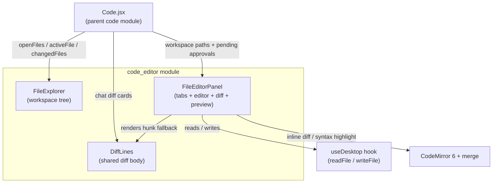
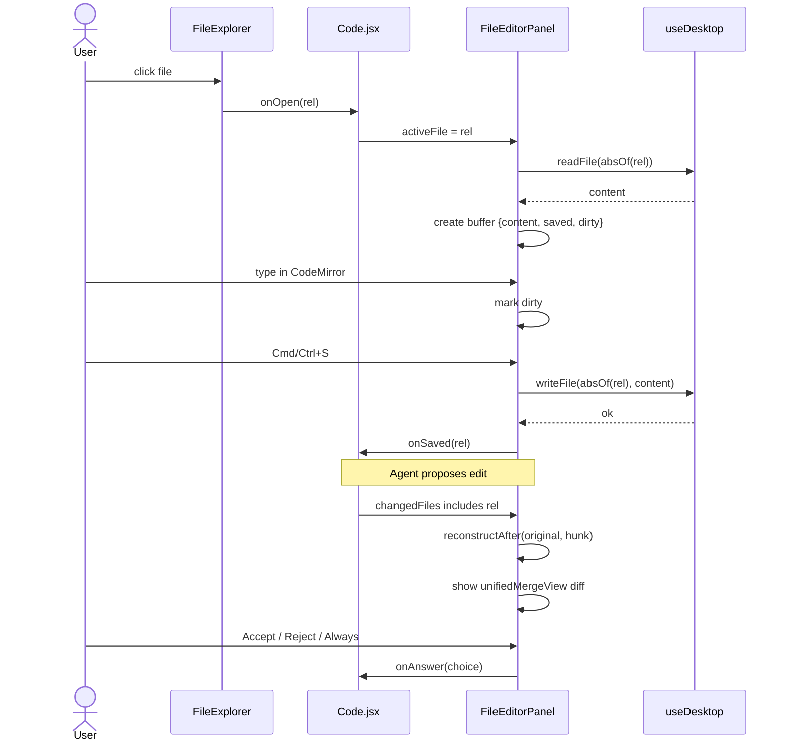

# Code Editor Module

## Overview

The `code_editor` module provides a lightweight, browser-based IDE (lite-IDE) used inside the **Code** tab of the AI UI frontend. It allows users to browse a local workspace, open files in a tabbed editor, review AI-proposed changes as inline diffs, and save edits back to disk. The module is intentionally thin over the filesystem: all actual read/write operations are delegated to the desktop IPC layer via the `useDesktop` hook, while the UI focuses on tree navigation, buffer management, diff visualization, and user approval flows.

This module is a sub-component of the larger [code](../codebase/code.md) feature, which orchestrates agent-driven coding conversations, permission bars, and tool diff cards. The diff renderer in this module is also reused by those chat diff cards so that agent changes look identical whether inspected in chat or in the editor.

---

## Architecture

### Responsibilities

| Sub-module | Responsibility |
|------------|----------------|
| `code_editor_explorer` | Renders a searchable, collapsible project tree from a flat list of `/`-relative paths; supports create, rename, delete, and refresh operations via callbacks. |
| `code_editor_panel` | Tabbed file editor built on CodeMirror 6; supports edit mode, full-file inline diff mode, and live preview for HTML/SVG; handles save/revert, dirty tracking, and keyboard shortcuts. |
| `code_editor_diff` | Shared red/green diff line renderer used by the editor's diff fallback and by the chat diff cards in the parent [code](../codebase/code.md) module. |

---

## Data Flow

---

## Sub-modules

- [code_editor_explorer](code_editor_explorer.md) — Workspace tree navigation and file operations.
- [code_editor_panel](code_editor_panel.md) — Tabbed editor, diff preview, and save/revert logic.
- [code_editor_diff](code_editor_diff.md) — Shared diff line rendering component.

---

## Integration Points

- **Parent feature**: The editor is mounted and controlled by [Code.jsx](../codebase/code.md), which supplies `openFiles`, `activeFile`, `changedFiles`, pending approvals, and workspace path resolution.
- **Desktop IPC**: File reads and writes go through the `useDesktop` hook in the [ai_ui_frontend_hooks](../ui/ai_ui_frontend_hooks.md) module.
- **Diff reuse**: `DiffLines` is also imported by the chat diff cards in [Code.jsx](../codebase/code.md) so that diff styling is consistent across the application.
- **External libraries**: CodeMirror 6 (`@uiw/react-codemirror`), the GitHub light/dark themes, language-data for syntax highlighting, and `@codemirror/merge` for inline diffs.

---

## Key Design Decisions

1. **Paths are `/`-relative** inside the module; the parent `Code.jsx` converts them to OS-absolute paths via `absOf(rel)` before calling desktop IPC.
2. **Buffer state is local** to `FileEditorPanel` so that tab switching, dirty tracking, and reload-from-disk can be handled without re-fetching from the parent.
3. **Diff reconstruction** happens in the UI: `reconstructAfter` applies the agent's hunk to the original file content to produce a proposed full-file view for CodeMirror's `unifiedMergeView`. If reconstruction fails, the component falls back to the streamed hunk rendered by `DiffLines`.
4. **Approval parity**: When an agent edit is pending for the active file, the same Accept/Reject/Always actions shown in the chat permission bar are also surfaced in the editor action bar.
5. **Live preview** for HTML/SVG uses a sandboxed iframe (`allow-scripts allow-popups allow-modals`) with no same-origin access to the host application.
