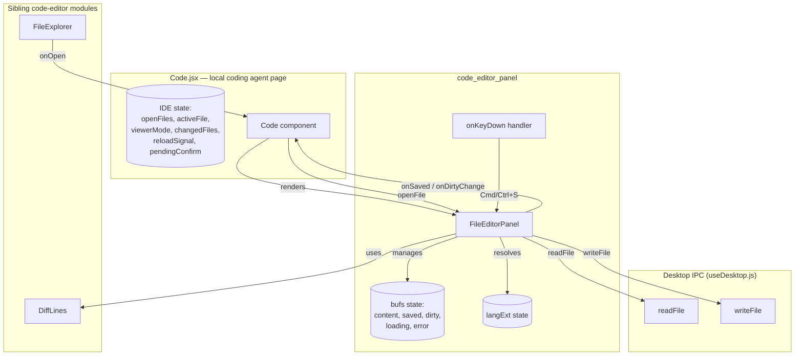
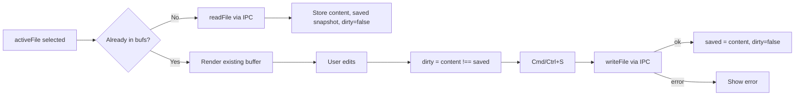
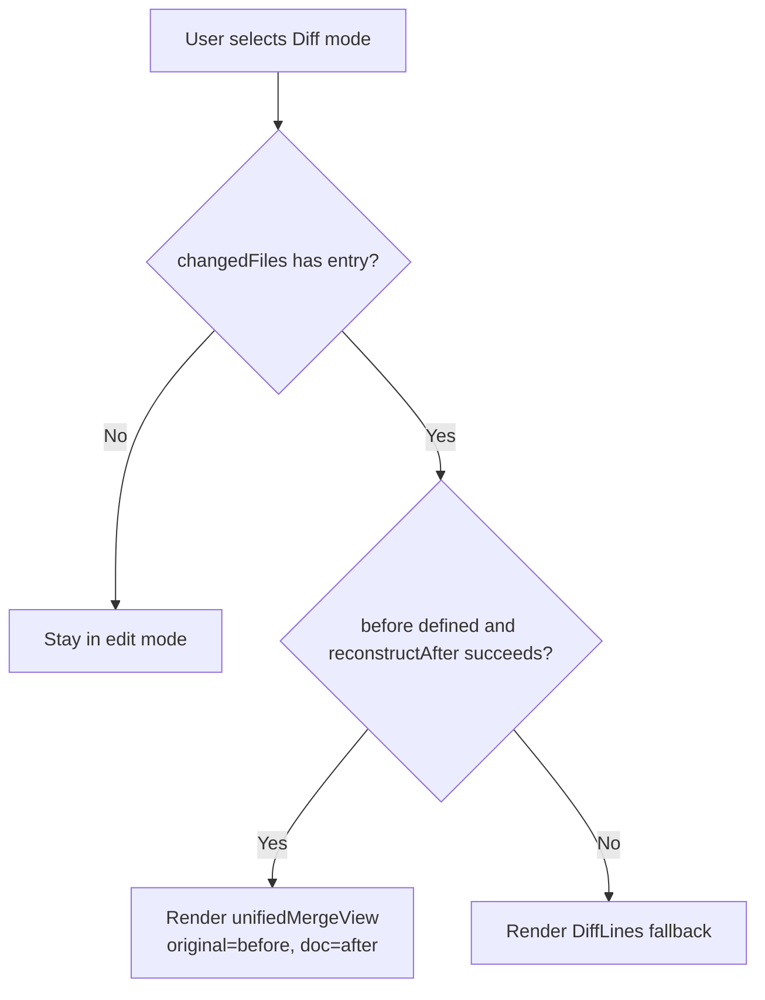
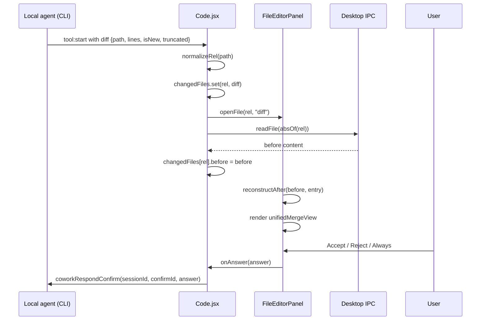
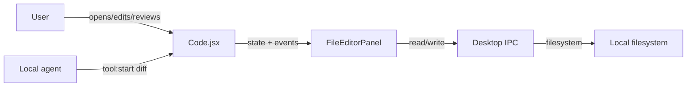
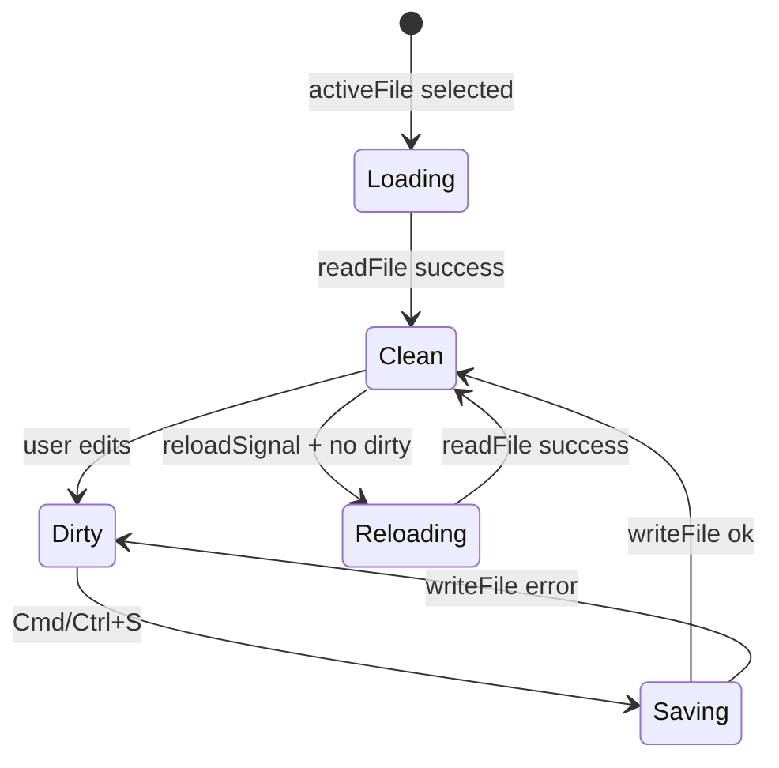

# code_editor_panel

The `code_editor_panel` module provides the **lite-IDE right pane** used inside the **Code** (local coding agent) surface of the AiNxt desktop application. It renders a tabbed, editable file viewer built on top of CodeMirror 6, with support for live editing, inline diff review, HTML/SVG preview, and keyboard-driven save/revert workflows.

This module is a React component (`FileEditorPanel`) plus a small keyboard handler (`onKeyDown`). It is intentionally stateful around open file buffers so that users can edit multiple files, see unsaved-change indicators, and review agent-proposed edits before they are written to disk.

---

## Core Responsibilities

| Responsibility | Description |
| --- | --- |
| **File buffer management** | Loads file contents asynchronously, tracks dirty state per tab, and prevents disk reloads from clobbering unsaved edits. |
| **Syntax highlighting** | Resolves a CodeMirror 6 language extension from the active file extension lazily. |
| **Edit / Diff / Preview modes** | Toggles between live editing, full-file inline diff, and sandboxed preview for HTML/SVG files. |
| **Agent edit review** | Reconstructs the proposed file content from an agent diff entry so the user can review changes before they are applied. |
| **Guarded disk writes** | Persists buffer content through the desktop IPC `writeFile` helper, which enforces workspace boundaries. |
| **Keyboard shortcuts** | Supports `Cmd/Ctrl + S` to save the active buffer. |

---

## Architecture

### Component Overview



### File Structure

```
ai-ui/src/components/code/
├── FileEditorPanel.jsx   # This module
├── FileExplorer.jsx      # Left-side file tree
└── DiffLines.jsx         # Streamed hunk diff fallback
```

---

## Component API

### `FileEditorPanel`

The main exported React component.

#### Props

| Prop | Type | Description |
| --- | --- | --- |
| `openFiles` | `string[]` | Relative paths of all open tabs. |
| `activeFile` | `string` | Currently focused relative path. |
| `mode` | `"edit" \| "diff" \| "preview"` | Desired viewing mode. |
| `changedFiles` | `Map<string, DiffEntry>` | Agent-proposed edits keyed by relative path. |
| `absOf(rel)` | `(string) => string` | Converts a relative path to an OS-absolute path. |
| `onSelectTab(rel)` | `(string) => void` | Called when the user clicks a tab. |
| `onCloseTab(rel)` | `(string) => void` | Called when the user closes a tab. |
| `onSetMode(mode)` | `(string) => void` | Called when the user toggles Edit/Diff/Preview. |
| `onClose()` | `() => void` | Called when the panel close button is clicked. |
| `onSaved(rel)` | `(string) => void` | Called after a successful disk write. |
| `onDirtyChange(rel, dirty)` | `(string, boolean) => void` | Called whenever the dirty state of the active buffer changes. |
| `reloadSignal` | `number` | Bumped by the parent when a file changes on disk. |
| `reloadTarget` | `string \| null` | The relative path that changed on disk. |
| `showTabs` | `boolean` | Whether the internal tab strip should render. |
| `pendingConfirm` | `object \| null` | The active permission prompt from the agent. |
| `pendingRel` | `string \| null` | Relative path tied to the pending permission. |
| `onAnswer(answer)` | `(string) => void` | Called when the user accepts/rejects a pending edit. |
| `dark` | `boolean` | Switches between CodeMirror GitHub light and dark themes. |

#### Internal State: `bufs`



### `onKeyDown`

A small handler attached to the panel root. It intercepts `Cmd/Ctrl + S` and triggers `save()` for the active file, preventing the browser's default save dialog.

---

## Viewing Modes

### Edit Mode

Standard CodeMirror 6 editor with line numbers, active-line highlight, and fold gutter. The buffer content is editable and dirty state is tracked.

### Diff Mode

When the active file has a corresponding entry in `changedFiles`, the panel can render the agent's proposed change in two ways:

1. **Full-file inline diff** (preferred): reconstructs the proposed file content from the original (`entry.before`) plus the agent's hunk (`entry.lines`). CodeMirror's `unifiedMergeView` is used with a custom high-contrast theme.
2. **Streamed hunk fallback**: if reconstruction fails (truncated hunk, old text not found, etc.), the panel falls back to the shared `DiffLines` component.



### Preview Mode

For `.html`, `.htm`, and `.svg` files, the panel can render the live buffer inside a sandboxed `<iframe>`. The sandbox allows scripts and popups but blocks same-origin access to the host application.

---

## Data Flow: Agent Edit Review

The panel is designed to surface agent edits before they are applied to disk. The parent `Code.jsx` listens to `tool:start` events from the local agent, populates `changedFiles`, and opens the affected file in diff mode.



---

## Dependencies

### Internal Modules

| Module | Relationship |
| --- | --- |
| [code](../codebase/code.md) | Parent page that owns IDE state and renders `FileEditorPanel`. |
| [code_editor_explorer](code_editor_explorer.md) | Sibling `FileExplorer` that provides the file tree and triggers `onOpen`. |
| [code_editor_diff](code_editor_diff.md) | Sibling `DiffLines` component used as the diff fallback renderer. |
| [ai_ui_frontend_hooks](../ui/ai_ui_frontend_hooks.md) | `useDesktop.js` exposes `readFile` and `writeFile` desktop IPC helpers. |

### External Libraries

| Library | Purpose |
| --- | --- |
| `@uiw/react-codemirror` | React wrapper for CodeMirror 6. |
| `@uiw/codemirror-theme-github` | GitHub light/dark themes. |
| `@codemirror/language-data` | Language extension registry for syntax highlighting. |
| `@codemirror/merge` | `unifiedMergeView` for inline diff rendering. |
| `@codemirror/view` | Custom theme overrides for diff highlights. |
| `lucide-react` | Toolbar icons. |

---

## Integration with the Code Page

`FileEditorPanel` does not own the list of open files or the active tab. That state lives in `Code.jsx` so that the panel can be used in both **tabbed** and **split** layouts:

- **Tabbed layout**: the editor replaces the chat area; `Code.jsx` renders the tab bar and passes `showTabs={false}`.
- **Split layout**: the editor sits beside the chat inside a resizable panel; `FileEditorPanel` renders its own tab strip.

The parent also supplies `changedFiles`, `reloadSignal`, and `pendingConfirm` so that agent-driven edits, external disk changes, and permission prompts are all reflected in the editor surface.

---

## Key Design Decisions

1. **Lazy loading**: file content and language extensions are loaded only when a tab becomes active, keeping initial render fast.
2. **Dirty-state protection**: disk reloads triggered by `reloadSignal` are skipped if the buffer has unsaved edits.
3. **Reconstruction before write**: the diff view shows the *proposed* full file, not just the hunk, by applying the agent's edit to the pre-edit snapshot in memory.
4. **Guarded writes**: all disk writes go through `writeFile` from `useDesktop.js`, which enforces that mutations stay within the open workspace.
5. **Permission surfacing**: when an agent edit is awaiting approval, the panel shows Accept/Reject/Always buttons tied to the same confirmation flow as the chat permission bar.

---

## Mermaid Diagrams Summary

### High-level placement



### Buffer lifecycle


