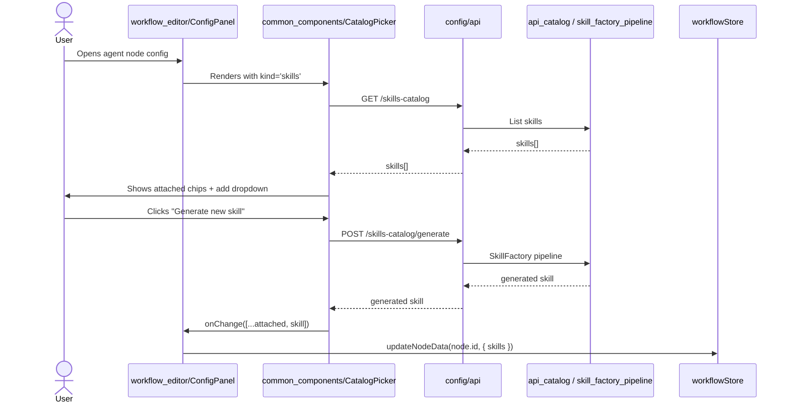

# Common Components Module

## Introduction

The `common_components` module is a shared React component library located under `ABStudio/frontend/src/components/common/`. It provides reusable UI primitives and domain-specific editing controls that are consumed across the ABStudio frontend — most notably by the workflow editor's [`ConfigPanel`](../workflows/workflow_editor.md), the standalone [`AgentEditor`](../agents/agents_feature.md), and the factory chat overlays ([`AgentFactoryChat`](../agents/agents_feature.md), [`SkillFactoryChat`](../skills/skills_feature.md), [`WorkflowFactoryChat`](../workflows/workflows_feature.md)).

The module's purpose is to:

1. **Centralize reusable UI patterns** such as suggestion chips, confirmation dialogs, tooltips, plan questionnaires, and empty states.
2. **Provide consistent catalog selection UX** for attaching tools and skills to agent nodes, with both class-styled and inline-styled variants.
3. **Encapsulate knowledge-base attachment logic** for agents, including namespace selection, per-document scoping, and an inline multi-file uploader that auto-approves documents for immediate RAG retrieval.

All components are implemented as functional React components using hooks. They communicate with the backend through the shared API layer in `ABStudio/frontend/src/config/api` (see [`config`](abstudio_frontend.md#config) for details) and rely on parent components to persist state into the workflow/agent model.

## Architecture Overview

```mermaid
flowchart TB
    subgraph CommonComponents["common_components"]
        direction TB
        UIPrimitives["UI Primitives"]
        CatalogPickers["Catalog Pickers"]
        Knowledge["Knowledge Management"]
    end

    subgraph Consumers["Primary Consumers"]
        ConfigPanel["workflow_editor/ConfigPanel"]
        AgentEditor["agents_feature/AgentEditor"]
        FactoryChats["Factory Chat Overlays"]
        TemplateViews["templates_feature"]
    end

    UIPrimitives -->|AnswerCards, PlanCard, HoverTooltip| FactoryChats
    UIPrimitives -->|ConfirmModal, TemplatesEmptyState| Consumers
    CatalogPickers -->|CatalogPicker, InlinePicker| ConfigPanel
    CatalogPickers -->|InlinePicker| FactoryChats
    CatalogPickers -->|CatalogPicker| AgentEditor
    Knowledge -->|KnowledgeSection, KnowledgeUploadInline| ConfigPanel
    Knowledge -->|KnowledgeSection| AgentEditor

    subgraph APILayer["API Layer"]
        api["config/api"]
    end

    CatalogPickers -->|GET /{kind}-catalog<br/>POST /{kind}-catalog/generate| api
    Knowledge -->|GET /kb?status=ACTIVE<br/>POST /kb/upload-build-studio| api
    GenerateInstructions["GenerateInstructionsModal"] -->|POST /generate-instructions| api
```

### Design Principles

- **Parent-controlled state**: Components such as `CatalogPicker`, `InlinePicker`, and `KnowledgeSection` never persist data themselves. They invoke `onChange` callbacks so parents can mirror values into the workflow store or agent model.
- **Backend-agnostic rendering**: Catalog and knowledge components fetch their own reference data but treat backend payloads as opaque objects keyed by `name`, `description`, and backend-specific identifiers.
- **Dual styling strategy**: `CatalogPicker` relies on global CSS classes, while `InlinePicker` uses self-contained inline styles for contexts (e.g., factory chat overlays) where global styles are unreliable.
- **Immediate KB availability**: `KnowledgeUploadInline` uses a Build-Studio-specific auto-approve endpoint so uploaded documents become RAG-searchable without an inbox approval queue.

## Sub-modules

| Sub-module | Responsibility | Key Components | Documentation |
|---|---|---|---|
| UI Primitives | Reusable, low-level UI building blocks used throughout ABStudio. | `AnswerCards`, `ConfirmModal`, `GenerateInstructionsModal`, `HoverTooltip`, `PlanCard`, `TemplatesEmptyState` | common_components_ui_primitives.md |
| Catalog Pickers | Tools/skills selection and generation for agent nodes. | `CatalogPicker`, `InlinePicker` | common_components_catalog_pickers.md |
| Knowledge Management | Knowledge-base attachment, namespace scoping, and inline document upload. | `KnowledgeSection`, `KnowledgeUploadInline` | common_components_knowledge_management.md |

## Module Boundaries

- **Does not own persistence**: State is always lifted to parent components that interact with [`workflowStore`](abstudio_frontend.md#store) or the agent API.
- **Does not own layout chrome**: Shell-level layout, navigation, and dashboards live in [`app_core`](abstudio_frontend.md#app-core) and feature modules.
- **Does not own backend catalog logic**: The actual catalog generation, skill factory pipeline, and KB ingestion are implemented in the backend modules `api_catalog`, `skill_factory_pipeline`, and `core_ocr`.

## Data Flow Example

The following diagram illustrates how a user attaches a skill to an agent node using `CatalogPicker`:



## Related Documentation

- [abstudio_frontend.md](abstudio_frontend.md) — parent frontend module tree.
- [workflow_editor.md](../workflows/workflow_editor.md) — primary consumer of `CatalogPicker` and `KnowledgeSection`.
- [agents_feature.md](../agents/agents_feature.md) — consumes `CatalogPicker`, `KnowledgeSection`, `GenerateInstructionsModal`, and `AnswerCards`.
- [skills_feature.md](../skills/skills_feature.md) — backend-driven skill generation consumer.
- [api_catalog.md](../api/api_catalog.md) — backend catalog endpoints.
- [api_kb.md](../api/api_kb.md) — backend knowledge-base upload endpoint.
