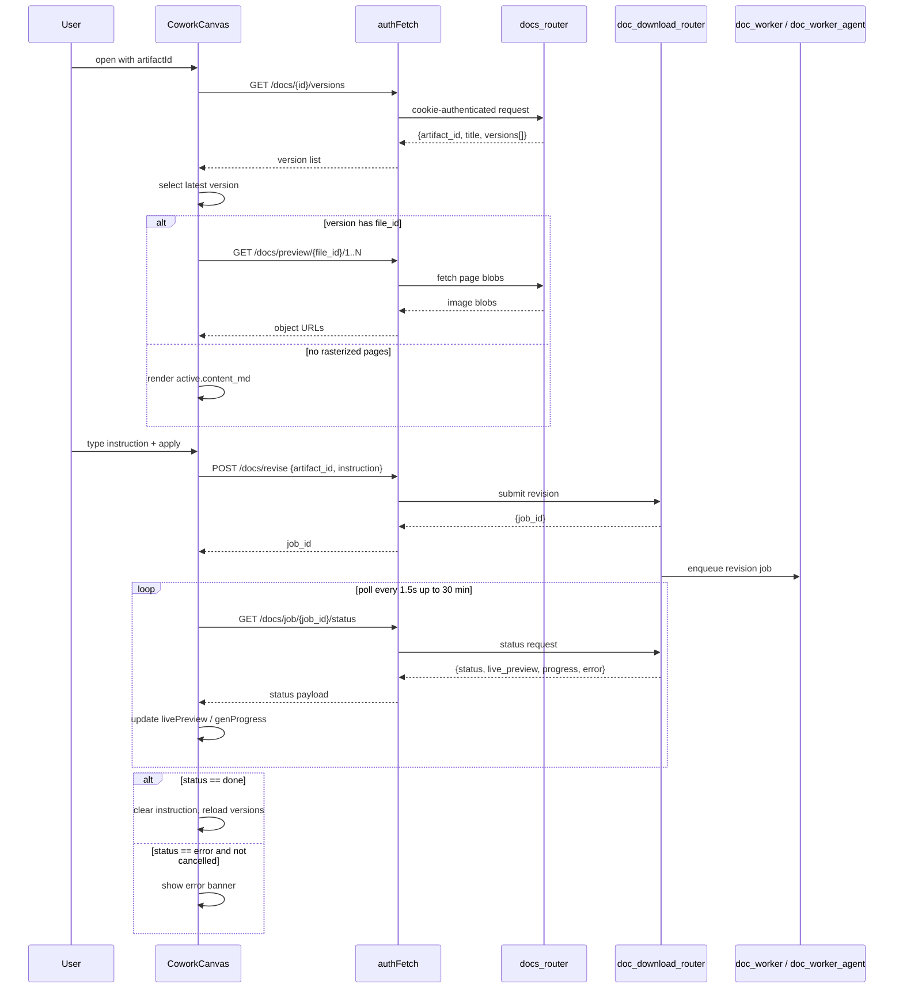

# Cowork Canvas

The **Cowork Canvas** is the frontend surface for iterative, AI-assisted document editing. It presents a document artifact as a paginated preview, exposes every saved version of that artifact, and lets a user describe a natural-language edit that the backend turns into a new version. The component is self-contained, cookie-authenticated, and designed to be opened as an overlay from anywhere in the AiNxt UI.

---

## What it does

- **Version history**: Loads every version of a document artifact from the backend and renders them as a selectable list.
- **Paginated preview**: Displays the currently selected version as rasterized page images when available, falling back to rendered Markdown.
- **Natural-language edits**: Accepts free-text instructions ("shorten the summary", "add a risks section", "make the tone formal") and submits them to the backend revision pipeline.
- **Live generation preview**: While a revision is running, streams the worker's incremental snapshot section-by-section through [`DocLivePreview`](../doc_live_preview.md).
- **Cancellation**: Lets the user stop an in-flight edit cleanly, distinguishing a user abort from a genuine build failure.
- **Download**: Offers a one-click download of the selected version's binary file.

---

## Where it lives

```text
ai-ui/
└─ src/
   └─ components/
      ├─ CoworkCanvas.jsx      # this module
      ├─ DocLivePreview.jsx    # live generation preview
      ├─ Message.jsx           # shared markdown components
      └─ ...
```

---

## Architecture

```mermaid
flowchart TB
    subgraph UI["AiNxt UI"]
        A[Parent view] -->|artifactId, onClose| B[CoworkCanvas]
        B --> C[Version history sidebar]
        B --> D[Page / Markdown preview]
        B --> E[AI edit input]
        B --> F[DocLivePreview]
    end

    subgraph Config["Shared config"]
        G[authFetch]
        H[API_BASE]
    end

    subgraph Backend["Backend services"]
        I[docs_router]
        J[doc_download_router]
        K[doc_worker / doc_worker_agent]
    end

    B <-->|GET /docs/{id}/versions| I
    B <-->|GET /docs/preview/{file_id}/{page}| I
    B <-->|POST /docs/revise| J
    B <-->|GET /docs/job/{id}/status| J
    B <-->|POST /docs/job/{id}/cancel| J
    B -->|download| J
    B -.->|uses| G
    B -.->|uses| H
    F -.->|shared markdown| Message
```

---

## Component relationships

| Component / Module | Relationship | Purpose |
|---|---|---|
| [`DocLivePreview`](../doc_live_preview.md) | Child render | Shows the incremental section-by-section preview while an edit is building. |
| [`Message.jsx`](../chat/message.md) | Shared markdown | Supplies `mdComponents` so fallback Markdown rendering matches the chat experience. |
| [`config.js`](../infrastructure/config.md) | Shared utility | Provides `authFetch` (cookie-authenticated fetch) and `API_BASE`. |
| [`docs_router`](../../backend/docs_router.md) | Backend API | Serves version history and page preview images. |
| [`doc_download_router`](../../backend/doc_download_router.md) | Backend API | Accepts revision instructions, streams job status, cancels jobs, and serves downloads. |
| [`doc_worker`](../../backend/doc_worker.md) / [`doc_worker_agent`](../../backend/doc_worker_agent.md) | Backend worker | Executes the actual document generation and revision jobs. |

---

## Data flow



---

## Core state

| State | Type | Purpose |
|---|---|---|
| `data` | `{artifact_id, title, versions[]}` | Full version history payload. |
| `active` | version object | Currently selected version. |
| `pageUrls` | string[] | Object URLs for the active version's rasterized pages. |
| `instruction` | string | User's natural-language edit instruction. |
| `loading` | boolean | Initial version-history load in progress. |
| `busy` | boolean | A revision job is currently running. |
| `stage` | string | Human-readable status label shown on the apply button. |
| `err` | string | Error message banner. |
| `livePreview` | `{title, sections[], done, total_hint}` | Incremental document snapshot from the worker. |
| `genProgress` | `{label}` | Current build-step label. |
| `jobId` | string | In-flight revision job id; enables cancellation. |
| `cancelling` | boolean | Cancellation request in flight. |
| `cancelledRef` | ref | Synchronous flag so the polling loop can treat a stopped job as a clean abort. |

---

## Key functions

### `CoworkCanvas({ artifactId, onClose })`

Main component. Opens as a fixed overlay and manages the full lifecycle: load history, render preview, accept edits, poll jobs, and cancel jobs.

Props:

| Prop | Type | Description |
|---|---|---|
| `artifactId` | string | Document artifact to open. |
| `onClose` | function | Called when the user closes the canvas. |

### `load()`

Fetches `/docs/{artifactId}/versions` and sets `data` and `active`. Falls back to the latest version if the previously selected version is no longer present.

### Page rendering effect

When `active.file_id` changes:

1. Fetches page `1` with retries for up to ~20 seconds (preview generation can lag the done status).
2. Once page `1` exists, walks pages `2..50` until the first missing page.
3. Converts each blob to an object URL and pushes it into `pageUrls`.
4. Cleans up object URLs on unmount/version change.

If no rasterized pages are available, the component renders `active.content_md` using the same ReactMarkdown plugins and components as the chat renderer.

### `applyEdit()`

Submits the user's instruction to `/docs/revise`, receives a `job_id`, and polls `/docs/job/{job_id}/status` every 1.5 seconds for up to 30 minutes. While polling it:

- Streams `live_preview` into `livePreview`.
- Streams `progress` into `genProgress`.
- On `done`, clears the instruction and reloads version history.
- On `error`, checks `cancelledRef` and the error message for "cancel" before treating it as a failure.

### `stopEdit()`

Sets `cancelledRef` and `cancelling`, then posts to `/docs/job/{jobId}/cancel`. The polling loop exits cleanly when it next sees the cancelled status.

### `download(fileId, fmt)`

Fetches `/docs/download/{fileId}` as a blob and triggers a browser download named from the artifact title.

---

## Process flow: applying an AI edit

```mermaid
flowchart LR
    A[User types instruction] -->|Ctrl/Cmd+Enter or click| B{instruction.trim?}
    B -->|no| A
    B -->|yes| C[set busy=true, clear preview state]
    C --> D[POST /docs/revise]
    D --> E{response ok?}
    E -->|no| F[show error, set busy=false]
    E -->|yes| G[receive job_id, start polling]
    G --> H[render DocLivePreview]
    H --> I{status?}
    I -->|done| J[reload versions, clear input]
    I -->|error + not cancelled| K[show error]
    I -->|still running| G
    L[User clicks Stop] --> M[POST /docs/job/{id}/cancel]
    M --> N[set cancelledRef=true]
    N --> I
```

---

## Backend endpoints used

| Method | Path | Purpose |
|---|---|---|
| GET | `/docs/{artifactId}/versions` | Load artifact metadata and version history. |
| GET | `/docs/preview/{file_id}/{page}` | Fetch a rasterized page image blob. |
| POST | `/docs/revise` | Submit a natural-language revision instruction. |
| GET | `/docs/job/{job_id}/status` | Poll revision job status and live preview. |
| POST | `/docs/job/{job_id}/cancel` | Cancel an in-flight revision job. |
| GET | `/docs/download/{file_id}` | Download the binary file for a version. |

For details on the backend implementation of these endpoints, see [`docs_router`](../api/docs_router.md) and [`doc_download_router`](../api/doc_download_router.md). The workers that execute the jobs are documented in [`doc_worker`](../doc_worker.md) and [`doc_worker_agent`](../doc_worker_agent.md).

---

## Design notes

- **Self-contained**: `CoworkCanvas` only needs `artifactId` and `onClose`; all data fetching, polling, and cleanup is internal.
- **Cookie authentication**: All requests go through `authFetch`, which sends the httpOnly session cookie and adds a correlation header.
- **Resilient preview loading**: Page rendering retries page 1 for ~20 seconds so the canvas does not stay blank when preview generation lags the job completion.
- **Consistent Markdown rendering**: Fallback Markdown uses the same `mdComponents`, `remarkGfm`, `remarkMath`, `rehypeHighlight`, and `rehypeKatex` pipeline as chat messages.
- **Clean cancellation**: A `useRef` flag lets the polling loop distinguish a user-initiated stop from a real build error, avoiding a red error banner on intentional aborts.
- **Memory safety**: Object URLs for page blobs are revoked when the version changes or the component unmounts.

---

## Related modules

- [`doc_live_preview`](../doc_live_preview.md) — live section-by-section preview during generation.
- [`message`](../chat/message.md) — shared Markdown rendering components.
- [`config`](../infrastructure/config.md) — `authFetch` and API base configuration.
- [`docs_router`](../api/docs_router.md) — backend version history and preview endpoints.
- [`doc_download_router`](../api/doc_download_router.md) — backend revision, job status, cancel, and download endpoints.
- [`doc_worker`](../doc_worker.md) — backend document conversion worker.
- [`doc_worker_agent`](../doc_worker_agent.md) — backend agentic document generation worker.
