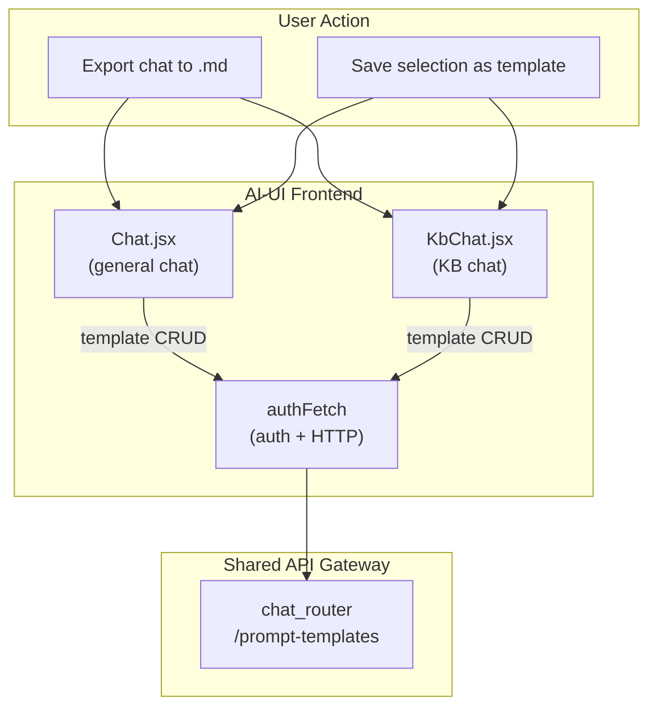
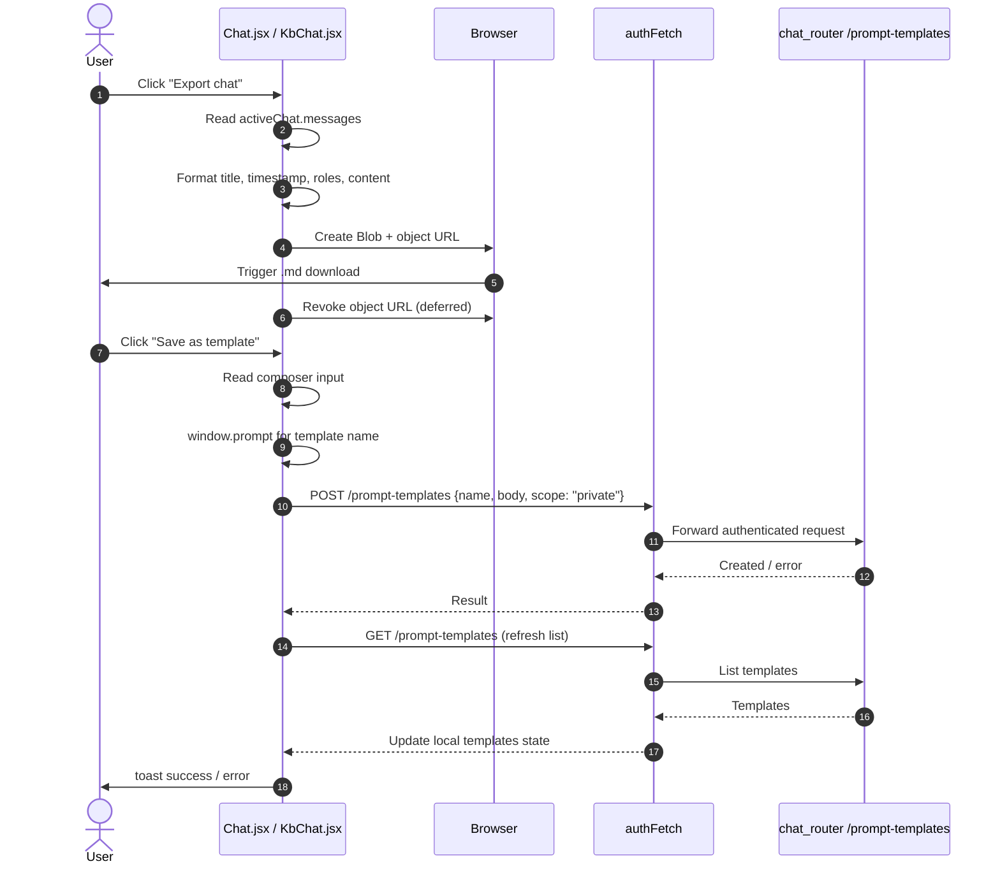
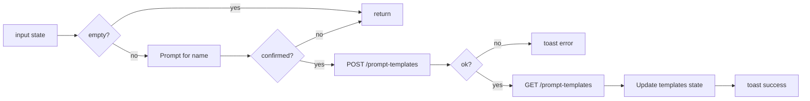

# export_template

The `export_template` module provides lightweight, user-facing utilities for persisting chat content from the AI-UI frontend. It exposes two complementary capabilities: **exporting a chat thread as a Markdown file** and **saving the current composer text as a reusable prompt template**. These helpers live inside the main chat components and are reused by both the general-purpose [`chat`](../chat/chat.md) experience and the knowledge-base-focused [`kb_chat`](../knowledge/kb_chat.md) experience.

---

## Overview

| Concern | Description |
|--------|-------------|
| **Purpose** | Let users take chat content out of the application (Markdown download) or turn frequently-used prompts into reusable templates. |
| **Location** | `ai-ui/src/components/Chat.jsx`, `ai-ui/src/components/KbChat.jsx` |
| **Key functions** | `handleExport`, `saveSelectionAsTemplate` |
| **Backend dependency** | [`chat_router`](../chat/chat_router.md) (`/prompt-templates` endpoints) for template persistence. |
| **Related modules** | [`chat`](../chat/chat.md), [`kb_chat`](../knowledge/kb_chat.md), [`auth`](../auth/auth.md) |

The module is intentionally thin: it does not own routing, state management, or backend storage. Instead, it consumes the active chat state from its parent component, formats content locally in the browser, and delegates persistence to existing platform APIs.

---

## Architecture



Both `Chat.jsx` and `KbChat.jsx` implement the same two helpers. They share no dedicated state slice; each helper reads from the local component state (`activeChat`, `input`) and produces either a client-side download or a single API call.

---

## Component Interaction



---

## Core Functions

### `handleExport`

Generates a Markdown snapshot of the currently active chat and triggers a browser download.

**Behavior**
- Reads `activeChat.messages` and `activeChat.title`.
- Builds a Markdown document with:
  - A level-1 heading from the chat title.
  - An `Exported: <IST timestamp>` line.
  - Each message rendered as bold role (`You` / `AiNxt`) followed by the message content.
- Creates a `Blob` of type `text/markdown`, generates a temporary object URL, and programmatically clicks an `<a download>` element.
- Sanitizes the filename by replacing non-alphanumeric characters with underscores.
- Revokes the object URL after a short delay so the browser has time to read the blob.

**Differences between contexts**

| Context | Content preprocessing |
|---------|----------------------|
| `Chat.jsx` | Strips doc-generation markers via a local `stripDocMarkersForExport` helper so exported Markdown does not contain `[DOCJOB:...]` placeholders. |
| `KbChat.jsx` | Exports message content as-is. |

### `saveSelectionAsTemplate`

Persists the current composer input as a private prompt template.

**Behavior**
- Validates that the composer `input` is non-empty.
- Prompts the user for a template name via `window.prompt`.
- POSTs `{ name, body: input, scope: "private" }` to `/prompt-templates` through `authFetch`.
- On success, refreshes the local template list by re-fetching `/prompt-templates` and updates component state.
- Shows a toast notification for success or failure.

**Scope**
Templates are always saved with `scope: "private"` from this entry point, meaning they are visible only to the creating user. Broader scope management is handled by the prompt-template admin UI elsewhere.

---

## Data Flow

### Export flow

```mermaid
flowchart LR
    A[activeChat state] --> B{messages?}
    B -->|no| C[return early]
    B -->|yes| D[Build Markdown lines]
    D --> E[Strip doc markers<br/>(Chat.jsx only)]
    E --> F[Create Blob]
    F --> G[Generate object URL]
    G --> H[Trigger download]
    H --> I[Revoke URL]
```

### Template save flow



---

## Dependencies

| Dependency | Role |
|------------|------|
| `activeChat` / `input` local state | Source data for export and template creation. |
| `authFetch` | Authenticated HTTP client; see [`auth`](../auth/auth.md). |
| `API` base URL | Runtime API origin. |
| `toast` | User feedback notifications. |
| `toIST` | Converts UTC timestamps to India Standard Time for the export header. |
| `stripDocMarkersForExport` (Chat.jsx only) | Local helper that removes `[DOCJOB:...]` placeholders from exported Markdown. |
| `/prompt-templates` endpoints | Backend CRUD for prompt templates; owned by [`chat_router`](../chat/chat_router.md). |

---

## Integration with the System

`export_template` sits at the edge of the chat user experience. It does not introduce new backend services or data models; it reuses:

- The chat state model defined in [`chat`](../chat/chat.md) and [`kb_chat`](../knowledge/kb_chat.md).
- The authentication and HTTP layer from [`auth`](../auth/auth.md).
- The prompt-template storage and listing APIs from [`chat_router`](../chat/chat_router.md).

Because the same helpers are duplicated across `Chat.jsx` and `KbChat.jsx`, any change to export formatting or template payload shape should be applied consistently in both files unless the product intentionally wants divergent behavior between general chat and KB chat.

---

## Process Flow: Exporting a Chat

1. The user opens the chat actions menu and selects **Export chat**.
2. The component checks whether the active chat contains messages.
3. It builds a Markdown string:
   - `# <chat title>`
   - `Exported: <IST timestamp>`
   - For each message: `**<role>**` + content.
4. In `Chat.jsx`, doc-generation markers are stripped so the file is clean.
5. A `Blob` is created and an object URL is generated.
6. A hidden anchor element triggers the browser download with a sanitized filename.
7. The object URL is revoked after ~1 second.

## Process Flow: Saving a Template

1. The user selects text in the composer and chooses **Save as template** (or uses the equivalent toolbar action).
2. The helper validates that the composer input is not empty.
3. A browser prompt asks for the template name.
4. If confirmed, an authenticated POST creates a private prompt template.
5. On success, the helper re-fetches the full template list and updates local state so the `/` template menu reflects the new entry.
6. A toast confirms the save or reports an error.

---

## Notes for Maintainers

- **No dedicated backend module**: `export_template` is purely a frontend concern. All persistence goes through existing routers.
- **Filename sanitization**: Non-alphanumeric characters in the chat title are replaced with `_` to avoid filesystem issues.
- **Object URL lifecycle**: The export helpers defer `URL.revokeObjectURL` to ensure the browser completes the download before the blob is freed.
- **Template scope**: Saved templates are always private from this entry point. Admin or shared templates are managed separately.
- **Keep parity**: Changes to `Chat.jsx` helpers should generally be mirrored in `KbChat.jsx` to keep the two chat experiences consistent.
