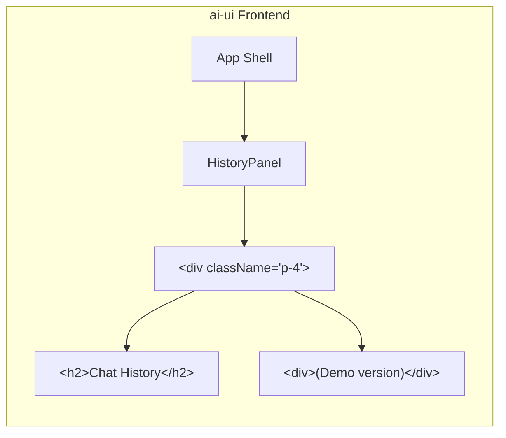
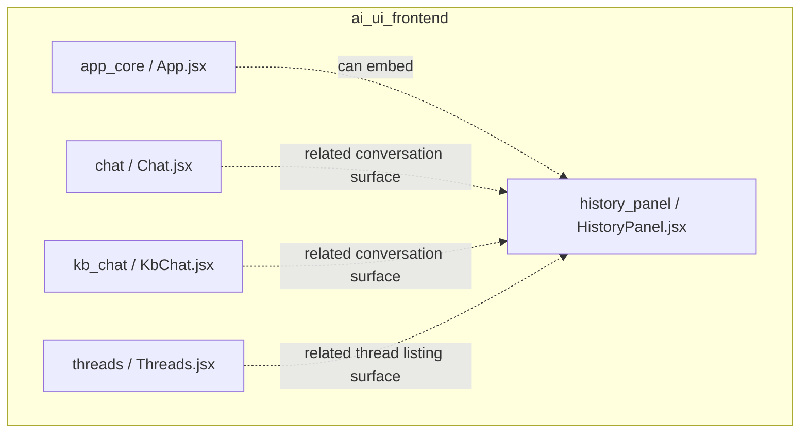
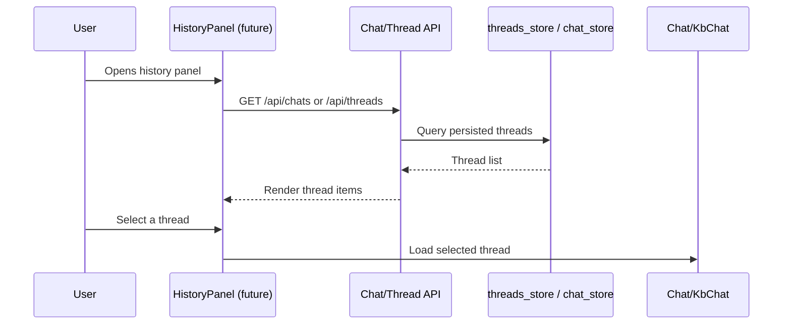
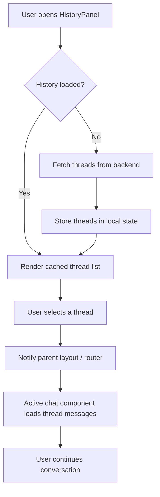

# History Panel Module

## Introduction

The **History Panel** module is a lightweight React UI component located in the `ai-ui` frontend application. It renders a sidebar-style panel that displays a placeholder view for **Chat History**. Currently shipped as a demo stub, the component is intended to be the future home of conversation history, thread listings, and past chat session navigation within the AI UI.

The module is intentionally minimal at this stage: it exposes a single default-exported functional component, `HistoryPanel`, which presents a titled container and a demo-version label. It is designed to be embedded into larger layout shells (for example, the main `App` shell or a chat/knowledge-base page) and to be expanded later with real data fetching, pagination, search, and selection behavior.

---

## Core Functionality

| Capability | Description |
|------------|-------------|
| **Chat history placeholder** | Renders a titled panel labeled "Chat History" for the AI UI. |
| **Demo marker** | Displays a `(Demo version)` label to indicate that the feature is not yet fully implemented. |
| **Layout-ready container** | Uses Tailwind-style utility classes (`p-4`, `font-semibold`, `mb-4`, `text-gray-400`) so it can be dropped into existing sidebars or drawers. |

### Component API

`HistoryPanel` is a stateless React component with no props, hooks, or side effects.

```jsx
import HistoryPanel from "./components/HistoryPanel";

function Layout() {
  return (
    <aside className="w-64 border-r">
      <HistoryPanel />
    </aside>
  );
}
```

---

## Architecture

### Component Structure



### Module Placement



---

## Dependencies

The `HistoryPanel` component has **no runtime dependencies** beyond the React framework and the project's Tailwind CSS utility classes. It does not import any other project modules, hooks, stores, or API clients.

| Dependency Type | Details |
|-----------------|---------|
| Framework | React (functional component) |
| Styling | Tailwind CSS utility classes |
| State | None |
| API calls | None |
| Child components | None |

---

## Data Flow

Because the component is a static placeholder, there is no data flow at this time. The diagram below illustrates the intended flow once the module is fully implemented.



---

## Integration with the System

The History Panel is part of the `ai-ui` conversation experience. It is conceptually related to the following modules, even though it does not currently import them:

- **[chat.md](../chat/chat.md)** — The main chat surface where a selected history item would be loaded.
- **[kb_chat.md](../knowledge/kb_chat.md)** — Knowledge-base chat surface that also maintains conversation history.
- **[threads.md](../chat/threads.md)** — Thread management UI; the history panel will likely reuse or mirror thread-listing behavior.
- **[message.md](../chat/message.md)** — Message rendering; history entries may preview message content.
- **[app_core.md](../core/app_core.md)** — The top-level `App.jsx` shell that hosts layout regions such as the history panel.

---

## Future Extension Points

When the demo placeholder is replaced with a full implementation, the module is expected to grow in the following areas:

1. **Data fetching** — Integrate with the chat or threads API to retrieve the user's past conversations.
2. **Thread list rendering** — Display thread titles, last-message previews, timestamps, and unread indicators.
3. **Search and filtering** — Allow users to search history by keyword or filter by date/agent.
4. **Selection and routing** — Clicking a history item loads the corresponding conversation in the active chat surface.
5. **Deletion and pinning** — Provide actions to delete, rename, or pin history entries.
6. **Real-time updates** — Optionally subscribe to thread events (for example, via WebSocket or server-sent events) to keep the list in sync.

---

## Process Flow: Loading a Chat from History (Future State)



---

## Notes for Maintainers

- The component is intentionally simple and safe to modify; it has no downstream consumers that depend on props or state.
- When replacing the demo label, preserve the outer `p-4` container and heading structure so that existing layout shells continue to render correctly.
- Consider co-locating history data logic with the existing `threads` or `chat` stores rather than introducing a new store, to avoid duplication of conversation state.
