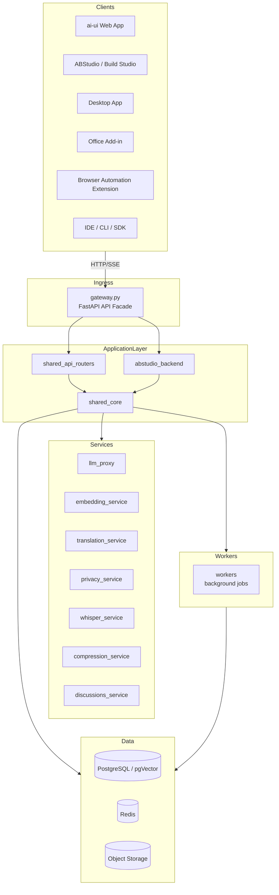
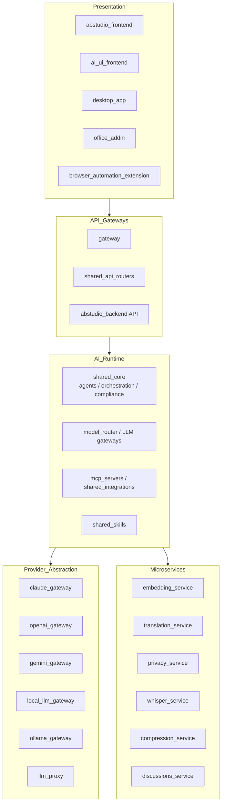
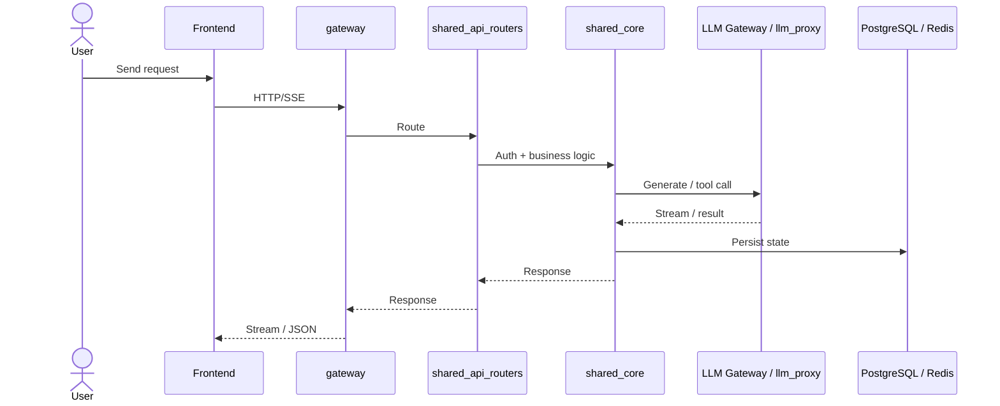

# `ainxt-platform-uat` Repository Overview

## Purpose

`ainxt-platform-uat` is the unified codebase for the **AiNxt enterprise AI platform**. It provides a complete stack for building, running, and governing AI agents, visual workflows, chat experiences, and automated software-delivery pipelines. The repository spans backend services, web frontends, desktop and Office clients, browser extensions, LLM provider gateways, dedicated microservices, background workers, and a shared core of cross-cutting infrastructure.

Key capabilities include:

- **Conversational AI** — multi-turn chat with RAG, memory, compliance gating, and tool use.
- **Agent & workflow authoring** — visual builder (ABStudio) for agents, skills, workflows, and templates.
- **SDLC automation** — AI-driven feature, bug, PR review, and governance pipelines.
- **Enterprise integrations** — connectors for Microsoft 365, Google, Slack, Jira, GitLab, Confluence, DocuSign, Zoom, and DPI.
- **Governance & safety** — PCI/PII detection, approval workflows, budget controls, and audit logging.
- **Multi-modal, multi-provider LLM access** — Claude, OpenAI, Gemini, and local/in-house models via a unified gateway and proxy layer.

---

## End-to-End Architecture

---

## Layered Component Architecture

---

## Typical Request Flow

---

## Core Modules

| Module | Responsibility | Documentation |
|---|---|---|
| **abstudio_backend** | ABStudio backend APIs, workflow engine, agent factory, catalog, templates, triggers | [abstudio_backend.md](abstudio_backend.md) |
| **abstudio_frontend** | React-based visual builder for workflows, agents, skills, and templates | [abstudio_frontend.md](abstudio_frontend.md) |
| **ai_ui_frontend** | Main web UI for chat, agents, governance, analytics, and platform features | [ai_ui_frontend.md](ai_ui_frontend.md) |
| **gateway** | Central FastAPI HTTP/SSE API facade, auth, routing, observability | [gateway.md](../models/gateway.md) |
| **llm_proxy** | Standalone outbound LLM proxy for Claude, OpenAI, and Gemini | [llm_proxy.md](../models/llm_proxy.md) |
| **embedding_service** | Text embedding, reranking, and document parsing microservice | [embedding_service.md](../knowledge/embedding_service.md) |
| **translation_service** | Indic language translation via AI4Bharat IndicTrans2 | [translation_service.md](../reference/translation_service.md) |
| **privacy_service** | PII/sensitive entity detection using ONNX privacy-filter | [privacy_service.md](../security/privacy_service.md) |
| **whisper_service** | Speech-to-text via faster-whisper | [whisper_service.md](../reference/whisper_service.md) |
| **compression_service** | LLMLingua-2 prompt compression for RAG contexts | [compression_service.md](../reference/compression_service.md) |
| **workers** | Background RQ workers, Kafka consumers, cron schedulers | [workers.md](../workers/workers.md) |
| **desktop_app** | Electron desktop client with local agent, browser automation, and computer-use | [desktop_app.md](../clients/desktop_app.md) |
| **office_addin** | Microsoft Office task pane add-in for Outlook, Word, Excel, PowerPoint | [office_addin.md](../documents/office_addin.md) |
| **browser_automation_extension** | Chrome extension for autonomous, LLM-driven web tasks | [browser_automation_extension.md](../reference/browser_automation_extension.md) |
| **mcp_servers** | Model Context Protocol servers exposing platform tools to agents | [mcp_servers.md](../mcp/mcp_servers.md) |
| **shared_core** | Foundational infrastructure: auth, DB, agents, routing, memory, compliance | [shared_core.md](../reference/shared_core.md) |
| **shared_api_routers** | FastAPI route handlers for all platform domains | [shared_api_routers.md](../api/shared_api_routers.md) |
| **shared_integrations** | Connector adapters and agent-callable tool libraries | [shared_integrations.md](../reference/shared_integrations.md) |
| **shared_skills** | Document processing and deterministic skill scripts | [shared_skills.md](../agents/shared_skills.md) |
| **discussions_service** | @AiNxt bot worker for the Discussions board | [discussions_service.md](../chat/discussions_service.md) |