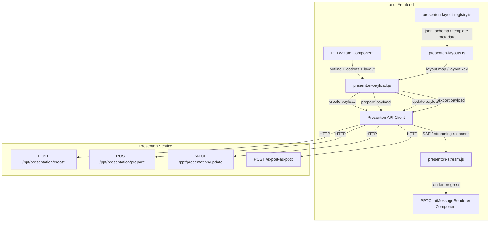
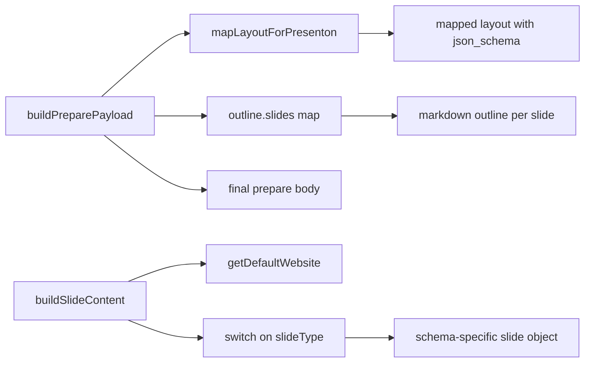
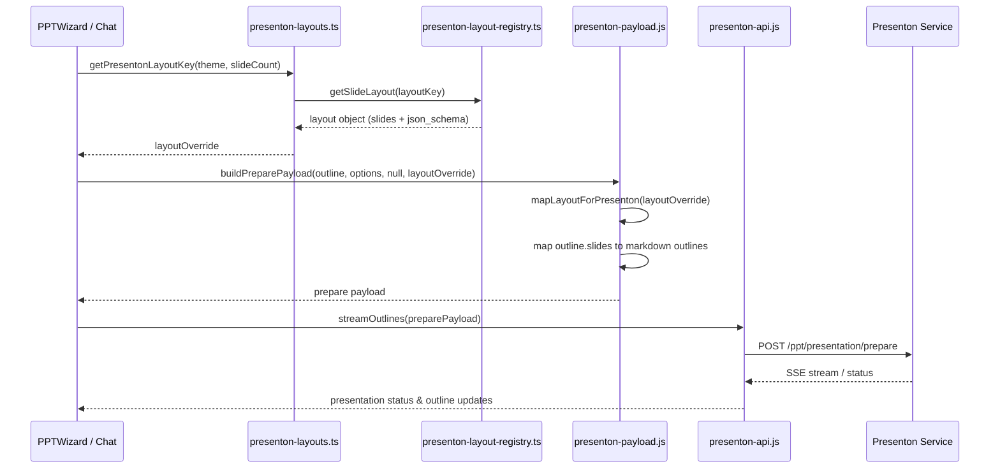
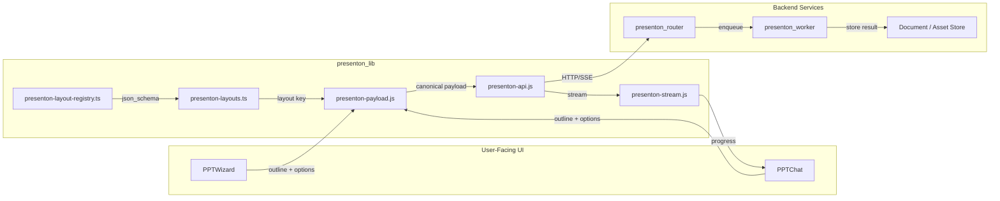

# presenton_lib_payload_builder

## Brief Introduction

The `presenton_lib_payload_builder` module is a frontend utility library in the `ai-ui` application responsible for constructing canonical API payloads for the **Presenton** presentation-generation service. It transforms application-level presentation outlines, layout registries, and user options into the exact JSON shapes expected by Presenton endpoints such as `/api/v1/ppt/presentation/create`, `/prepare`, `/update`, and export routes. The module also maps generic outline data to layout-specific slide schemas, enabling the AI-generated outlines produced elsewhere in the UI to be rendered consistently by the backend presentation engine.

---

## Module Purpose and Core Functionality

This module lives at `ai-ui/src/lib/presenton-payload.js` and exposes a set of pure builder functions. Its responsibilities are:

1. **Payload Normalization** – Convert UI/UX options (slide count, tone, language, verbosity, title, etc.) into the standardized request bodies required by Presenton.
2. **Layout Mapping** – Take a local layout registry object and reformat it into the structure the Presenton `/prepare` endpoint expects, including `json_schema`, `templateID`, and `templateName` per slide.
3. **Outline-to-Slide Conversion** – Transform a high-level outline (`{ title, slides: [{ title, bullets, chart, stats }] }`) into per-slide markdown outlines and, when needed, into schema-specific content objects.
4. **Slide Schema Adaptation** – Map generic slide data onto concrete slide layout schemas (e.g., `swift:IntroSlideLayout`, `swift:MetricsNumbers`, `swift:Timeline`) so that each slide receives the correct fields for its chosen template.
5. **Export & Update Helpers** – Provide ready-to-use payloads for updating an existing presentation or exporting it to `.pptx`/`.pdf`.

### Core Components

| Function | Purpose |
|----------|---------|
| `buildCreatePayload(prompt, options)` | Builds the payload for `POST /api/v1/ppt/presentation/create`. |
| `buildExportPayload(presentationId, title)` | Builds the payload for `POST /api/export-as-pptx` or `/api/export-as-pdf`. |
| `mapLayoutForPresenton(layout)` | Internal helper that reformats a local `TemplateGroup` layout into the Presenton layout contract. |
| `buildPreparePayload(outline, options, presentationId, layoutOverride)` | Builds the canonical payload for `POST /api/v1/ppt/presentation/prepare`. This is the primary integration point with the rest of the presentation flow. |
| `buildUpdatePayload(presentationId, title, nSlides, slides, userId)` | Builds the payload for `PATCH /api/v1/ppt/presentation/update`. |
| `getDefaultWebsite()` | Returns the default website/brand URL injected into slide content. |
| `buildSlideContent(slideType, slideData, index, total)` | Maps generic outline data to a specific slide layout schema. |

### Supported Slide Layouts

`buildSlideContent` currently understands the following `swift:` layout identifiers and emits schema-specific objects for each:

- `swift:IntroSlideLayout`
- `swift:simple-bullet-points-layout`
- `swift:MetricsNumbers`
- `swift:SwiftTableOfContents`
- `swift:Timeline`
- `swift:bullet-with-icons-title-description`
- `swift:icon-bullet-list-description-slide`
- `swift:image-list-description-slide`
- `swift:tableorChart`

Any unrecognized layout falls back to a generic `{ title, content, website }` object.

---

## Architecture and Component Relationships

The payload builder is a leaf utility in the `presenton_lib` family. It does not perform I/O; it only transforms data. Consumers pass in an outline, options, and a layout override, and receive a ready-to-send JSON body.

### Internal Component Interaction

### Data Flow for a Typical Prepare Request

---

## How It Fits into the Overall System

`presenton_lib_payload_builder` sits at the boundary between the AI-generated outline layer and the Presenton backend. It is part of the larger `presenton_lib` module group in `ai-ui`:

- **[presenton_lib_layout_registry](../reference/presenton_lib_layout_registry.md)** – Stores the canonical slide layout definitions, including `json_schema`, `templateID`, and `templateName`.
- **[presenton_lib_layout_mapping](../reference/presenton_lib_layout_mapping.md)** – Provides helpers such as `getPresentonLayoutKey`, `getPresentonLayoutId`, `createPresentonSlide`, and `getLayoutMap` to resolve the right layout for a given theme and slide count.
- **[presenton_lib_api_client](../api/presenton_lib_api_client.md)** – Handles HTTP/SSE communication with Presenton endpoints (`fetchTemplateLayout`, `streamOutlines`, `pollPresentationStatus`).
- **[presenton_lib_stream_reader](../reference/presenton_lib_stream_reader.md)** – Parses the server-sent event stream returned by Presenton.

Upstream UI consumers include:

- **[ppt_wizard](../reference/ppt_wizard.md)** – The step-by-step presentation creation wizard that collects topic, theme, and outline preferences.
- **[ppt_chat](../chat/ppt_chat.md)** – Chat-based presentation generation components that render progress and completion messages.

On the backend, the payloads produced by this module are consumed by:

- **[presenton_router](../api/presenton_router.md)** – FastAPI router exposing `generate_outline`, `generate_presentation`, `download_presentation`, `presentation_status`, `list_themes`, etc.
- **[presenton_worker](../presenton_worker.md)** – Background worker (`generate_ppt_job`) that performs the actual presentation generation job.

### System Context

---

## Key Design Decisions

1. **Pure Functions** – All exported builders are stateless and side-effect free, making them easy to unit test and safe to call from React render cycles.
2. **Layout Override Required** – `buildPreparePayload` intentionally throws if no `layoutOverride` is provided, enforcing that the caller has already resolved a valid layout from the registry.
3. **Markdown Outlines** – The prepare payload converts structured outline data into per-slide markdown strings. This gives the backend a consistent text representation while preserving hierarchy (title, bullets, charts, stats).
4. **Schema-Aware Fallback** – `buildSlideContent` uses a `switch` on `slideType` so that new layouts can be added without changing the outline format; unknown layouts degrade gracefully to a generic content object.
5. **Default Branding** – `getDefaultWebsite()` centralizes the brand URL (`your-ainxt-instance.example.com`) so that all generated slides share a consistent footer/website field.

---

## References

- [presenton_lib_layout_registry](../reference/presenton_lib_layout_registry.md) – Canonical layout definitions and JSON schemas.
- [presenton_lib_layout_mapping](../reference/presenton_lib_layout_mapping.md) – Layout key resolution and slide creation helpers.
- [presenton_lib_api_client](../api/presenton_lib_api_client.md) – HTTP/SSE client for Presenton endpoints.
- [presenton_lib_stream_reader](../reference/presenton_lib_stream_reader.md) – Server-sent event stream parser.
- [ppt_wizard](../reference/ppt_wizard.md) – UI wizard that drives presentation creation.
- [ppt_chat](../chat/ppt_chat.md) – Chat-based presentation generation UI.
- [presenton_router](../api/presenton_router.md) – Backend API router for Presenton.
- [presenton_worker](../presenton_worker.md) – Background worker that executes presentation generation jobs.
