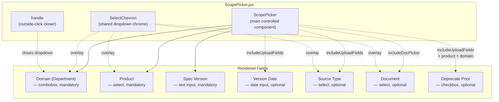
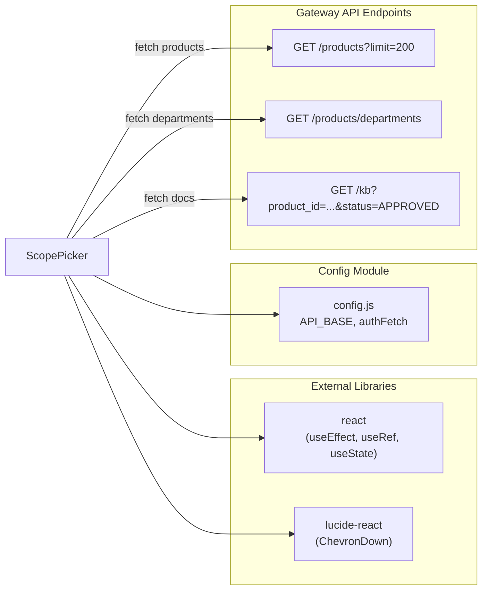
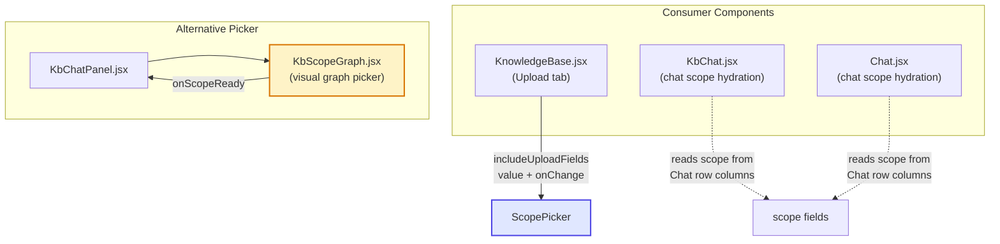
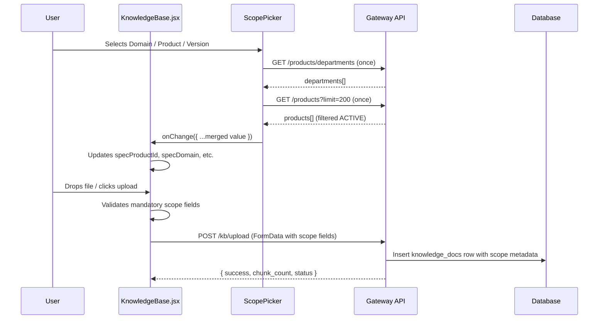
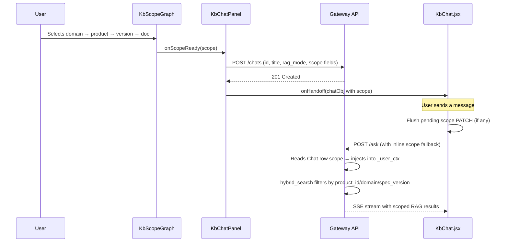
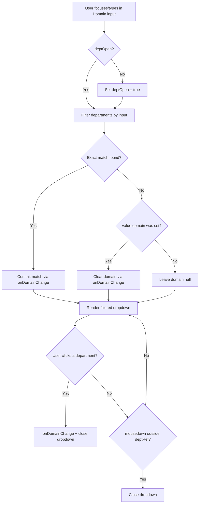

# ScopePicker Module

## Overview

`ScopePicker` is a shared, stateless React component that provides a single source of truth for Knowledge Base (KB) scope selection across the AI-UI frontend. It collects the four core scope fields — **Domain (Department)**, **Product**, **Spec Version**, and optionally **Document** — that determine which KB documents are reachable during RAG retrieval and how uploaded documents are catalogued.

The component is designed as a controlled input: the parent owns the `value` object and receives updates via `onChange`. This allows the same widget to serve two distinct surfaces without duplicating scope-selection logic:

| Surface | Mode | Extra Fields |
|---|---|---|
| **Knowledge Base Upload** (`KnowledgeBase.jsx`) | `includeUploadFields` | Version Date, Source Type, Deprecate Prior |
| **KB Chat scoping** (chat-side, via `includeDocPicker`) | `includeDocPicker` | Document pinning dropdown |

> **Note:** The chat-side scope selection has migrated to a visual graph-based picker (`KbScopeGraph`) rendered inside `KbChatPanel`. `ScopePicker`'s `includeDocPicker` mode remains available for any surface that needs a compact form-based document picker. See [kb_graph](#related-documentation) for the graph-based alternative.

---

## Architecture

### Component Structure



### Props Contract

| Prop | Type | Default | Description |
|---|---|---|---|
| `value` | `object` | `{}` | The current scope object (see below). Parent-owned. |
| `onChange` | `(next) => void` | — | Receives the full merged value object on every field change. |
| `includeDocPicker` | `boolean` | `false` | Renders the document-level picker (chat side). |
| `includeUploadFields` | `boolean` | `false` | Renders Version Date + Source Type + Deprecate Prior (upload side). |
| `disabled` | `boolean` | `false` | Disables all inputs (e.g. during upload). |
| `layout` | `"grid" \| "row"` | `"grid"` | UI density variant. `grid` = 2-column grid; `row` = flex-wrap. |
| `className` | `string` | `""` | Additional CSS classes on the root container. |

### Value Object Shape

```
{
  product_id:      string | null,   // mandatory — selected product UUID
  domain:          string | null,   // mandatory — department name (internal "domain" field)
  spec_version:    string | null,   // mandatory — free-text version label (e.g. "v3", "2025.1")
  version_date:    string | null,   // optional  — ISO date (upload only)
  deprecate_prior: boolean,         // optional  — deprecate older versions on approval (upload only)
  source_type:     string | null,   // optional  — BRD | FSD | TPMC_DECISION | RBI_CIRCULAR | ARCHITECTURE | SPEC | OTHER (upload only)
  kb_doc_id:       string | null,   // optional  — pin to a specific document (chat side)
}
```

---

## Dependencies



### Internal Dependencies

| Dependency | Source | Purpose |
|---|---|---|
| `API_BASE` | `../config` | Base URL for gateway API calls |
| `authFetch` | `../config` | Authenticated fetch wrapper (sends httpOnly cookie) |
| `ChevronDown` | `lucide-react` | Custom dropdown chevron overlay |

### Backend Endpoints

The component reuses three existing gateway endpoints — no dedicated ScopePicker API exists:

| Endpoint | Method | Purpose | Filtering |
|---|---|---|---|
| `/products?limit=200` | GET | Product list | Client filters to `status === "ACTIVE"` only |
| `/products/departments` | GET | Department list | Client filters out empty/whitespace strings |
| `/kb?product_id=...&status=APPROVED&limit=200` | GET | Document list (doc picker) | Scoped by `product_id`, optionally `spec_version` and `domain` |

---

## Consumers & Integration



### Primary Consumer: KnowledgeBase Upload

`KnowledgeBase.jsx` renders `ScopePicker` with `includeUploadFields` enabled. The parent maintains six pieces of state (`specProductId`, `specDomain`, `specVersion`, `specVersionDate`, `deprecatePrior`, `sourceType`) and merges them into the `value` prop. On upload, all scope fields are appended to the `FormData` sent to `POST /kb/upload`.

The upload flow enforces a mandatory-scope gate: Domain + Product + Spec Version must all be set before a file can be uploaded. A soft warning banner appears only after the user attempts an upload without these fields.

### Chat-Side Scope Hydration

Both `KbChat.jsx` and `Chat.jsx` no longer render `ScopePicker` directly. Instead, they hydrate the four scope columns (`product_id`, `domain`, `spec_version`, `kb_doc_id`) from the Chat row returned by `GET /chats/{id}/messages`. Scope changes are persisted via a debounced `PATCH /chats/{id}/scope` call (350 ms debounce, per-chat timer map).

The visual scope selection for KB chats is now handled by `KbScopeGraph` (rendered inside `KbChatPanel`), which produces the same scope tuple shape that `ScopePicker` emits, ensuring downstream consumers (`KbChatPanel.handleScopeReady`) work identically regardless of which picker was used.

---

## Data Flow

### Upload-Side Flow



### Chat-Side Scope Persistence



---

## State Management

`ScopePicker` manages only **fetch state** internally — all selection state is controlled by the parent:

| State | Type | Purpose |
|---|---|---|
| `products` | `array` | Cached product list from `/products` |
| `productsLoaded` | `boolean` | Tracks first-load completion (drives "No products" empty state) |
| `docs` | `array` | Document list for the doc picker (re-fetched on scope change) |
| `departments` | `array` | Department list from `/products/departments` |
| `deptsLoaded` | `boolean` | Tracks department list load |
| `deptOpen` | `boolean` | Department combobox dropdown visibility |
| `deptInput` | `string` | Department combobox text input (synced from `value.domain`) |

### Merge Pattern

Every field change calls `merge(patch)` which spreads the patch over the current `value` and invokes `onChange`:

```javascript
const merge = (patch) => onChange?.({ ...value, ...patch });
```

### Cascade Invalidation

Changing Product or Spec Version invalidates the document selection:

| Trigger | Effect |
|---|---|
| Product change | `kb_doc_id` reset to `null` |
| Version change | `kb_doc_id` reset to `null` |
| Domain change | Doc list re-fetched (domain is a query param) |

### AbortController for Doc Fetches

The document-picker fetch uses `AbortController` so rapid edits to `product_id` / `spec_version` / `domain` cancel orphan requests instead of piling up on the backend. The docs list is also cleared synchronously on each re-fetch to prevent a flash of stale cross-product documents.

---

## Source Type Enum

The `SOURCE_TYPES` constant mirrors the database `CHECK` constraint on `knowledge_docs.source_type` and `document_embeddings.source_type`. The order reflects upload-frequency expectation in the NPCI domain:

| Value | Label |
|---|---|
| `BRD` | BRD — Business Requirements |
| `FSD` | FSD — Functional Spec |
| `TPMC_DECISION` | TPMC Decision |
| `RBI_CIRCULAR` | RBI Circular |
| `ARCHITECTURE` | Architecture / Design |
| `SPEC` | Spec |
| `OTHER` | Other (safe default — server normalises empty string → NULL) |

---

## Styling & Cross-Browser Considerations

### Custom Select Chrome

The component uses a shared `SELECT_CLASS` constant and `SelectChevron` overlay to replace native dropdown arrows across all browsers. Key techniques:

- `appearance-none` + vendor-specific variants (`-webkit-appearance`, `-moz-appearance`, `&::-ms-expand:hidden`) kill the native caret
- An inline `SELECT_STYLE` fallback (`WebkitAppearance`, `MozAppearance`, `appearance`, `backgroundImage`) covers engines that strip Tailwind bracket variants
- `SelectChevron` renders a `ChevronDown` icon absolutely positioned over the right side of each select

### Conditional Text Color

`text-gray-*` is intentionally omitted from the base `SELECT_CLASS` and `INPUT_CLASS`. The callsite chooses between `text-gray-700` (resolved value) and `text-gray-300` (placeholder). Including a base color would cause the heavier shade to always win the Tailwind stylesheet-order tiebreak, making the placeholder color ineffective.

### Date Input Placeholder

`<input type="date">` doesn't render an HTML `placeholder` attribute. The "dd-mm-yyyy" hint is the browser's UA-styled datetime-edit pseudo-element. The component lights it up via Tailwind arbitrary variants (`[&::-webkit-datetime-edit-*]`) for WebKit browsers and falls back to `text-gray-300` for Firefox.

---

## Process Flow: Department Combobox

The Domain (Department) field uses a custom combobox pattern instead of a native `<select>` because the department list is dynamic and the user may type to filter:



An outside-click handler (`handle`) is registered on `document` via `mousedown` and checks whether the click target is contained within `deptRef`. This is cleaned up on unmount.

---

## Related Documentation

| Module | Relationship |
|---|---|
| [knowledge_base](../knowledge/knowledge_base.md) | Primary consumer — renders `ScopePicker` in the Upload tab with `includeUploadFields` |
| [kb_chat](../knowledge/kb_chat.md) | Hydrates scope fields from the Chat row; uses scope for RAG retrieval via `/ask` |
| [chat](../chat/chat.md) | Same scope hydration pattern as `kb_chat`; supports embedded KB mode |
| [config](../core/config.md) | Provides `API_BASE` and `authFetch` used by all API calls |
| [kb_graph](../knowledge/kb_graph.md) | Alternative visual graph-based scope picker (`KbScopeGraph`) used by `KbChatPanel` for chat-side scope selection |
