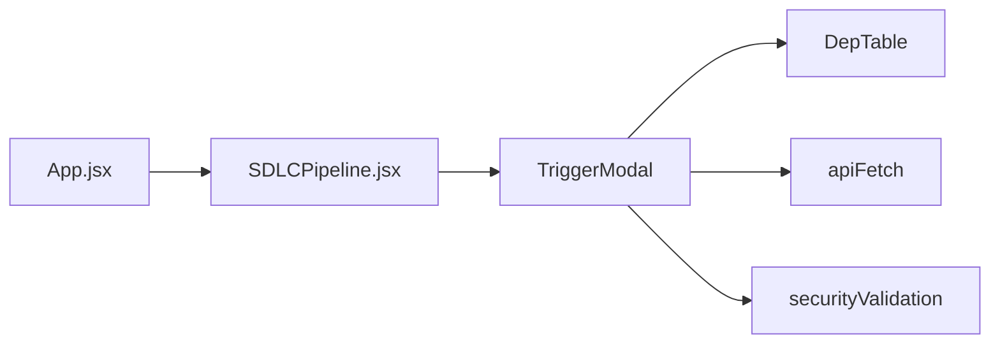
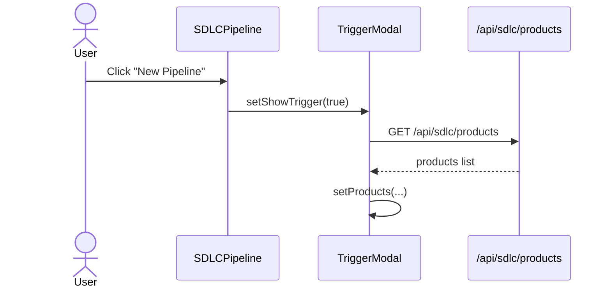
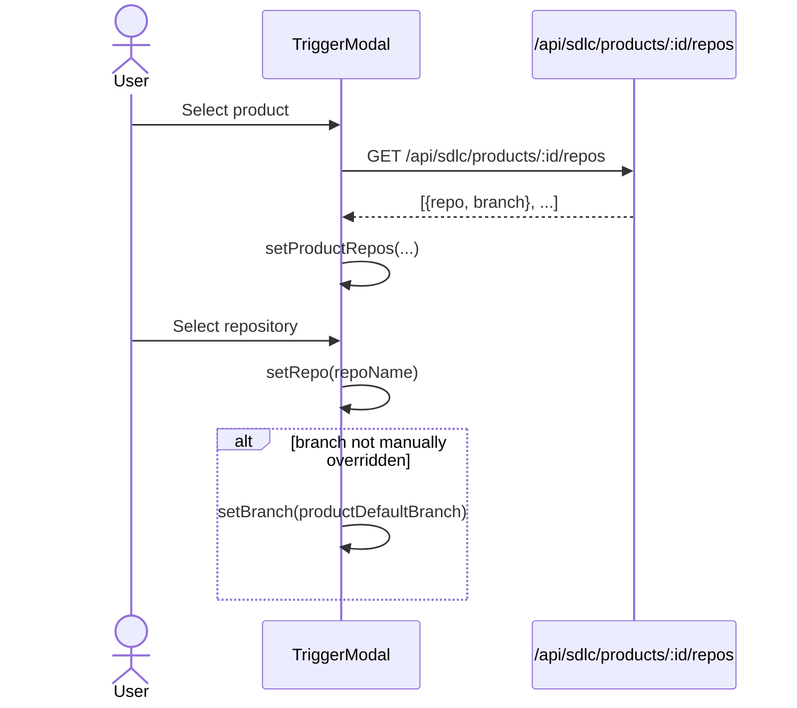
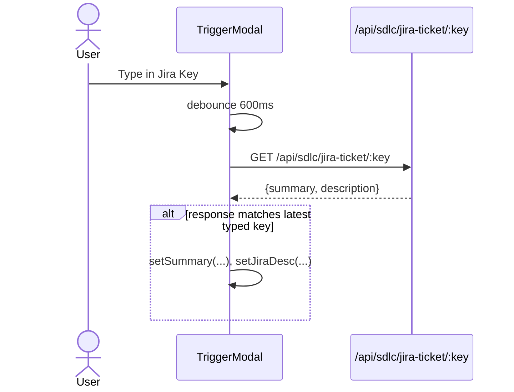
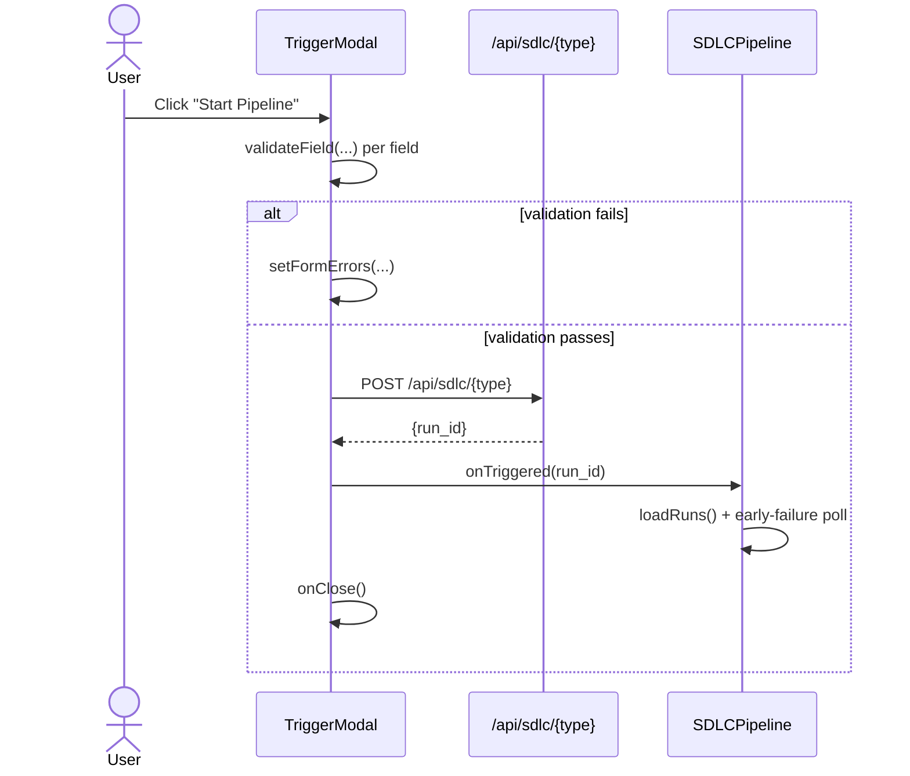

# trigger_modal

The `trigger_modal` module provides the **TriggerModal** React component used inside the AI-UI SDLC Pipeline view. It renders a modal dialog that lets users start a new SDLC pipeline run—either a `feature` pipeline, a `bug` fix pipeline, or a standalone `governance` review. The component collects the Jira ticket, repository/branch context, language override, optional multi-repo dependencies, and pipeline flags, then submits the request to the backend SDLC router.

---

## Overview

`TriggerModal` is a self-contained form component defined in `ai-ui/src/components/SDLCPipeline.jsx`. It is rendered by the parent [`sdlc_pipeline`](../sdlc/sdlc_pipeline.md) component when the user clicks **New Pipeline**. After a successful submission it returns the new `run_id` via the `onTriggered` callback so the parent can refresh the run list and begin early-failure polling.

The modal supports three trigger types:

| Type | Backend endpoint | Purpose |
|------|------------------|---------|
| `feature` | `POST /api/sdlc/feature` | Start a feature-development pipeline from a Jira ticket. |
| `bug` | `POST /api/sdlc/bug` | Start a bug-fix pipeline from a Jira ticket. |
| `governance` | `POST /api/sdlc/governance` | Run EA/IS/DPDP governance skills over an existing branch diff. |

---

## Core Responsibilities

1. **Collect pipeline inputs**
   - Jira key with auto-fetch of summary/description.
   - Product → repository → branch cascade.
   - Manual repository/branch entry as fallback.
   - Language override for cases where auto-detection may fail.

2. **Validate inputs client-side**
   - Jira key format (`PROJECT-123`).
   - Required fields per trigger type.
   - Branch name format.
   - Repository free-text sanitization.

3. **Support advanced options**
   - Skip tests + SLT.
   - Skip SLT generation only.
   - Opt-in governance review with a comma-separated skill subset.
   - Multi-repo dependencies (when enabled via `useMultiRepoEnabled`).

4. **Submit and hand off**
   - POST the assembled payload to the appropriate SDLC endpoint.
   - Surface backend errors in the UI.
   - Invoke `onTriggered(run_id)` on success and close the modal.

---

## Architecture

```mermaid
flowchart TB
    subgraph UI["AI-UI Frontend"]
        SDLCPipeline["SDLCPipeline<br/>(sdlc_pipeline)"]
        TriggerModal["TriggerModal<br/>(trigger_modal)"]
        DepTable["DepTable<br/>(dep_table)"]
    end

    subgraph Shared["Shared Utilities"]
        apiFetch["apiFetch<br/>(config)"]
        securityValidation["securityValidation<br/>(ai_ui_frontend_utils)"]
    end

    subgraph Backend["Backend SDLC API"]
        sdlc_router["sdlc_router<br/>(shared_api_routers)"]
        sdlc_worker["sdlc_worker<br/>(sdlc_pipeline_workers)"]
    end

    SDLCPipeline -->|renders when showTrigger=true| TriggerModal
    TriggerModal -->|uses for multi-repo deps| DepTable
    TriggerModal -->|HTTP requests| apiFetch
    TriggerModal -->|validateJiraKey, validateRepoName,<br/>validateBranch, validateSummary| securityValidation
    apiFetch -->|POST /api/sdlc/{feature,bug,governance}| sdlc_router
    sdlc_router -->|enqueues job| sdlc_worker
    TriggerModal -->|onTriggered(run_id)| SDLCPipeline
```

### Component Placement



---

## State Model

`TriggerModal` keeps all form state in local React `useState` hooks. The key state slices are:

| State | Type | Description |
|-------|------|-------------|
| `type` | `"feature" \| "bug" \| "governance"` | Active trigger tab. |
| `jiraKey`, `summary`, `jiraDesc` | `string` | Ticket metadata; `jiraDesc` is read-only preview text. |
| `repo`, `branch`, `branchOverridden` | `string`, `string`, `boolean` | Target repository and base branch; override flag prevents product auto-fill from clobbering user edits. |
| `langOverride` | `string` | Explicit language selection when repo auto-detection is unavailable. |
| `skipTests`, `skipSlt`, `runGovernanceReview`, `governanceSkillsInput` | `boolean` / `string` | Pipeline option flags. |
| `govBaseBranch`, `govBaseCommit`, `govHeadBranch` | `string` | Governance-only diff inputs. |
| `products`, `selectedProductId`, `productRepos` | `array` / `string` / `array` | Product → repo cascade data. |
| `deps` | `array` | Multi-repo dependency rows. |
| `formErrors` | `object` | Per-field validation messages. |
| `loading`, `jiraLoading`, `error`, `jiraMsg` | `boolean` / `string` / `object` | UI feedback state. |

---

## Data Flow

### 1. Opening the Modal



### 2. Product → Repository → Branch Cascade



### 3. Jira Auto-Fill



### 4. Submission Flow



---

## Validation Rules

Validation is delegated to [`securityValidation`](../ui/ai_ui_frontend_utils.md):

| Field | Rule | Error message source |
|-------|------|----------------------|
| Jira key | Required; must match `/^[A-Z][A-Z0-9_]+-\d+$/` | `validateJiraKey` |
| Summary | Required; free-text sanitized | `validateSummary` |
| Repository | Optional when product selected; otherwise free-text sanitized | `validateRepoName` |
| Branch | Optional; must match `/^[a-zA-Z0-9/_\-.]+$/` | `validateBranch` |

Governance mode has its own minimal validation: repository and head branch are required.

---

## Backend Integration

`TriggerModal` uses [`apiFetch`](../core/config.md) to talk to the SDLC endpoints exposed by [`sdlc_router`](../sdlc/sdlc_router.md). The backend then enqueues work through [`sdlc_worker`](../sdlc/sdlc_pipeline_workers.md).

### Feature / Bug Payload

```json
{
  "jira_key": "NPCI-1234",
  "summary": "Add refund API",
  "repo": "org/payments-service",
  "branch": "develop",
  "language_override": "java",
  "skip_tests": false,
  "skip_slt": false,
  "run_governance_review": true,
  "governance_skills": ["ea", "is"],
  "product_id": "prod-uuid",
  "dependencies": [
    { "repo": "org/shared-lib", "ref": "main", "kind": "compile-only" }
  ]
}
```

### Governance Payload

```json
{
  "product_id": "prod-uuid",
  "repo": "org/payments-service",
  "base_branch": "main",
  "base_commit": "abc1234",
  "head_branch": "feature/refund-api",
  "governance_skills": ["ea", "is", "dpdp"]
}
```

---

## Multi-Repo Dependencies

When `useMultiRepoEnabled()` returns `true`, the modal renders the [`DepTable`](../core/dep_table.md) component. `DepTable` automatically fetches declared dependencies from the primary repo's build manifest and merges them with any user-added rows. Each dependency carries:

- `repo` — dependency repository path.
- `ref` — branch/tag/commit.
- `kind` — e.g. `compile-only`.
- `source` — `manifest` (auto-fetched) or `user` (manually added).

See [`dep_table`](../core/dep_table.md) for the full dependency-table behavior.

---

## Governance Review Option

The **Run Governance Review** checkbox enables post-REVIEW execution of pluggable governance skills (EA, IS, DPDP) over the generated diff. Because the backend does not yet expose a catalog of skill slugs, the subset picker is a free-form comma-separated input. An empty value means "all loaded skills." The backend parsing is handled by `agents/sdlc_governance/config.py::parse_subset` (see [`sdlc_governance`](../sdlc/shared_core_sdlc_pipeline.md#sdlc_governance)).

---

## Error Handling

- **Field-level errors** are shown directly under each input after blur or on submit.
- **Form-level errors** (e.g. "Either a repository or a language override is required") appear above the action buttons.
- **Backend errors** are parsed from the response (`detail` field if JSON, otherwise raw text) and displayed in the same form-level error area.
- **Stale Jira fetches** are discarded via `_jiraLatestKeyRef` so out-of-order responses do not overwrite the form.

---

## Related Modules

| Module | Relationship |
|--------|--------------|
| [`sdlc_pipeline`](../sdlc/sdlc_pipeline.md) | Parent component that owns the modal visibility and run-list state. |
| [`dep_table`](../core/dep_table.md) | Child component for multi-repo dependency editing. |
| [`config`](../core/config.md) | Provides `apiFetch` for authenticated HTTP requests. |
| [`ai_ui_frontend_utils`](../ui/ai_ui_frontend_utils.md) | Provides `validateJiraKey`, `validateRepoName`, `validateBranch`, `validateSummary`. |
| [`sdlc_router`](../sdlc/sdlc_router.md) | Backend router that receives the trigger requests. |
| [`sdlc_pipeline_workers`](../sdlc/sdlc_pipeline_workers.md) | Background workers that execute the triggered pipelines. |
| [`shared_core_sdlc_pipeline`](../sdlc/shared_core_sdlc_pipeline.md) | Shared SDLC agent logic, including governance skill parsing. |

---

## Process Flow Summary

```mermaid
flowchart TD
    A[User opens Trigger Modal] --> B[Load products list]
    B --> C{Select product?}
    C -->|Yes| D[Load product repos]
    D --> E[Select repo & auto-fill branch]
    C -->|No| F[Enter repo/branch manually]
    E --> G[Enter Jira key]
    F --> G
    G --> H{Debounced Jira fetch}
    H -->|Success| I[Auto-fill summary & description]
    H -->|Fail| J[User types summary manually]
    I --> K[Configure options & dependencies]
    J --> K
    K --> L[Click Start Pipeline]
    L --> M{Validation passes?}
    M -->|No| N[Show field/form errors]
    M -->|Yes| O[POST to /api/sdlc/{type}]
    O --> P{Backend OK?}
    P -->|No| Q[Display backend error]
    P -->|Yes| R[Call onTriggered(run_id)]
    R --> S[SDLCPipeline refreshes run list]
    S --> T[Begin early-failure polling]
```
