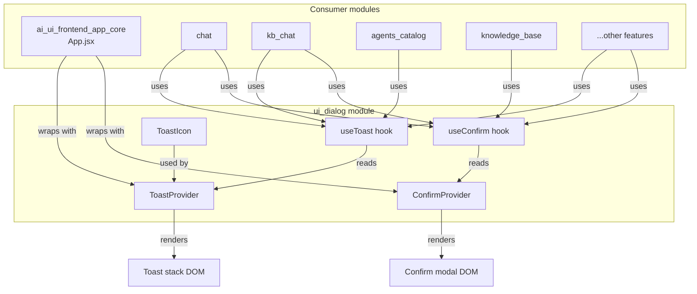
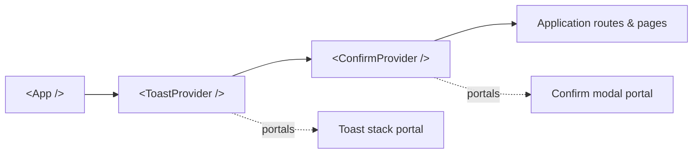
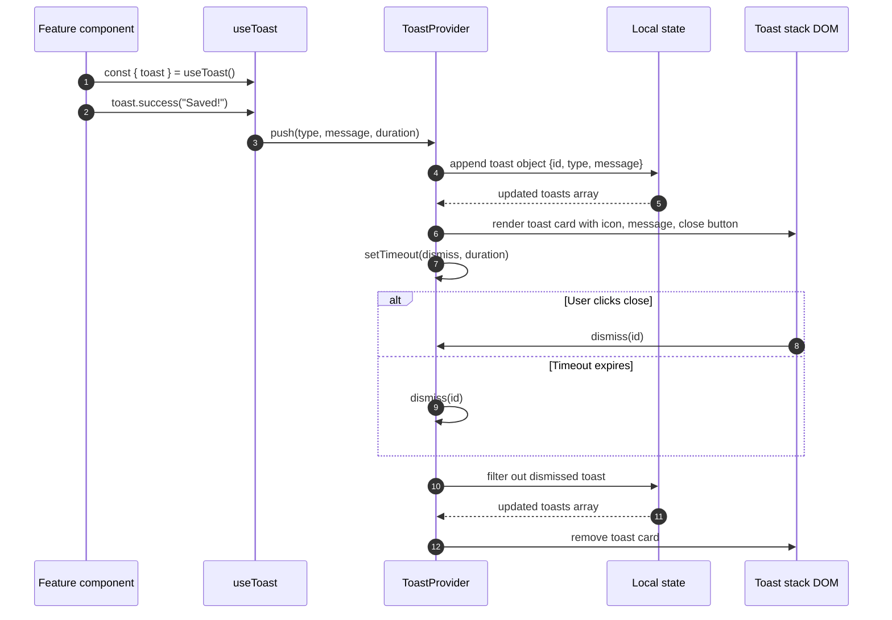
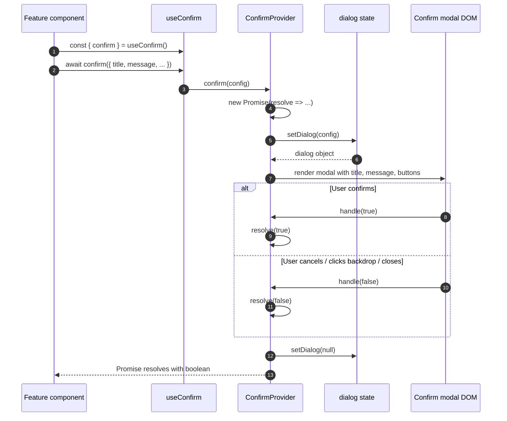
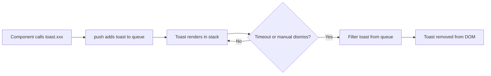
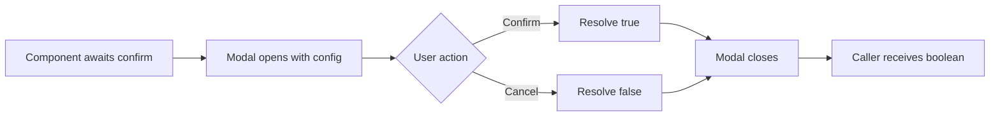

# ui_dialog Module

## Brief Introduction

The `ui_dialog` module is a lightweight, reusable React UI primitive layer in the `ai-ui` frontend application. It provides two global, context-driven interaction patterns used across the entire product surface:

1. **Toast notifications** — ephemeral, auto-dismissing feedback messages (success, error, warning, info).
2. **Confirmation dialogs** — promise-based modal confirmations for destructive or irreversible actions.

Implemented as React Context providers and hooks, the module centralizes notification and confirmation UX so that any component in the application can trigger a toast or request user confirmation without importing modal markup or managing local state.

---

## Core Components

### `ToastProvider` & `useToast`

`ToastProvider` mounts a global toast stack in the top-right corner of the viewport and exposes a `toast` API through React Context.

| Export | Purpose |
|--------|---------|
| `ToastProvider` | Context provider that renders the toast container and manages the toast queue. |
| `useToast` | Hook that returns `{ toast }` for pushing notifications. |
| `ToastIcon` | Internal component that maps a toast type to a colored `lucide-react` icon. |

**Supported toast types:**

- `toast.success(message)` — green, `CheckCircle` icon, 3-second duration.
- `toast.error(message)` — red, `AlertCircle` icon, 5-second duration.
- `toast.warn(message)` — yellow, `AlertTriangle` icon, 3-second duration.
- `toast.info(message)` — blue, `Info` icon, 3-second duration.

Toasts are stored in a local array, rendered as a fixed-position stack, and automatically dismissed after their configured duration. Users can also dismiss a toast manually via the close button.

### `ConfirmProvider` & `useConfirm`

`ConfirmProvider` renders a single global confirmation modal and exposes a promise-based `confirm` function through React Context.

| Export | Purpose |
|--------|---------|
| `ConfirmProvider` | Context provider that renders the confirmation modal when invoked. |
| `useConfirm` | Hook that returns `{ confirm }` for opening a confirmation dialog. |

**Configuration options:**

- `title` — modal header text.
- `message` — body text; rendered with `whitespace-pre-line` to support multi-line messages safely without HTML injection.
- `confirmLabel` — label for the primary action button (default: `"Confirm"`).
- `variant` — `"danger"` (red, warning icon) or `"primary"` (blue, info icon); default `"danger"`.

The `confirm` function returns a `Promise<boolean>` that resolves to `true` when the user confirms and `false` when the user cancels, clicks the backdrop, or closes the modal.

---

## Architecture

The module is intentionally small and self-contained. It depends only on React and `lucide-react` for iconography, and it exposes its functionality entirely through React Context hooks.

### Component Hierarchy

The providers are typically nested near the root of the application so that every routed page and feature component can access `useToast` and `useConfirm`.

---

## Dependencies

### Internal Dependencies

The `ui_dialog` module has no internal business-logic dependencies. It is a pure UI primitive.

### External Dependencies

| Dependency | Usage |
|------------|-------|
| `react` | Context, hooks (`useState`, `useCallback`, `useRef`, `useContext`), and JSX rendering. |
| `lucide-react` | Iconography for toasts and the confirmation modal (`X`, `AlertTriangle`, `CheckCircle`, `Info`, `AlertCircle`). |

### Downstream Consumers

Any feature module in `ai-ui` can consume the providers. Likely consumers based on the module tree include:

- [ai_ui_frontend_app_core](ai_ui_frontend_app_core.md) — wraps the application with `ToastProvider` and `ConfirmProvider`.
- [chat](../chat/chat.md) and [kb_chat](../knowledge/kb_chat.md) — display success/error toasts and request confirmation for destructive actions.
- [agents_catalog](../agents/agents_catalog.md) — confirms deletions and reports operation outcomes.
- [knowledge_base](../knowledge/knowledge_base.md) — confirms document removals and reports upload status.
- [workflows_feature](../workflows/workflows_feature.md), [triggers_feature](triggers_feature.md), and other feature modules — use toasts for user feedback.

> **Note:** Because the module is a generic primitive, individual consumer documentation should describe the specific user flows that trigger toasts or confirmations.

---

## Data Flow

### Toast Flow

### Confirmation Dialog Flow

---

## Component Interactions

### ToastIcon

`ToastIcon` is a pure presentational component that receives a `type` prop and returns the corresponding `lucide-react` icon with Tailwind color classes. It is only used inside `ToastProvider`.

### ToastProvider ↔ useToast

- `ToastProvider` creates the `toast` API object and stores it in `ToastContext`.
- `useToast` reads the context and returns `{ toast }`.
- If a component calls `useToast` outside of `ToastProvider`, an explicit error is thrown to aid debugging.

### ConfirmProvider ↔ useConfirm

- `ConfirmProvider` stores the `confirm` callback in `ConfirmContext`.
- `useConfirm` reads the context and returns `{ confirm }`.
- The `confirm` callback captures a resolver in a ref, updates local `dialog` state, and returns a promise that resolves when the user interacts with the modal.

---

## Process Flows

### Adding a New Toast Notification

### Requesting User Confirmation

---

## How It Fits into the Overall System

The `ui_dialog` module sits at the presentation layer of the `ai-ui` frontend. It does not communicate with the backend, manage application state, or implement business rules. Instead, it provides a consistent, accessible, and centralized way for all feature modules to:

- Communicate transient status to users (toasts).
- Guard destructive actions with explicit user consent (confirmation dialogs).

By co-locating the toast stack and confirmation modal at the root of the React tree, the module avoids duplicated modal markup across pages and ensures a uniform UX for notifications and confirmations throughout the application.

### Integration Points

| Integration | Description |
|-------------|-------------|
| Application root | `ToastProvider` and `ConfirmProvider` are mounted near the top of the component tree, typically inside [ai_ui_frontend_app_core](ai_ui_frontend_app_core.md). |
| Feature modules | Any feature can import `useToast` and `useConfirm` to trigger notifications or confirmations. |
| Styling | Uses Tailwind CSS utility classes for layout, color, and animation (`animate-slide-in`). |

---

## References

- [ai_ui_frontend_app_core](ai_ui_frontend_app_core.md) — application root that hosts the dialog providers.
- [chat](../chat/chat.md) — chat feature that uses toasts and confirmations.
- [kb_chat](../knowledge/kb_chat.md) — knowledge-base chat feature that uses toasts and confirmations.
- [agents_catalog](../agents/agents_catalog.md) — agent catalog feature that confirms destructive actions.
- [knowledge_base](../knowledge/knowledge_base.md) — knowledge-base management feature that reports upload/removal status.
