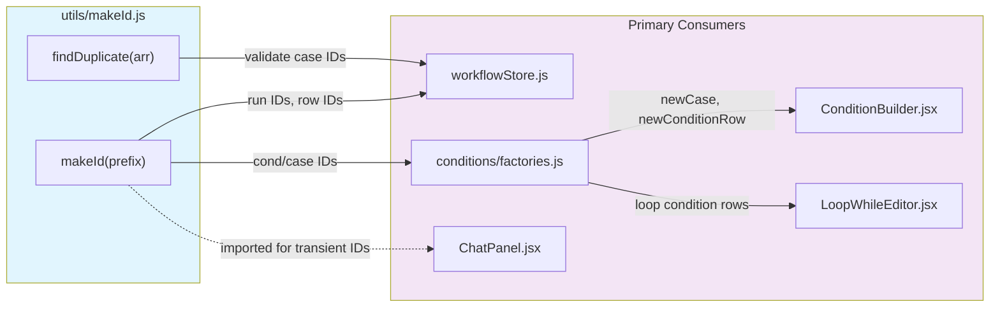
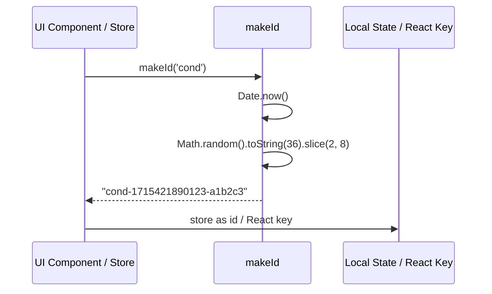
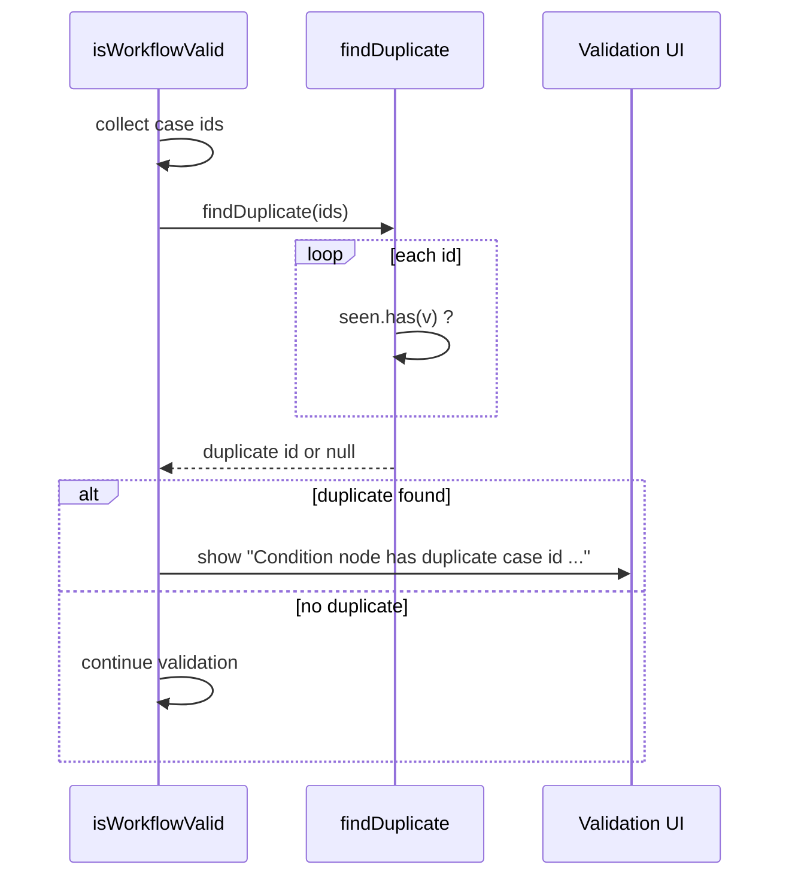

# utils_make_id

## Brief Introduction

`utils_make_id` is a small, dependency-free utility module in the AB Studio frontend. It provides two helpers for transient client-side data: `makeId`, which mints short, locally-unique identifiers, and `findDuplicate`, which detects the first repeated value in an array. The module is intentionally lightweight so it can be imported anywhere in the React application without pulling in store or framework code.

---

## Core Functionality

### `makeId(prefix?: string): string`

Generates a collision-resistant, transient identifier by combining the current timestamp with a random base-36 suffix.

```javascript
makeId('cond'); // e.g. "cond-1715421890123-a1b2c3"
makeId();       // e.g. "1715421890123-a1b2c3"
```

**Design rationale**

- `Date.now()` alone can collide when multiple IDs are generated in the same millisecond (e.g., during a bulk insert or rapid UI updates).
- A 6-character random suffix (`Math.random().toString(36).slice(2, 8)`) makes same-millisecond collisions extremely unlikely for client-side, in-memory entities.
- The optional `prefix` makes IDs self-describing, which simplifies debugging in React keys, debug logs, and serialized workflow payloads.

**Intended use cases**

- React keys for transient rows (condition cases, condition rows, loop conditions).
- Temporary IDs for attachments, chat messages, and debug-log rows before the backend assigns persistent IDs.
- Local session/run identifiers that do not need to be globally unique or cryptographically secure.

> **Note:** `makeId` is not a replacement for backend primary keys or `crypto.randomUUID()`. For persisted workflow nodes and edges, the workflow store uses its own `createWorkflowNodeId` / `createWorkflowEdgeId` helpers, which prefer `crypto.randomUUID` and only fall back to a similar timestamp+random pattern when `crypto` is unavailable. See store for details.

### `findDuplicate(arr: any[]): any | null`

Returns the first value that appears more than once in an iterable, or `null` if all values are unique.

```javascript
findDuplicate(['case-a', 'case-b', 'case-a']); // "case-a"
findDuplicate(['case-a', 'case-b', 'case-c']); // null
```

**Design rationale**

- Uses a single pass and a `Set`, giving O(n) time and O(n) space.
- Returns the duplicate value itself (not just a boolean) so callers can produce user-friendly error messages.

**Intended use cases**

- Validating user-created condition cases before a workflow run.
- Guarding against accidental duplicate IDs in any array-shaped domain object.

---

## Architecture & Component Relationships



### Relationship to sibling utility modules

`utils_make_id` sits alongside other frontend utilities in `ABStudio/frontend/src/utils/`:

- **[utils_editor_persistence](utils_editor_persistence.md)** — persists composer drafts and active threads to `localStorage`. It does not generate IDs, but the IDs it stores (thread IDs, workflow IDs) may originally come from `makeId` or the workflow store.
- **[utils_thread_helpers](utils_thread_helpers.md)** — formats chat threads and maps persisted history into UI messages. It uses its own inline ID pattern for history messages (`hist-${idx}-${random}`) rather than `makeId`, but both follow the same timestamp+random philosophy.

### Relationship to the workflow store

The workflow store is the most important consumer of `utils_make_id`:

- `makeId('run')` creates the `runId` for the Debug Log run context.
- `makeId('row')` creates stable identities for Debug Log timeline rows.
- `findDuplicate` validates that a condition node's case IDs are unique before execution.

The workflow store also defines its own ID generators for React Flow entities (`createWorkflowNodeId`, `createWorkflowEdgeId`, `createSessionWorkflowId`). Those generators prefer `crypto.randomUUID()` and only fall back to a `Date.now()` + random pattern when the Web Crypto API is unavailable. `makeId` is the simpler, deterministic utility used when cryptographic uniqueness is unnecessary.

### Relationship to condition editors

Condition cases and rows are created by `features/workflows/editor/conditions/factories.js`, which imports `makeId`:

- `newConditionRow()` → `{ id: makeId('cond'), ... }`
- `newCase()` → `{ id: makeId('case'), conditions: [newSimpleConditionRow()], ... }`

These factories are consumed by:

- `ConditionBuilder.jsx` and `ConditionCase.jsx` for the **Condition** node.
- `LoopWhileEditor.jsx` for the **Loop** node's "continue while" predicate.

---

## Data Flow

### ID generation flow



### Duplicate detection flow



---

## Process Flows

### Creating a new condition case

```mermaid
flowchart LR
    A[User clicks "Add Case"] --> B[ConditionBuilder calls newCase]
    B --> C[factories.js calls makeId('case')]
    C --> D[Case object with unique id]
    D --> E[ConditionBuilder renders case with stable React key]
```

### Starting a workflow run

```mermaid
flowchart LR
    A[User sends message] --> B[ChatPanel calls workflow store]
    B --> C[beginRunContext calls makeId('run')]
    C --> D[Debug Log run context initialized]
    D --> E[SSE events append rows via makeId('row')]
```

### Validating a condition node before run

```mermaid
flowchart LR
    A[isWorkflowValid] --> B[Extract case ids]
    B --> C[findDuplicate(ids)]
    C --> D{duplicate?}
    D -->|yes| E[Return validation error]
    D -->|no| F[Continue graph validation]
```

---

## API Reference

### `makeId(prefix?: string): string`

| Parameter | Type | Description |
|-----------|------|-------------|
| `prefix` | `string` (optional) | A short label prepended to the ID (e.g., `'cond'`, `'case'`, `'run'`). |

**Returns:** A string of the form `${prefix}-${Date.now()}-${rand}` or `${Date.now()}-${rand}`.

### `findDuplicate(arr: any[]): any | null`

| Parameter | Type | Description |
|-----------|------|-------------|
| `arr` | `Array` | The iterable to inspect. |

**Returns:** The first value that occurs more than once, or `null` if all values are unique.

---

## How It Fits into the Overall System

AB Studio's frontend is a React application built around a visual workflow editor. Many entities in the editor are created and destroyed client-side before ever reaching the backend:

- Condition cases and rows
- Loop continuation predicates
- Debug Log rows
- Chat attachments and placeholder messages

`utils_make_id` provides the minimal identity layer these transient entities need. By keeping the module tiny and free of external dependencies, it can be imported by utility factories, Zustand stores, and React components alike without creating circular dependencies or bloating bundles.

The module also enforces a consistent ID shape across the frontend. When an engineer sees an ID like `case-1715421890123-a1b2c3`, it is immediately recognizable as a client-generated, transient identifier produced by this utility.

---

## Related Documentation

- **workflowStore** — Uses `makeId` for Debug Log run/row IDs and `findDuplicate` for condition validation. Defines `createWorkflowNodeId` / `createWorkflowEdgeId` for persisted graph entities.
- **[utils_editor_persistence](utils_editor_persistence.md)** — Persists drafts and active threads; stores IDs generated elsewhere.
- **[utils_thread_helpers](utils_thread_helpers.md)** — Maps chat history to UI messages using a similar timestamp+random ID pattern.
- **[workflow_editor_conditions](../workflows/workflow_editor_conditions.md)** — Condition and loop editors that consume IDs from `conditions/factories.js`.
