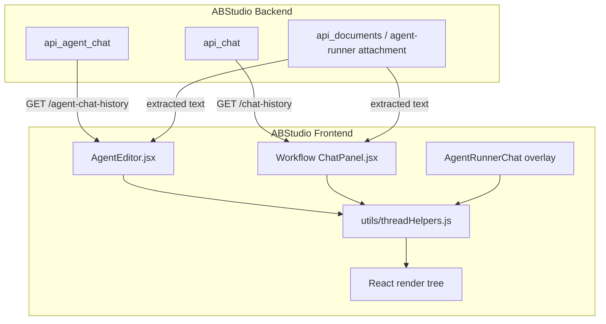
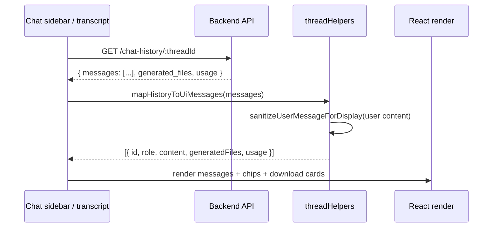
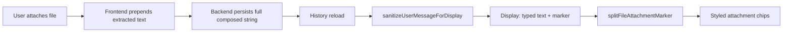

# `utils_thread_helpers` — Thread & Chat History Utilities

## Brief Introduction

`utils_thread_helpers` is a small, shared JavaScript utility module in the ABStudio frontend (`ABStudio/frontend/src/utils/threadHelpers.js`). It centralises the formatting, grouping, and display transformations required by every chat-history sidebar and message transcript in the application.

The module is intentionally UI-agnostic: it does not render components, manage network state, or know about React. Instead it exposes pure functions that convert server-side thread/message payloads into shapes that the React components can render directly. This avoids duplicating the same ~50 lines of date-formatting, message-mapping, and attachment-stripping logic across [AgentEditor](../agents/agents_feature.md), the Workflow ChatPanel, and any future agent-chat surfaces.

---

## Core Functionality

### 1. Thread list presentation

| Function | Purpose |
|----------|---------|
| `formatRelativeTime(isoTs)` | Converts an ISO timestamp into a compact relative label (`now`, `3m`, `2h`, `5d`, `3w`). |
| `getThreadGroup(thread)` | Buckets a thread into `Today`, `Yesterday`, `Last 7 Days`, or `Older` based on its `last_updated` field. |
| `groupThreads(threadsToGroup)` | Returns an ordered array of `[groupName, items]` tuples, dropping empty groups. |
| `threadTitle(thread)` | Safe accessor for `thread.title` with a fallback to `"New chat"`. |
| `threadPreview(thread)` | Safe accessor for `thread.last_message_preview` with a fallback to `"Continue the conversation"`. |

These five helpers power the chat-history sidebars in both the agent preview pane and the workflow builder preview pane. They are deterministic and have no external dependencies, which makes them trivial to unit-test.

### 2. Message history mapping

`mapHistoryToUiMessages(historyMessages)` transforms the server-persisted message array into UI-ready message objects.

For each message it:

1. Normalises `role` to either `"assistant"` or `"user"`.
2. Generates a stable-enough local id (`hist-{idx}-{random}`) so React can key list items.
3. Runs **user** messages through `sanitizeUserMessageForDisplay` so that raw parsed document text is not re-exposed in the bubble.
4. Preserves assistant metadata such as `generated_files` and `usage` so that download cards and cost/token footers re-appear on thread reload without re-running the agent.

### 3. Attachment display hygiene

When a user attaches a document, the frontend prepends the extracted text to the prompt before sending it to the backend. Two legacy prefix shapes exist in persisted history:

* **Workflow / Agent editor shape:** `[File: <name>]\n<parsed text>` … `\n\nUser question: <text>`
* **AgentRunnerChat overlay shape:** `Attached document "<name>":\n---\n<parsed text>\n---` … `\n\n<text>`

The backend stores the full composed string so the LLM has complete context on subsequent turns, but the UI must never show that raw dump on reload. The module provides three cooperating helpers:

| Function | Purpose |
|----------|---------|
| `sanitizeUserMessageForDisplay(content)` | Strips the prepended file blocks and returns only the typed question plus a compact italic marker: `_(N file(s) attached: name1, name2)_`. |
| `formatFileAttachmentMarker(filenames)` | Canonical writer for the marker string. |
| `splitFileAttachmentMarker(content)` | Splits a display string back into `{ text, filenames }` so the renderer can show styled attachment chips instead of leaking markdown italics. |

The writer/parser pair is kept in lock-step; a mismatch would cause history reloads to silently mis-parse attachment markers.

---

## Architecture & Component Relationships

### Module position



### Data flow on thread load



### Thread-list grouping flow

```mermaid
flowchart LR
    A[Raw threads array] --> B[groupThreads]
    B --> C[getThreadGroup per thread]
    C --> D[Bucket: Today / Yesterday / Last 7 Days / Older]
    D --> E[Filter empty groups]
    E --> F[Ordered [group, items] tuples]
    F --> G[Sidebar render]
```

### Attachment round-trip



---

## Component Interaction

### Consumers

The helpers are consumed by at least the following components:

* **[AgentEditor](../agents/agents_feature.md)** — uses `groupThreads`, `threadTitle`, `threadPreview`, and `formatRelativeTime` for the agent preview-mode history sidebar; uses `mapHistoryToUiMessages` when loading `/agent-chat-history`; uses `splitFileAttachmentMarker` to render user-bubble attachment chips.
* **Workflow ChatPanel** — uses the same set for the workflow preview-mode sidebar and transcript; uses `mapHistoryToUiMessages` when loading `/chat-history`.
* **AgentRunnerChat overlay** — referenced in comments as a consumer of the attachment sanitisation helpers.

### Dependencies

`utils_thread_helpers` has **zero runtime dependencies**. It only uses built-in JavaScript APIs (`Date.parse`, `String`, `Array`, `Math`, `RegExp`). This makes it safe to import from any frontend surface without pulling in stores, API clients, or UI libraries.

---

## How It Fits into the Overall System

The module sits at the boundary between the backend’s persisted chat model and the frontend’s render model.

* **Backend persistence** stores the full prompt (including extracted document text) so that agents can continue conversations accurately. See [api_agent_chat](../api/api_agent_chat.md) and [api_chat](../api/api_chat.md) for the endpoints that return these payloads.
* **Document extraction** is performed by the backend document pipeline (`api_documents` / `/agent-runner/attachment`). The raw extracted text is what the helpers later strip from display. See [api_documents](../api/api_documents.md) for details.
* **Frontend state** (workflow store, agent editor local state) holds the UI message list produced by `mapHistoryToUiMessages`.
* **Frontend rendering** consumes the normalised messages and the grouped thread list.

Because the module is pure, it can be reused by future chat surfaces — for example a standalone agent-runner page, a Teams-style thread view, or a mobile chat interface — without modification.

---

## Key Design Decisions

1. **Pure functions only.** No hooks, no API calls, no side effects. This keeps the module easy to test and import anywhere.
2. **Defensive parsing.** Malformed timestamps return empty strings or the `Older` bucket; unrecognised attachment prefixes are returned unchanged so user data is never lost.
3. **Lock-step marker pair.** `formatFileAttachmentMarker` and `splitFileAttachmentMarker` share a single canonical shape. Any change to one must change the other.
4. **No backend changes required.** The attachment marker trick lets the UI survive reloads without requiring the backend to persist a structured attachment list separately from the message content.

---

## References

* [agents_feature](../agents/agents_feature.md) — Agent editor and preview chat.
* workflow_editor_ChatPanel — Workflow builder chat panel.
* [api_agent_chat](../api/api_agent_chat.md) — Backend endpoints for agent chat threads and history.
* [api_chat](../api/api_chat.md) — Backend endpoints for workflow chat threads and history.
* [api_documents](../api/api_documents.md) — Document extraction and attachment handling that produces the raw text the helpers strip from display.
