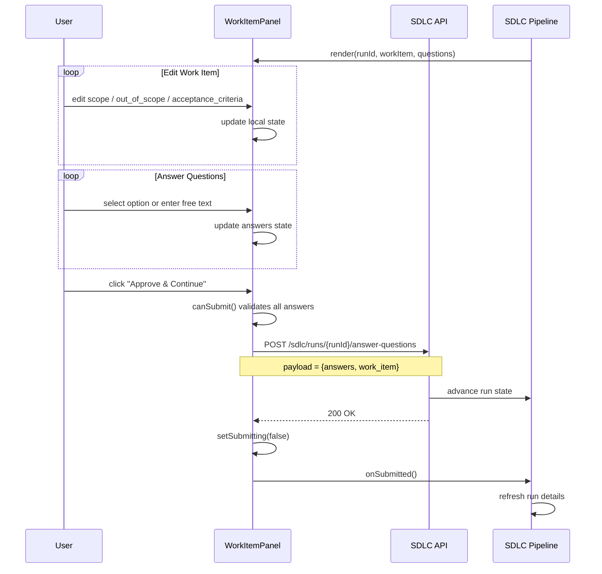
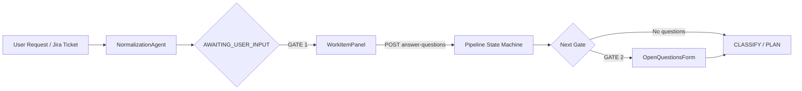

# WorkItemPanel

The `WorkItemPanel` is a React component in the `ai-ui` frontend that implements **GATE 1** of the SDLC pipeline — the *normalization* gate. It is displayed when a pipeline run reaches the `AWAITING_USER_INPUT` state after the `NormalizationAgent` has produced an initial `WorkItem`. The panel lets a human reviewer inspect, edit, and approve the work item (problem statement, scope, out-of-scope items, acceptance criteria, constraints, and technical hints) and answer any clarifying questions raised by the normalizer, all before the pipeline proceeds to the more expensive `CLASSIFY`/`PLAN` stages.

---

## Purpose and Core Functionality

`WorkItemPanel` centralizes the first human-in-the-loop checkpoint of the SDLC workflow. Its responsibilities are:

1. **Render the normalized work item** produced by the backend `NormalizationAgent`.
2. **Allow inline editing** of the editable sections: acceptance criteria, in-scope items, and out-of-scope items.
3. **Display read-only context** such as constraints and technical hints.
4. **Collect answers** to any `pending_questions` generated by the normalizer.
5. **Submit a single consolidated payload** to the backend endpoint `POST /sdlc/runs/{runId}/answer-questions`, containing both the edited work item and the answers.
6. **Gate downstream spend** by preventing `CLASSIFY`/`PLAN` CLI execution until the user explicitly approves the work item.

The component is intentionally lightweight: it does not support drag-reorder or rich text, using simple per-item inline text inputs for editable lists and radio buttons or free-text textareas for questions.

---

## Architecture

`WorkItemPanel` is a self-contained presentational/container component composed of four internal sub-components:

| Sub-component | Responsibility |
|---------------|----------------|
| `WorkItemPanel` | Main container. Manages state for the work item edits and answers, validates submission readiness, and calls the SDLC API. |
| `EditableList` | Reusable add/remove/edit list used for acceptance criteria, scope, and out-of-scope items. |
| `ReadOnlySection` | Collapsible display for constraints and technical hints. Highlights out-of-scope read-only sections with warning styling. |
| `InlineQuestion` | Renders a single pending question with optional recommended option, radio choices, and a free-text "Other" path. |

The component consumes the shared `apiFetch` utility from [`config`](../core/config.md) and uses icons from `lucide-react`.

```mermaid
graph TB
    subgraph "WorkItemPanel Component"
        A[WorkItemPanel] --> B[EditableList]
        A --> C[ReadOnlySection]
        A --> D[InlineQuestion]
        A --> E[handleApprove]
    end

    F[SDLCPipeline] -->|renders when run.status === AWAITING_USER_INPUT| A
    A -->|POST /sdlc/runs/{runId}/answer-questions| G[Backend SDLC Router]
    G --> H[NormalizationAgent / Pipeline State Machine]

    style A fill:#e1f5fe
    style F fill:#fff3e0
    style G fill:#f3e5f5
```

---

## Component Relationships

### Parent Context

`WorkItemPanel` is typically rendered by the [`SDLCPipeline`](../sdlc/sdlc_pipeline.md) component (or an equivalent SDLC run detail view) when the run is in the `AWAITING_USER_INPUT` state and `gate_kind === "normalization"`. It receives the following props:

| Prop | Type | Description |
|------|------|-------------|
| `runId` | `string` | The SDLC run identifier used in the API path. |
| `workItem` | `object` | The normalized work item object from the backend. |
| `questions` | `array` | Optional list of pending questions from the normalizer. |
| `onSubmitted` | `function` | Callback invoked after a successful submit so the parent can refresh run state. |

### Backend Integration

The component talks directly to the SDLC answer-questions endpoint:

```
POST {API_BASE}/sdlc/runs/{runId}/answer-questions
```

This endpoint is exposed by the [`sdlc_router`](../sdlc/sdlc_router.md) in the shared API routers layer and is handled by the backend SDLC pipeline state machine (see [`shared_core_sdlc_pipeline`](../sdlc/shared_core_sdlc_pipeline.md)).

### Related Frontend Components

- [`OpenQuestionsForm`](../core/open_questions.md) — Implements **GATE 2** (classify-stage questions). `WorkItemPanel` explicitly does not delegate to it; GATE 1 questions are answered inline so they can ride the same payload as the work item edits.
- [`SDLCPipeline`](../sdlc/sdlc_pipeline.md) — Orchestrates the overall SDLC run UI and decides which gate panel to render.

---

## Data Flow



---

## State Management

`WorkItemPanel` uses React `useState` for all local state:

| State | Initial Value | Purpose |
|-------|---------------|---------|
| `scope` | `workItem.scope \|\| []` | Editable in-scope list. |
| `outOfScope` | `workItem.out_of_scope \|\| []` | Editable out-of-scope list. |
| `acceptanceCriteria` | `workItem.acceptance_criteria \|\| []` | Editable acceptance criteria list. |
| `answers` | Derived from `questions` | One answer object per pending question. |
| `submitting` | `false` | Loading flag for the submit button. |
| `error` | `null` | Holds any API or validation error message. |

The `answers` state is initialized so that:
- Questions with options default to the `recommended` option if one is provided.
- Questions without options default to `useOther: true` and require free-text input.

---

## Submission Payload

When the user clicks **Approve & Continue**, `handleApprove` builds the following payload:

```json
{
  "answers": [
    {
      "selected_option": 0,
      "answer": "Selected option text or free-text answer"
    }
  ],
  "work_item": {
    "scope": ["..."],
    "out_of_scope": ["..."],
    "acceptance_criteria": ["..."]
  }
}
```

- `selected_option` is `null` when the user chose "Other" or the question had no options.
- `answer` contains either the selected option text or the trimmed free-text value.
- The `work_item` object always includes the latest edited values, even if no edits were made.

---

## Validation and Error Handling

- **Client-side validation**: `canSubmit()` ensures every answer is complete before enabling the submit button. For "Other" answers, the free-text field must be non-empty; for option-based answers, a numeric option must be selected.
- **Server-side errors**: Any non-OK response is parsed as JSON (falling back to raw text) and surfaced in the inline error banner.
- **Empty questions**: The panel fires unconditionally, even when `questions` is empty, because the edited work item itself must always be submitted.

---

## How It Fits into the System

`WorkItemPanel` sits at the boundary between the automated SDLC pipeline and human reviewers. It is the first gate in a multi-gate approval flow:

1. **GATE 1 — Normalization** (`WorkItemPanel`): Confirm the problem statement, scope, and acceptance criteria.
2. **GATE 2 — Classify/Plan** ([`OpenQuestionsForm`](../core/open_questions.md)): Answer deeper planning questions after the work item is locked.

By separating these gates, the system avoids spending compute on `CLASSIFY`/`PLAN` LLM calls until the human has validated the normalized understanding of the request.



---

## Dependencies

- **Runtime**: React (`useState`), `lucide-react` icons.
- **API client**: `apiFetch` and `API_BASE` from [`config`](../core/config.md).
- **Backend endpoint**: `POST /sdlc/runs/{runId}/answer-questions` exposed by [`sdlc_router`](../sdlc/sdlc_router.md).
- **Pipeline orchestration**: [`SDLCPipeline`](../sdlc/sdlc_pipeline.md) and the backend [`shared_core_sdlc_pipeline`](../sdlc/shared_core_sdlc_pipeline.md).

---

## References

- [`SDLCPipeline`](../sdlc/sdlc_pipeline.md) — Parent SDLC run UI orchestrator.
- [`OpenQuestionsForm`](../core/open_questions.md) — GATE 2 question form for classify/plan stage.
- [`sdlc_router`](../sdlc/sdlc_router.md) — Backend router exposing `answer-questions`.
- [`shared_core_sdlc_pipeline`](../sdlc/shared_core_sdlc_pipeline.md) — Backend SDLC state machine and normalization logic.
- [`config`](../core/config.md) — Shared frontend API configuration and `apiFetch` helper.
