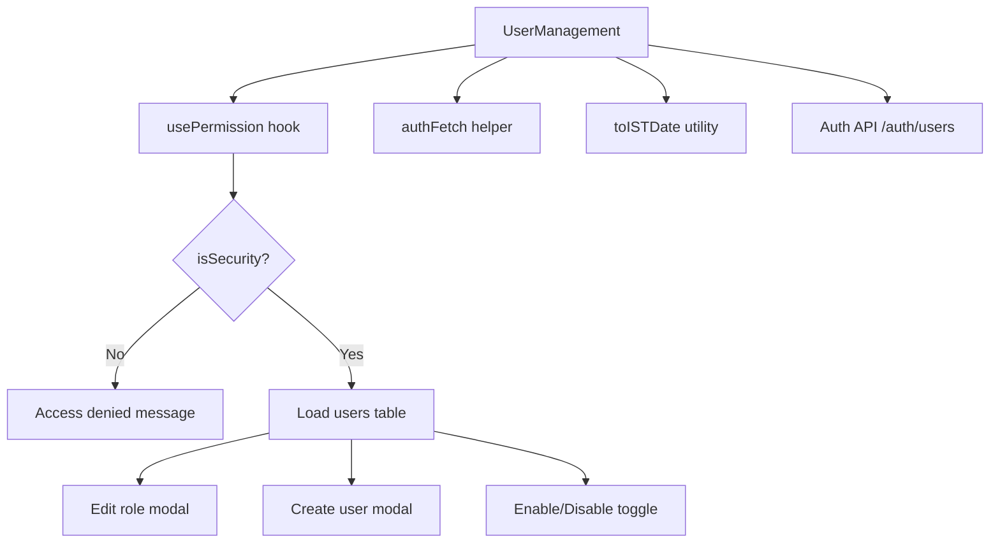
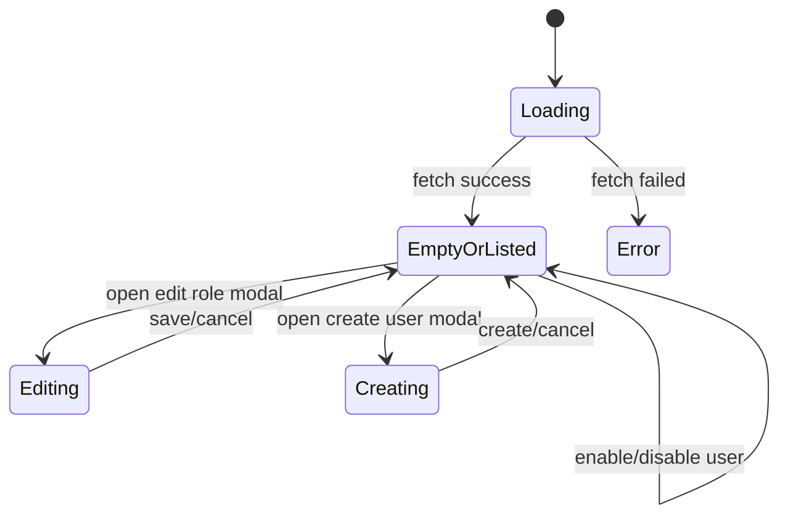
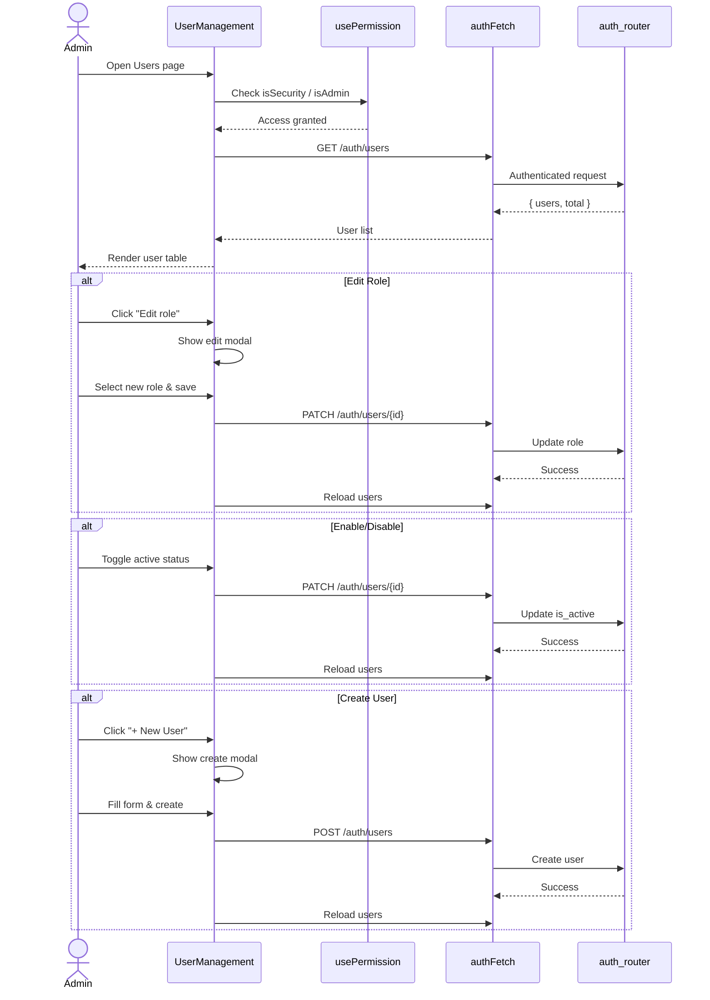
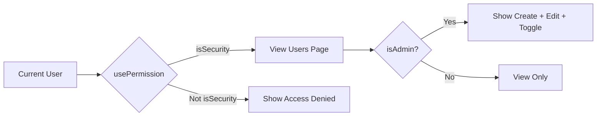
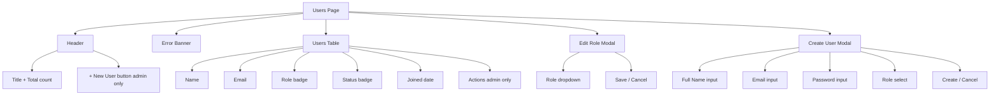

# User Management Module

## Brief Introduction

The **User Management** module provides the administrative interface for viewing, creating, and modifying platform user accounts within the `ai-ui` frontend. It is implemented as a single React component, `UserManagement`, and is gated behind role-based access so that only users with `security` or `admin` privileges can manage accounts. The module supports listing registered users, editing user roles, enabling/disabling accounts, and creating new users with an initial temporary password.

This module is part of the broader [ai_ui_frontend](ai_ui_frontend.md) application and consumes the [auth_router](auth_router.md) backend endpoints for user lifecycle operations.

---

## Core Functionality

### 1. User Listing

The component loads the full list of registered users from the backend on mount:

- **Endpoint:** `GET {API_BASE}/auth/users`
- **Response:** `{ users: [...], total: <number> }`
- **Displayed fields:** name, email, role, active/disabled status, and registration date (converted to IST).

### 2. Role Management

Administrators can change a user's role via a modal dialog. Supported roles are:

| Role       | Description                              |
|------------|------------------------------------------|
| `viewer`   | Read-only access                         |
| `developer`| Can build and run agents/workflows       |
| `operator` | Operational control and monitoring       |
| `security` | Security and user administration         |
| `admin`    | Full platform administration             |

- **Endpoint:** `PATCH {API_BASE}/auth/users/{userId}`
- **Payload:** `{ role: "<role>" }`

### 3. Account Enable/Disable

Administrators can toggle a user's active state:

- **Endpoint:** `PATCH {API_BASE}/auth/users/{userId}`
- **Payload:** `{ is_active: <boolean> }`

### 4. User Creation

Administrators can create new users with a temporary password:

- **Endpoint:** `POST {API_BASE}/auth/users`
- **Payload:** `{ name, email, password, role }`

---

## Architecture

### Component Structure

### State Management

---

## Dependencies

### Frontend Dependencies

| Dependency | Module | Purpose |
|------------|--------|---------|
| `usePermission` | [ai_ui_frontend_hooks](ai_ui_frontend_hooks.md) | Role-based access check (`isAdmin`, `isSecurity`) |
| `authFetch` | [ai_ui_frontend_config](ai_ui_frontend_config.md) | Authenticated HTTP requests |
| `toISTDate` | [ai_ui_frontend_utils](ai_ui_frontend_utils.md) | Date formatting to IST timezone |

### Backend Dependencies

| Dependency | Module | Purpose |
|------------|--------|---------|
| `GET /auth/users` | [auth_router](auth_router.md) | List all users |
| `POST /auth/users` | [auth_router](auth_router.md) | Create a new user |
| `PATCH /auth/users/{id}` | [auth_router](auth_router.md) | Update role or active status |

---

## Data Flow

---

## Access Control

The module enforces two levels of access:

1. **Security/Admin gate:** The entire page is hidden unless `isSecurity` is true. This is checked via the `usePermission` hook.
2. **Admin-only actions:** The "New User" button and the "Actions" column (edit role, enable/disable) are only rendered when `isAdmin` is true.

---

## UI Layout

---

## Error Handling

- **Load failures:** Displayed in the error banner at the top of the page.
- **Update/create failures:** Backend error detail is shown inline in the relevant modal or banner.
- **Unauthorized access:** A centered message informs the user that the page requires a Security or Admin role.

---

## Integration with the Overall System

The User Management module is one of several administrative features in the `ai-ui` frontend. It integrates with the platform's authentication and authorization layer:

- **Authentication:** Uses `authFetch` to include the current session token in all requests.
- **Authorization:** Relies on the backend's `auth_router` to enforce admin/security checks server-side, even though the UI also gates actions.
- **RBAC:** The roles managed here (`viewer`, `developer`, `operator`, `security`, `admin`) align with the platform-wide role-based access control implemented in [auth_rbac](auth_rbac.md).

For related administrative interfaces, see:

- [Budget Manager](budget_manager.md) — budget allocation and approvals
- [Model Governance](model_governance.md) — model access permissions
- [Level Overrides](level_overrides.md) — temporary permission elevation
- [Endpoint Manager](endpoint_manager.md) — API key and endpoint management

---

## File Reference

| File | Component | Responsibility |
|------|-----------|--------------|
| `ai-ui/src/components/UserManagement.jsx` | `UserManagement` | Main user administration UI |
