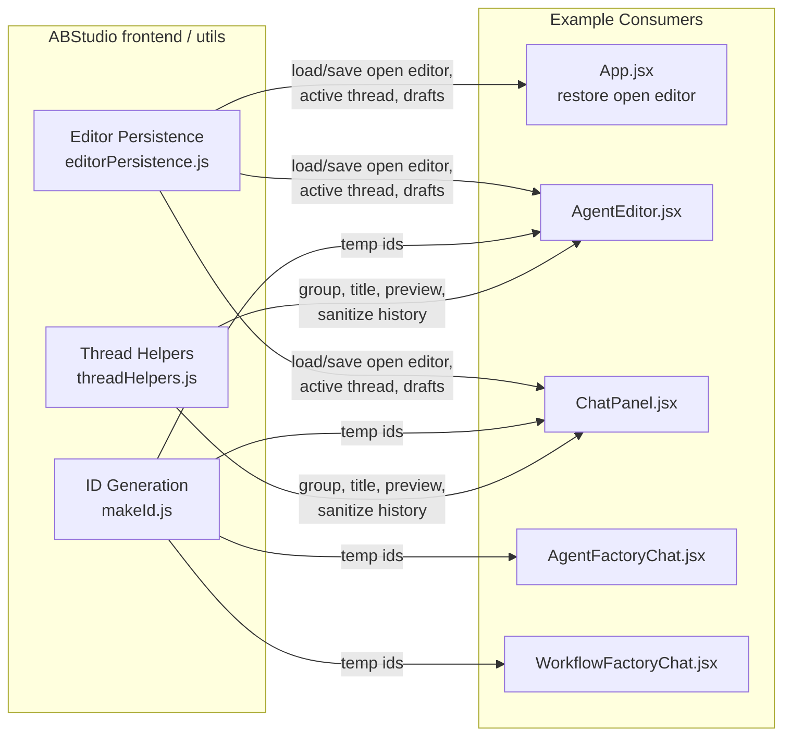
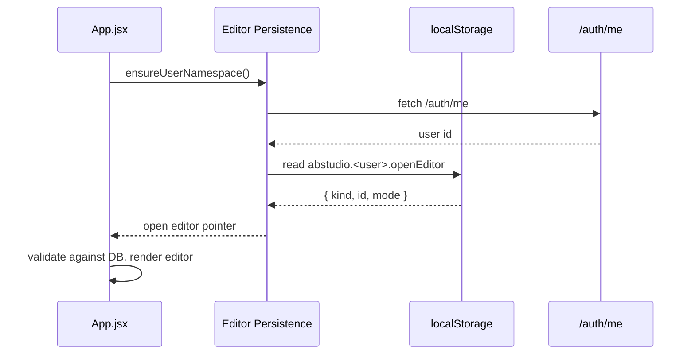

# ABStudio Frontend — `utils`

## Purpose

The `utils` module is a collection of small, framework-agnostic JavaScript helpers shared across the ABStudio React frontend. It is intentionally thin: it contains no UI components, no business logic, and no server calls (with one optional identity-resolution helper). Instead it provides three focused capabilities that many features need:

1. **Client-side UI state persistence** — remembering which editor is open, the active chat thread, unsent composer drafts, and the selected workflow node across page reloads.
2. **Transient ID generation** — creating locally-unique ids for client-only entities such as temp messages, condition rows, and attachments.
3. **Thread / chat-history formatting** — grouping, titling, previewing, and sanitizing chat threads and messages so multiple chat UIs render history consistently.

All real data (workflows, agents, chat history, configuration) continues to live in the backend database; `utils` only stores lightweight *view-state* pointers in `localStorage`.

---

## Architecture Overview



### Design Principles

| Principle | How it is applied |
|-----------|-------------------|
| **Database remains source of truth** | `localStorage` only holds UI pointers (editor id, thread id, draft text, selected node). |
| **User-namespaced storage** | Keys are prefixed with the authenticated user id resolved from `/auth/me`, falling back to `anon`. |
| **Graceful degradation** | All `localStorage` reads/writes are wrapped in `try/catch` so private-mode or quota errors never crash the app. |
| **Synchronous writes for drafts** | Composer drafts and active threads are written synchronously so a reload never loses in-progress text. |
| **Shared formatting** | Thread grouping, relative timestamps, and attachment-marker parsing live in one place so every chat pane behaves identically. |

---

## Sub-Modules

| Sub-module | File | Responsibility | Detailed Docs |
|------------|------|----------------|---------------|
| **Editor Persistence** | `editorPersistence.js` | User-namespaced `localStorage` for open editor, active thread, composer drafts, and selected workflow node. | [utils_editor_persistence](utils_editor_persistence.md) |
| **ID Generation** | `makeId.js` | Locally-unique transient ids and duplicate detection. | [utils_make_id](utils_make_id.md) |
| **Thread Helpers** | `threadHelpers.js` | Thread grouping, relative time, title/preview, history-to-UI mapping, and file-attachment marker handling. | [utils_thread_helpers](utils_thread_helpers.md) |

---

## How `utils` Fits into the System

`utils` is a leaf dependency: no other module in the tree depends on it for business rules, and it depends only on generic platform primitives (`platformFetch` from the frontend config). It is consumed by higher-level feature modules such as:

- **[app_core](app_core.md)** — restores the previously open editor on initial load.
- **[agents_feature](agents_feature.md)** — `AgentEditor` and `AgentFactoryChat` use thread helpers and id generation.
- **[workflows_feature](workflows_feature.md)** / **[workflow_editor](workflow_editor.md)** — `ChatPanel`, `Canvas`, and `ConfigPanel` rely on thread helpers, persistence, and transient ids.

Because the helpers are pure functions or thin `localStorage` wrappers, they can be imported by any future feature without adding coupling.

---

## Data Flows

### Restoring the Editor After Reload



### Mapping Persisted History to UI Messages

```mermaid
flowchart LR
    A[Server history messages] --> B{role?}
    B -->|assistant| C[Keep raw content + generated files + usage]
    B -->|user| D[sanitizeUserMessageForDisplay]
    D --> E[Strip [File: ...] blocks]
    D --> F[Strip Attached document blocks]
    D --> G[Append "_(N files attached: ...)_" marker]
    C & G --> H[UI message array]
```

---

## Cross-Cutting Concerns

- **Identity resolution** — `editorPersistence.js` fetches `/auth/me` once and caches `id`, `department`, and `can_approve`. The fetch is bounded by a 4-second timeout so a slow auth endpoint cannot block UI restore.
- **Namespace fallback** — Until `/auth/me` resolves, keys use the `anon` namespace; reads also check `anon` so drafts saved before identity resolution are not lost.
- **Storage quota** — All writes silently catch exceptions; the UI degrades to non-persistent behavior rather than throwing.
- **Attachment marker contract** — `formatFileAttachmentMarker` and `splitFileAttachmentMarker` are kept in lock-step so that a message sanitized for display can later be split back into text + filenames by the renderer.

---

## See Also

- [utils_editor_persistence](utils_editor_persistence.md)
- [utils_make_id](utils_make_id.md)
- [utils_thread_helpers](utils_thread_helpers.md)
- [app_core](app_core.md)
- [agents_feature](agents_feature.md)
- [workflow_editor](workflow_editor.md)
