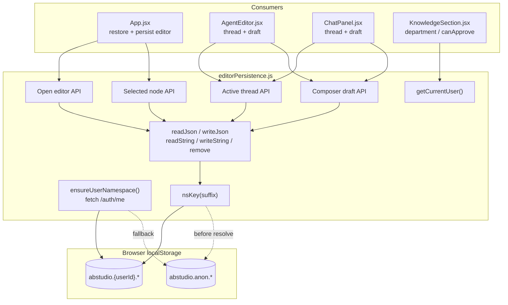
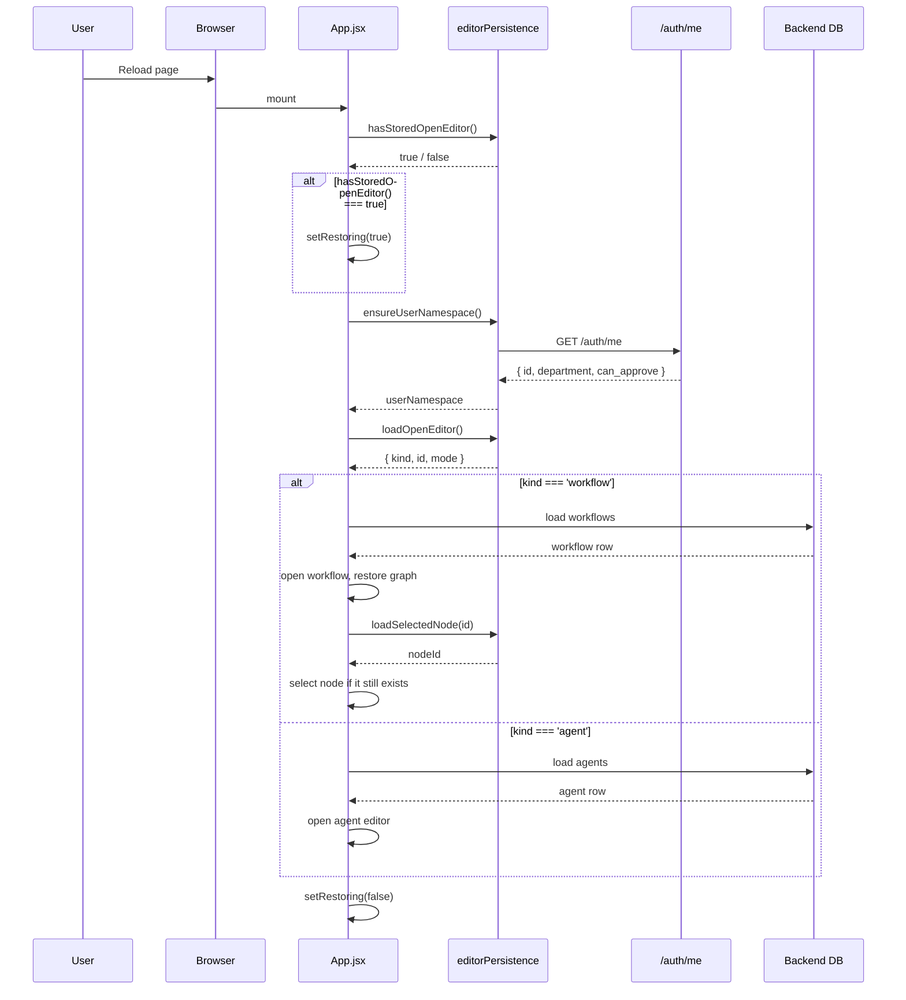
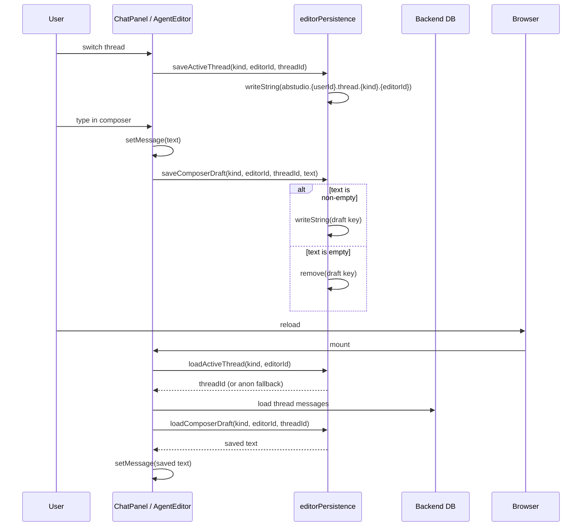
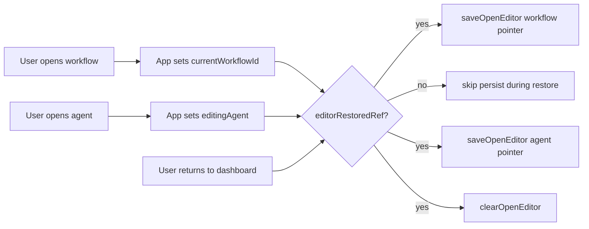

# utils_editor_persistence

## Brief Introduction

`utils_editor_persistence` is a small, client-side persistence utility for the ABStudio frontend. It persists **Build Studio UI view-state** in `localStorage` so that a page reload can restore the user's last open editor, active chat thread, unsent composer draft, and selected workflow node. It deliberately does **not** store real application data — the backend database remains the single source of truth for workflows, agents, chat history, and configuration.

The module is user-namespaced: keys are prefixed with the authenticated user's id (fetched once from `/auth/me`), with an `anon` fallback for unauthenticated or standalone development scenarios. All storage operations degrade silently on quota errors or unavailable `localStorage`.

---

## Core Responsibilities

| Concern | What is persisted | Why |
|---|---|---|
| **Open editor pointer** | `{ kind: 'workflow' \| 'agent', id, mode }` | Reopen the last editor after reload |
| **Active chat thread** | `threadId` per `(kind, editorId)` | Return to the same conversation |
| **Composer draft** | Unsent text per `(kind, editorId, threadId)` | Recover text typed but not sent |
| **Selected workflow node** | `nodeId` per `workflowId` | Reopen the config panel that was visible |
| **Current user identity** | `{ id, department, canApprove }` | Drive KB uploader banners and approver pickers |

---

## Module Architecture



---

## Component Reference

### Identity & Namespace

#### `ensureUserNamespace()`
Resolves the authenticated user id once by calling `/auth/me`. The result is cached for the lifetime of the module, and subsequent calls return the same promise. A 4-second timeout prevents a slow or unreachable auth endpoint from blocking the editor restore path. On failure or timeout, the namespace remains `anon`.

#### `getCurrentUser()`
Returns the cached identity synchronously. Until `ensureUserNamespace()` resolves, it returns the `anon` defaults (`{ id: null, department: '', canApprove: false }`). Components that render identity-dependent UI should re-read after awaiting `ensureUserNamespace()`.

### Open Editor Pointer

| Function | Purpose |
|---|---|
| `loadOpenEditor()` | Read the stored `{ kind, id, mode }` pointer for the current user |
| `hasStoredOpenEditor()` | Namespace-agnostic check: does **any** user have a stored open-editor pointer? |
| `saveOpenEditor(pointer)` | Persist the current open editor |
| `clearOpenEditor()` | Remove the stored pointer |

`hasStoredOpenEditor()` is used by [App.jsx](app_core.md) to decide whether to show a neutral loading splash on first render while the async restore resolves, avoiding a dashboard flash.

### Active Chat Thread

| Function | Purpose |
|---|---|
| `loadActiveThread(kind, editorId)` | Return the last active thread id for an editor |
| `saveActiveThread(kind, editorId, threadId)` | Persist the active thread id |

Reads check both the resolved user namespace and the `anon` fallback, so a value saved before `/auth/me` resolved is not lost.

### Composer Draft

| Function | Purpose |
|---|---|
| `loadComposerDraft(kind, editorId, threadId)` | Return unsent text for a thread |
| `saveComposerDraft(kind, editorId, threadId, text)` | Persist or remove unsent text |
| `clearComposerDraft(kind, editorId, threadId)` | Explicitly remove a draft |

Drafts are keyed per thread so switching threads shows the correct draft for each conversation.

### Selected Workflow Node

| Function | Purpose |
|---|---|
| `loadSelectedNode(workflowId)` | Return the id of the node whose config panel was open |
| `saveSelectedNode(workflowId, nodeId)` | Persist or clear the selected node |

---

## Data Flow

### Page Reload Restore Flow



### Chat Thread / Draft Persistence Flow



---

## Storage Key Scheme

All keys are prefixed with `abstudio.{namespace}.`, where `{namespace}` is either the resolved user id or `anon`.

| Data | Key pattern | Example |
|---|---|---|
| Open editor | `abstudio.{ns}.openEditor` | `abstudio.42.openEditor` |
| Active thread | `abstudio.{ns}.thread.{kind}.{editorId}` | `abstudio.42.thread.workflow.wf_123` |
| Composer draft | `abstudio.{ns}.draft.{kind}.{editorId}.{threadId}` | `abstudio.42.draft.workflow.wf_123.th_abc` |
| Selected node | `abstudio.{ns}.selNode.{workflowId}` | `abstudio.42.selNode.wf_123` |

---

## Dependencies

### Internal

- `platformFetch` from [`config/api`](app_core.md) — used to call `/auth/me`.

### Consumers

| Consumer | Uses |
|---|---|
| [App.jsx](app_core.md) | `hasStoredOpenEditor`, `ensureUserNamespace`, `loadOpenEditor`, `saveOpenEditor`, `clearOpenEditor`, `loadSelectedNode`, `saveSelectedNode` |
| [AgentEditor.jsx](agents_feature.md) | `loadActiveThread`, `saveActiveThread`, `loadComposerDraft`, `saveComposerDraft` |
| [ChatPanel.jsx](workflow_editor.md) | `loadActiveThread`, `saveActiveThread`, `loadComposerDraft`, `saveComposerDraft` |
| `useCurrentUser` hook / `KnowledgeSection.jsx` | `getCurrentUser` |

---

## Process Flows

### How the Open-Editor Pointer is Updated



The persist effect in [App.jsx](app_core.md) is gated by `editorRestoredRef` so that the transient dashboard state during hydration does not overwrite the stored pointer.

### Namespace Fallback Behavior

```mermaid
flowchart TD
    A[Module loads] --> B[ensureUserNamespace starts]
    B --> C{Auth resolved?}
    C -->|yes| D[use abstudio.{userId}.*]
    C -->|no / timeout| E[use abstudio.anon.*]
    F[saveActiveThread / saveComposerDraft] --> G{namespace resolved?}
    G -->|yes| D
    G -->|no| E
    H[loadActiveThread / loadComposerDraft] --> I[check user namespace first]
    I --> J[fall back to anon namespace]
```

---

## Design Notes

- **Source of truth**: The backend database owns all real data. This module only stores lightweight UI pointers and drafts.
- **Privacy**: Keys are namespaced by user id so a shared browser does not leak one user's open editor or draft text to another user.
- **Resilience**: All `localStorage` reads and writes are wrapped in `try/catch`; failures degrade silently.
- **Race safety**: `ensureUserNamespace()` is idempotent and caches its promise. Reads for active threads and drafts check both the resolved namespace and the `anon` fallback to handle saves that happened before auth resolved.
- **Restore validation**: The stored pointer is only a hint. [App.jsx](app_core.md) re-fetches the workflow/agent catalog and validates the id; if the entity no longer exists, the pointer is cleared and the dashboard is shown.

---

## Related Documentation

- [app_core](app_core.md) — orchestrates the open-editor restore and persist logic.
- [agents_feature](agents_feature.md) — uses thread and draft persistence in the agent preview chat.
- [workflow_editor](workflow_editor.md) — uses thread and draft persistence in the workflow preview chat.
