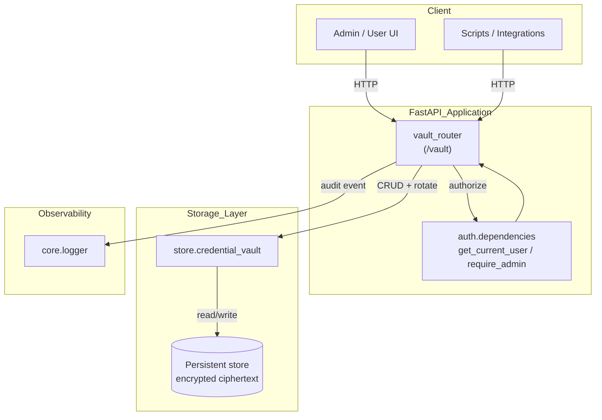
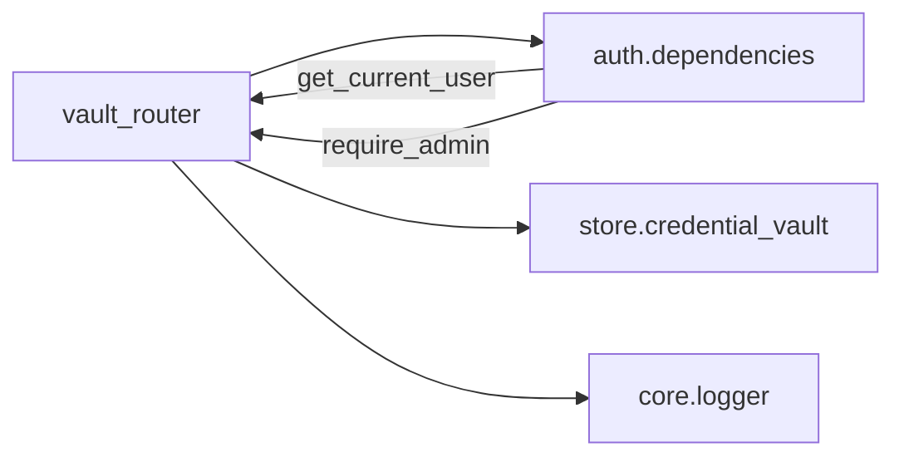
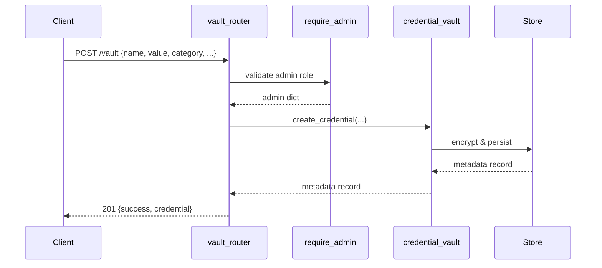
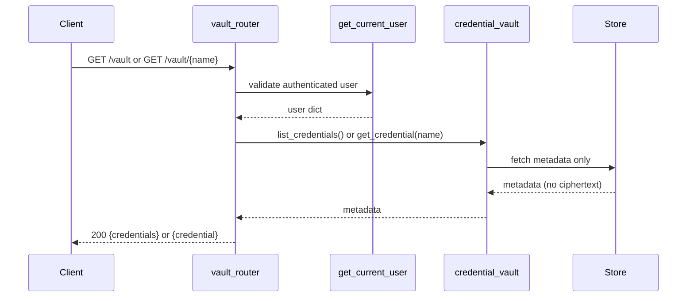
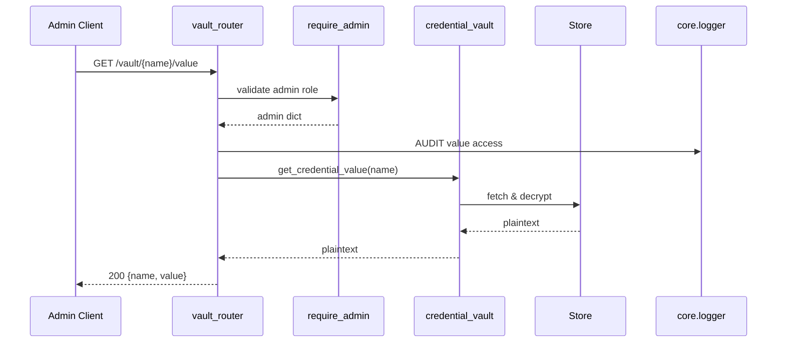
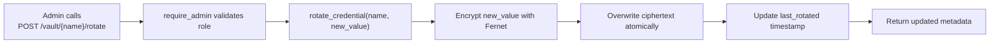

# vault_router

The `vault_router` module exposes the `/vault` HTTP API for encrypted credential management. It provides a centralized, access-controlled vault for storing sensitive material such as API keys, OAuth tokens, passwords, and certificates. Plaintext values are encrypted with Fernet before persistence, and the router enforces a strict read/write split: writes require an admin role, reads require an authenticated user, and decryption of a value is admin-only and always audit-logged.

---

## Overview

`vault_router` is a FastAPI `APIRouter` mounted at `/vault`. It acts as the public boundary for the credential vault store (`store.credential_vault`), translating HTTP requests into encrypted storage operations and applying role-based authorization through `auth.dependencies`.

The router is intentionally thin: validation, serialization, encryption, and persistence live in the underlying store layer, while the router focuses on request models, access control, and HTTP semantics.

### Key responsibilities

- **Encrypted credential lifecycle**: create, update, rotate, delete, and list credentials.
- **Category taxonomy**: constrain credentials to `api_key`, `oauth_token`, `password`, or `certificate`.
- **Authorization**: require admin for mutations and value retrieval; require authenticated user for metadata reads.
- **Audit logging**: log every access to a decrypted credential value with the accessor identity.
- **Safe responses**: never return encrypted or plaintext values except through the dedicated admin-only `/vault/{name}/value` endpoint.

---

## Architecture



### Component roles

| Component | Role |
|-----------|------|
| `vault_router` | Defines routes, request/response models, and HTTP error handling. |
| `auth.dependencies` | Supplies `get_current_user` for reads and `require_admin` for writes/value access. |
| `store.credential_vault` | Implements Fernet encryption and persistence operations. |
| `core.logger` | Receives audit log entries when decrypted values are accessed. |

---

## Dependencies



- **[auth.dependencies](auth_dependencies.md)** — JWT-based authentication and admin role enforcement. `vault_router` uses `get_current_user` for read-only endpoints and `require_admin` for all mutating endpoints and value retrieval.
- **[store.credential_vault](store_credential_vault.md)** — The underlying encrypted credential store. It handles Fernet encryption, conflict detection, atomic rotation, and metadata retrieval.
- **[core.logger](core_logger.md)** — Structured logging used to emit an audit record whenever an admin retrieves a decrypted credential value.

---

## Data Flow

### Creating a credential



### Listing or reading metadata



### Retrieving a decrypted value (admin + audit)



---

## API Endpoints

| Method | Path | Access | Description |
|--------|------|--------|-------------|
| `POST` | `/vault` | Admin | Create a new encrypted credential. |
| `GET` | `/vault` | Authenticated user | List credential metadata; optional `category` filter. |
| `GET` | `/vault/categories` | Authenticated user | Return valid category values. |
| `GET` | `/vault/{name}` | Authenticated user | Return metadata for a single credential. |
| `PUT` | `/vault/{name}` | Admin | Update description, tags, and/or value. |
| `DELETE` | `/vault/{name}` | Admin | Permanently delete a credential. |
| `POST` | `/vault/{name}/rotate` | Admin | Atomically replace the stored value and update `last_rotated`. |
| `GET` | `/vault/{name}/value` | Admin | Return the decrypted plaintext; audit-logged. |

### Request/response models

- **`CredentialCreate`** — `name`, `value`, `description`, `category`, `tags`.
- **`CredentialUpdate`** — optional `value`, `description`, `tags`; only supplied fields are changed.
- **`RotateRequest`** — `new_value` to replace the existing credential value.

### Authorization matrix

```mermaid
flowchart TD
    A["Incoming request"] --> B{"Endpoint?"}
    B -->|write: POST /vault, PUT, DELETE, POST /rotate| C["require_admin"]
    B -->|read metadata: GET /vault, GET /categories, GET /{name}| D["get_current_user"]
    B -->|decrypt value: GET /{name}/value| C
    C --> E["Proceed / 403"]
    D --> E
```

---

## Security Model

- **Encryption at rest**: `store.credential_vault` encrypts plaintext values with Fernet before persistence. The router never sees or stores keys.
- **Least-privilege access**: only admins can create, modify, rotate, or delete credentials. Any authenticated user can inspect metadata.
- **Value secrecy**: list and detail endpoints return metadata only. The plaintext value is exposed only through `/vault/{name}/value`.
- **Audit trail**: every value retrieval is logged with the accessor's email or subject identifier and admin role.
- **Conflict safety**: duplicate credential names raise `409 Conflict`.
- **Category validation**: unknown category filters or values are rejected with `400 Bad Request`.

---

## Error Handling

| Scenario | HTTP status | Detail |
|----------|-------------|--------|
| Duplicate credential name on create | `409 Conflict` | Message from `ValueError` |
| Unknown category filter | `400 Bad Request` | Lists valid categories |
| Credential not found (read/update/delete/rotate/value) | `404 Not Found` | Credential name |
| Vault unavailable or unexpected failure on create | `500 Internal Server Error` | Generic failure message |
| Insufficient role | `403 Forbidden` | Raised by `require_admin` |

---

## Integration with the Broader System

`vault_router` is one of many shared API routers in the platform. It is typically mounted alongside routers such as [auth_router](auth_router.md), [connectors_router](connectors_router.md), and [api_keys_router](api_keys_router.md). While `api_keys_router` manages user-level API keys, `vault_router` manages shared organizational secrets used by connectors, agents, and backend services.

Credentials stored through this router are consumed by the connector engine and other backend components that need to retrieve secrets without embedding them in code or configuration. See [connectors/engine](connectors_engine.md) and [store/credential_vault](store_credential_vault.md) for how stored credentials are resolved at runtime.

---

## Process Flow: Credential Rotation



Rotation is the preferred way to update a sensitive value because it explicitly records when the secret was changed, supporting compliance and operational traceability.

---

## Notes for Maintainers

- The `/vault/categories` route is registered before `/vault/{name}` to avoid path-parameter shadowing.
- All store imports are performed inside endpoint functions to avoid circular imports at module load time.
- The router intentionally does not return ciphertext; if you need to expose encrypted blobs for backup or migration, add a separate admin-only endpoint in coordination with the credential vault store.
- When adding new categories, update `_CATEGORIES` and ensure the store layer can handle them consistently.
