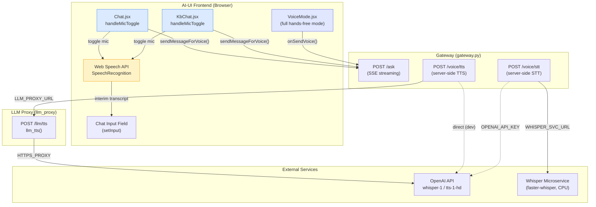
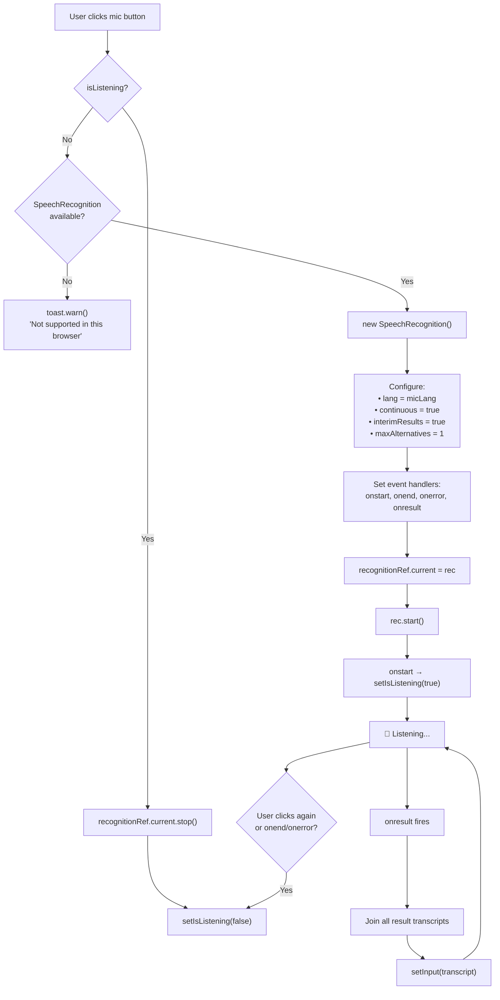
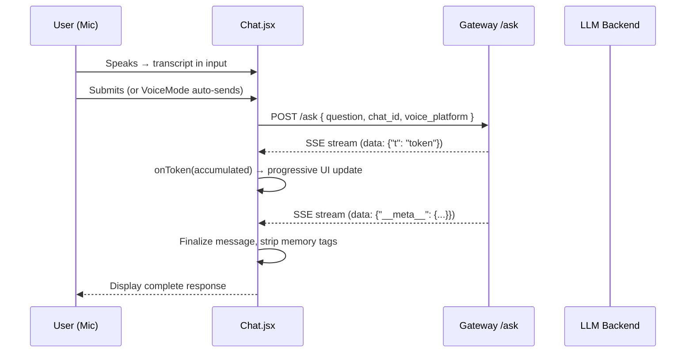
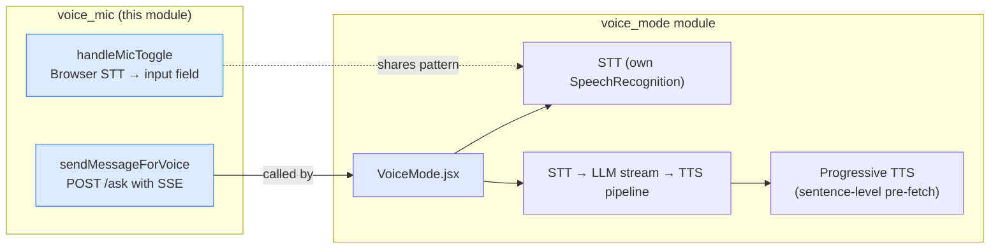
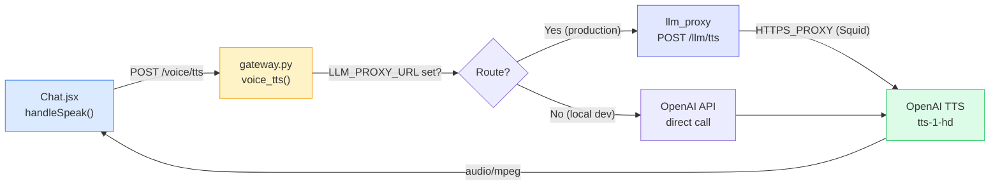
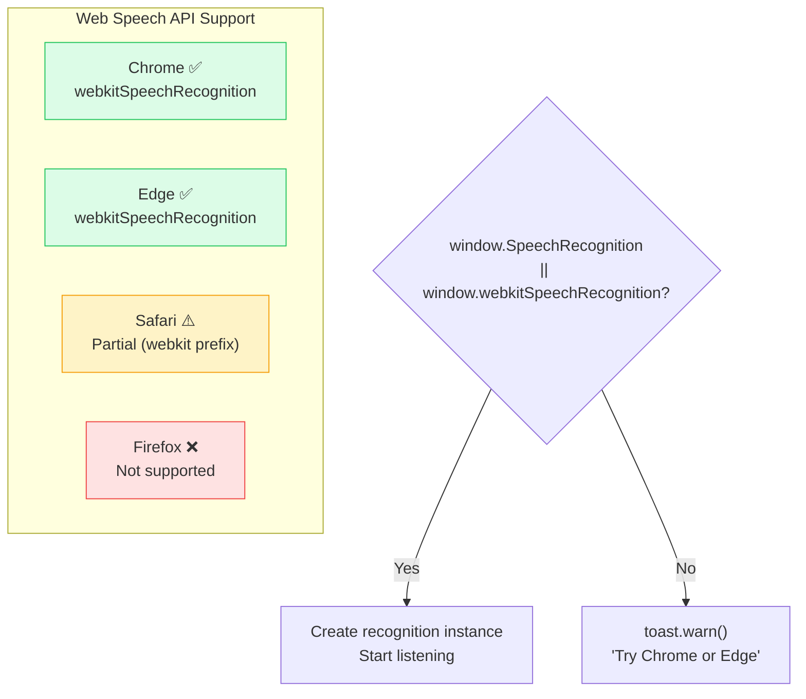
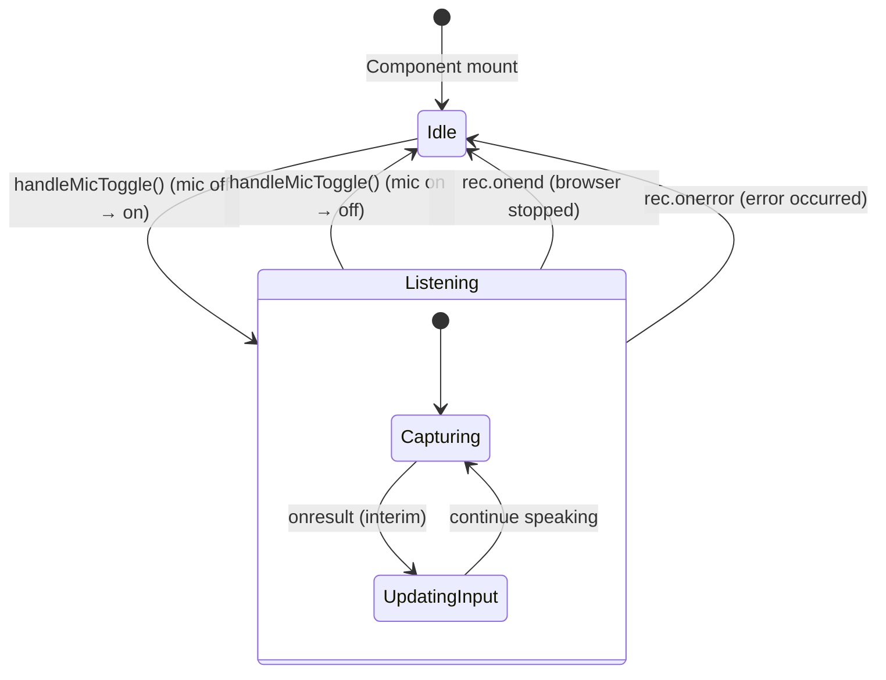

# Voice & Microphone (voice_mic)

> **Module ID:** `voice_mic`
> **Parent Module:** [chat](chat.md)
> **Source File:** `ai-ui/src/components/Chat.jsx`
> **Related Modules:** [voice_mode](voice_mode.md), [voice_and_tts](voice_and_tts.md), [llm_proxy_main](llm_proxy_main.md), [whisper_service](whisper_service.md), [kb_chat](kb_chat.md)

---

## 1. Introduction

The `voice_mic` module provides **speech-to-text (STT) microphone input** for the AI-UI chat interface. It is the entry point for users who prefer to dictate their questions rather than type them. The module wraps the browser-native [Web Speech API](https://developer.mozilla.org/en-US/docs/Web/API/Web_Speech_API) (`SpeechRecognition` / `webkitSpeechRecognition`) to capture continuous, interim speech transcripts and populate the chat input field in real time.

The module is a sub-component of the broader [chat](chat.md) module and is consumed by two chat surfaces:

| Consumer | File | Role |
|---|---|---|
| **Chat** | `ai-ui/src/components/Chat.jsx` | General-purpose AI chat |
| **KbChat** | `ai-ui/src/components/KbChat.jsx` | Knowledge-base–scoped chat |

Both surfaces expose an identical `handleMicToggle` function and share the same `sendMessageForVoice` helper for dispatching transcribed text to the backend.

### Key Capabilities

- **Toggle-based mic control** — click to start listening, click again to stop.
- **Continuous recognition** — the microphone stays open until the user explicitly stops it, allowing multi-sentence dictation.
- **Interim results** — the input field updates live as the user speaks, showing partial transcripts before finalization.
- **Language-aware** — recognition language is driven by the `micLang` state (default `en-IN`), supporting multilingual dictation.
- **Graceful degradation** — if the browser does not support the Web Speech API, a user-friendly toast notification is shown instead of a silent failure.

---

## 2. Architecture Overview



### Module Boundaries

The `voice_mic` module is specifically the **microphone toggle and browser-side STT** logic. It does **not** encompass:

- **Full hands-free voice mode** — that is the [voice_mode](voice_mode.md) module (`VoiceMode.jsx`), which orchestrates a complete STT → LLM → TTS conversation loop.
- **Server-side STT/TTS endpoints** — those belong to the [voice_and_tts](voice_and_tts.md) module in the gateway.
- **TTS playback for individual messages** — the `handleSpeak` function in `Chat.jsx` handles per-message text-to-speech and is documented under the [chat](chat.md) module.

---

## 3. Core Component: `handleMicToggle`

### 3.1 Function Signature

```javascript
function handleMicToggle()
```

No parameters. Relies on component-level state and refs:

| State / Ref | Type | Purpose |
|---|---|---|
| `isListening` | `boolean` | Tracks whether the microphone is currently active |
| `setIsListening` | `function` | Updates the listening state (drives UI button appearance) |
| `recognitionRef` | `useRef` | Holds the active `SpeechRecognition` instance for cleanup |
| `micLang` | `string` | BCP-47 language tag (e.g., `en-IN`, `hi-IN`) |
| `setInput` | `function` | Updates the chat input field with the transcript |

### 3.2 Behavioural Flow



### 3.3 Source Code

```javascript
function handleMicToggle() {
    if (isListening) {
      recognitionRef.current?.stop();
      setIsListening(false);
      return;
    }

    const SR = window.SpeechRecognition || window.webkitSpeechRecognition;
    if (!SR) {
      toast.warn("Speech recognition is not supported in this browser. Try Chrome or Edge.");
      return;
    }

    const rec = new SR();
    rec.lang            = micLang;
    rec.continuous      = true;   // keep mic open until user stops it
    rec.interimResults  = true;
    rec.maxAlternatives = 1;

    rec.onstart  = () => setIsListening(true);
    rec.onend    = () => setIsListening(false);
    rec.onerror  = () => setIsListening(false);

    rec.onresult = (e) => {
      const transcript = Array.from(e.results)
        .map(r => r[0].transcript)
        .join("");
      setInput(transcript);
    };

    recognitionRef.current = rec;
    rec.start();
  }
```

### 3.4 Design Decisions

| Decision | Rationale |
|---|---|
| `continuous = true` | Allows the user to speak multiple sentences without the mic auto-stopping after each pause. The user controls when to stop. |
| `interimResults = true` | Provides real-time feedback — the input field updates as the user speaks, not just when a phrase is finalized. |
| `maxAlternatives = 1` | Only the top recognition result is used; avoids ambiguity and keeps the transcript clean. |
| `recognitionRef` storage | The `SpeechRecognition` instance is stored in a ref (not state) to avoid re-renders and allow imperative `stop()` calls during cleanup. |
| `onerror` → `setIsListening(false)` | Any recognition error (network, no-speech, audio-capture) resets the UI to the "not listening" state so the user can retry. |

---

## 4. Companion: `sendMessageForVoice`

When the user finishes dictating and submits (or when the [voice_mode](voice_mode.md) module sends a transcribed query), the `sendMessageForVoice` function dispatches the text to the backend.

### 4.1 Function Signature

```javascript
async function sendMessageForVoice(text, mode = "platform", onToken = null)
```

| Parameter | Type | Description |
|---|---|---|
| `text` | `string` | The transcribed user message |
| `mode` | `string` | `"platform"` (default) or `"generic"` — controls backend response shaping |
| `onToken` | `function \| null` | Callback invoked with accumulated text on each SSE token (used by VoiceMode for progressive TTS) |

**Returns:** `Promise<string>` — the final cleaned assistant response.

### 4.2 Data Flow



The function creates a user message and a placeholder assistant message (with `streaming: true`), then reads the SSE stream from `/ask`, accumulating tokens and updating the UI in real time. The `onToken` callback enables the [voice_mode](voice_mode.md) module to pre-fetch TTS audio for each complete sentence as it streams in.

---

## 5. Relationship to VoiceMode

The [voice_mode](voice_mode.md) module (`VoiceMode.jsx`) is a **full-screen, hands-free voice conversation** experience that builds on top of the same primitives:



**Key differences:**

| Aspect | `voice_mic` (handleMicToggle) | `voice_mode` (VoiceMode) |
|---|---|---|
| **Scope** | Mic input only — populates the text input field | Full conversation loop — STT, LLM, TTS |
| **STT** | Browser Web Speech API | Browser Web Speech API (own instance) |
| **TTS** | None (uses `handleSpeak` separately) | Progressive sentence-level TTS pre-fetch |
| **User interaction** | User clicks mic, speaks, then manually submits | Fully hands-free — auto-submits on silence, auto-listens after response |
| **UI** | Mic button in chat toolbar | Full-screen overlay with animated orb |

---

## 6. Backend Dependencies

### 6.1 Speech-to-Text (STT)

The `voice_mic` module uses **browser-side** STT exclusively (Web Speech API). However, the gateway also exposes a server-side STT endpoint (`POST /voice/stt`) used by other parts of the system. See [voice_and_tts](voice_and_tts.md) for details.

### 6.2 Text-to-Speech (TTS)

TTS is used by the `handleSpeak` function (in the parent [chat](chat.md) module) and by the [voice_mode](voice_mode.md) module. The TTS call chain:



**TTS Request Model** (`_TTSRequest` / `_TtsRequest`):

| Field | Type | Default | Options |
|---|---|---|---|
| `text` | `str` | *(required)* | Max 2000 characters |
| `voice` | `str` | `"nova"` | `alloy`, `echo`, `fable`, `onyx`, `nova`, `shimmer` |
| `model` | `str` | `"tts-1-hd"` | `tts-1`, `tts-1-hd` |
| `speed` | `float` | `0.92` | 0.25 – 4.0 |

### 6.3 TTS Fallback Chain (Client-Side)

The `handleSpeak` function in `Chat.jsx` implements a two-tier TTS strategy:

1. **Backend TTS** (preferred) — `POST /voice/tts` → OpenAI `tts-1-hd` via gateway/llm_proxy. Higher quality.
2. **Web Speech API fallback** — `window.speechSynthesis.speak()`. Used when the backend is unavailable, offline, or `OPENAI_API_KEY` is missing.

The fallback includes stale-request guarding via a monotonic `ttsRequestIdRef` counter, ensuring that if the user clicks a different message's speak button while a TTS fetch is in flight, the stale response is discarded.

---

## 7. Browser Compatibility



The module explicitly checks for `window.SpeechRecognition || window.webkitSpeechRecognition` before attempting to create a recognition instance. If neither is available, a toast notification advises the user to switch to Chrome or Edge.

---

## 8. State Management



### State Variables

| Variable | Location | Type | Description |
|---|---|---|---|
| `isListening` | `Chat.jsx` / `KbChat.jsx` | `boolean` | Drives mic button visual state (active/inactive) |
| `micLang` | `Chat.jsx` / `KbChat.jsx` | `string` | BCP-47 language tag for recognition |
| `recognitionRef` | `Chat.jsx` / `KbChat.jsx` | `useRef` | Active `SpeechRecognition` instance |
| `input` | `Chat.jsx` / `KbChat.jsx` | `string` | Chat input field content (updated with transcript) |

---

## 9. Duplication Note

The `handleMicToggle` and `sendMessageForVoice` functions are **duplicated verbatim** between `Chat.jsx` and `KbChat.jsx`. This is a known pattern in the codebase — both chat surfaces maintain independent state and refs. A future refactor could extract these into a shared hook (e.g., `useVoiceMic`) to eliminate the duplication.

---

## 10. Cross-Module References

| Module | Relationship |
|---|---|
| [chat](chat.md) | Parent module — `handleMicToggle` lives inside the `Chat` component |
| [kb_chat](kb_chat.md) | Sibling module — `KbChat.jsx` contains an identical `handleMicToggle` |
| [voice_mode](voice_mode.md) | Full-screen hands-free voice conversation — uses `sendMessageForVoice` and its own STT instance |
| [voice_and_tts](voice_and_tts.md) | Backend gateway endpoints (`voice_stt`, `voice_tts`) for server-side speech processing |
| [llm_proxy_main](llm_proxy_main.md) | LLM proxy TTS endpoint (`llm_tts`) — production TTS routing target |
| [whisper_service](whisper_service.md) | Local whisper microservice for air-gapped STT (used by gateway `voice_stt`, not directly by this module) |
