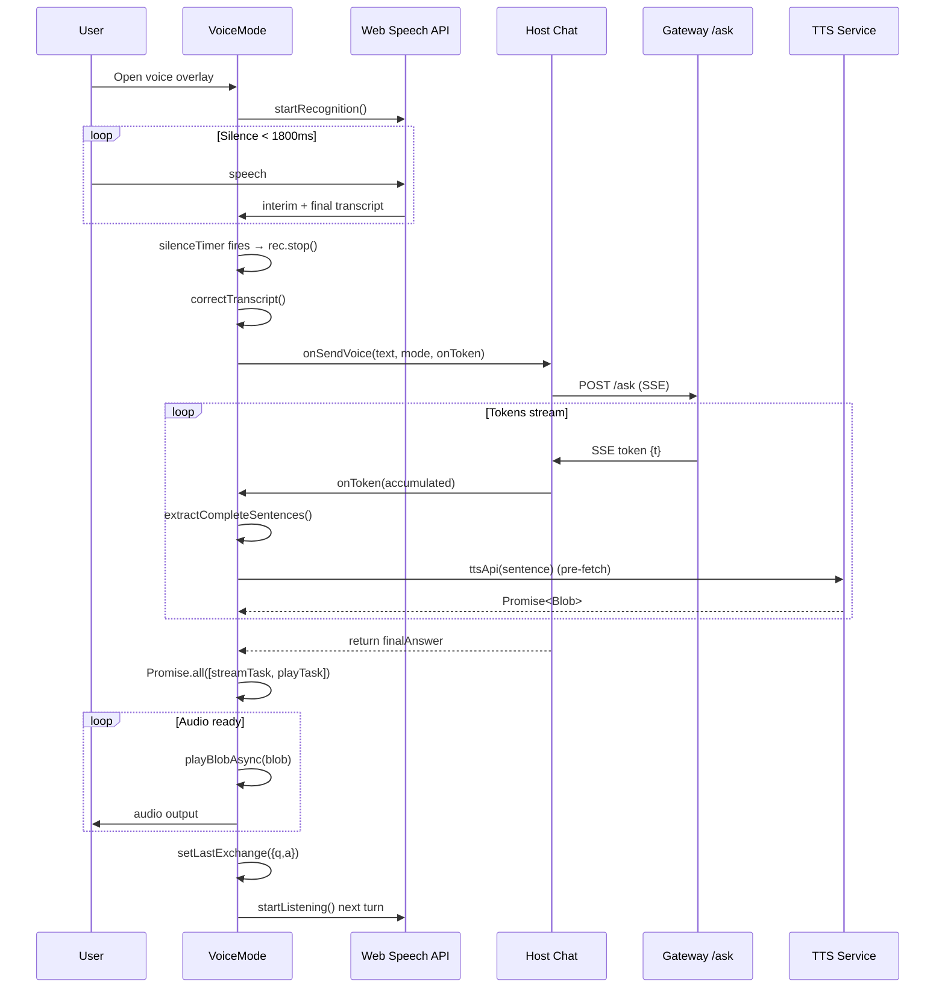
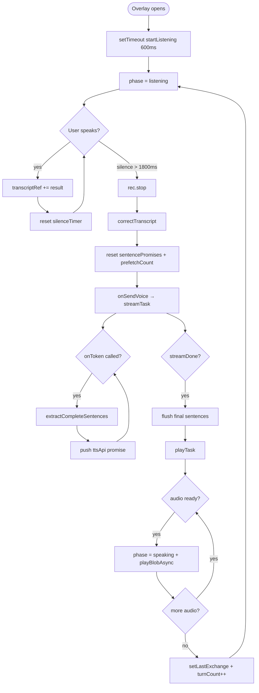
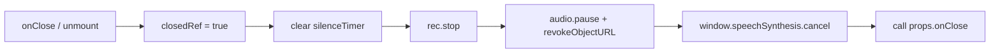

# Voice Mode

Voice Mode is a ChatGPT-style conversational voice overlay in the `ai-ui` frontend. It enables hands-free, multi-turn spoken interaction with the platform by combining browser-based Speech Recognition (STT), streaming LLM responses, and sentence-level Text-to-Speech (TTS) pre-fetching. The component is intentionally self-contained and can be mounted on top of any chat view that provides a streaming send callback and a TTS API wrapper.

---

## Core Purpose

- Provide a full-duplex voice conversation experience: the user speaks, the platform thinks and replies aloud, then immediately listens for the next turn.
- Hide the complexity of Web Speech API management, silence detection, streaming response rendering, and audio playback orchestration behind a single React component.
- Support a "platform" demo mode that applies positive pivots to LLM output so public demonstrations stay constructive and on-message.

---

## Architecture

Voice Mode is a pure frontend component. It relies on the host chat component for the actual LLM streaming call and on the gateway/llm_proxy services for TTS audio generation. STT is performed in-browser via the Web Speech API; the gateway also exposes an optional server-side STT endpoint that is not used by this component.

```mermaid
flowchart TB
    subgraph Browser["Browser (ai-ui)"]
        VM[VoiceMode.jsx]
        WS[Web Speech API]
        HostChat[Host Chat Component<br/>Chat.jsx / KbChat.jsx]
    end

    subgraph Gateway["Gateway / LLM Proxy"]
        GW["/ask streaming endpoint"]
        TTS["/voice/tts → /llm/tts"]
    end

    subgraph External["External / Managed"]
        OAI[OpenAI TTS]
    end

    VM -->|start / stop| WS
    VM -->|onSendVoice(text, mode, onToken)| HostChat
    HostChat -->|SSE stream| GW
    VM -->|ttsApi(text) → Blob| TTS
    TTS -->|proxies or calls| OAI
    VM -->|plays audio| VM
```

### Component Responsibilities

| Component | Responsibility |
|-----------|----------------|
| `VoiceMode` | Orchestrates the full turn loop: listen → correct transcript → stream LLM → pre-fetch TTS → play audio → listen again. |
| `handleClose` | Cleans up timers, recognition, audio, and synthesis before invoking the parent `onClose`. |
| `cleanup` (inline in `stopAll`) | Stops recognition, cancels pending silence timer, pauses and revokes audio object URLs, cancels `window.speechSynthesis`. |
| Host `sendMessageForVoice` | Performs the authenticated POST to `/ask`, decodes SSE tokens, calls `onToken` per token, and returns the final answer. |
| Host `handleMicToggle` | Simple inline mic-to-text used outside Voice Mode; Voice Mode uses its own recognition instance. |
| Gateway `voice_tts` | Receives TTS requests and routes them to `llm_proxy` in production or OpenAI directly in local dev. |
| `llm_proxy.llm_tts` | Calls OpenAI TTS with optional HTTPS_PROXY support and returns `audio/mpeg`. |

---

## Dependencies

Voice Mode depends on the host chat surface and the platform's TTS infrastructure. It does not directly import chat logic; everything is injected via props.

```mermaid
flowchart LR
    VM[VoiceMode.jsx] -->|props| Host[Host Chat Component]
    VM -->|Browser API| WS[Web Speech API]
    VM -->|fetch wrapper| ttsApi[ttsApi(text) → Promise<Blob>]
    ttsApi -->|calls| GW[gateway.py /voice/tts]
    GW -->|proxies| LP[services/llm_proxy/main.py /llm/tts]
    LP -->|OpenAI API| OAI[OpenAI audio/speech]
    Host -->|SSE| Ask[gateway.py /ask]
```

### Related Modules

- [chat](chat.md) — `Chat.jsx` provides `sendMessageForVoice` and `handleMicToggle` for the main chat surface.
- [kb_chat](kb_chat.md) — `KbChat.jsx` provides an identical `sendMessageForVoice` implementation for knowledge-base chat.
- [gateway](gateway.md) — Exposes `/voice/tts` and `/voice/stt`; the TTS path is consumed by the `ttsApi` wrapper.
- [llm_proxy](llm_proxy.md) — Hosts `/llm/tts`, the production TTS proxy that reaches OpenAI from the web tier.

---

## Data Flow

A single Voice Mode turn moves through four phases: `listening`, `processing`, `speaking`, and back to `listening`. The diagram below shows the data produced and consumed at each step.



### Key Data Transformations

1. **STT correction** — `correctTranscript` applies regex replacements for commonly misheard technical terms (e.g., "H D F C" → "SDLC", "rack" → "RAG", "ai next" → "AiNxt").
2. **TTS cleaning** — `cleanForTTS` strips markdown, code blocks, URLs, and list markers so the spoken output is natural.
3. **Positive pivots** — In `platform` mode, `applyPositivePivots` rewrites negative phrases ("we don't support", "limitation", "unfortunately") into constructive language.
4. **Sentence extraction** — `extractCompleteSentences` only queues audio for sentences ending in terminal punctuation, preventing partial phrases from being spoken.

---

## Component Interaction

Voice Mode is rendered as a full-screen overlay. It receives three props and manages all internal state with React hooks and refs.

```mermaid
flowchart LR
    subgraph Props["Props"]
        P1[onClose: () => void]
        P2[onSendVoice: (text, mode, onToken) => Promise<string>]
        P3[micLang: string]
        P4[ttsApi: (text) => Promise<Blob>]
    end

    subgraph State["React State"]
        S1[phase]
        S2[transcript]
        S3[response]
        S4[errorMsg]
        S5[turnCount]
        S6[mode]
        S7[lastExchange]
    end

    subgraph Refs["Refs"]
        R1[recRef]
        R2[silenceTimer]
        R3[transcriptRef]
        R4[phaseRef]
        R5[closedRef]
        R6[audioRef]
        R7[sentencePromises]
        R8[prefetchCount]
    end

    Props --> VM[VoiceMode]
    VM --> State
    VM --> Refs
    Refs --> VM
```

### Props

| Prop | Type | Description |
|------|------|-------------|
| `onClose` | `() => void` | Called after all resources are cleaned up to unmount the overlay. |
| `onSendVoice` | `(text, mode, onToken) => Promise<string>` | Initiates the LLM stream. `mode` is `"generic"` or `"platform"`. `onToken` receives the accumulated response after each token. |
| `micLang` | `string` | BCP-47 language tag passed to the Web Speech API (default `"en-IN"`). |
| `ttsApi` | `(text) => Promise<Blob>` | Returns an audio Blob for the supplied text. Typically calls `/voice/tts`. |

### State & Refs

| Name | Kind | Purpose |
|------|------|---------|
| `phase` | state | UI phase: `listening`, `processing`, `speaking`, `error`. |
| `transcript` | state | Current STT text shown to the user. |
| `response` | state | Accumulated or final LLM response shown to the user. |
| `errorMsg` | state | Human-readable error when recognition or TTS fails. |
| `turnCount` | state | Number of completed exchanges, shown in the UI. |
| `mode` | state | `"generic"` or `"platform"`; controls positive-pivot rewriting. |
| `lastExchange` | state | Previous `{q, a}` pair shown as context during the next turn. |
| `recRef` | ref | Active `SpeechRecognition` instance. |
| `silenceTimer` | ref | `setTimeout` handle that stops recognition after `SILENCE_MS`. |
| `transcriptRef` | ref | Mutable copy of the transcript for use inside recognition callbacks. |
| `phaseRef` | ref | Mutable copy of the phase for synchronous reads. |
| `closedRef` | ref | True once the overlay is closing; guards async callbacks. |
| `audioRef` | ref | Active `<Audio>` element. |
| `sentencePromises` | ref | Array of `Promise<Blob>` for each queued sentence. |
| `prefetchCount` | ref | Number of sentences already submitted to TTS. |

---

## Process Flows

### Turn Loop



### Error Handling

```mermaid
flowchart TB
    Err{Error source}
    Err -->|SpeechRecognition unsupported| E1[setErrorMsg + phase=error]
    Err -->|rec.onerror| E2[setErrorMsg + phase=error]
    Err -->|TTS first sentence fails| E3[setErrorMsg + phase=error]
    Err -->|onSendVoice throws| E4[setErrorMsg + phase=error]
    E1 --> Retry[User taps "Tap to retry"]
    E2 --> Retry
    E3 --> Retry
    E4 --> Retry
    Retry --> startListening
```

### Cleanup on Close



---

## Key Implementation Details

### Concurrent Stream-and-Play Pipeline

Voice Mode does not wait for the full LLM response before starting TTS. Two tasks run concurrently:

- `streamTask` streams the LLM response and pushes a TTS promise for every completed sentence.
- `playTask` waits for each promise and plays the resulting Blob as soon as it resolves.

This means the first sentence can start playing while the LLM is still generating later sentences, reducing perceived latency.

### Silence Detection

Recognition is `continuous` with `interimResults`. On every `onresult` event the component resets an `1800ms` timer. If no new result arrives within that window, `rec.stop()` is called and the turn is submitted.

### Mode Switching

The component currently defaults to `mode = "generic"`. When set to `"platform"`:

- `onToken` applies `applyPositivePivots` to the accumulated text before display.
- The final answer returned by `onSendVoice` is also pivoted before display and storage in `lastExchange`.

### TTS Fallback

If the final answer contains no terminal punctuation, the component treats the whole cleaned text (up to 2000 characters) as a single TTS utterance so short answers are still spoken.

### Skip Button

During the `speaking` phase a "Skip — listen now" button stops the current audio, discards remaining pre-fetched promises, and immediately restarts listening.

---

## Integration Notes

Voice Mode is mounted by the host chat component when the user toggles the microphone in the main chat UI. The host is responsible for:

- Providing a stable `onSendVoice` callback that streams tokens and returns the final string.
- Providing a `ttsApi` wrapper that posts to the platform's TTS endpoint and returns a Blob.
- Calling `onClose` to unmount the overlay.

For the exact streaming contract expected by `onSendVoice`, see the host chat modules:

- [chat](chat.md)
- [kb_chat](kb_chat.md)

For backend TTS routing and configuration, see:

- [gateway](gateway.md)
- [llm_proxy](llm_proxy.md)
