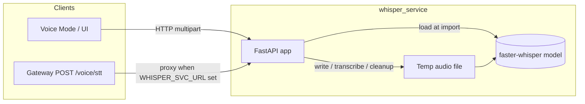
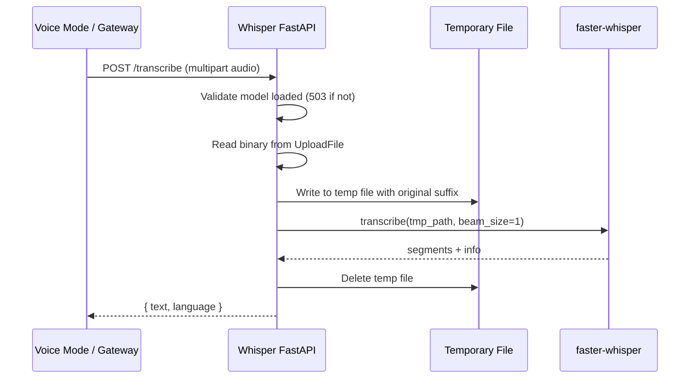
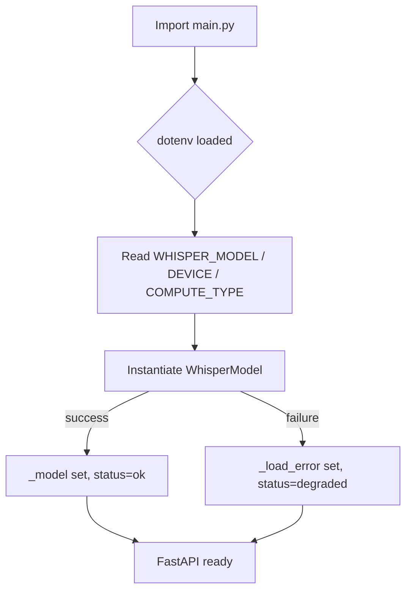
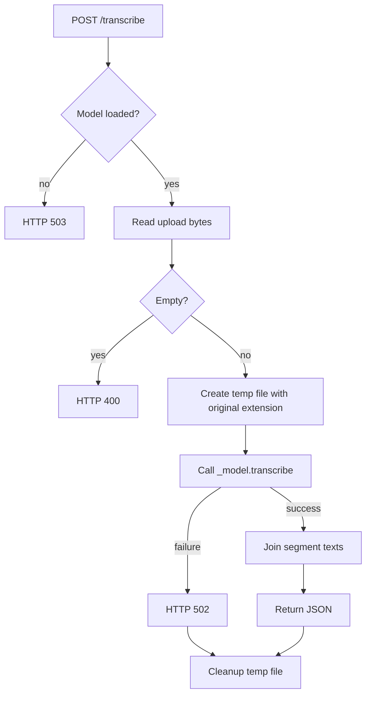

# Whisper Service

The **Whisper Service** is a dedicated FastAPI microservice that provides **speech-to-text (STT)** capabilities for the platform's Voice Mode. It is intentionally decoupled from the main [gateway](gateway.md) process so that large machine-learning models are never loaded lazily inside the uvicorn gateway workers. The service wraps a [faster-whisper](https://github.com/SYSTRAN/faster-whisper) model and exposes a single transcription endpoint plus a health probe.

---

## Purpose & Core Functionality

- **Offload STT inference** from the gateway to a separate process (`services/whisper_svc/main.py`, default port `8006`).
- **Eager model loading** at module import time on CPU, avoiding runtime cold-start latency and GPU/MPS surprises.
- **Air-gap friendly** via `WHISPER_MODEL` pointing to a local directory or a cached size name.
- **Container-format agnostic** transcription by writing uploaded audio to a temporary file and leveraging bundled `ffmpeg`.

### Public Endpoints

| Method | Path | Description |
|--------|------|-------------|
| `POST` | `/transcribe` | Multipart upload of an audio file; returns `{ "text": "...", "language": "..." }`. |
| `GET`  | `/health` | Returns service status, configured model, device, compute type, and any load error. |

---

## Architecture



### Component Breakdown

| Component | File | Responsibility |
|-----------|------|----------------|
| `app` | `services/whisper_svc/main.py` | FastAPI application exposing `/health` and `/transcribe`. |
| `_model` | `services/whisper_svc/main.py` | Globally loaded `faster_whisper.WhisperModel` instance. |
| `health` | `services/whisper_svc/main.py::health` | Reports whether the model loaded successfully and the current configuration. |
| `transcribe` | `services/whisper_svc/main.py::transcribe` | Accepts an audio upload, persists it temporarily, runs inference, and returns text/language. |

---

## Dependencies

### Internal

- **[gateway](gateway.md)** — routes `POST /voice/stt` to this service when `WHISPER_SVC_URL` is configured. See [gateway.md](gateway.md) for the broader routing and health/monitoring picture.
- **[ai_ui_frontend](ai_ui_frontend.md)** — the Voice Mode UI in `ai-ui/src/components/VoiceMode.jsx` initiates the audio capture that ultimately reaches this service.

### External

- **FastAPI** — HTTP framework.
- **faster-whisper** — CTranslate2-based Whisper implementation; loaded eagerly at import time.
- **ffmpeg** — used indirectly by `faster-whisper` for broad audio container support.

---

## Data Flow



---

## Configuration

All behavior is controlled through environment variables:

| Variable | Default | Description |
|----------|---------|-------------|
| `WHISPER_MODEL` | `base` | Model size (`tiny`, `base`, `small`, `medium`, `large-v3`, etc.) or a local directory containing pre-downloaded weights. |
| `WHISPER_DEVICE` | `cpu` | Compute device. Kept CPU-only by default to mirror [embedding_service](embedding_service.md) and [privacy_service](privacy_service.md). |
| `WHISPER_COMPUTE_TYPE` | `int8` | Quantization type; `int8` keeps CPU memory footprint small. |
| `WHISPER_SVC_URL` | — | URL the [gateway](gateway.md) uses to proxy STT requests here. |

### Air-Gap Deployment

Set `WHISPER_MODEL` to a pre-populated local directory on the host. The service does not download weights at runtime.

---

## Process Flow

### Startup



### Transcription Request



---

## Health & Observability

The `health` endpoint returns:

```json
{
  "status": "ok | degraded",
  "model": "base",
  "device": "cpu",
  "compute_type": "int8",
  "load_error": null | "..."
}
```

- `ok` means the model loaded and `/transcribe` can serve requests.
- `degraded` means the model failed to load; `/transcribe` will return `503` with the captured `_load_error`.

For platform-level health aggregation, see [gateway.md](gateway.md) under health and monitoring.

---

## Error Handling

| HTTP Status | Trigger |
|-------------|---------|
| `400` | Empty audio upload. |
| `502` | Transcription runtime failure. |
| `503` | Model not loaded (missing dependency, missing weights, or unsupported compute type). |

---

## Operational Notes

- **Not part of the default stack** — start only when STT is required:
  ```bash
  uvicorn services.whisper_svc.main:app --host 0.0.0.0 --port 8006 --workers 1
  ```
- **Single worker recommended** because the model is loaded once per process; multiple workers multiply memory usage.
- **No GPU/MPS default** to keep the service predictable in shared environments. Override `WHISPER_DEVICE` only when GPU inference is explicitly desired.
- Temporary files are cleaned up in a `finally` block, but operators should still monitor disk usage under heavy load.

---

## Relationship to Other Services

| Service | Role |
|---------|------|
| [gateway](gateway.md) | Proxies voice STT requests and exposes `/voice/stt` to clients. |
| [llm_proxy](llm_proxy.md) | Handles LLM, TTS, and image generation; Whisper Service is the STT counterpart. |
| [embedding_service](embedding_service.md) | Follows the same "no lazy ML load in gateway" pattern. |
| [privacy_service](privacy_service.md) | Also follows the same eager-load, separate-process pattern for ONNX models. |
| [ai_ui_frontend](ai_ui_frontend.md) | Provides the Voice Mode UI that captures audio and sends it through the gateway. |

---

## See Also

- [gateway.md](gateway.md)
- [llm_proxy.md](llm_proxy.md)
- [embedding_service.md](embedding_service.md)
- [privacy_service.md](privacy_service.md)
- [ai_ui_frontend.md](ai_ui_frontend.md)
