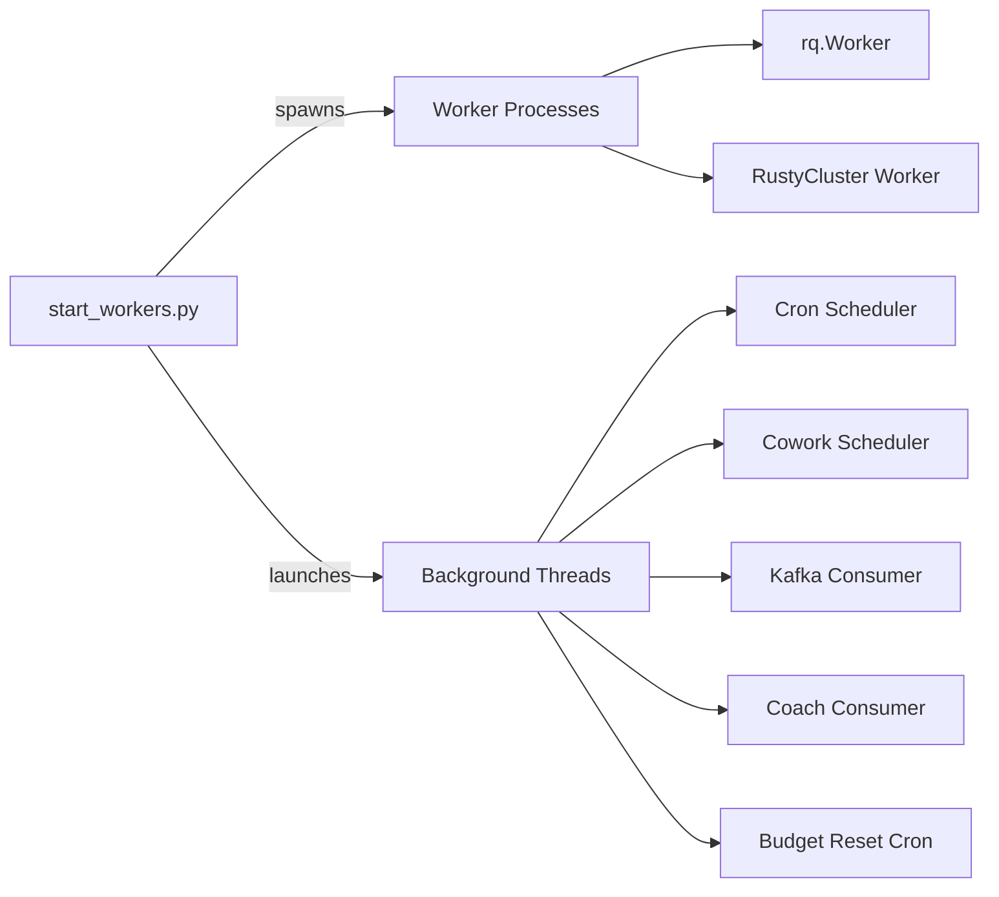
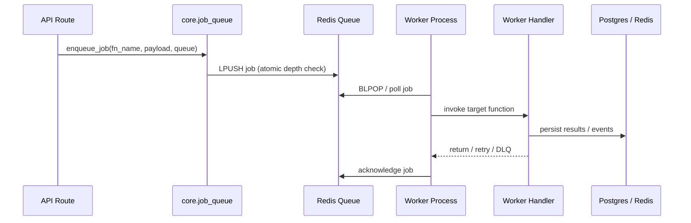

# Workers Module Overview

## Purpose

The `workers` module is the asynchronous execution backbone of the AiNxt / ABStudio platform. It contains all background RQ (Redis Queue) job handlers, Kafka consumers, cron schedulers, and long-lived daemon processes that perform heavy, long-running, or isolation-sensitive work outside the synchronous HTTP request path.

The module is responsible for:
- Executing chat, agent, workflow, and durable workflow jobs
- Running the AI-driven SDLC pipeline (feature, bug, PR review, governance)
- Generating documents (PDF, DOCX, PPTX) and managing knowledge-base ingestion
- Indexing code repositories and building knowledge graphs
- Performing infrastructure maintenance (purging, memory upkeep, scheduling)
- Integrating with external systems (GitLab, GitHub, Microsoft Graph, Active Directory)
- Orchestrating all worker processes via `start_workers.py`

## Architecture

The workers layer sits between API producers (gateway, routers) and platform storage. Jobs are enqueued to Redis/RustyCluster queues, consumed by RQ worker processes, and results are persisted to Postgres, Redis, or object storage.

```mermaid
flowchart TB
    subgraph Producers
        GW[gateway.py]
        R[shared_api_routers]
        SCHED[cron scheduler]
    end

    subgraph QueueLayer["Queue Layer (Redis / RustyCluster)"]
        Q_CHAT[chat_queue]
        Q_AGENT[agent_queue]
        Q_SDLC[sdlc_queue]
        Q_DOC[doc_queue]
        Q_KB[kb_queue]
        Q_EXEC[exec_queue]
        Q_SEC[security_queue]
        Q_TENX[tenx_queue]
        Q_CONN[connector_queue]
    end

    subgraph Workers["workers module"]
        direction TB
        CAW[chat_agent_execution_workers]
        SDW[sdlc_pipeline_workers]
        DKW[document_knowledge_workers]
        IMW[infrastructure_maintenance_workers]
        EIW[external_integration_workers]
        CSW[cowork_scheduling_workers]
        TEV[tenx_evaluation_workers]
        BCV[broadcast_coach_workers]
        KEC[kafka_event_consumer]
        WOR[worker_orchestration]
    end

    subgraph Storage
        PG[(Postgres)]
        KV[(Redis)]
        OBJ[(Object Storage)]
        KF[Kafka]
    end

    GW --> Q_CHAT & Q_AGENT & Q_SDLC & Q_DOC & Q_EXEC & Q_SEC
    R --> Q_DOC & Q_KB & Q_TENX & Q_CONN
    SCHED --> Q_SDLC & Q_KB

    Q_CHAT --> CAW
    Q_AGENT --> CAW
    Q_SDLC --> SDW
    Q_DOC --> DKW
    Q_KB --> DKW
    Q_EXEC --> CAW
    Q_SEC --> CAW
    Q_TENX --> TEV
    Q_CONN --> CSW

    CAW --> PG & KV
    SDW --> PG & KV & OBJ
    DKW --> PG & KV & OBJ
    IMW --> PG & KV & OBJ
    EIW --> PG & KV & OBJ
    CSW --> PG & KV
    TEV --> PG & KV
    BCV --> PG & KV
    KEC --> KF & PG

    WOR --> CAW & SDW & DKW & IMW & EIW & CSW & TEV & BCV & KEC
```

### Worker Orchestration

All worker processes are bootstrapped and supervised by `workers/start_workers.py`. The orchestrator spawns RQ worker subprocesses, launches background daemon threads (cron scheduler, Cowork scheduler, Kafka consumer, Coach consumer, budget reset crons), and manages graceful shutdown.

## Core Sub-modules

| Sub-module | Responsibility | Key Files |
|---|---|---|
| **chat_agent_execution_workers** | Chat, agent, workflow, sandbox code, and security scan execution | `agent_worker.py`, `chat_worker.py`, `durable_workflow_worker.py`, `exec_worker.py`, `secure_code_gate_worker.py`, `security_scan_worker.py`, `skill_loop_worker.py` |
| **sdlc_pipeline_workers** | AI-driven SDLC pipeline jobs (feature, bug, PR review, governance) with HITL resume | `sdlc_worker.py` |
| **document_knowledge_workers** | Document generation, KB ingestion, knowledge graph construction, code chunking | `doc_worker.py`, `doc_worker_agent.py`, `kb_worker.py`, `knowledge_graph_worker.py`, `presenton_worker.py` |
| **infrastructure_maintenance_workers** | Data retention, memory maintenance, DLQ handling, workflow/trigger scheduling | `purge_worker.py`, `thread_purge.py`, `memory_maintenance_worker.py`, `workflow_scheduler_worker.py` |
| **external_integration_workers** | External repo sync, codebase indexing, workspace sync, meeting automation, AD sync | `index_worker.py`, `external_sync_worker.py`, `workspace_sync_worker.py`, `meeting_worker.py`, `ad_sync.py` |
| **cowork_scheduling_workers** | Recurring Cowork task scheduling and headless execution | `cowork_scheduler.py`, `cowork_task_worker.py` |
| **tenx_evaluation_workers** | Isolated worker pool for 10x Award evaluation and repo cloning | `tenx_eval_worker.py`, `tenx_worker_main.py` |
| **broadcast_coach_workers** | Admin email broadcasts, Coach event ingestion, AST graph-edge extraction | `broadcast_worker.py`, `coach_consumer.py`, `graph_edges.py` |
| **kafka_event_consumer** | Durable Kafka consumer for chat history, metrics, audit, SDLC, and budget events | `kafka_consumer.py` |
| **worker_orchestration** | Process supervisor and scheduler launcher for all workers | `start_workers.py` |

## Data Flow

A typical job flows from an API endpoint through the queue layer to a worker and finally to persistent storage:

## References

- [sdlc_pipeline_workers](sdlc_pipeline_workers.md) — SDLC pipeline execution and HITL resume
- [chat_agent_execution_workers](chat_agent_execution_workers.md) — Chat, agent, workflow, and security execution
- [document_knowledge_workers](document_knowledge_workers.md) — Document generation and KB/graph workers
- [infrastructure_maintenance_workers](infrastructure_maintenance_workers.md) — Maintenance, retention, and scheduling
- [external_integration_workers](external_integration_workers.md) — External system integrations and indexing
- [cowork_scheduling_workers](cowork_scheduling_workers.md) — Recurring Cowork task automation
- [tenx_evaluation_workers](tenx_evaluation_workers.md) — 10x Award evaluation worker pool
- [broadcast_coach_workers](broadcast_coach_workers.md) — Broadcasts, Coach ingestion, graph edges
- [kafka_event_consumer](kafka_event_consumer.md) — Kafka-to-Postgres event consumer
- [worker_orchestration](worker_orchestration.md) — Worker process startup and supervision